# Pemvidutide Preserves Lean Body Mass During Weight Loss in Patients with Overweight and Obesity: Results of a Phase 2 MRI-Based Body Composition Sub-Study

Steven Heymsfield¹, John J. Suschak², Jonathan Kasper², Julio Gutierrez², Shaheen Tomah², Lars Johansson³, Edvin Johansson³, Jay Yang², Stephine Keeton², M. Scot Roberts², M. Scott Harris², Sarah K. Browne²

¹Pennington Biomedical Research Center, Baton Rouge, LA, USA; ²Altimmune, Inc., Gaithersburg, MD, USA; ³Antaros Medical AB, Mölndal, Sweden

## Background

### Obesity and Body Composition with Weight Loss

* Pemvidutide is a potency-balanced GLP-1/glucagon dual receptor agonist that was previously shown to significantly reduce body weight vs placebo in subjects with obesity

* The quality of weight loss achieved with incretin-based therapies, including preservation of lean mass, may reduce:

    - Risk of falls and fracture

    - Development of co-morbidities

    - Higher rates of all-cause mortality

* Visceral adipose tissue is associated with increased risk for cardiovascular disease

## Aims

* Evaluate the changes in body composition with weight loss in subjects enrolled in the Phase 2 MOMENTUM trial of pemvidutide in the treatment of obesity.

## Methods

### Study Population ‒ Key Eligibility Criteria

* Clinicaltrials.gov# NCT05295875

* Men and women, ages 18-65 years

* BMI ≥ 30 kg/m² or BMI ≥ 27 kg/m² with at least one obesity-related comorbidity

* HbA1c ≤ 6.5% and fasting glucose ≤ 125 mg/dL

* At least one unsuccessful weight loss attempt

* Minimum of ~ 25% of subjects were to be male

### Study Design

* Phase 2, 48-week trial of pemvidutide in 391 subjects with overweight or obesity

* Randomized 1:1:1:1 to 4 treatment arms, stratified by gender and baseline BMI, with standard lifestyle interventions

* Body composition MRIs were completed in 67 subjects, 50 who received pemvidutide, at baseline and Week 48

Study Design Diagram showing screening, randomization, and treatment arms: placebo weekly, 1.2 mg weekly, 1.8 mg weekly, and 2.4 mg weekly with a 4-week titration period leading to Week 48.

### Outcome Measures

* Lean mass, visceral adipose tissue (VAT), subcutaneous adipose tissue (SAT), and total adipose tissue (TAT) were quantified at baseline and after 48 weeks of pemvidutide treatment

## Results

### Characteristics of Study Participants

| Characteristic                   | Treatment Placebo (N=17) | Treatment 1.2 mg (N=18) | Treatment 1.8 mg (N=15) | Treatment 2.4 mg (N=17) |
| -------------------------------- | ---------------------------- | --------------------------- | --------------------------- | --------------------------- |
| Age, years mean (SD)             | 58.35 (10.0)                 | 51.33 (9.5)                 | 49.33 (14.4)                | 52.76 (12.8)                |
| Gender female, N (%)             | 13 (76.5%)                   | 16 (88.9%)                  | 11 (73.3%)                  | 13 (76.5%)                  |
| BMI, kg/m² mean (SD)             | 37.3 (6.1)                   | 36.9 (4.8)                  | 34.8 (5.5)                  | 35.4 (4.8)                  |
| Body weight, kg mean (SD)        | 100.7 (18.8)                 | 102.7 (12.5)                | 99.1 (18.8)                 | 101.0 (16.8)                |
| Race White, N (%)                | 11 (64.7%)                   | 16 (88.9%)                  | 10 (66.7%)                  | 16 (94.1%)                  |
| African-American, N (%)          | 3 (17.6%)                    | 1 (5.6%)                    | 4 (26.7%)                   | 1 (5.9%)                    |
| Asian, N (%)                     | 1 (5.9%)                     | 1 (5.6%)                    | 0 (0.0%)                    | 0 (0.0%)                    |
| Native or American Indian, N (%) | 0 (0.0%)                     | 0 (0.0%)                    | 1 (6.7%)                    | 0 (0.0%)                    |
| Other, N (%)                     | 2 (11.8%)                    | 0 (0.0%)                    | 0 (0.0%)                    | 0 (0.0%)                    |
| Ethnicity Hispanic, N (%)        | 3 (17.6%)                    | 2 (11.1%)                   | 2 (13.3%)                   | 2 (11.8%)                   |
| not Hispanic, N (%)              | 14 (82.4%)                   | 16 (88.9%)                  | 13 (86.7%)                  | 15 (88.2%)                  |

### Reduction in Body Weight by Week 48

| Treatment                 | LS Mean Weight Loss (%) |
| ------------------------- | ----------------------- |
| placebo (N=97)            | -2.2                    |
| 1.2 mg pemvidutide (N=98) | -10.3\*\*\*             |
| 1.8 mg pemvidutide (N=99) | -11.2\*\*\*             |
| 2.4 mg pemvidutide (N=97) | -15.6\*\*\*             |

| Week | placebo | 1.2 mg pemvidutide | 1.8 mg pemvidutide | 2.4 mg pemvidutide |
| ---- | ------- | ------------------ | ------------------ | ------------------ |
| 0    | 0       | 0                  | 0                  | 0                  |
| 4    | -1.5    | -3.5               | -4.0               | -4.5               |
| 8    | -2.0    | -5.5               | -6.0               | -7.0               |
| 12   | -2.2    | -7.0               | -7.5               | -9.0               |
| 16   | -2.3    | -8.0               | -8.5               | -10.5              |
| 20   | -2.4    | -8.5               | -9.0               | -11.5              |
| 24   | -2.3    | -9.0               | -9.5               | -12.5              |
| 28   | -2.2    | -9.5               | -10.0              | -13.5              |
| 32   | -2.1    | -9.8               | -10.5              | -14.0              |
| 36   | -2.2    | -10.0              | -10.8              | -14.5              |
| 40   | -2.3    | -10.1              | -11.0              | -15.0              |
| 44   | -2.2    | -10.2              | -11.1              | -15.3              |
| 48   | -2.2    | -10.3              | -11.2              | -15.6              |

Data are means ± SE. *** p < 0.001 vs. placebo, mixed model for repeated measures

### Lean Loss Ratio at Week 48

| Change in Total Mass (kg) | Change in Lean Mass (kg) |
| ------------------------- | ------------------------ |
| -2                        | 0                        |
| -5                        | -1                       |
| -10                       | -2                       |
| -15                       | -3                       |
| -20                       | -4                       |

\*Change in Total Mass = Lean Mass Loss + Adipose Mass Loss; n=50 across all dose groups

### Lean Loss Ratio at Week 48 by Age Subgroup

**SUBJECTS < 60 YEARS OLD (N=38)**

| Change in Total Mass (kg) | Change in Lean Mass (kg) |
| ------------------------- | ------------------------ |
| 0                         | 0                        |
| -5                        | -1                       |
| -10                       | -2                       |
| -15                       | -3                       |
| -20                       | -4                       |

**SUBJECTS ≥ 60 YEARS OLD (N=12)**

| Change in Total Mass (kg) | Change in Lean Mass (kg) |
| ------------------------- | ------------------------ |
| 0                         | 0                        |
| -5                        | -1                       |
| -10                       | -2                       |
| -15                       | -3                       |

### Change in Adipose Tissue Depots at Week 48

| Adipose Tissue Depot              | Placebo (N=17) | 1.2 mg (N=18) | 1.8 mg (N=15) | 2.4 mg (N=17) |
| --------------------------------- | -------------- | ------------- | ------------- | ------------- |
| Total Adipose Tissue (TAT)        | -4.4%          | -10.9%        | -11.9%        | -18.8%        |
| Subcutaneous Adipose Tissue (SAT) | -4.7%          | -11.5%        | -13.0%        | -19.5%\*\*    |
| Visceral Adipose Tissue (VAT)     | -8.8%          | -15.6%        | -20.4%        | -28.3%\*\*    |

Data are means ± SE. * p<0.05, ** p<0.01, *** p<0.001 vs placebo (ANCOVA)

## Conclusions

* Lean Loss Ratio of only 21.9%, representing class-leading preservation of lean mass in all age groups

* Preferential reduction of VAT, which is associated with reduced risk for cardiovascular disease

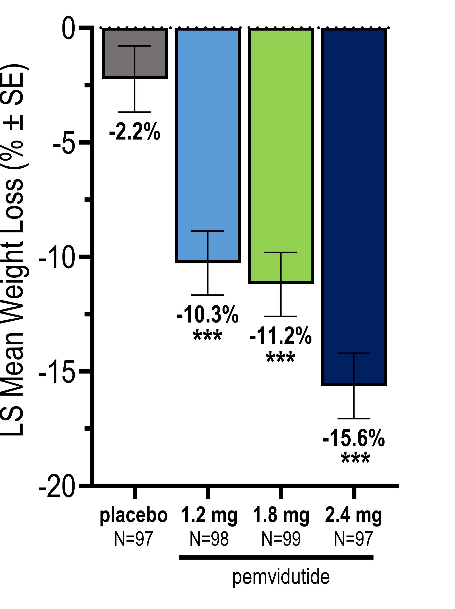

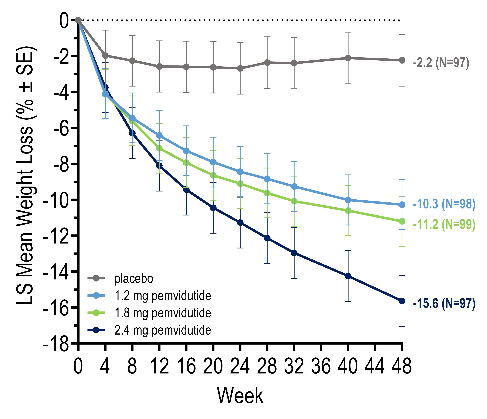

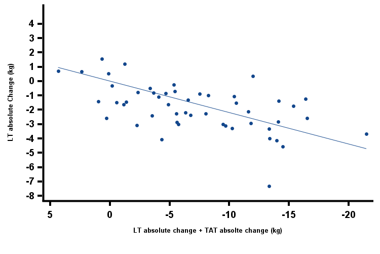

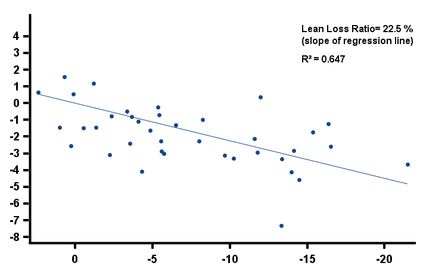

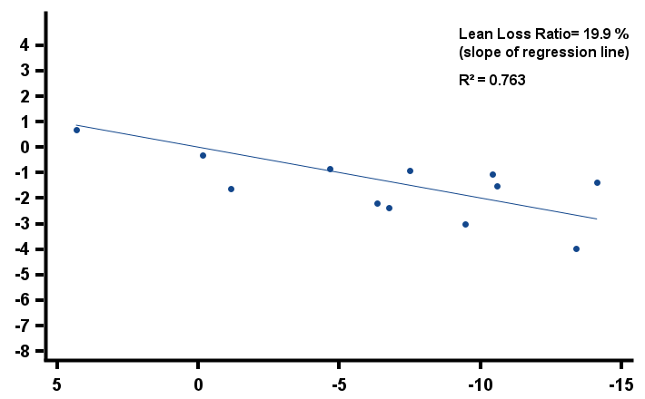

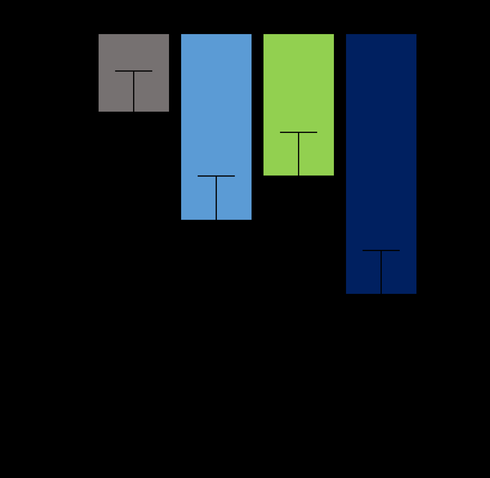

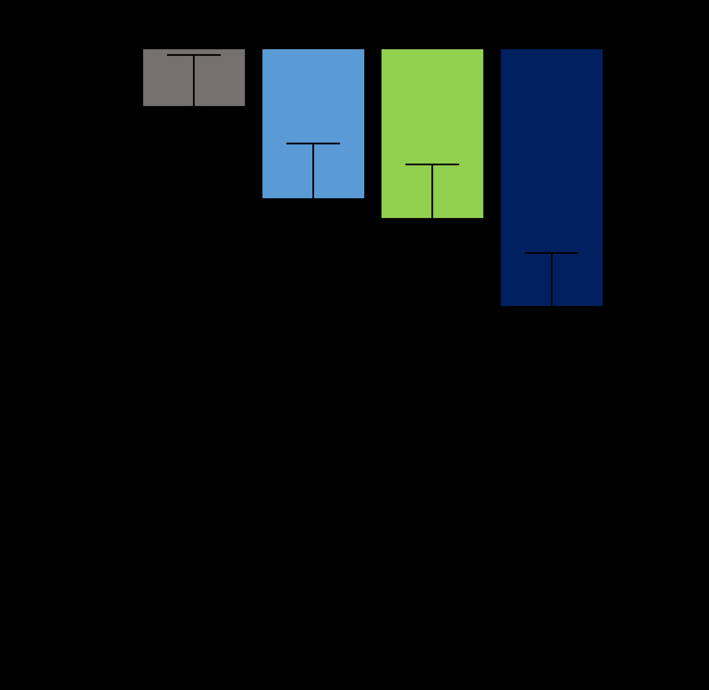

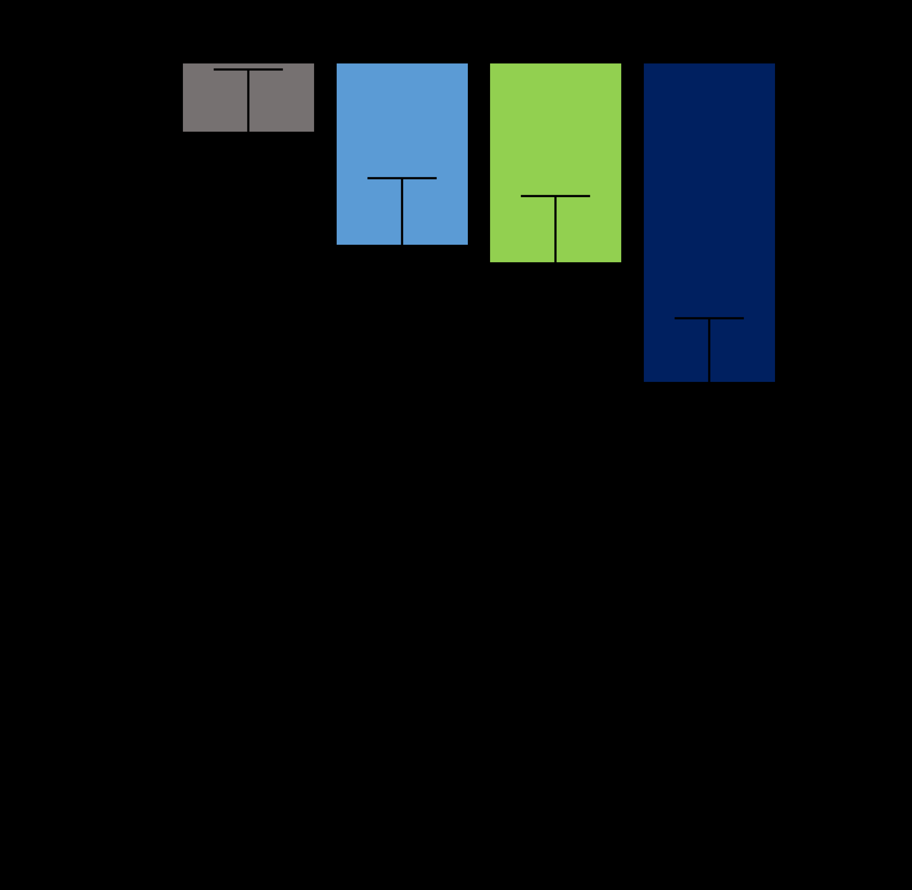

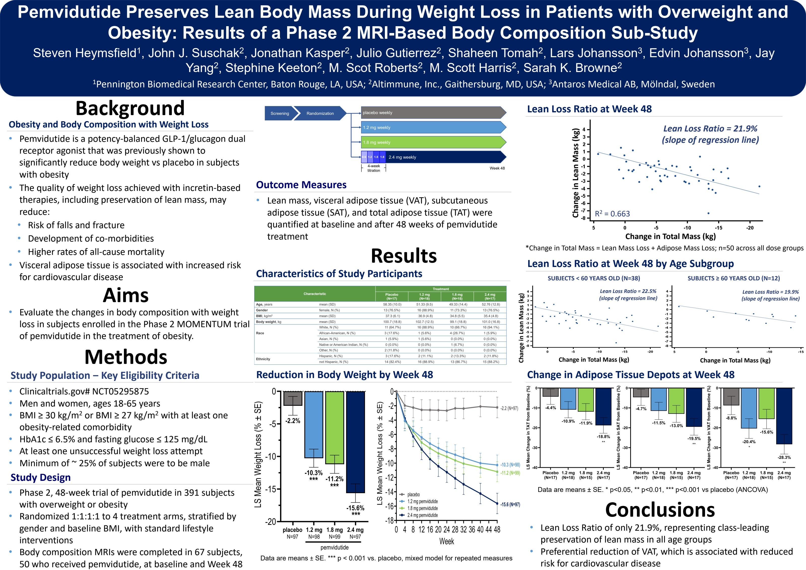

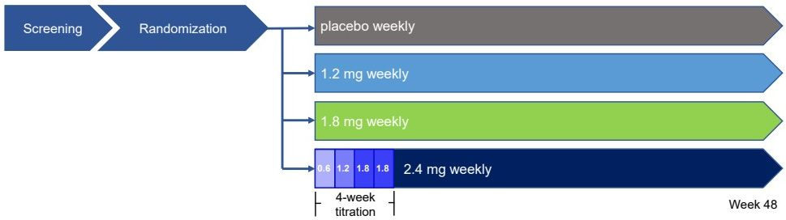

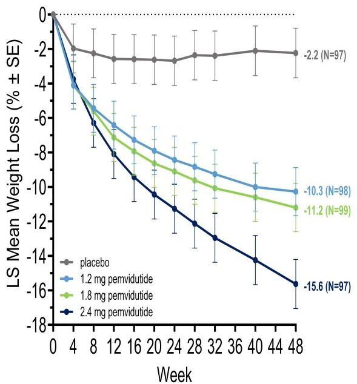

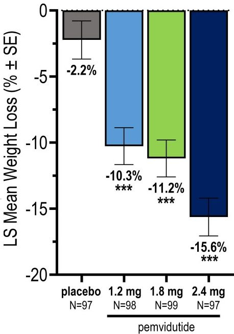

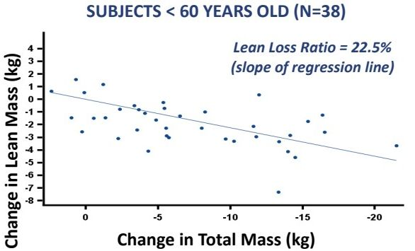

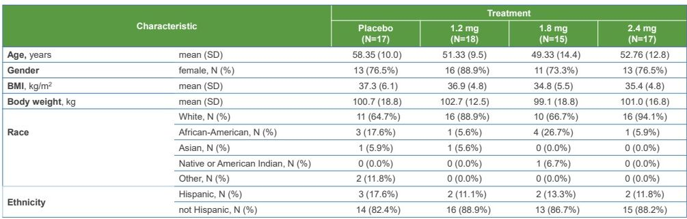

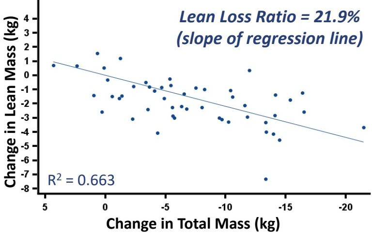

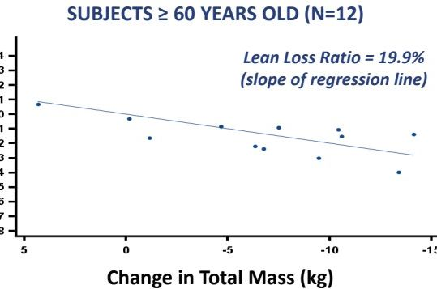

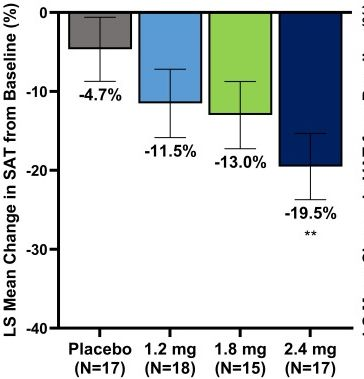

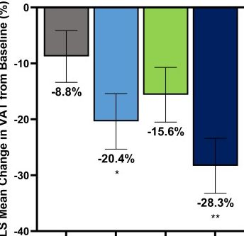

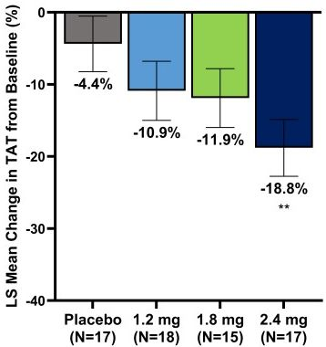
