EASL CONGRESS Milan, Italy 2024 5-8 June logo

# Pemvidutide treatment is associated with improvement in noninvasive tests indicating greater likelihood of histologic response in subjects with metabolic dysfunction-associated steatotic liver disease: a 24-week, randomized, double-blind, placebo-controlled trial

<u>Naim Alkhouri</u>¹, Shaheen Tomah², John J. Suschak², Jonathan Kasper², M. Scot Roberts², M. Scott Harris², Sarah K. Browne², Rohit Loomba³
¹Arizona Liver Health, Tucson, AZ, USA; ² Altimmune, Inc; Gaithersburg, MD, USA; ³ University of California San Diego, San Diego, CA, USA

altimmune logo

# Pemvidutide improved MASH NITs associated with histologic response

## FAST Score Responders

| Treatment     | Proportion of Subjects (%) |
| ------------- | -------------------------- |
| placebo (N=8) | 25.0                       |
| 1.2 mg (N=5)  | 60.0                       |
| 1.8 mg (N=6)  | 66.7                       |
| 2.4 mg (N=4)  | 75.0                       |

| Baseline Characteristic (FAST ≥0.35) | Treatment Placebo (n=8) | Treatment 1.2 mg (n=7) | Treatment 1.8 mg (n=6) | Treatment 2.4 mg (n=6) |
| ------------------------------------ | --------------------------- | -------------------------- | -------------------------- | -------------------------- |
| AST, IU/L mean (SD)                  | 34.1 (8.9)                  | 29.4 (6.7)                 | 30.3 (6.1)                 | 43.3 (13.6)                |
| CAP, dB/m mean (SD)                  | 356.4 (33.4)                | 361 (21.7)                 | 353.7 (41.8)               | 364.8 (37.6)               |
| LSM, kPa mean (SD)                   | 7.1 (0.8)                   | 7.2 (1.9)                  | 6.6 (1.4)                  | 7.4 (1.9)                  |
| FAST score¹ mean (SD)                | 0.8 (0.5)                   | 0.6 (0.2)                  | 0.6 (0.1)                  | 1.4 (0.6)                  |

Figure 1. Proportion of subjects with an Intermediate-to-High risk FAST score at baseline who achieved a FAST score <0.35 at Week 24

## Combined MRI + ALT Responders

| Treatment      | Proportion of Subjects (%) |
| -------------- | -------------------------- |
| placebo (N=11) | 0                          |
| 1.2 mg (N=6)   | 50.0\*\*                   |
| 1.8 mg (N=9)   | 44.4\*                     |
| 2.4 mg (N=5)   | 60.0\*\*                   |

| Baseline Characteristic (ALT ≥30 IU/L) | Treatment Placebo (n=11) | Treatment 1.2 mg (n=6) | Treatment 1.8 mg (n=9) | Treatment 2.4 mg (n=5) |
| -------------------------------------- | ---------------------------- | -------------------------- | -------------------------- | -------------------------- |
| LFC, % mean (SD)                       | 26.7 (10.4)                  | 25.5 (8.4)                 | 23.0 (7.1)                 | 24.1 (6.3)                 |
| ALT, IU/L mean (SD)                    | 52.5 (18.1)                  | 47.5 (11.7)                | 41.9 (10.3)                | 56.3 (23.4)                |

Figure 2. Proportion of subjects with baseline ALT ≥30 IU/L who achieved simultaneous reductions in MRI-PDFF ≥30% and ALT ≥17 IU/L at Week 24. Cochran-Mantel-Haenszel: *p<0.05, **p<0.005, vs. placebo

## Introduction

* Approximately 70% of individuals with obesity have metabolic dysfunction-associated steatotic liver disease (MASLD), a condition of excess liver fat

* 20-30% of MASLD subjects may advance to metabolic dysfunction-associated steatohepatitis (MASH), an inflammatory form of MASLD

* Fibroscan-AST (FAST) score combines liver stiffness measure (LSM), controlled attenuated parameter (CAP), and aspartate aminotransferase (AST) to detect elevated NAS and fibrosis

* FAST scores >0.35 indicates patients at risk of developing MASH (Newsome et al. 2020)

* A 30% relative reduction in LFC correlates with ≥2-point reduction in NAFLD activity score (NAS)

* Alanine aminotransferase (ALT) reductions of 17 IU/L are positive predictors of histologic improvement

* Pemvidutide is a balanced GLP-1/glucagon dual receptor agonist under development for the treatment of MASH and obesity

## Aim

* Examine the effects of pemvidutide on non-invasive tests (NITs) that have been shown to predict the likelihood of histologic response

## Method

### Study Design

* Sixty-four subjects with MASLD treated with pemvidutide or placebo by subcutaneous injection weekly for 24 weeks (NCT05292911)

### Study Population ‒ Key Eligibility Criteria

* BMI ≥28 kg/m² and LFC by MRI-PDFF ≥10%

* FibroScan® LSM <10kPa

* HbA1c <9.5%

* ALT and AST ≤75 IU/L

### Outcome Measures

* Proportion of subjects who achieved a FAST score <0.35 at week 24

* Proportion of subjects with ALT ≥30 IU/L at baseline who achieved a simultaneous reduction in MRI-PDFF (≥30%) and ALT (≥17 IU/L) at week 24

## Conclusions

* Pemvidutide treatment resulted in reductions of up to 76.4% in relative LFC, and 15.2 IU/L in serum ALT at 24 weeks

* Reductions in LFC correlated with improvements in NITs

* In a subset of subjects with intermediate-to-high risk of MASH, pemvidutide treatment was associated with improvement in the FAST score

* In a subset of subjects with ALT ≥30 IU/L at baseline, pemvidutide treatment resulted in a significantly greater combined ALT/MRI-PDFF response rate compared to placebo, indicating greater likelihood of histologic response

* Pemvidutide is being evaluated in an ongoing 24-week Phase 2b biopsy-driven MASH trial (IMPACT: NCT05989711)

## References

* Newsome et al. Lancet Gastroenterol. Hepatol. 2020 PMC7066580

## Characteristics of Study Participants

| Baseline Characteristic              | Treatment Placebo (n = 19) | Treatment 1.2 mg (n=16) | Treatment 1.8 mg (n=15) | Treatment 2.4 mg (n=14) |
| ------------------------------------ | ------------------------------ | --------------------------- | --------------------------- | --------------------------- |
| Age, years mean (SD)                 | 49.0 (15)                      | 48.6 (11)                   | 49.9 (10)                   | 48.4 (8)                    |
| Gender female, n (%)                 | 11 (57.9%)                     | 7 (43.8%)                   | 8 (53.3%)                   | 8 (57.1%)                   |
| BMI, kg/m² mean (SD)                 | 37.1 (4.9)                     | 36.7 (6.1)                  | 36.0 (3.8)                  | 37.0 (5.3)                  |
| Body weight, kg mean (SD)            | 104.4 (21.2)                   | 101.4 (16.3)                | 100.9 (13.2)                | 107.4 (17.2)                |
| Diabetes status T2D, n (%)           | 5 (26.3%)                      | 3 (18.8%)                   | 6 (40.0%)                   | 3 (21.4%)                   |
| Liver fat content (LFC), % mean (SD) | 24.0 (9.6)                     | 20.1 (7.7)                  | 23.9 (7.4)                  | 20.5 (6.5)                  |
| ALT, IU/L mean (SD)                  | 41.0 (21.3)                    | 32.4 (14.2)                 | 35.3 (13.0)                 | 39.6 (26.6)                 |
| AST, IU/L mean (SD)                  | 25 (10.5)                      | 24.4 (6.6)                  | 23.6 (6.9)                  | 29.4 (15.4)                 |
| CAP, dB/m mean (SD)                  | 342 (30)                       | 333 (34)                    | 347 (37)                    | 347 (33)                    |
| LSM, kPa mean (SD)                   | 6.7 (0.9)                      | 6.9 (2.0)                   | 6.1 (1.3)                   | 6.5 (1.8)                   |
| FAST score¹ mean (SD)                | 0.4 (0.5)                      | 0.4 (0.3)                   | 0.3 (0.2)                   | 0.7 (0.8)                   |

¹FAST = {exp (–1.65 + 1.07 × ln (LSM) + 2.66 × 10⁻⁸ × CAP³ – 63.3 × AST⁻¹)}/{1 + exp (–1.65 + 1.07 × ln (LSM) + 2.66 × 10⁻⁸ × CAP³ – 63.3 × AST⁻¹)}

## Results

### LFC A. Absolute Reduction

| Treatment      | Mean Absolute Change in Liver Fat (% ± SE) |
| -------------- | ------------------------------------------ |
| placebo (N=18) | -1.6                                       |
| 1.2 mg (N=14)  | -11.2\*\*\*                                |
| 1.8 mg (N=13)  | -17.0\*\*\*                                |
| 2.4 mg (N=11)  | -15.6\*\*\*                                |

### LFC B. Relative Reduction

| Treatment      | Mean Relative Change in Liver Fat (% ± SE) |
| -------------- | ------------------------------------------ |
| placebo (N=18) | -14.0                                      |
| 1.2 mg (N=14)  | -56.3\*\*\*                                |
| 1.8 mg (N=13)  | -75.2\*\*\*                                |
| 2.4 mg (N=11)  | -76.4\*\*\*                                |

Figure 3. Reduction in LFC by MRI-PDFF at Week 24. (A) Absolute and (B) relative reductions in LFC from baseline. Analysis of Covariance: ***p<0.001 vs. placebo

### CAP Absolute Reduction

| Treatment      | Mean Change from Baseline ± SE CAP (dB/m) |
| -------------- | ----------------------------------------- |
| placebo (N=18) | -32.1                                     |
| 1.2 mg (N=14)  | -36.5                                     |
| 1.8 mg (N=13)  | -52.9                                     |
| 2.4 mg (N=11)  | -90.0\*\*\*                               |

Figure 4. Reduction in FibroScan CAP score at Week 24. Absolute reduction from baseline. Analysis of Covariance: ***p<0.001 vs. placebo

### ALT All Subjects A.

| Treatment      | Mean Change from Baseline ± SE (IU/L) |
| -------------- | ------------------------------------- |
| placebo (N=19) | -2.2                                  |
| 1.2 mg (N=16)  | -13.3\*\*                             |
| 1.8 mg (N=15)  | -13.7\*\*                             |
| 2.4 mg (N=14)  | -15.2\*\*                             |

### ALT Subjects w/ Baseline ALT ≥30 IU/L B.

| Treatment      | Mean Change from Baseline ± SE (IU/L) |
| -------------- | ------------------------------------- |
| placebo (N=13) | -3.1                                  |
| 1.2 mg (N=7)   | -17.0                                 |
| 1.8 mg (N=10)  | -17.7                                 |
| 2.4 mg (N=9)   | -20.6                                 |

Figure 5. Reduction in ALT at Week 24. Absolute reductions from baseline in (A) all subjects and (B) subjects with baseline ALT ≥30 IU/L. Mixed model repeated measures: *p<0.05, **p<0.005, vs. placebo

### AST All Subjects

| Treatment      | Mean Change from Baseline ± SE (IU/L) |
| -------------- | ------------------------------------- |
| placebo (N=19) | 1.9                                   |
| 1.2 mg (N=16)  | -6.9\*\*\*                            |
| 1.8 mg (N=15)  | -6.6\*\*\*                            |
| 2.4 mg (N=14)  | -6.6\*\*\*                            |

Figure 6. Reduction in AST at Week 24. Absolute reduction from baseline in all subjects. Mixed model repeated measures: ***p<0.001 vs. placebo

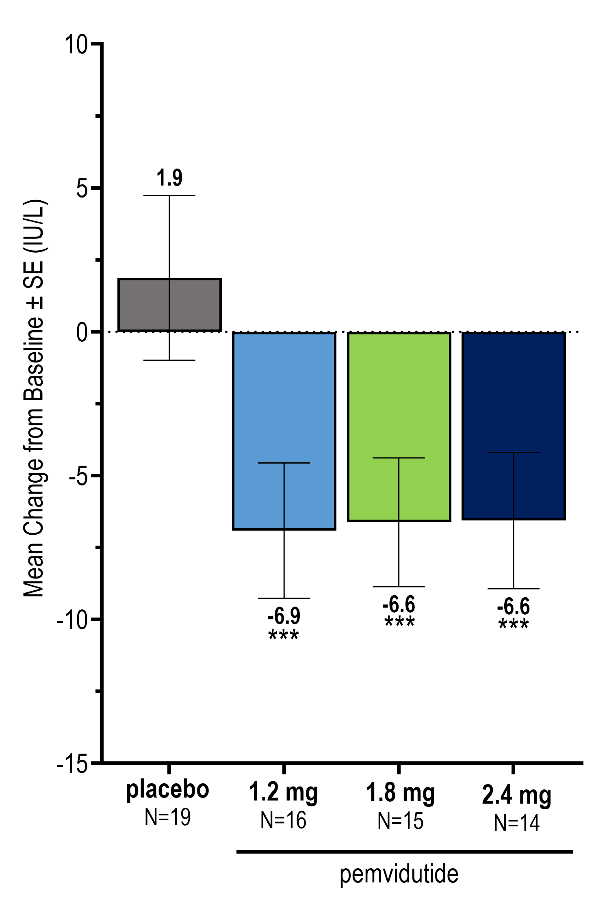

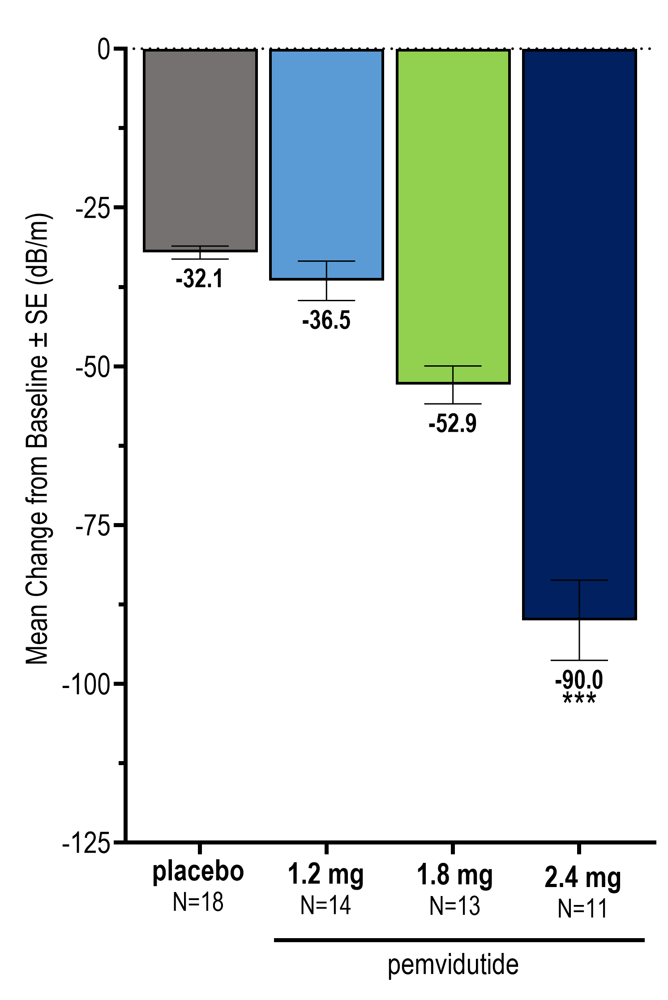

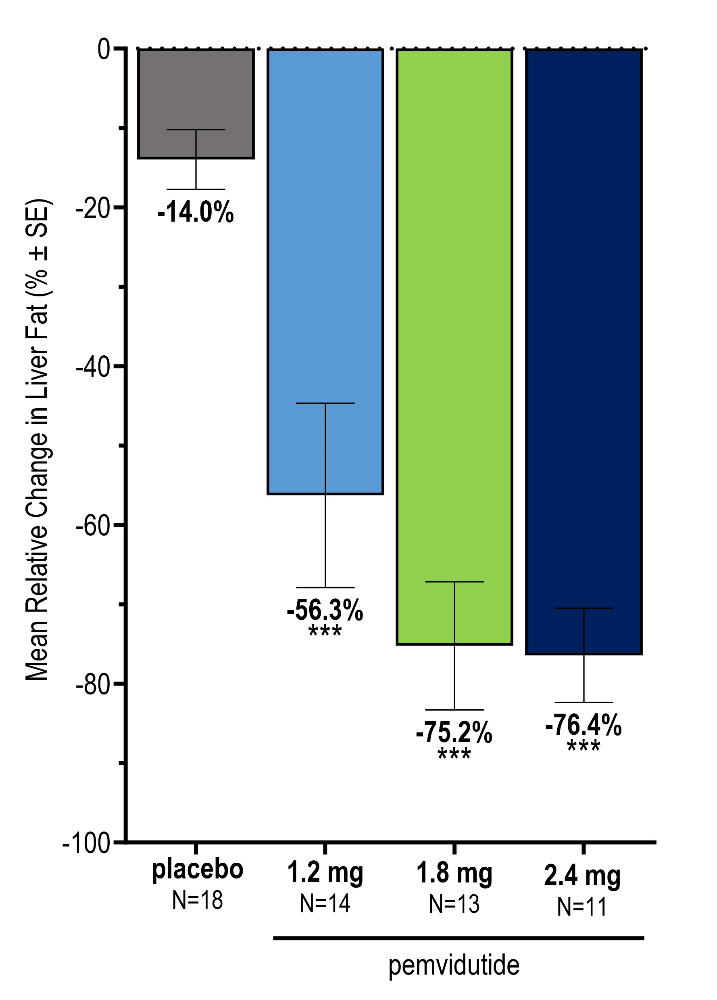

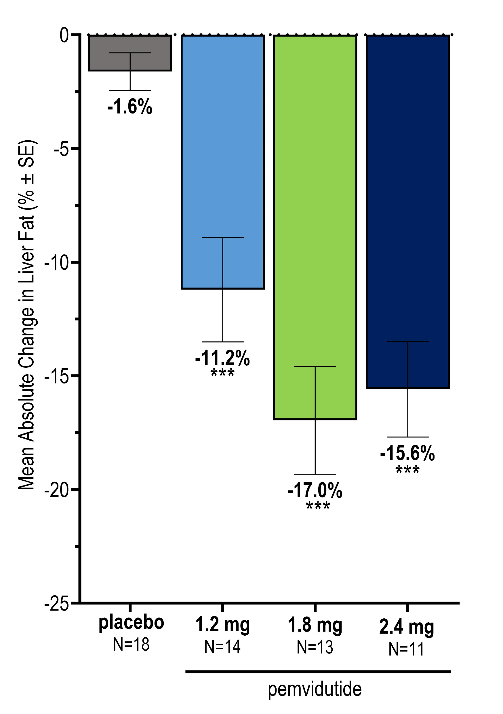

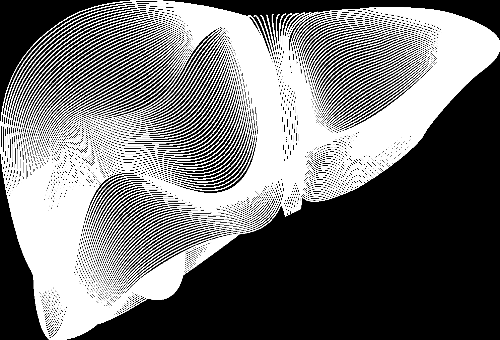

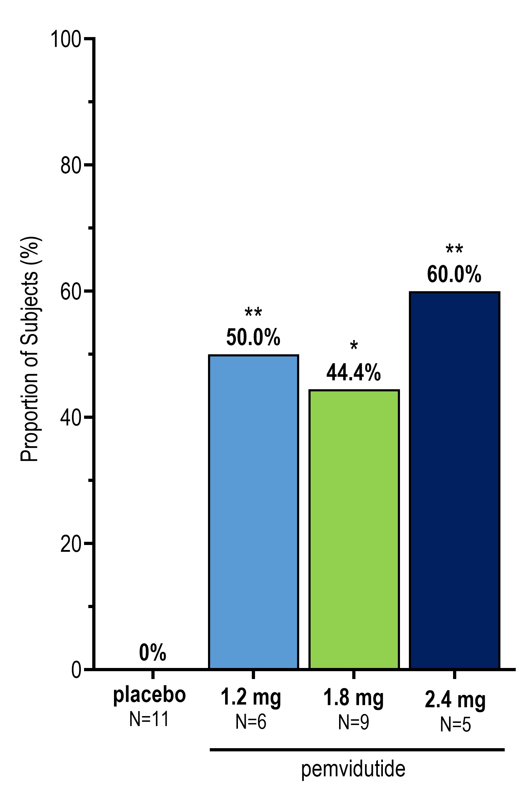

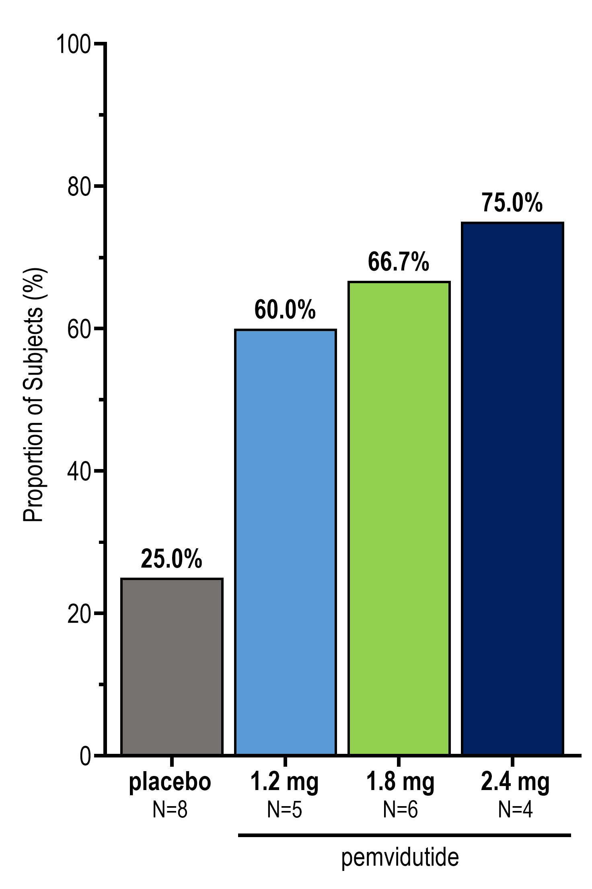

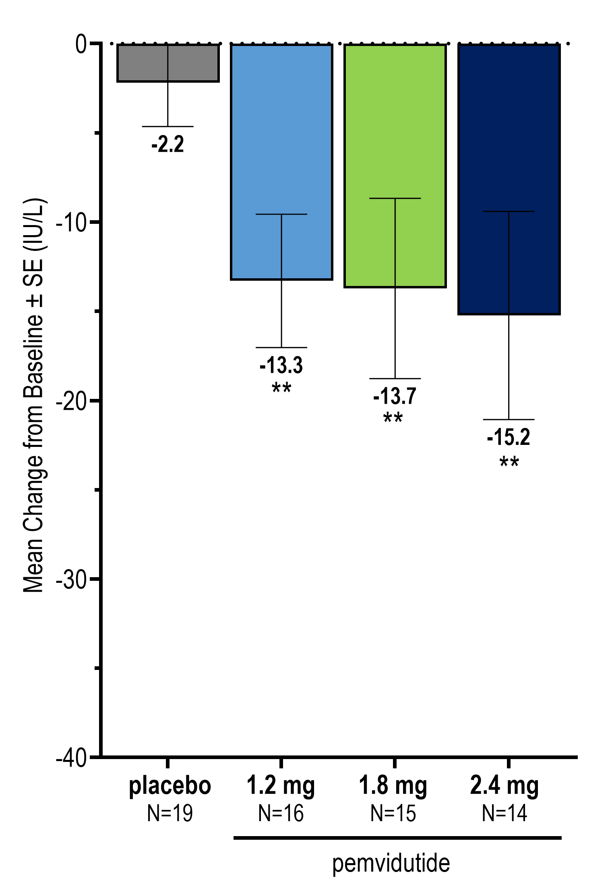

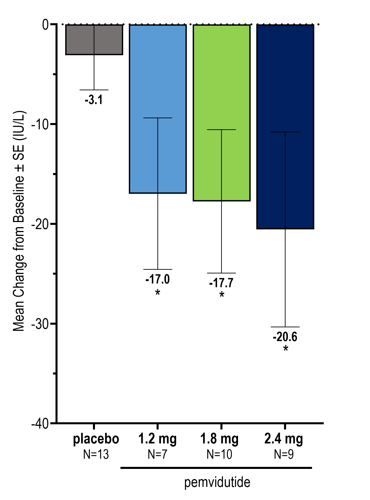

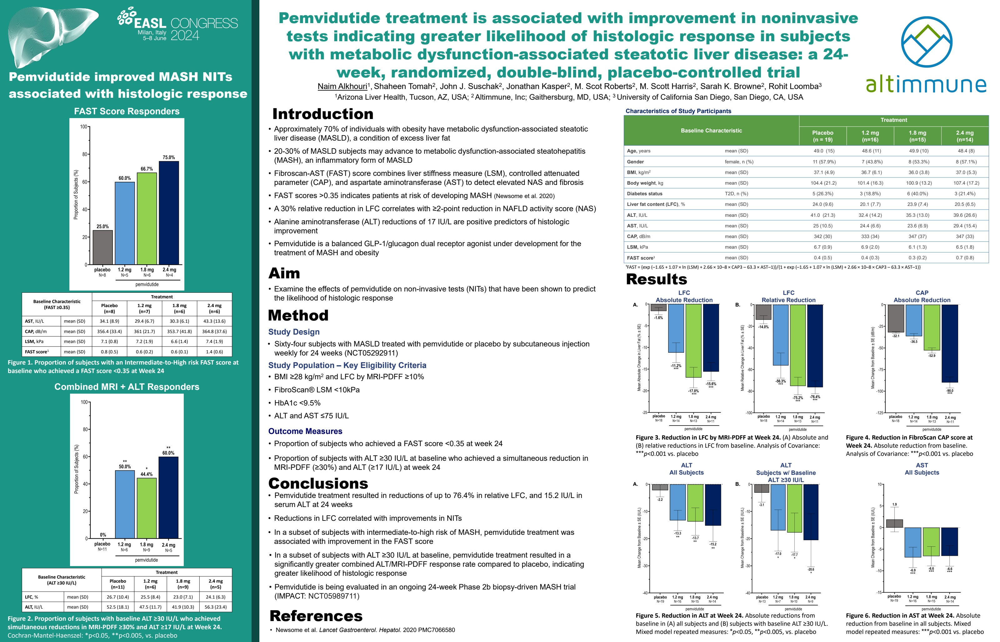

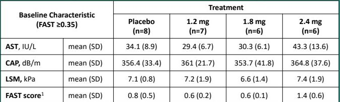

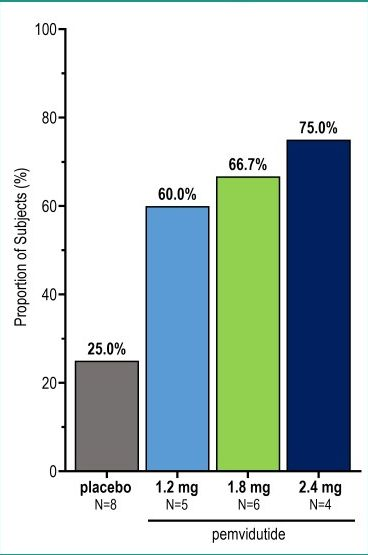

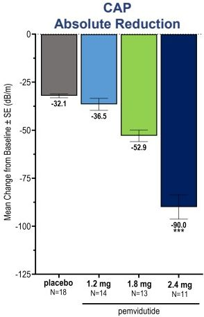

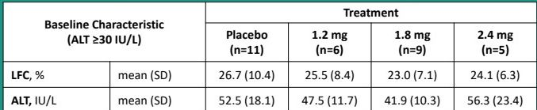

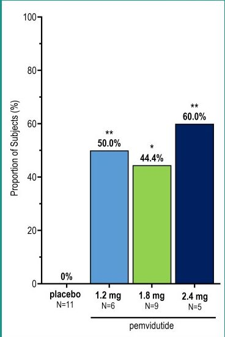

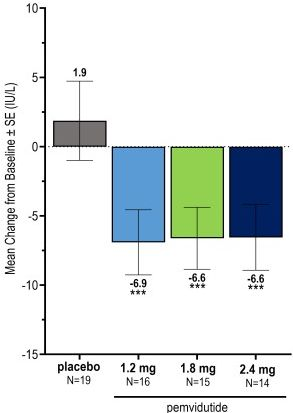

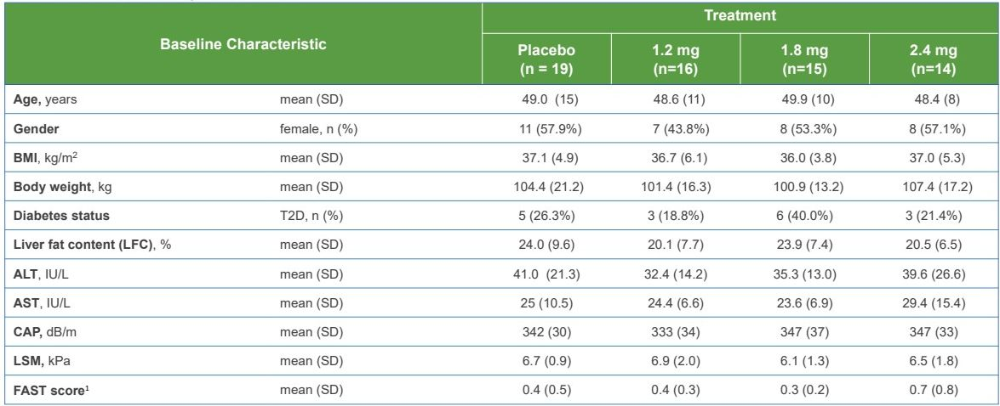

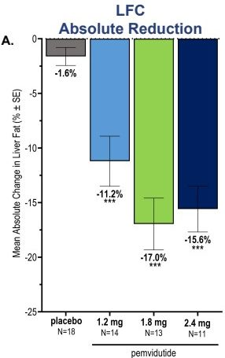

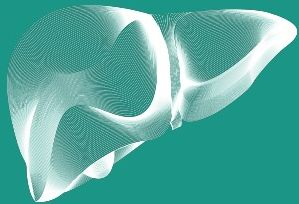

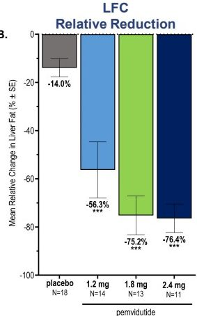

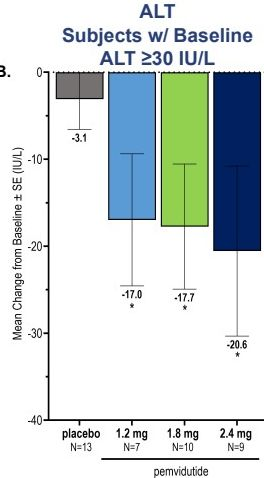

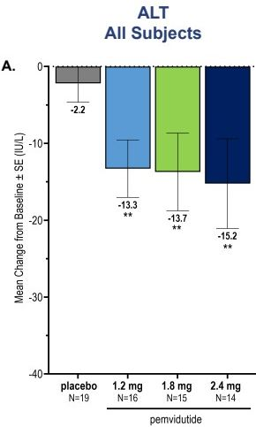
