# Safety, Tolerability and Pharmacokinetics of AZD/ECC5004, an Oral Small Molecule GLP-1 Receptor Agonist

Amina Z Haggag,¹ Sandra Pagnussat,² Jianfeng Xu,³ Xuefeng Sun,⁴ Laurie Butcher,³ Xiaoliang Pan,⁴ Haihui Liu,⁴ Wen Chen,³ Jianfeng Xu,⁴ Jingye Zhou³

¹Anaheim Clinical Trials LLC, Anaheim, CA, USA; ²QPS MRA LLC, Miami, FL, USA; ³Eccogene Inc., Cambridge, MA, USA; ⁴Eccogene (Shanghai) Co. Ltd., Shanghai, China

## Introduction

* GLP-1 receptor agonists (RA) are established therapies in type 2 diabetes (T2D), chronic weight management and cardiovascular risk reduction.¹⁻⁴

* However, as most are injectable, barrier to therapy exist for many patients who prefer an oral treatment option.

* AZD/ECC5004 is a potent oral small molecule GLP-1 RA in development for glycemic control in T2D and chronic weight management in obesity/overweight.

* In non-clinical studies, ECC5004 engaged the GLP-1 receptor and demonstrated G-protein biased signaling via cAMP, but not beta-arrestin, with potency equal to or greater than that of other small molecule GLP-1 RAs.⁵

* In non-human primates, there were no adverse effects observed over 9 months of ECC5004 therapy. Reduction in appetite was seen with up to 36.5% body weight (BW) reduction versus control, suggestive of GLP-1 receptor engagement (**Figure 1**).⁵

* In a single-ascending dose (SAD) and a multiple-ascending dose (MAD) study, we evaluated the safety, tolerability and pharmacokinetics (PK) of ECC5004 for the first time in humans.

## Figure 1. Pharmacodynamic effects in non-human primates

| Panel A: Insulin Secretion Time (min)  | Panel A: Insulin Secretion Vehicle (µU/mL) | Panel A: Insulin Secretion ECC5004 33 µg/kg (µU/mL) | Panel A: Insulin Secretion ECC5004 33 µg/kg (µU/mL) | Panel A: Insulin Secretion ECC5004 33 µg/kg (µU/mL) | Panel A: Insulin Secretion ECC5004 33 µg/kg (µU/mL) | Panel A: Insulin Secretion ECC5004 33 µg/kg (µU/mL) | Panel A: Insulin Secretion ECC5004 33 µg/kg (µU/mL) |
| ------------------------------------------ | ---------------------------------------------- | ------------------------------------------------------- | ------------------------------------------------------- | ------------------------------------------------------- | ------------------------------------------------------- | ------------------------------------------------------- | ------------------------------------------------------- |
| 0                                          | 100                                            | 100                                                     |                                                         |                                                         |                                                         |                                                         |                                                         |
| 15                                         | 200                                            | 1200                                                    |                                                         |                                                         |                                                         |                                                         |                                                         |
| 30                                         | 150                                            | 600                                                     |                                                         |                                                         |                                                         |                                                         |                                                         |
| 60                                         | 100                                            | 150                                                     |                                                         |                                                         |                                                         |                                                         |                                                         |
| Panel B: Body Weight Change vs Control (%) |                                                |                                                         |                                                         |                                                         |                                                         |                                                         |                                                         |
| Gender                                     | Dose (mg/kg/day)                               | Day 0                                                   | Day 50                                                  | Day 100                                                 | Day 150                                                 | Day 200                                                 | Day 250                                                 |
| Female                                     | 10                                             | 0                                                       | -2                                                      | -5                                                      | -8                                                      | -10                                                     | -10                                                     |
| Female                                     | 30                                             | 0                                                       | -3                                                      | -6                                                      | -8                                                      | -9                                                      | -9                                                      |
| Female                                     | 50                                             | 0                                                       | -4                                                      | -7                                                      | -10                                                     | -11                                                     | -11                                                     |
| Male                                       | 10                                             | 0                                                       | -5                                                      | -10                                                     | -12                                                     | -15                                                     | -16                                                     |
| Male                                       | 30                                             | 0                                                       | -10                                                     | -20                                                     | -25                                                     | -30                                                     | -31                                                     |
| Male                                       | 50                                             | 0                                                       | -12                                                     | -25                                                     | -30                                                     | -35                                                     | -37                                                     |

A) ECC5004 potentiated glucose stimulated insulin secretion following an intravenous glucose tolerance test; B) Body weight differences versus control over 9 months; at the end of the study, in the 10, 30 and 50 mg/kg/day groups, the least-squares mean changes in body weight gain compared with control were –15.8%, –31.3% and –36.5% in males and –10.3%, –8.5% and –11.4% in females, respectively. The starting body weights were 2.6 to 2.7 kg for females and 2.9 to 3.0 kg for males for the control and the three ECC5004-dosed groups.

## Methods

* The SAD study included two sequential cohorts with eight healthy adult participants aged 18–65 years, with a body mass index (BMI) between 18.0 and 32.0 kg/m² (**Figure 2**).

* Participants were randomized 6:2 to receive ECC5004 or placebo in four ascending dose periods (Cohort A1: 1 mg, 4 mg, 10 mg and 25 mg; Cohort A2: 50 mg, 100 mg, 200 mg, and 300 mg).

* The MAD study included four sequential cohorts, each with 12 adult participants aged 18–70 years, with BMI between 24.0 and 40.0 kg/m², HbA1c between 7.0 and 10.5%, and T2D treated with metformin (**Figure 2**).

* Participants were randomized 9:3 to receive either ECC5004 (5 mg, 10 mg, 30 mg, or 50 mg) or placebo once daily for up to 28 days.

## Figure 2. Phase 1 first-in-human SAD and MAD study design

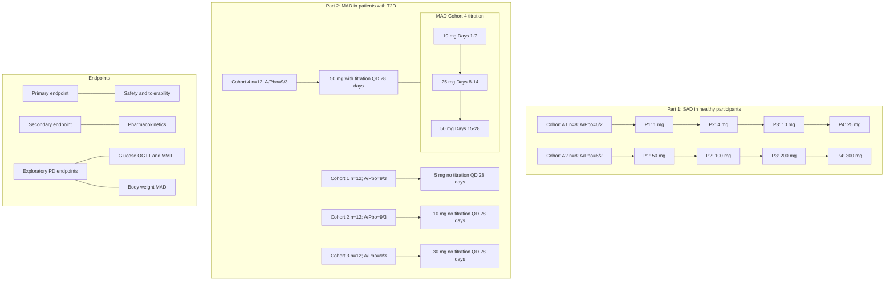

Participants were in-patient and fasted for up to 14 hours each day.

Dose range for MAD disclosed on CT.gov was 10–150 mg; 50 mg was the maximum dose studied as 10–30 mg was predicted to be the therapeutic dose range for T2D from emerging blinded data.

A, active; MAD, multiple-ascending dose; MMTT, mixed-meal tolerance test; OGTT, oral glucose tolerance test; P, period; Pbo, placebo; PD, pharmacodynamic; QD, once daily; SAD, single-ascending dose; T2D, type 2 diabetes.

## Results – SAD study

### Disposition and baseline characteristics

* In the SAD study, 39 participants were screened, and 19 participants randomized including four replacements; 16 participants (eight in each in cohort) completed the study.

* Baseline demographics were well-balanced between cohorts.

* Doses from 1 mg up to 300 mg were administered as single doses.

### Safety and tolerability

* There were no serious adverse events (SAEs), deaths or discontinuations due to treatment-emergent adverse events (TEAEs) (**Table 1**).

* Dose-dependent increases in adverse events (AEs) were observed; nausea and vomiting were the most common AEs observed at doses ≥ 50 mg.

* No clinically significant treatment-emergent changes in ECGs or laboratory assessments were observed.

### Pharmacokinetics

* Dose-dependent increases in ECC5004 concentrations were observed (**Figure 3**).

* GM time to maximum concentration (tₘₐₓ) was 7.6 hours (gCV 36.7%) to 16.7 hours (101.0%).

### Exploratory pharmacodynamics

* Reductions were observed in glucose area-under-the-curve (AUC) during the oral glucose tolerance test (OGTT) from doses ≥ 4 mg (**Figure 4**).

## Figure 3. SAD ECC5004 pharmacokinetic results

| SAD ECC5004 PK (Weight normalized concentration ng/mL) Time (hr) | SAD ECC5004 PK (Weight normalized concentration ng/mL) 1 mg | SAD ECC5004 PK (Weight normalized concentration ng/mL) 4 mg | SAD ECC5004 PK (Weight normalized concentration ng/mL) 10 mg | SAD ECC5004 PK (Weight normalized concentration ng/mL) 25 mg | SAD ECC5004 PK (Weight normalized concentration ng/mL) 50 mg |
| -------------------------------------------------------------------- | --------------------------------------------------------------- | --------------------------------------------------------------- | ---------------------------------------------------------------- | ---------------------------------------------------------------- | ---------------------------------------------------------------- |
| 0                                                                    | 0.1                                                             | 0.1                                                             | 0.1                                                              | 0.1                                                              | 0.1                                                              |
| 10                                                                   | 0.5                                                             | 2                                                               | 5                                                                | 15                                                               | 30                                                               |
| 20                                                                   | 0.3                                                             | 1.5                                                             | 4                                                                | 10                                                               | 20                                                               |
| 48                                                                   | 0.1                                                             | 0.5                                                             | 1                                                                | 3                                                                | 5                                                                |
| Time (hr)                                                            | 100 mg                                                          | 200 mg                                                          | 300 mg                                                           |                                                                  |                                                                  |
| 0                                                                    | 0.1                                                             | 0.1                                                             | 0.1                                                              |                                                                  |                                                                  |
| 10                                                                   | 60                                                              | 120                                                             | 200                                                              |                                                                  |                                                                  |
| 20                                                                   | 40                                                              | 80                                                              | 150                                                              |                                                                  |                                                                  |
| 48                                                                   | 10                                                              | 20                                                              | 40                                                               |                                                                  |                                                                  |

Above lower limit of quantification

## Figure 4. SAD ECC5004 pharmacodynamic results indicate engagement of the GLP-1 receptor

| Dose (mg) | Median % Change in OGTT Glucose AUC |
| --------- | ----------------------------------- |
| Placebo   | 0                                   |
| 1         | -5                                  |
| 4         | -15                                 |
| 10        | -20                                 |
| 25        | -22                                 |
| 50        | -25                                 |
| 100       | -30                                 |
| 200       | -32                                 |
| 300       | -35                                 |

Dots represent individual % change; box plot is of median, 25th & 75th percentiles. During the OGTT, participants fasted for 10 hours and blood was collected for plasma glucose at 0.25, 0.5, 1.0, 1.5, and 2 hours post oral intake of 75 g glucose at baseline (Day -1) and Day 1 post treatment. AUC, area under the curve; OGTT, oral glucose tolerance test.

## Table 1. SAD summary of treatment-emergent adverse events

| Variables, n (%) \[E]            | ECC5004 1 mg n = 6 | ECC5004 4 mg n = 6 | ECC5004 10 mg n = 6 | ECC5004 25 mg n = 6 | Placebo n = 8 | Total n = 9 |
| -------------------------------- | -------------------------- | -------------------------- | --------------------------- | --------------------------- | ----------------- | --------------- |
| Cohort A1                        |                            |                            |                             |                             |                   |                 |
| TEAEs                            | 1 (16.7) \[3]              | 2 (33.3) \[3]              | 1 (16.7) \[2]               | 0                           | 2 (25.0) \[5]     | 4 (44.4) \[13]  |
| Leading to study discontinuation | 0                          | 0                          | 1 (16.7) \[1]               | 0                           | 0                 | 1 (11.1) \[1]   |
| Nausea                           | 1 (16.7) \[1]              | 1 (16.7) \[2]              | 1 (16.7) \[1]               | 0                           | 0                 | 2 (22.2) \[4]   |
| Vomiting                         | 1 (16.7) \[1]              | 0                          | 0                           | 0                           | 0                 | 1 (11.1) \[1]   |
| Variables, n (%) \[E]            | ECC5004                    |                            |                             |                             | Placebo           | Total           |
|                                  | 50 mg                      | 100 mg                     | 200 mg                      | 300 mg                      | n = 8             | n = 9           |
|                                  | n = 6                      | n = 6                      | n = 6                       | n = 6                       |                   |                 |
| Cohort A2                        |                            |                            |                             |                             |                   |                 |
| TEAEs                            | 4 (66.7) \[8]              | 6 (100) \[18]              | 6 (100) \[15]               | 6 (100) \[13]               | 1 (12.5) \[1]     | 9 (100) \[55]   |
| Leading to study discontinuation | 1 (16.7) \[1]              | 0                          | 0                           | 0                           | 0                 | 1 (11.1) \[1]   |
| Nausea                           | 3 (50.0) \[3]              | 5 (83.3) \[6]              | 5 (83.3) \[5]               | 4 (66.7) \[4]               | 0                 | 9 (100) \[18]   |
| Vomiting                         | 1 (16.7) \[1]              | 5 (83.3) \[5]              | 3 (50.0) \[3]               | 4 (66.7) \[4]               | 0                 | 8 (88.9) \[13]  |

There were two discontinuations due to TEAEs of oral candidiasis and COVID-19. There were no SAEs and no TEAEs leading to death. The numbers of participants within each column should not be added because a patient may have had more than one adverse event. E, number of adverse events recorded; SAE, serious adverse event; TEAE, treatment-emergent adverse event.

## Results – MAD study

### Disposition and baseline characteristics

* In the MAD study, 188 participants were screened, 52 randomized and 48 (92.3%) completed the study.

* ECC5004 doses 5, 10 and 30 mg were administered without titration over 28 days; 50 mg was up titrated weekly (10 mg 7/7, 25 mg 7/7, and 50 mg 14/7).

* Baseline demographics were well-balanced between cohorts. All participants had T2D and were predominantly male (55.8%) and White (76.9%). Participants had a mean age of 56.1 (SD 8.3) years, mean HbA1c of 8.6% (SD 0.9) and a mean BMI of 31.7 kg/m² (SD 1.6).

### Safety and tolerability

* There were no SAEs or deaths (**Table 2**).

* All doses were well tolerated; dose-dependent increases in AEs were observed and nausea and vomiting were the most common AEs.

* There were two discontinuations due to TEAEs: QTc prolongation on Day 1 (Cohort 3) and asymptomatic, transient liver enzyme elevation on Day 7 (Cohort 4); both of which resolved with no intervention.

* Dose-dependent increases in heart rate were observed with +2.7 bpm (95% CI: –2.4, +7.9; n = 9) at 50 mg versus –7.0 bpm (95% CI: –16.0, 1.9; n = 3) in placebo at 28 days; no differences in blood pressure were observed between groups.

* No other clinically significant treatment-emergent changes in ECGs or laboratory assessments (including liver enzymes) were observed.

## Table 2. MAD summary of treatment-emergent adverse events

| Variables, n (%) \[E]            | ECC5004 5 mg n = 9 | ECC5004 10 mg n = 9 | ECC5004 30 mg n = 10 | ECC5004 50 mg (uptitrated) n = 10 | Placebo n = 13 | Total n = 51 |
| -------------------------------- | -------------------------- | --------------------------- | ---------------------------- | ----------------------------------------- | ------------------ | ---------------- |
| TEAEs                            | 7 (77.8) \[14]             | 3 (33.3) \[7]               | 10 (100) \[45]               | 9 (90.0) \[57]                            | 8 (61.5) \[27]     | 37 (72.5) \[150] |
| Leading to study discontinuation | 0                          | 0                           | 1 (10.0) \[1]                | 1 (10.0) \[1]                             | 0                  | 2 (3.9) \[2]     |
| Gastrointestinal disorders       | 3 (33.3) \[6]              | 3 (33.3) \[6]               | 9 (90.0) \[31]               | 7 (70.0) \[27]                            | 7 (53.8) \[17]     | 29 (56.9) \[87]  |
| Nausea                           | 1 (11.1) \[1]              | 1 (11.1) \[1]               | 6 (60.0) \[6]                | 6 (60.0) \[8]                             | 1 (7.7) \[1]       | 15 (29.4) \[17]  |
| Diarrhea                         | 3 (33.3) \[5]              | 0                           | 2 (20.0) \[2]                | 2 (20.0) \[7]                             | 3 (23.1) \[4]      | 10 (19.6) \[18]  |
| Vomiting                         | 0                          | 0                           | 1 (10.0) \[1]                | 2 (20.0) \[7]                             | 0                  | 3 (5.9) \[10]    |

There were no SAEs and no TEAEs leading to death. E, number of adverse events recorded; SAE, serious adverse event; TEAE, treatment-emergent adverse event.

## Figure 5. MAD ECC5004 pharmacokinetic results

| MAD ECC5004 PK (ng/mL) Dose | MAD ECC5004 PK (ng/mL) Day 1 Peak | MAD ECC5004 PK (ng/mL) Day 14 (Steady State) | MAD ECC5004 PK (ng/mL) Day 28 Peak |
| ------------------------------- | ------------------------------------- | ------------------------------------------------ | -------------------------------------- |
| 5 mg                            | 30                                    | 30                                               | 30                                     |
| 10 mg                           | 80                                    | 80                                               | 80                                     |
| 30 mg                           | 300                                   | 350                                              | 400                                    |
| 50 mg                           | 100                                   | 400                                              | 700                                    |

### Pharmacokinetics

* Dose-dependent increases in ECC5004 concentration were observed and the PK profile was comparable to that observed in the SAD study (**Table 3**).

### Exploratory pharmacodynamics

* On Day 28, at ECC5004 50 mg, the least-squares (LS) mean change from baseline in fasting glucose levels was –76.6 mg/dL (95% CI: –106.8, –46.4; n = 9). The LS mean percent change for glucose AUC₀₋₄ₕ was –51.67% (95% CI: –60.97, –40.29; n = 9), and for BW was –5.76% (95% CI: –7.43, –4.09; n = 9) (**Figure 6**).

## Table 3. MAD pharmacokinetic parameters (Day 28)

|                               | ECC5004 5 mg n = 9 | ECC5004 10 mg n = 9 | ECC5004 30 mg n = 9 | ECC5004 50 mg n = 10 |
| ----------------------------- | -------------------------- | --------------------------- | --------------------------- | ---------------------------- |
| Cₘₐₓ, ng/mL, GM (gCV%)        | 27.31 (45.4)               | 80.28 (64.6)                | 373.66 (47.9)               | 682.66 (92.8)                |
| tₘₐₓ, hr, GM (gCV%)           | 5.69 (60.3)                | 3.67 (77.7)                 | 7.18 (36.9)                 | 6.61 (41.6)                  |
| AUC₀₋ₗₐₛₜ, h•ng/mL, GM (gCV%) | 666.49 (40.2)              | 1801.64 (60.2)              | 8310.03 (66.3)              | 13 104.95 (143.3)            |
| CL/F, L/h                     | 11.31 (37.4)               | 8.19 (59.3)                 | 5.07 (57.5)                 | 4.34 (90.7)                  |
| t₁/₂, hr, GM (gCV%)\*         | 22.83 (27.0)               | 21.07 (25.3)                | 14.95 (29.9)                | 11.37 (20.8)                 |

\*PK estimates are limited in their interpretation as the elimination phase was not well captured at 48 hours; for detailed PK characterization, refer to Haggag A, et al. AZD5004/ECC5004, a Small Molecule GLP-1 Receptor Agonist May be Administered Once Daily Under Fed/Fasted Conditions. Presented at Obesity Week, Nov 4, 2024.
AUC₀₋ₗₐₛₜ, area under the plasma concentration–time curve from time zero to the last measurable non-zero concentration; CL/F, oral clearance; gCV%, geometric coefficient of variation; Cₘₐₓ, maximum concentration; GM, geometric mean; MAD, multiple-ascending dose; PK, pharmacokinetics; t₁/₂, elimination half-life time; tₘₐₓ, time to maximum concentration.

## Figure 6. MAD ECC5004 exploratory pharmacodynamic results

| Dose    | A. Fasting Glucose (mg/dL) | B. MMTT Glucose AUC (%) | C. Body Weight (%) |
| ------- | -------------------------- | ----------------------- | ------------------ |
| Placebo | -10                        | -5                      | -1                 |
| 5 mg    | -20                        | -15                     | -2                 |
| 10 mg   | -30                        | -25                     | -3                 |
| 30 mg   | -50                        | -40                     | -4                 |
| 50 mg   | -77                        | -52                     | -6                 |

Titration: 10 mg 7 days, 25 mg 7 days, 50 mg 14 days. Error bars together with boxes show 95% CI and LS means (LS geometric means for MMTT AUC) from the linear mixed effect analysis. Dots are individual data points. AUC, area under the curve; BL, baseline; BMI, body mass index; CI, confidence interval; LS, least-square; MMTT, mixed-meal tolerance test.

## Limitations

* The elimination phase of ECC5004 was not well-captured due to PK samples being collected for 48 hours post-dose only.

* Study was not optimized to evaluate PD endpoints because all participants were hospitalized and fasted for up to 14 hours each day to minimize variability in PK assessments.

* Small sample size was not powered to discern differences on exploratory PD endpoints.

## Conclusions

* ECC5004 is an oral small molecule GLP-1 RA in development for glycemic control in T2D and chronic weight management in obesity/overweight, with potential to increase access to therapy for patients.

* The Phase 1 SAD and MAD studies in healthy volunteers and in patients with T2D demonstrated an acceptable safety profile.

* The PK profile supports once-daily oral dosing.

* These first-in-human data provide evidence for dose-dependent GLP-1 receptor target engagement in humans.

* Overall, these data support continued development of ECC5004. Phase 2b studies in overweight/obesity (VISTA, NCT06579092) and T2D (SOLSTICE, NCT06579105) are currently enrolling.

## References

1. Tan Q, Akindehin SE, Orsso CE, et al. Front Endocrinol (Lausanne) 2022;13:838410.
2. Brunton SA, Wysham CH. Postgrad Med 2020;132(S2):3–14.
3. Nauck MA, Quast DR, Wefers J, Meier JJ. Mol Metab 2021;46:101102.
4. Zhao X, Wang M, Wen Z, et al. Front Endocrinol (Lausanne) 2021;12:721135.
5. Haggag A, Xu J, Butcher L, et al. Diabetes Obes Metab 2024. DOI: 10.1111/dom.16047.

## Disclosures

AH and SP have no conflicts of interest. JX, XS, LB, XP, HL, WC, JX and JZ are employees and equity holders of Eccogene.

## Acknowledgements

We thank Victoria E.R. Parker, MBBS PhD and Meera Kodukulla, PhD, from AstraZeneca for medical writing support. Editorial assistance was provided by Oxford PharmaGenesis, Oxford, UK, which was funded by AstraZeneca.

Presented at Obesity Week, November 3–6, 2024, San Antonio, TX, USA

Funded by: ECCOGENE

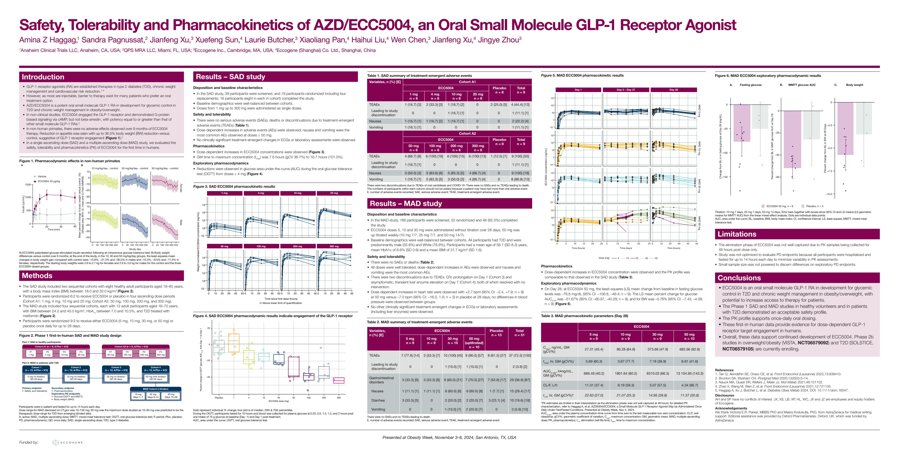

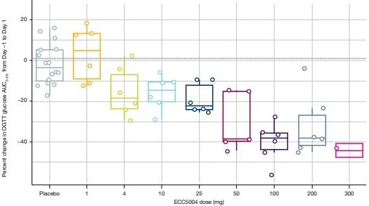

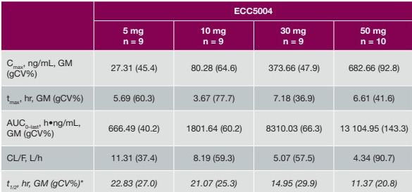

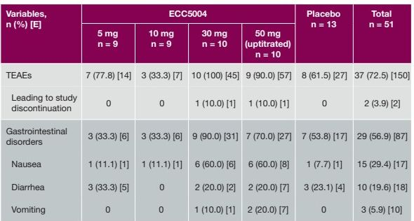

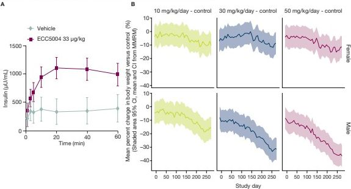

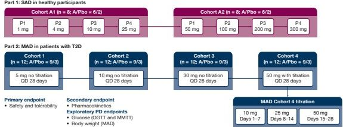

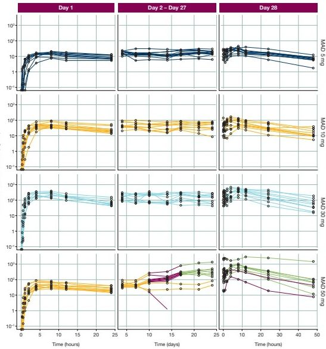

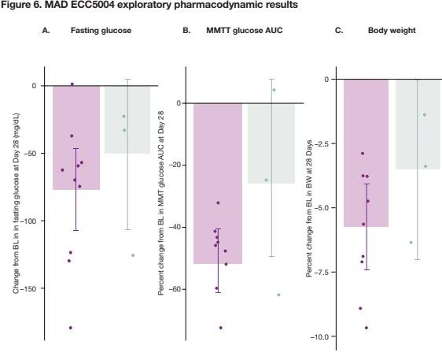

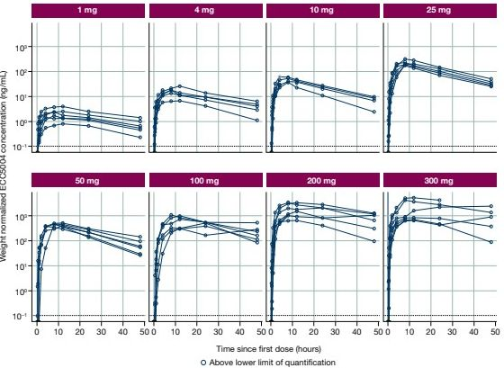

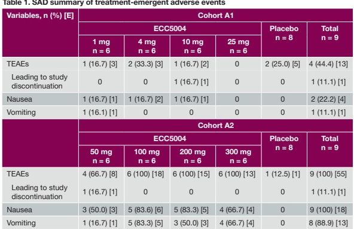
