# Neuroprotective effects of HM15211, a novel long-acting GLP-1/GIP/Glucagon triple agonist in the neurodegenerative disease models

**Jeong A Kim**, Sang Don Lee, Sang-Hyun Lee, Sung Min Bae, In Young Choi, and Young Hoon Kim

Hanmi Pharm. Co., Ltd., Seoul, Republic of Korea

Hanmi logo

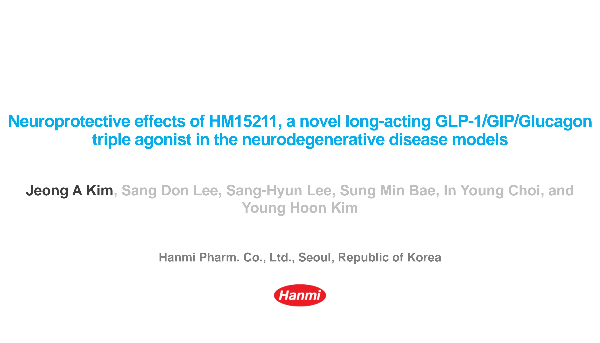

Presenter Disclosure

Hanmi logo

# Employee of Hanmi Pharm. Co., Ltd.

European Association for the Study of Diabetes (EASD) 54ᵗʰ Annual Meeting, Berlin, German; 01-05 Oct., 2018

Hanmi Pharm. Co., Ltd.

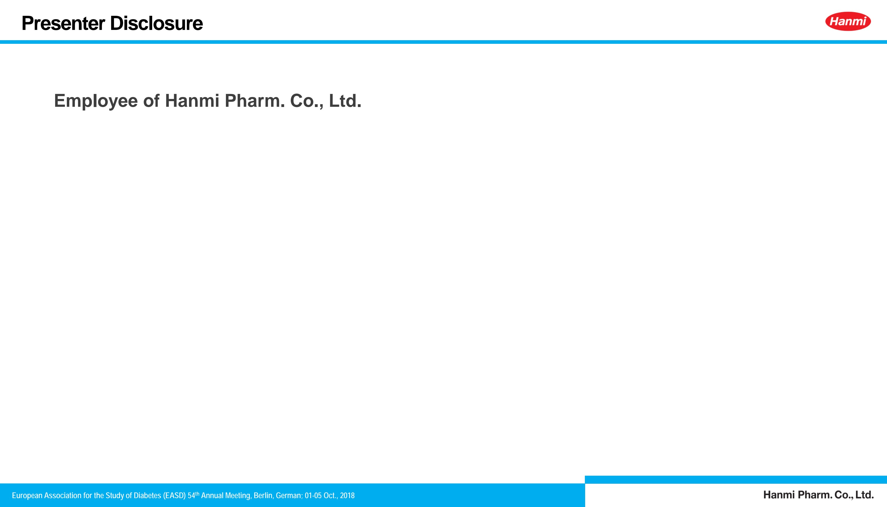

# HM15211, a novel long-acting GLP-1/GIP/Glucagon triple agonist

Hanmi logo

Diagram of HM15211 showing GLP-1/GIP/GCG triple agonist, Flexible PEG Linker, and Aglycosylated Fc fragment

Hanmi’s GLP-1/GIP/GCG triple agonist is conjugated with a human IgG Fc fragment *via* flexible linker

**[General profile]**

* Extended half-life (t1/2 = 42.7 ~ 55 hrs in mice; 82.8 ~ 85.7 hrs in rats)

* High glucagon (GCG) activity suitable for obesity treatment

* Balanced GLP-1 and GIP to neutralize hyperglycemic risk of high GCG

* Anti-inflammatory effect by GIP activity

* Recently completed for FIH clinical study in healthy obese subjects

**LAPSCOVERY : Long Acting Peptide/Protein DiSCOVERY Technology**

European Association for the Study of Diabetes (EASD) 54ᵗʰ Annual Meeting, Berlin, German; 01-05 Oct., 2018

Hanmi Pharm. Co., Ltd.

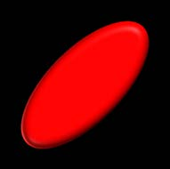

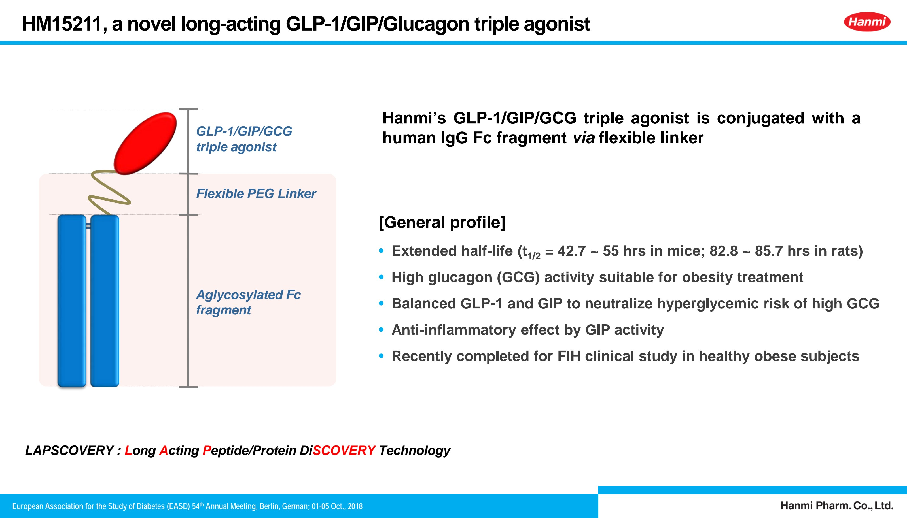

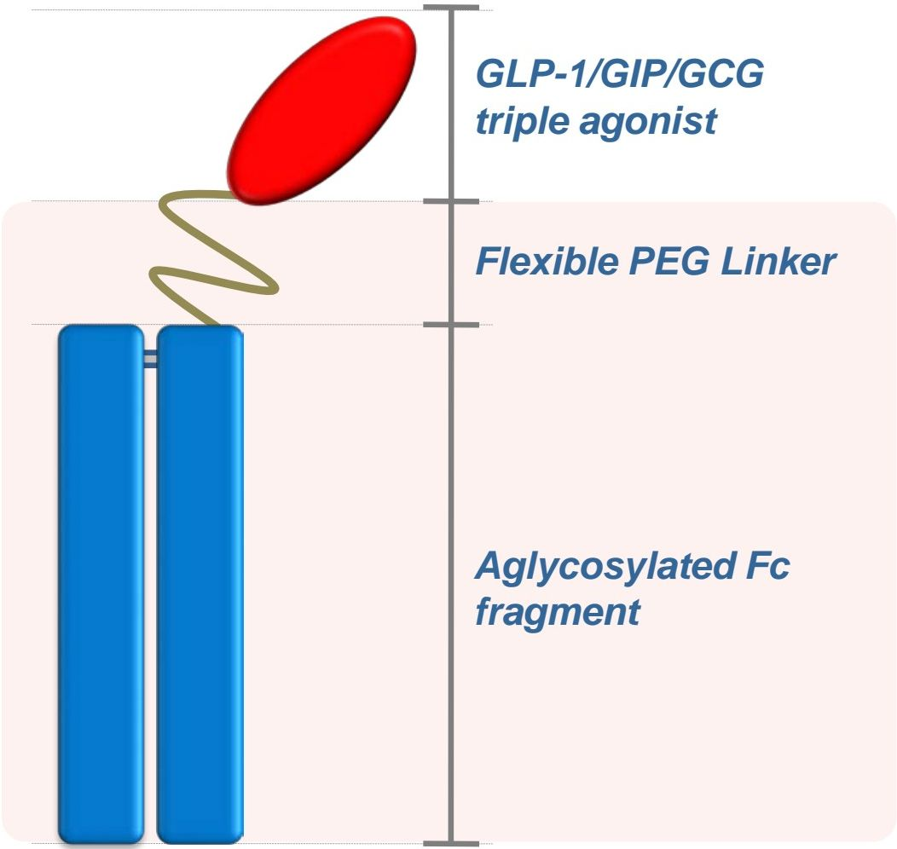

# Incretin hormones in central nervous system

Hanmi logo

* Obesity is one of the risk factors for neurological disorders

### Parkinson’s disease
* Insulin resistance, T2DM ↑ PD
* ↑ Insulin levels ↑ α-synuclein aggregation
* Leptin ↑ survival of DA cells

### Alzheimer’s disease
* ↑ BMI, T2DM ↑ AD risk
* Leptin/insulin resistance ↑ AD
* Leptin ↓ Aβ, p-tau

### Multiple sclerosis
* Obesity ↑ MS risk
* Caloric restriction ↑ EAE lifespan
* ↓ insulin sensitivity in MS

* Neuroprotective effects of GLP-1, glucagon and GIP

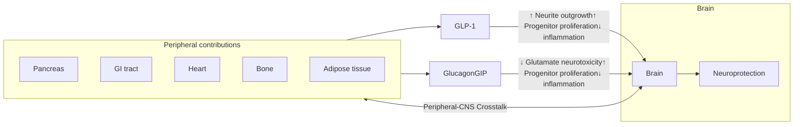

European Association for the Study of Diabetes (EASD) 54ᵗʰ Annual Meeting, Berlin, German; 01-05 Oct., 2018
Hanmi Pharm. Co., Ltd.

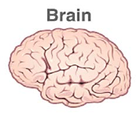

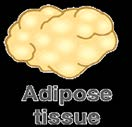

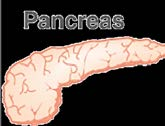

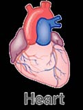

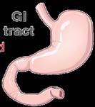

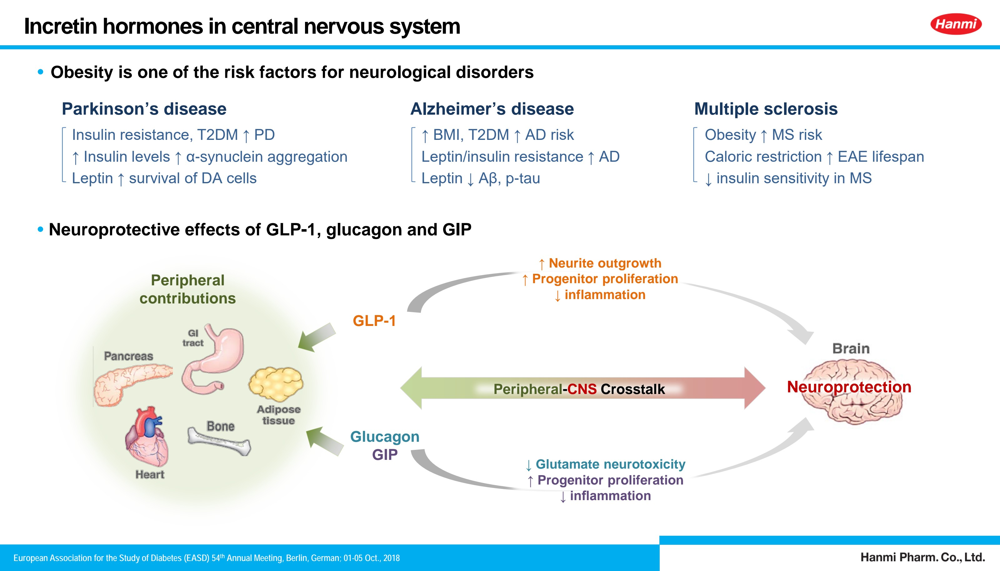

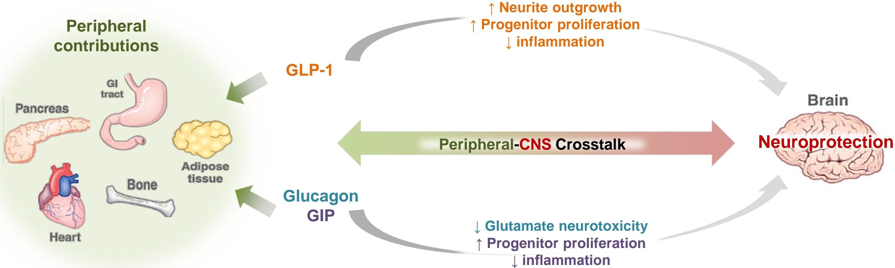

Objective

Hanmi logo

# Evaluation of neuroprotective potential of HM15211...

* **To assess the efficacy and related mode of actions**
    

    - a. in Parkinson’s disease mice model
    

    - b. of Alzheimer’s disease in diabetic mice model

European Association for the Study of Diabetes (EASD) 54ᵗʰ Annual Meeting, Berlin, German; 01-05 Oct., 2018

Hanmi Pharm. Co., Ltd.

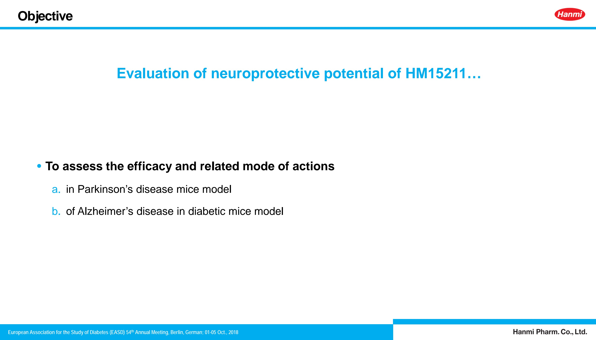

# Efficacy and related MoAs in Parkinson’s disease mice model

European Association for the Study of Diabetes (EASD) 54ᵗʰ Annual Meeting, Berlin, German; 01-05 Oct., 2018 Hanmi Pharm. Co., Ltd.

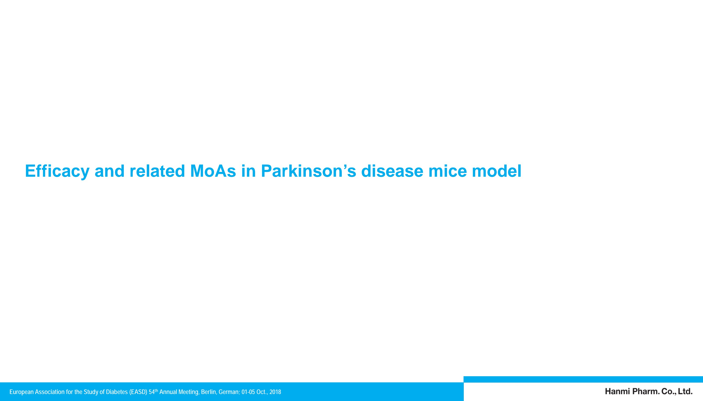

# Parkinson’s disease mouse model Hanmi logo

* MPTP is a specific neurotoxin affecting the nigrostriatal system.

Diagram showing MPTP crossing the BBB from blood to glial cells, converting to MPP+, and entering dopamine neurons via dopamine transporters, leading to complex I inhibition, ATP decrease, reactive oxygen species, oxidative stress, inflammation, and cell death.

## • Experimental scheme

### Subchronic PD model

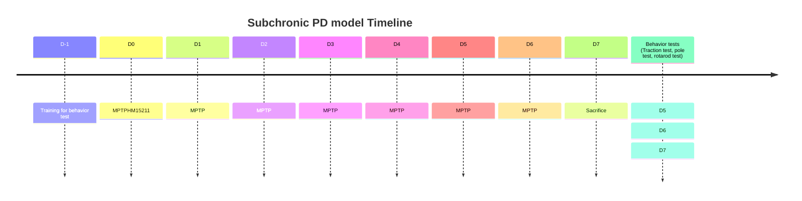

### Chronic PD model

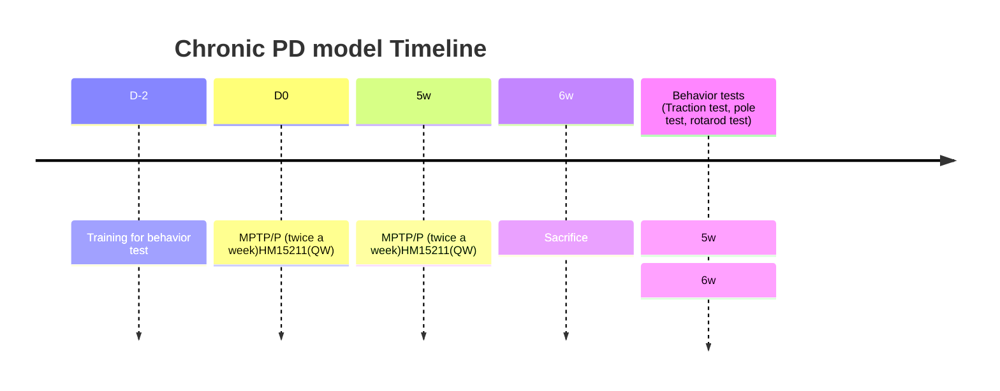

European Association for the Study of Diabetes (EASD) 54ᵗʰ Annual Meeting, Berlin, German; 01-05 Oct., 2018
Hanmi Pharm. Co., Ltd.

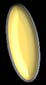

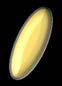

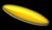

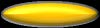

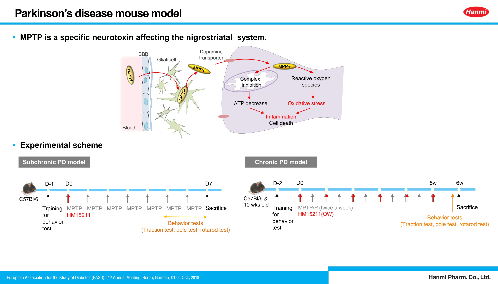

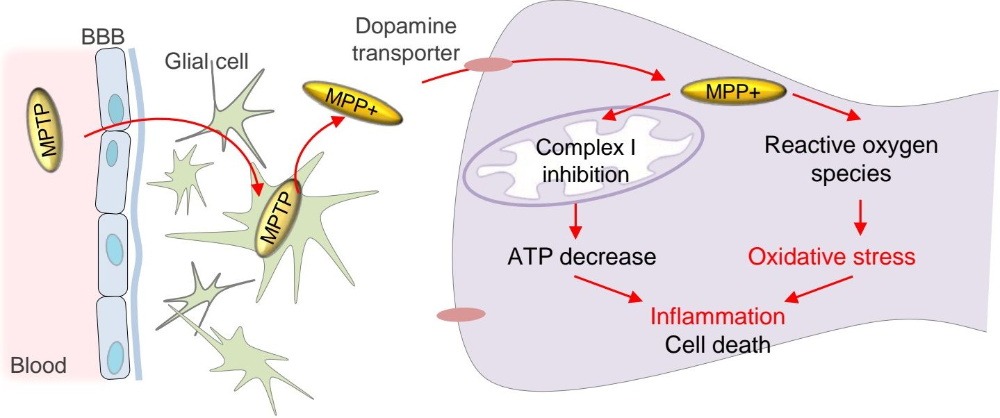

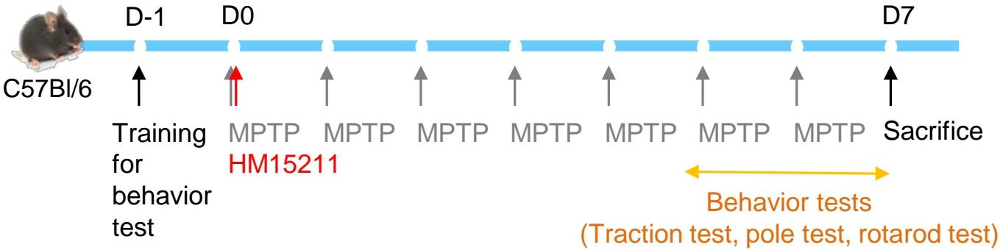

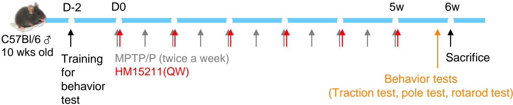

# Dopaminergic neuroprotection by HM15211 Hanmi logo

## Subchronic PD model

Microscopic images of Striatum and Substantia nigra in Subchronic PD model across Vehicle, MPTP, and HM15211 treatment groups at 40x and 100x magnification

| Treatment                                    | TH+ area in striatum (% vs. vehicle) | TH+ area in substantia nigra |
| -------------------------------------------- | ------------------------------------ | ---------------------------- |
| Vehicle                                      | 100\*\*\*                            | 125\*\*\*                    |
| MPTP 30 mg/kg, QD                            | 45                                   | 65                           |
| MPTP 30 mg/kg, QD + HM15211 2.5 nmol/kg, QW  | 58\*                                 | 105\*\*                      |
| MPTP 30 mg/kg, QD + HM15211 5.03 nmol/kg, QW | 70\*\*\*                             | 122\*\*\*                    |

## Chronic PD model

Microscopic images of Striatum and Substantia nigra in Chronic PD model across Vehicle, MPTP/P, and HM15211 treatment groups at 40x and 100x magnification

| Treatment                              | TH+ area in substantia nigra | α-synuclein (ng/ml) |
| -------------------------------------- | ---------------------------- | ------------------- |
| Vehicle                                | 135\*\*\*                    | 5.0\*\*\*           |
| MPTP/P                                 | 45                           | 6.8                 |
| MPTP/P + HM15211 5.03 nmol/kg (sc, QW) | 82\*                         | 5.1\*\*             |

*Tyrosine hydroxylase (TH) : rate limiting step for dopamine synthesis*

\*~*** $p<0.05 \sim 0.001$ vs. MPTP or MPTP/P by One-way ANOVA

European Association for the Study of Diabetes (EASD) 54ᵗʰ Annual Meeting, Berlin, German; 01-05 Oct., 2018

Hanmi Pharm. Co., Ltd.

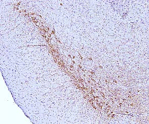

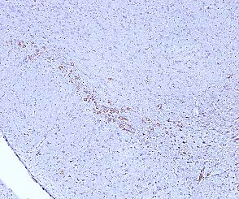

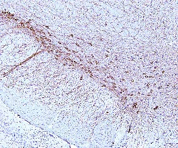

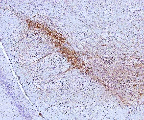

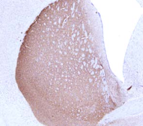

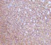

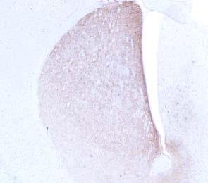

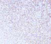

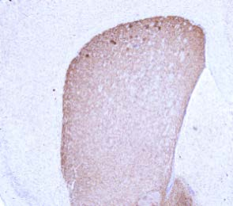

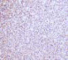

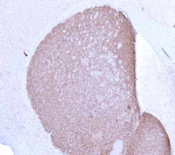

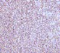

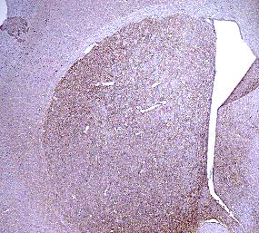

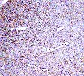

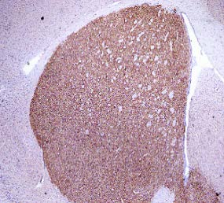

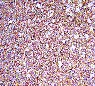

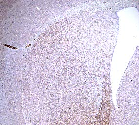

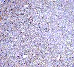

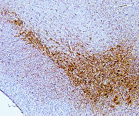

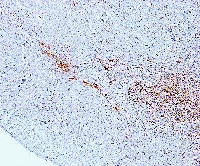

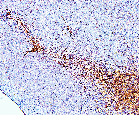

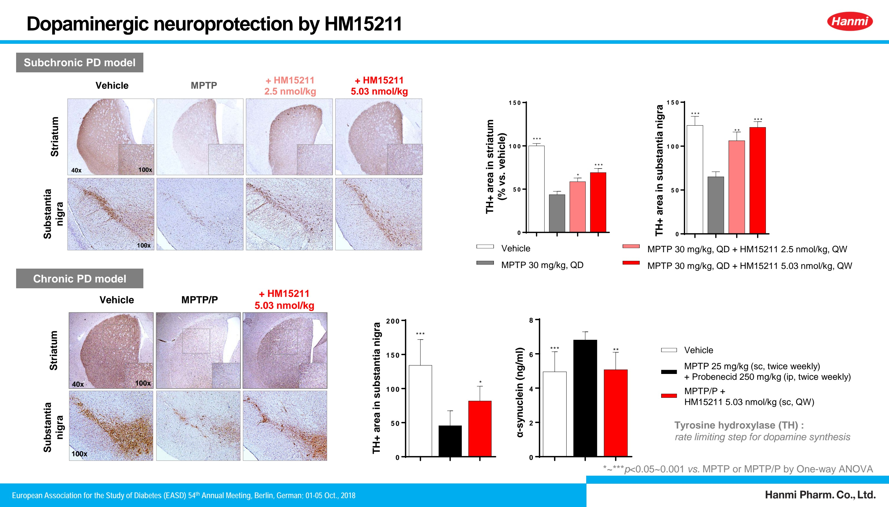

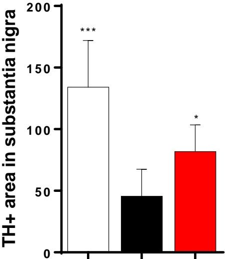

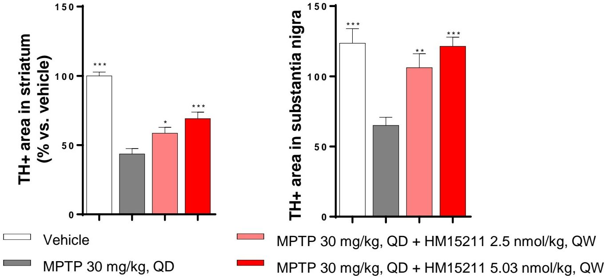

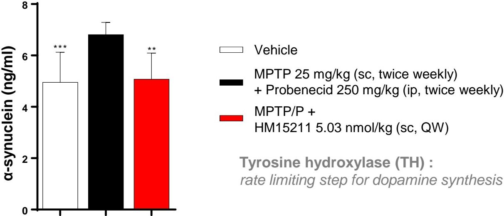

# Motor function restoring by HM15211

Hanmi logo

**Subchronic PD model**

| Subchronic PD model Test | Subchronic PD model Vehicle | Subchronic PD model MPTP 30 mg/kg, QD | Subchronic PD model MPTP 30 mg/kg, QD + HM15211 2.5 nmol/kg, QW | Subchronic PD model MPTP 30 mg/kg, QD + HM15211 5.03 nmol/kg, QW |
| ---------------------------- | ------------------------------- | ----------------------------------------- | ------------------------------------------------------------------- | -------------------------------------------------------------------- |
| Traction test (score)        | 2.6\*\*\*                       | 0.8                                       |                                                                     |                                                                      |
| Pole test (T-turn, s)        | 2.5\*\*\*                       | 28                                        |                                                                     |                                                                      |
| Pole test (T-total, s)       | 10\*\*\*                        | 72                                        |                                                                     |                                                                      |
| Rotarod (falling latency, s) | 172\*\*\*                       | 38                                        |                                                                     |                                                                      |

**Chronic PD model**

| Chronic PD model Test    | Chronic PD model Vehicle | Chronic PD model MPTP 25 mg/kg + Probenecid 250 mg/kg | Chronic PD model MPTP/P + HM15211 5.03 nmol/kg |
| ---------------------------- | ---------------------------- | --------------------------------------------------------- | -------------------------------------------------- |
| Traction test (score 0\~3)   | 2.8\*\*\*                    | 1.7                                                       |                                                    |
| Pole test (T-total, s)       | 12\*\*\*                     | 39                                                        |                                                    |
| Rotarod (falling latency, s) | 165\*\*\*                    | 92                                                        |                                                    |

\*~***$p < 0.05 \sim 0.001$ vs. MPTP or MPTP/P by One-way ANOVA

European Association for the Study of Diabetes (EASD) 54th Annual Meeting, Berlin, German; 01-05 Oct., 2018

**Hanmi Pharm. Co., Ltd.**

# Anti-inflammatory effect of HM15211

Hanmi logo

## Subchronic PD model

Microscopy images of Striatum at 200x and 200x Cropped for Vehicle, MPTP, and HM15211 treated groups

| Treatment                                    | Iba1+ area in striatum (% vs. vehicle) |
| -------------------------------------------- | -------------------------------------- |
| Vehicle                                      | 100\*\*\*                              |
| MPTP 30 mg/kg, QD                            | 165                                    |
| MPTP 30 mg/kg, QD + HM15211 2.5 nmol/kg, QW  | 118\*\*                                |
| MPTP 30 mg/kg, QD + HM15211 5.03 nmol/kg, QW | 108\*\*\*                              |

| Treatment                                    | IFNγ (pg/ml) | IL-10 (pg/ml) |
| -------------------------------------------- | ------------ | ------------- |
| Vehicle                                      | 105\*\*\*    | 630\*\*\*     |
| MPTP 30 mg/kg, QD                            | 155          | 550           |
| MPTP 30 mg/kg, QD + HM15211 2.5 nmol/kg, QW  | 115\*\*\*    | 630\*\*\*     |
| MPTP 30 mg/kg, QD + HM15211 5.03 nmol/kg, QW | 98\*\*\*     | 630\*\*\*     |

## Chronic PD model

Microscopy images of Striatum at 200x and 400x for Vehicle, MPTP/P, and HM15211 treated groups

| Treatment                                                                  | Iba1+ area in striatum (% vs. vehicle) | IFN-γ (pg/ml) | IL-10 (pg/ml) |
| -------------------------------------------------------------------------- | -------------------------------------- | ------------- | ------------- |
| Vehicle                                                                    | 100\*\*                                | 108\*         | 2250\*\*\*    |
| MPTP 25 mg/kg (sc, twice weekly) + Probenecid 250 mg/kg (ip, twice weekly) | 205                                    | 138           | 1550          |
| MPTP/P + HM15211 5.03 nmol/kg (sc, QW)                                     | 105\*                                  | 115           | 2150\*\*\*    |

\*~***p<0.05~0.001 vs. MPTP or MPTP/P by One-way ANOVA

European Association for the Study of Diabetes (EASD) 54ᵗʰ Annual Meeting, Berlin, German; 01-05 Oct., 2018
Hanmi Pharm. Co., Ltd.

# Efficacy and related MoAs of Alzheimer’s disease in diabetic mice model

European Association for the Study of Diabetes (EASD) 54ᵗʰ Annual Meeting, Berlin, German; 01-05 Oct., 2018 Hanmi Pharm. Co., Ltd.

# Alzheimer’ disease in diabetic mouse model

Hanmi logo

* **Experimental scheme**

* **Inhibition of Aβ1-42 and AGE accumulation by HM15211**

| Group                                 | Aβ1-42 (% vs. vehicle) | AGE (µg/ml) |
| ------------------------------------- | ---------------------- | ----------- |
| db/db D0 (6w)                         | 35\*\*\*               | 0.9\*\*\*   |
| db/m (18w) vehicle                    | 65\*\*\*               | 1.1\*       |
| db/db (18w) vehicle                   | 100                    | 1.3         |
| db/db (18w) HM15211 1.08 nmol/kg, Q2D | 48\*\*\*               | 1.0\*\*     |

\*~***p<0.05~0.001 vs. db/db (18w) vehicle by One-way ANOVA

European Association for the Study of Diabetes (EASD) 54ᵗʰ Annual Meeting, Berlin, German; 01-05 Oct., 2018

Hanmi Pharm. Co., Ltd.

# Reduction of inflammation and oxidative stress by HM15211

Hanmi logo

Microscopy images of Cortex, Hippo_CA1, and Hippo_DG regions for different treatment groups: db/db_D0 (6w), db/m_vehicle, db/db_Vehicle, and db/db_HM15211 1.08 nmol/kg

| Group                                 | IL-1β (pg/ml) | IFN-γ (pg/ml) | HNE protein adduct (μg/ml) |
| ------------------------------------- | ------------- | ------------- | -------------------------- |
| db/db D0 (6w)                         | 58            | 49            | 4.8                        |
| db/m (18w) vehicle                    | 70            | 41            | 2.6                        |
| db/db (18w) vehicle                   | 86            | 55            | 11.3                       |
| db/db (18w) HM15211 1.08 nmol/kg, Q2D | 49            | 37            | 5.3                        |

Fig. 2. 4-Hydroxyl-2-nonenal (HNE) protein adducts as a second messenger
*J Clin Biochem Nutr. 2007 Jul;41(1):18-26*

\*~***p<0.05~0.001 vs. MPTP or MPTP/P by One-way ANOVA

European Association for the Study of Diabetes (EASD) 54ᵗʰ Annual Meeting, Berlin, German; 01-05 Oct., 2018

Hanmi Pharm. Co., Ltd.

# Summary & Conclusion

Hanmi logo

* **In MPTP/Probenecid induced chronic Parkinson’s disease model, HM15211 inhibited the increase of alpha synuclein, which is the most prominent pathological biomarker of Parkinson’s disease.**

* **In aged db/db mice, pathological characters of Alzheimer’s disease such as Aβ1-42 and AGE accumulations were shown. These were reversed by HM15211 treatment.**

* **These neuroprotective effects of HM15211 are derived from anti inflammatory effect through the altered cytokine expression and reduced lipid peroxidation.**

**Based on these results, the novel long-acting GLP-1 / GIP / Glucagon tri-agonist, HM15211 might have therapeutic potential for neurodegenerative diseases**

**Please note presentations reporting more information about HM15211:**

119-OR : Therapeutic effect of a novel long-acting GLP-1/GIP/Glucagon triple agonist (HM15211) in NASH and fibrosis animal models

500-P: Bone protective effect of a novel long-acting GLP-1/GIP/Glucagon triple agonist (HM15211) in the obese-osteoporosis rodent model

719-P: A novel combination of a long-acting GLP-1/GIP/Glucagon triple agonist (HM15211) and once weekly basal insulin offers improved glucose lowering and weight loss in a diabetic animal model

European Association for the Study of Diabetes (EASD) 54ᵗʰ Annual Meeting, Berlin, German; 01-05 Oct., 2018

Hanmi Pharm. Co., Ltd.

