# Bone protective effect of a novel long-acting GLP-1/GIP/Glucagon triple agonist (HM15211) in the obese-osteoporosis rodent model Hanmi logo 500-P

Sang Don Lee¹, Jong Suk Lee¹, Eun Jin Park¹, Jong Soo Lee¹, Sang-Hyun Lee¹, In Young Choi¹, and Young Hoon Kim¹
1Hanmi Pharm. Co., Ltd, Seoul, Korea

## BACKGROUND

* Increased fracture risk associated to weight loss¹

Diagram showing weight loss leading to bone mass loss through various factors: mechanical effect, insulin and IGF-1, estrogen, adiponectin and ghrelin, calcium absorption, increased fall risk, disorder of bone quality, and mineralization disorder.

* Bone homeostasis effects of GCG², GLP-1³ and GIP⁴

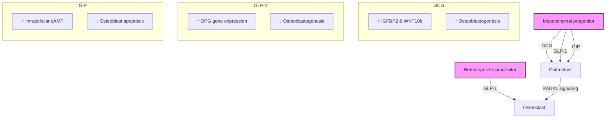
\*Br J Clin Pharmacol. 2016 Jan;81(1):78-88.

## AIMS

This study investigated whether treatment with HM15211 prevents bone loss under a severe weight loss condition, and the underlying mechanism of action.

## METHODS

* To investigate MoA for bone protection of HM15211, MC3T3-E1 cells were treated with HM15211. Osteoblast differentiation related markers (RUNX2, OCN, ALP and Col1α) were analyzed using real-time PCR. Additionally, collagen protein expression change and anti-apoptotic effect were evaluated using commercial kit.

* Diet induced obesity (DIO) osteoporosis rat model was induced by surgical oophorectomy (OVX) and fed 60% kcal fat diet to immatured 5 weeks old female sprague dawley (SD) rats for 8 weeks. Serum levels of bone biochemical markers (Glu-OC ; Glu-Osteocalcin, OPG ; Osteoprotegerin and PINP ; Procollagen type I propeptides) were measured by commercial ELISA kits. BMD (Bone mineral density) of femurs were monitored using a high resolution in vivo µ-CT system (n = 7 /group). Food restricted group was supplied limited amount of daily food to be had same weight loss with HM15211 2.2 nmol/kg treated group.

| D-56                             | D0                           | D14   | D28 or 56 |
| -------------------------------- | ---------------------------- | ----- | --------- |
| SD ♀ 5wks old, 60% kcal fat diet | OVX                          | Serum | Serum     |
|                                  | HM15211 Q3D, Liraglutide BID |       | Necropsy  |

## RESULTS

### Reduction of body weight and food intake

Figure 1. Body weight change and accumulative food intake

| Time (Day) | Sham vehicle, Q2D | OVX vehicle, Q2D | OVX Liraglutide 25 nmol/kg, BID | OVX HM15211 2.2 nmol/kg, Q2D | OVX HM15211 4.4 nmol/kg, Q2D |
| ---------- | ----------------- | ---------------- | ------------------------------- | ---------------------------- | ---------------------------- |
| 0          | 0                 | 0                | 0                               | 0                            | 0                            |
| 3          | 1                 | 1                | -2                              | -5                           | -8                           |
| 6          | 2                 | 2                | -3                              | -8                           | -15                          |
| 9          | 3                 | 3                | -4                              | -10                          | -20                          |
| 12         | 4                 | 4                | -5                              | -12                          | -25                          |
| 15         | 5                 | 5                | -6                              | -13                          | -28                          |
| 18         | 6                 | 6                | -7                              | -14                          | -30                          |
| 21         | 7.5               | 7                | -8                              | -15                          | -33                          |
| 24         | 8.8               | 7.5              | -3.0                            | -15.2                        | -35.7                        |

| Group                           | Accumulative Food Intake (g) |
| ------------------------------- | ---------------------------- |
| Sham vehicle, Q2D               | 102                          |
| OVX vehicle, Q2D                | 103                          |
| OVX Liraglutide 25 nmol/kg, BID | 80                           |
| OVX HM15211 2.2 nmol/kg, Q2D    | 80                           |
| OVX HM15211 4.4 nmol/kg, Q2D    | 50                           |

\*~***p<0.05~0.001 vs. vehicle by One-way ANOVA

⮚ HM15211 administration significantly decreased body weight and food intake, respectively.
Legend for Figure 1

### Improvement of bone biochemical markers

Figure 2. Serum levels of Glu-OC, OPG and PINP

(a) Glu-OC (bone resorption marker)

| Time (Day) | Sham vehicle | OVX vehicle | OVX Liraglutide | OVX HM15211 2.2 | OVX HM15211 4.4 |
| ---------- | ------------ | ----------- | --------------- | --------------- | --------------- |
| pre        | 100          | 100         | 100             | 100             | 100             |
| 14         | 105          | 155         | 150             | 100             | 40              |
| 28         | 110          | 160         | 125             | 60              | 45              |

(b) OPG (osteoclastogenesis inhibition marker) & PINP (bone formation marker)

| Marker       | Sham vehicle | OVX vehicle | OVX Liraglutide | OVX HM15211 2.2 | OVX HM15211 4.4 |
| ------------ | ------------ | ----------- | --------------- | --------------- | --------------- |
| OPG (pg/ml)  | 100          | 40          | 60              | 175             | 210             |
| PINP (ng/ml) | 40           | 20          | 35              | 55              | 70              |

⮚ Bone bio chemical markers (Glu-OC, OPG and PINP) were dose dependently improved on HM15211 dosing group, respectively.

### Prevention of BMD loss following weight loss

Figure 3. Weight loss and femurs BMD

| Metric             | Sham vehicle | OVX vehicle | OVX Liraglutide | OVX HM15211 2.2 |
| ------------------ | ------------ | ----------- | --------------- | --------------- |
| Δ Body weight (%)  | 8            | 7           | -3              | -15             |
| Femurs BMD (g/cm²) | 0.45         | 0.42        | 0.41            | 0.44            |

\*~***p<0.05~0.001 vs. vehicle by One-way ANOVA

⮚ Even in a severe weight loss condition, HM15211 prevented BMD loss of femurs

### Protection of bone health in same weight loss

Figure 4. Bone health profiles while weight loss matching

(a) Weight loss and femurs BMD (b) µ-CT image of Femurs

| Metric             | OVX HM15211 2.2 nmol/kg | OVX Food restricted |
| ------------------ | ----------------------- | ------------------- |
| Δ Body weight (%)  | -35                     | -35                 |
| Femurs BMD (g/cm²) | 0.42                    | 0.28                |

µ-CT image of Femurs for HM15211
µ-CT image of Femurs for Food restricted

(c) Glu-OC (bone resorption marker)

| Time (Day) | OVX HM15211 2.2 nmol/kg | OVX Food restricted |
| ---------- | ----------------------- | ------------------- |
| pre        | 100                     | 100                 |
| 28         | 60                      | 280                 |
| 42         | 50                      | 450                 |
| 56         | 45                      | 510                 |

\*p<0.05 vs. food restricted group by t-Test

⮚ During the same weight loss, HM15211 prevented the decline of bone health

### MoA studies for bone protection

Figure 5. Bone protection mechanism in MC3T3-E1 cell

(a) Osteoblast differentiation marker genes & Collagen expression in conditioned media

| Metric           | Control | HM15211 1 µM | HM15211 10 µM |
| ---------------- | ------- | ------------ | ------------- |
| RUNX2 (fold)     | 1       | 1.8          | 2.8           |
| OCN (fold)       | 1       | 1.2          | 1.5           |
| ALP (fold)       | 1       | 1.6          | 2.2           |
| Col1α (fold)     | 1       | 1.1          | 1.3           |
| Collagen (µg/ml) | 220     | 320          | 410           |

(b) Inhibition of osteoblast apoptosis

| FBS (%) | HM15211 (µM) | GIP inhibitor (µM) | Luminescence (RLU) |
| ------- | ------------ | ------------------ | ------------------ |
| 10      | 0            | 0                  | 25000              |
| 0       | 0            | 0                  | 10000              |
| 0       | 2            | 0                  | 18000              |
| 0       | 2            | 0.31               | 16500              |
| 0       | 2            | 1.25               | 15000              |
| 0       | 2            | 5                  | 14000              |
| 0       | 2            | 20                 | 13000              |

\*~***p<0.05~0.001 vs. vehicle by One-way ANOVA

⮚ HM15211 improved osteoblast differentiation and showed anti apoptotic effect. Additionally, GIP antagonist reversed the beneficial effect of HM15211 on bone protection.

## CONCLUSIONS

* Lower serum level of Glu-OC and higher serum levels of OPG and PINP were observed compared with those of vehicle and liraglutide treated groups in obese-osteoporosis rats model.

* HM15211 showed comparable BMD of femurs compare to vehicle while it showed greater weight loss compared to liraglutide in obese-osteoporosis rats model.

* HM15211 led to significant increase in collagen and Gla-OC expression, which were blunted by inhibition of GIPR-mediated signaling in osteoblast cell.

* These results suggest that HM15211 might provide potent weight loss without bone loss

## REFERENCES

1. Francisco J. A. de Paula and Clifford J. Rosen, Arq Bras Endocrinol Metabol. 2010 Mar;54(2):150-7.

2. Francesc Villarroya et al., Nat Rev Endocrinol. 2017 Jan;13(1):26-35.

3. Guojing Luo et al., Br J Clin Pharmacol. 2016 Jan;81(1):78-88.

4. Katsushi Tsukiyama et al., Mol Endocrinol. 2006 Jul;20(7):1644-51.

European Association for the Study of Diabetes (EASD) 54ᵗʰ Annual Meeting, Berlin, Germany , 01 - 05 October 2018

Hanmi Pharm. Co., Ltd.

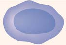

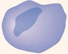

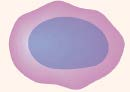

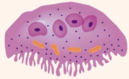

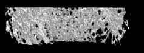

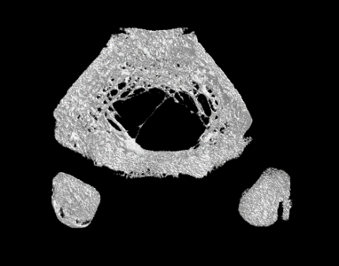

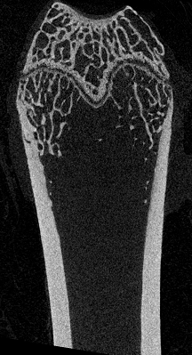

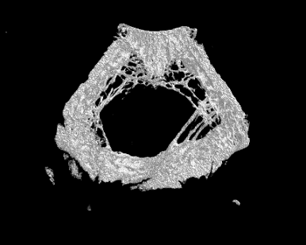

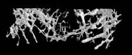

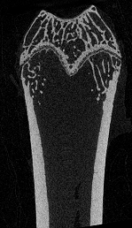

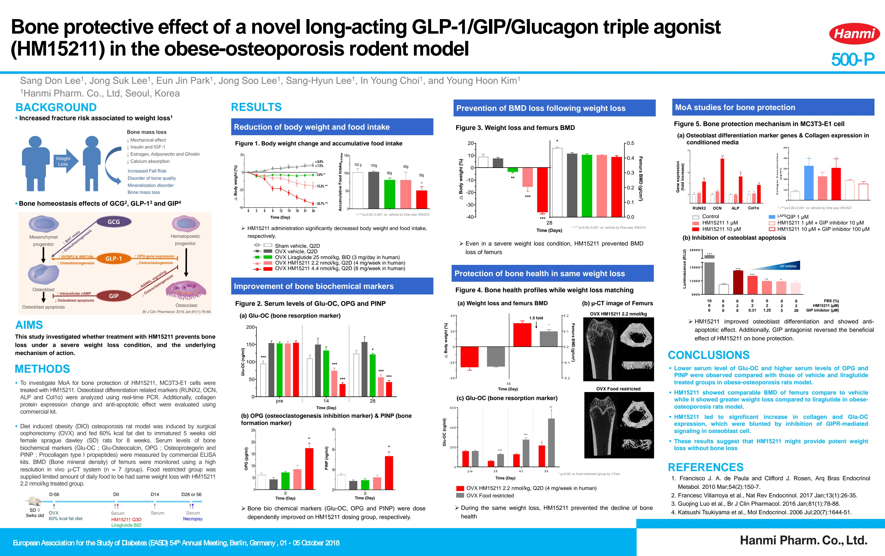

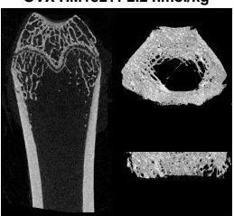

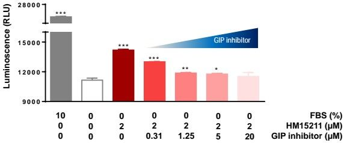

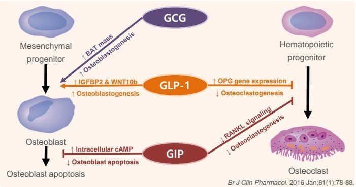

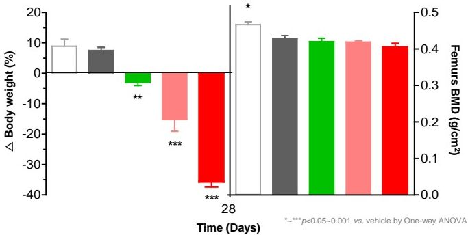

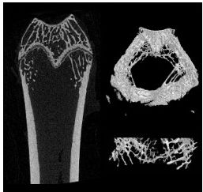

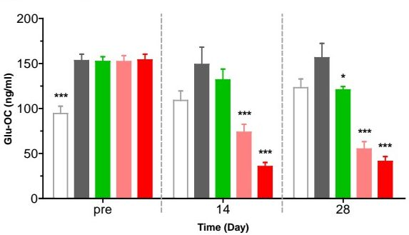

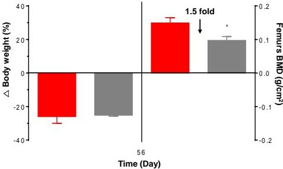

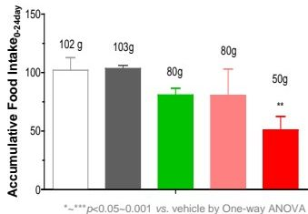

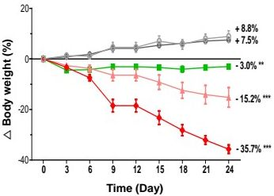

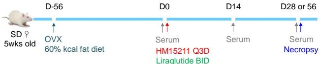

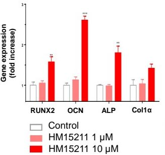

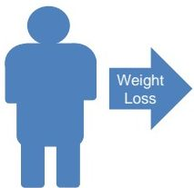

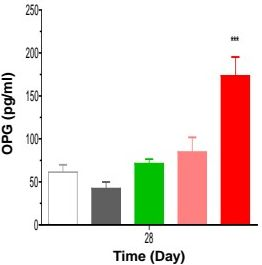

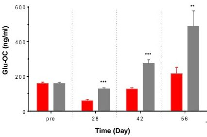

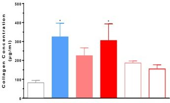

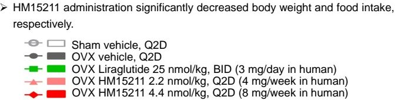

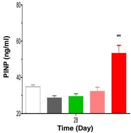

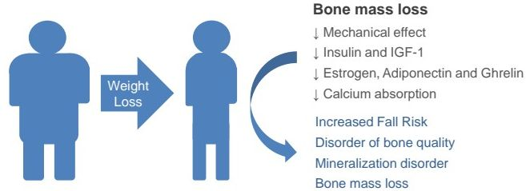

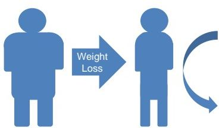
