# Novel combination of GLP-1/GIP/Glucagon triple agonist (HM15211) and once-weekly basal insulin offers improved glucose lowering and weight loss in a diabetic animal model Hanmi logo 719-P

Jong Suk Lee¹, Jung Kuk Kim¹, Jae Hyuk Choi¹, Jin Young Kim¹, Min Young Kim¹, Sang Hyun Lee¹ ,and In Young Choi¹
¹Hanmi Pharm. Co., Ltd, Seoul, South Korea

## BACKGROUND

Despite improved glycemic control, no current combo therapies (i.e. Basal/bolus insulin and Insulin/GLP-1RA) have consistent benefits in weight control.

|                              | Glycemic control(HbA1c change) | Total INS dose | Hypo. Risk          | Weight control(BW change)         |
| ---------------------------- | ------------------------------ | -------------- | ------------------- | --------------------------------- |
| Basal /Bolus insulin         | -1.46 %                        | 84.1 U         | 1.66 episodes/PYE\* | 2.64 kg                           |
| Basal insulin /GLP-1RA COMBO | -1.3 \~ -2.0 %; -1.48 %    | 40.4 U         | 0.13 episodes/PYE   | ~~-2.7 \~ +2.0 kg~~; -0.93 kg |

Diabetes Care. 41, 1009-16 (2018) for DUAL VII; IR presentation 2Q, 2017 Novo nordisk. \*PYE: patient years of exposure

## Hypothesis

Hypothesis diagram showing weekly basal insulin (HM12460A) and weekly triple agonist (HM15211) effects on blood glucose and body weight

**HM12460A [Ph1, US]**
* Long-acting basal insulin
* Targeting once-weekly insulin
* Under efficacy evaluation in diabetic patients (P1b)

**HM15211 [Ph1, US]**
* Efficient WL effect in obese animals
* Expected for once-weekly regimen
* Under safety and PK evaluation in healthy volunteers (P1)

## AIMS

* We hypothesized that when combined with basal insulin, HM15211 could maximize the exogenous insulin response by providing potent BWL and following insulin sensitivity improvement.

* We investigated the therapeutic potential of HM15211 and long-acting basal insulin combination for T2DM treatment by evaluating drug-to-drug interaction (DDI), and glycemic and BW control efficacy in diabetic animal models

## METHODS

* In vitro human insulin receptor (hIR) phosphorylation potency by long-acting basal insulin (HM12460A) was evaluated in CHO cell stably expressing hIR in the presence or absence of HM15211. Similarly, cAMP accumulation potency by HM15211 was evaluated in CHO cells stably expressing respective receptors (human GLP-1R, GCGR, or GIPR) in the presence or absence of insulin counter partners.

* To evaluate the in vivo efficacy, db/db mice and DIO/STZ rats were chronically administered with HM15211 and/or HM12460A, and blood glucose and BW were monitored. At the end of the treatment, HbA1c levels were measured to determine overall glycemic control efficacy.

## RESULTS

**No pharmacologic drug-drug Interaction (DDI) between HM12460A and HM15211**

Table 1. In vitro potency change by concomitant treatment

| Test materials          | % Activity vs. HM12460A or HM15211 hIR | % Activity vs. HM12460A or HM15211 hGLP-1R | % Activity vs. HM12460A or HM15211 hGCGR | % Activity vs. HM12460A or HM15211 hGIPR |
| ----------------------- | ------------------------------------------ | ---------------------------------------------- | -------------------------------------------- | -------------------------------------------- |
| HM12460A                | 100.0%                                     | -                                              | -                                            | -                                            |
| HM15211                 | -                                          | 100.0%                                         | 100.0%                                       | 100.0%                                       |
| HM12460A (with HM15211) | 126.1±29.0%                                | -                                              | -                                            | -                                            |
| HM15211 (with HM12460A) | -                                          | 126.2±11.2%                                    | 91.1±3.5%                                    | 110.2±14.0%                                  |
| Drug interference       | No                                         | No                                             | No                                           | No                                           |

⮚ hIR phosphorylation potency of HM12460A was not affected by concomitant treatment of HM15211. Similar results were also observed in cAMP accumulation potency of HM15211, suggesting no in vitro drug interference

**In vivo efficacy studies for weekly Insulin/Triple agonist COMBO**

Figure 1. Experimental design for animal studies

**a) Genetic diabetes model**
db/db mice diagram
**db/db mice**
: Obesity and T2DM phenotype due to leptin receptor deficiency

**b) Acquired diabetes model**
DIO/STZ rats diagram
**DIO/STZ rats**
: Obesity and insulin resistance induced by high fat diet
: Partial β-cell destruction by low dose STZ administration

**Glycemic and BW control by weekly Insulin/Triple agonist COMBO in db/db mice**

Figure 2. BG, HbA1c and body weight change in db/db mice

(a) Non-fasting blood glucose profile

| Time (Days) | Vehicle | HM12460A | HM12460A + HM15211 | IDeg + Lirag |
| ----------- | ------- | -------- | ------------------ | ------------ |
| 0           | 500     | 500      | 500                | 500          |
| 2           | 500     | 480      | 400                | 480          |
| 4           | 500     | 480      | 320                | 480          |
| 6           | 500     | 480      | 280                | 480          |
| 8           | 550     | 450      | 120                | 450          |
| 10          | 550     | 450      | 100                | 450          |
| 12          | 550     | 450      | 80                 | 450          |
| 14          | 550     | 450      | 80                 | 450          |

(b) HbA1c after 2 weeks treatment

| Group              | HbA1c (%) |
| ------------------ | --------- |
| Vehicle            | 7.1       |
| HM12460A           | 6.6       |
| HM12460A + HM15211 | 5.7       |
| IDeg + Lirag       | 6.0       |

(c) BWC after 2 weeks treatment

| Group              | BWC (% vs. D0) |
| ------------------ | -------------- |
| Vehicle            | 2              |
| HM12460A           | 12             |
| HM12460A + HM15211 | -18            |
| IDeg + Lirag       | -4             |

\*~\*\*\*p<0.05~0.001 vs. vehicle by one-way ANOVA
†p<0.05 vs. HM12460A mono by unpaired t-test
[ ] Vehicle
[ ] HM12460A 42.2 nmol/kg, Q2D (12 nmol/kg in human)
[ ] HM12460A 42.2 nmol/kg, Q2D + HM15211 2.6 nmol/kg, Q2D
[ ] IDeg 18.5 nmol/kg BID + Lirag 30 nmol/kg, BID (50 U + 1.8 mg in human)

⮚ In db/db mice, the HM12460A and HM15211 COMBO provided better glycemic control (vs. HM12460A mono) and greater weight loss than an HM12460A mono or IDeg/Lirag COMBO (insulin degludec/liraglutide COMBO)

**Glycemic and body weight control by weekly Insulin/Triple COMBO in DIO/STZ rats**

Figure 3. HbA1c and Body weight change in DIO/STZ rats

(a) HbA1c after 8 weeks treatment

| Group              | HbA1c (%) |
| ------------------ | --------- |
| Vehicle            | 6.8       |
| Liraglutide        | 6.1       |
| HM12460A           | 5.4       |
| HM12460A + HM15211 | 3.7       |

(b) BWC after 8 weeks treatment

| Group              | BWC (% vs. D0) |
| ------------------ | -------------- |
| Vehicle            | 50             |
| Liraglutide        | 45             |
| HM12460A           | 50             |
| HM12460A + HM15211 | -45            |

\*\*\* p<0.001 vs. vehicle by one-way ANOVA
††† p<0.001 vs. HM12460A mono by unpaired t-test
[ ] Vehicle
[ ] Liraglutide 15 nmol/kg, BID (1.8 mg in human)
[ ] HM12460A 16.2 nmol/kg, Q3D (6 nmol/kg in human)
[ ] HM12460A 16.2 nmol/kg, Q3D + HM15211 5.9 nmol/kg, Q3D

⮚ Combination treatment efficiently reduced BW and showed enhanced blood glucose lowering (data not shown) and more HbA1c reduction, compared to HM12460A mono or liraglutide mono in DIO/STZ rats

## CONCLUSIONS

* In diabetic animal models, weekly basal insulin and triple agonist COMBO provided better glycemic control (vs. insulin mono) and more weight loss than an INS/GLP-1RA COMBO

* In addition to prandial insulin and GLP-1RA, a triple agonist could be an additional COMBO partner for basal insulin resulting in improved glycemic control and particularly effective body weight loss exceeding what can be achieved by INS/GLP-1RA COMBO

## REFERENCES

* Finan B et al., Sci Transl Med. 5, 209ra(151) (2013)

* Neuschwander-Tetri BA et al., Lancet. 385, 956-65 (2015)

* Finan B et al., Nat Med. 21, 27-36 (2015)

* Harriman G et al., Proc Natl Acd Sci USA. 113, E1796-805 (2016)

European Association for the Study of Diabetes (EASD) 54ᵗʰ Annual Meeting, Berlin, Germany , 01 - 05 October 2018

Hanmi Pharm. Co., Ltd.

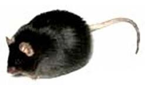

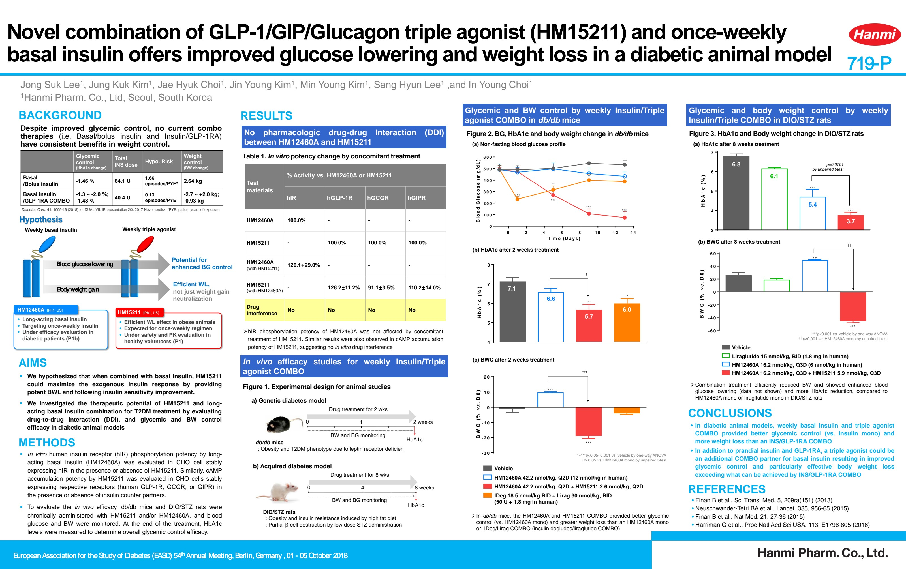

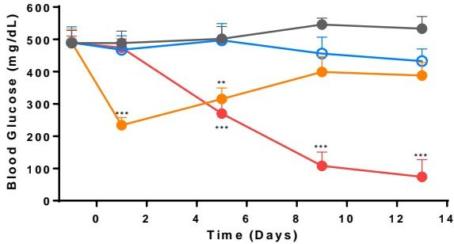

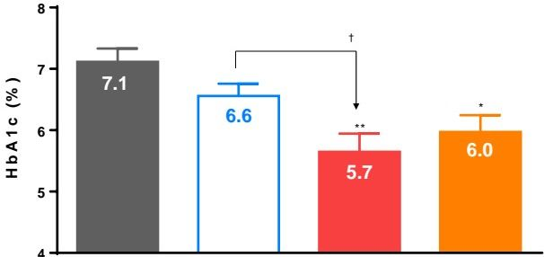

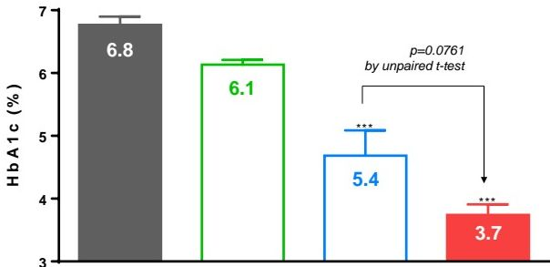

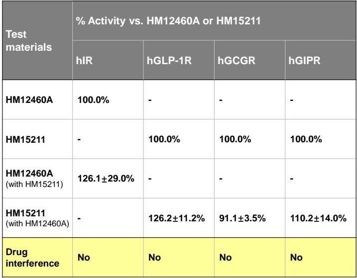

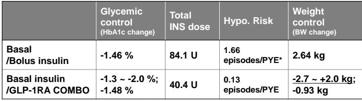

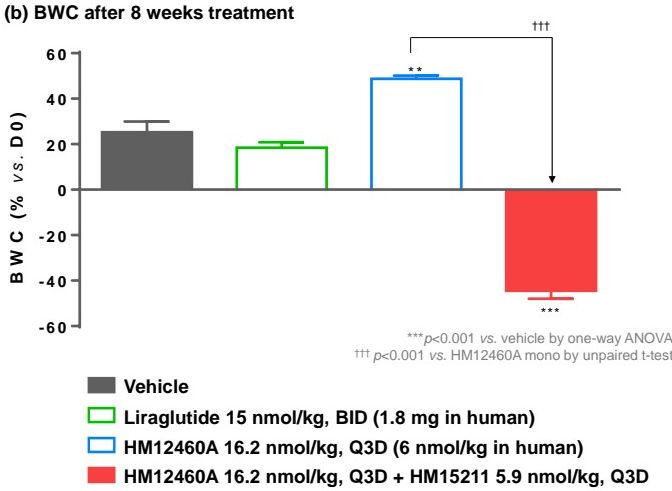

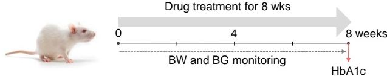

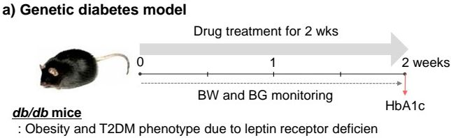

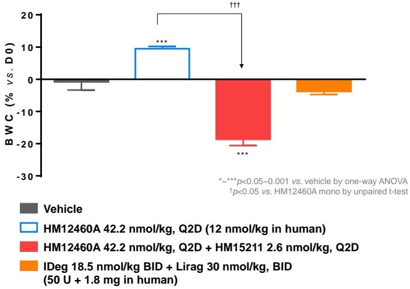

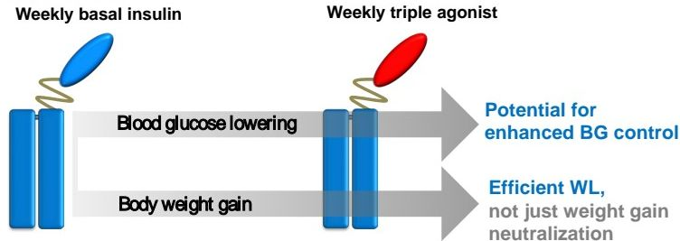

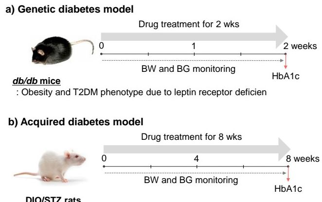

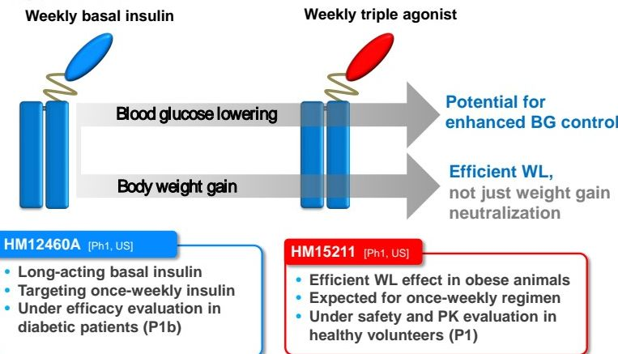
