# Effect of a novel long-acting GLP-1/GIP/glucagon triple agonist (HM15211) in a dyslipidemia animal models Hanmi logo 1054-P

Hyo Sang Jo¹, Jae Hyuk choi¹, Jung Kuk Kim¹, Sang Don Lee¹, Jong Soo Lee¹, Sang Hyun Lee¹, and In Young Choi¹
¹Hanmi Pharm. Co., Ltd, Seoul, South Korea

## BACKGROUND

**Known targets of current dyslipidemia drugs, and suggested effects of HM15211 on lipid metabolism**

Diagram showing lipid metabolism pathways and drug targets including HM15211, Ezetimibe, PCSK9 Ab, Fibrate, Niacin, and Statin.

As possessing single target, the efficacy of current dyslipidemia drugs was limited. With GLP-1, GIP, and GCG triple-agonism, HM15211 might provide more promising lipid lowering efficacy

## AIMS

* Previously, we showed that a long-acting GLP-1/GIP/Glucagon triple agonist, HM15211, not only provided efficient weight loss, but also improved lipid profiles in DIO mice. With its triple agonism, HM15211 could affect multiple pathways in lipid metabolism, suggesting HM15211 as a novel therapeutic option for dyslipidemia

* In the present study, we investigated the 1) therapeutic effect of HM15211 on dyslipidemia in disease animal model and its 2) mode of action (MoA).

## METHODS

* To evaluate the therapeutic efficacy in dyslipidemia, high-fat and high-fructose diet hamsters were administered with HM15211, and blood lipids were monitored. Commercially available dyslipidemia drugs such as evolocumab and rosuvastatin were used as comparative control. At the end of study, liver tissue samples were prepared, and protein level of LDLR and HMGCR was evaluated

* To evaluate the inhibitory effect of HM15211 on lipid absorption, oral lipid tolerance test was performed. Briefly, overnight fasted normal mice were fed with olive oil, followed by blood TG monitoring

* For in vitro MoA studies, cell lysates of HepG2 cells treated with HM15211 were subjected to western blot analysis (LDLR, and HMGCR) and qPCR (lipid metabolism-related genes)

* Additionally, LDL uptake and enzymatic activity of HMGCR in HepG2 cells were also determined after HM15211 treatment by using commercially available kits

## RESULTS

### Lipid lowering efficacy in an animal model

Figure 1. Effect of HM15211 on blood cholesterol (CHO) in dyslipidemia hamsters (n=6)

| Group                         | Blood LDL-C (mg/dL) | Blood HDL-C (mg/dL) |
| ----------------------------- | ------------------- | ------------------- |
| Normal hamster, Vehicle       | 30                  | 160                 |
| Dyslipidemia hamster, Vehicle | 240                 | 180                 |
| Evolocumab 219.2 nmol/kg, QW  | 190                 | 190                 |
| Rosuvastatin 3.0 mg/kg, QD    | 160                 | 170                 |
| HM15211 1.6 nmol/kg, Q2D      | 80                  | 195                 |
| HM15211 3.1 nmol/kg, Q2D      | 50                  | 185                 |

| Group                         | LDL/HDL ratio |
| ----------------------------- | ------------- |
| Normal hamster, Vehicle       | 0.2           |
| Dyslipidemia hamster, Vehicle | 1.4           |
| Evolocumab 219.2 nmol/kg, QW  | 1.1           |
| Rosuvastatin 3.0 mg/kg, QD    | 0.9           |
| HM15211 1.6 nmol/kg, Q2D      | 0.4           |
| HM15211 3.1 nmol/kg, Q2D      | 0.3           |

\*\*\*p< 0.001 vs. vehicle by One-way ANOVA

⮚ In high fat- and high fructose-fed hamsters, HM15211 treatment showed superior cholesterol lowering compared to lipid lowering agents

### Inhibition of lipid absorption by HM15211

Figure 2. Effect of HM15211 on lipid absorption during oil tolerance test in normal mice (n=5)

| Time (hrs) | Vehicle | Evolocumab | Rosuvastatin | Ezetimibe | HM15211 0.5 | HM15211 1.0 |
| ---------- | ------- | ---------- | ------------ | --------- | ----------- | ----------- |
| 0          | 100     | 100        | 100          | 100       | 100         | 100         |
| 1          | 450     | 450        | 450          | 250       | 150         | 150         |
| 2          | 750     | 800        | 750          | 400       | 150         | 150         |
| 3          | 1000    | 1000       | 1000         | 500       | 150         | 150         |
| 4          | 400     | 400        | 400          | 200       | 100         | 100         |

\*\*\*p<0.001 vs. Normal mice, vehicle by One-way ANOVA

⮚ Blood TG was significantly reduced in HM15211 groups after olive oil challenge, demonstrating the inhibitory effect of HM15211 on lipid absorption

### Enhanced LDL clearance by HM15211

Figure 3. Effect of HM15211 on hepatic LDLR expression and LDL uptake

Western blot images showing LDLR and β-actin expression in HepG2 cells and hamster liver.

| Group               | LDL-BODIPY uptake (% vs. CTL) |
| ------------------- | ----------------------------- |
| CTL                 | 100                           |
| HM15211 0.01 μM     | 110                           |
| HM15211 0.1 μM      | 180                           |
| HM15211 1 μM        | 350                           |
| HM15211 10 μM       | 330                           |
| Evolocumab 10 μg/mL | 280                           |

\*\*\*p<0.001 vs. CTL by One-way ANOVA

⮚ HM15211 treatment increased LDLR expression in HepG2 cells and liver tissue, which correlated with enhanced LDL uptake by HM15211

### HMGCR§ inhibition by HM15211

Figure 4. Effect of HM15211 on hepatic HMGCR expression, and enzymatic activity

Western blot images showing HMGCR and β-actin expression in HepG2 cells and hamster liver.

| Time (hrs) | CTL | HM15211 10 μM | Rosuvastatin 1 μM |
| ---------- | --- | ------------- | ----------------- |
| 0          | 100 | 100           | 100               |
| 24         | 100 | 25            | 20                |
| 48         | 100 | 15            | 10                |

\*\*\*p<0.001 vs. CTL by One-way ANOVA
§HMGCR: HMG-CoA reductase, rate limiting enzyme for CHO synthesis

⮚ HM15211 treatment increased phosphorylation of HMGCR (data not shown), the key enzyme for CHO synthesis, followed by its progressive degradation in HepG2 cells and liver tissue, thereby substantially inhibiting the enzymatic activity of HMGCR

### Improved FFA metabolism by HM15211

Figure 5. Effect of HM15211 on FFA metabolism related gene expression in HepG2 cells

| Gene   | CTL | HM15211 10 μM |
| ------ | --- | ------------- |
| Srebp1 | 1.0 | 0.5           |
| Acc1   | 1.0 | 0.6           |
| Acc2   | 1.0 | 0.5           |
| Fas    | 1.0 | 0.7           |
| Scd1   | 1.0 | 0.6           |

| Gene            | CTL | HM15211 10 μM |
| --------------- | --- | ------------- |
| In mitochondria |     |               |
| Cpt1            | 1   | 4             |
| Lcad            | 1   | 3             |
| Vlcad           | 1   | 8             |
| Hadha           | 1   | 4             |
| Hadhb           | 1   | 3             |
| In peroxisome   |     |               |
| Acox            | 1   | 2             |
| Ehhadh          | 1   | 3             |
| Acaa1           | 1   | 4             |

**Abbreviations**
Srebp1: Sterol regulatory element-binding protein 1
Acc1/2: Acetyl-CoA carboxylase 1/2
Fas: Fatty acid synthase
Scd1: Stearoyl-CoA desaturase1
Cpt1: Carnitine palmitoyltransferase1
Vlcad: Very long-chain acyl-CoA dehydrogenase
Hadha/b: Hydroxyacyl-CoA dehydrogenase
Acox: Acyl-coA oxidase
Ehhadh: Enoyl-CoA Hydratase, 3-Hydroxyacyl CoA Dehydrogenase
Acaa1: 3-ketoacyl-CoA thiolase

⮚ HM15211 reduced and increased the expression of genes involved in de novo lipogenesis and β-oxidation in HepG2 cells, respectively, suggesting favorable changes in lipid metabolism

## CONCLUSIONS

* In dyslipidemia hamsters, HM15211 provides greater CHO lowering than commercial dyslipidemia drugs such as evolocumab and statin

* In the series of mechanistic studies, responsible MoAs for this potent CHO lowering by HM15211 are elucidated as follows: (1) inhibition of lipid absorption, (2) enhanced LDL clearance, (3) inhibition of CHO synthesis, and (4) improved FFA metabolism

* In conclusion, our results suggest that HM15211 might be a good therapeutic option for dyslipidemia patients

## REFERENCES

* A Kharitonenkov et al, Mol Metab. 3, 221-9 (2013)

* E Osto et al, Circulation. 131, 871-81 (2015)

* JS Dron et al, Arterioscler Thromb Vas Biol. 38, 592-8 (2018)

European Association for the Study of Diabetes (EASD) 55ᵗʰ Annual Meeting, Barcelona, Spain, 16 - 20 September 2019

Hanmi Pharm. Co., Ltd.

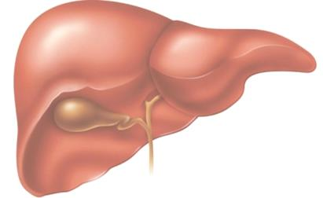

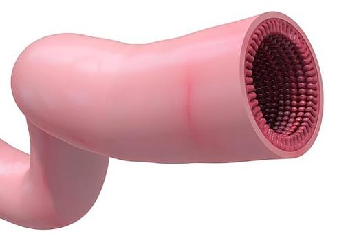

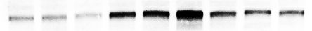

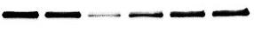

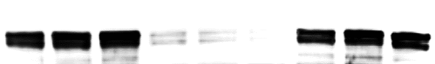

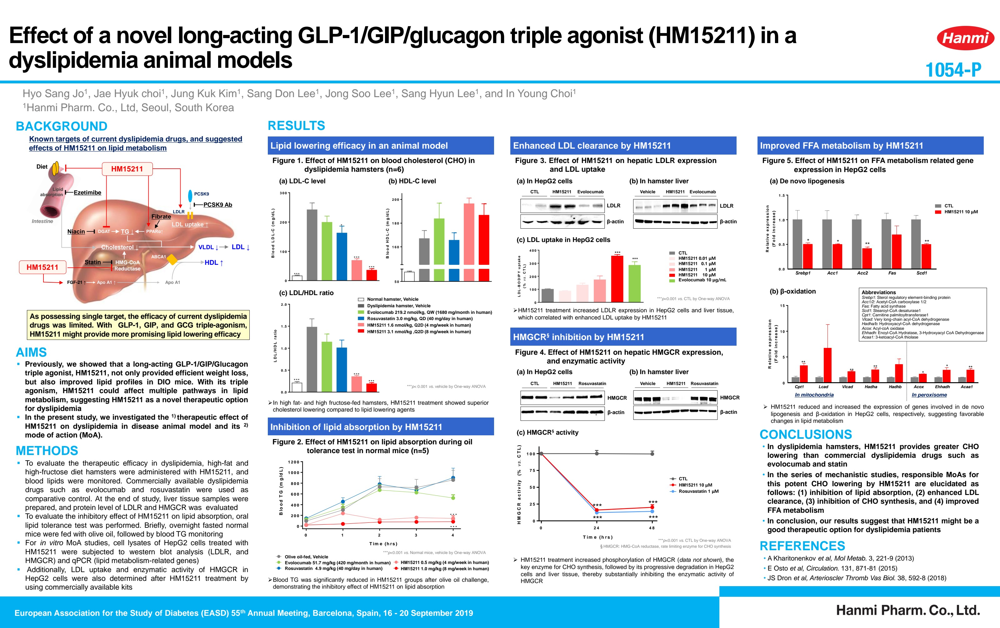

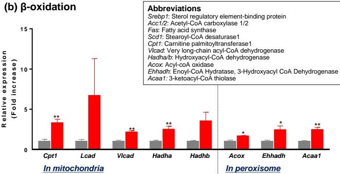

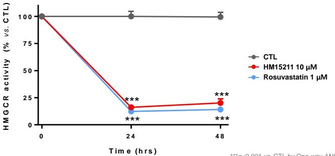

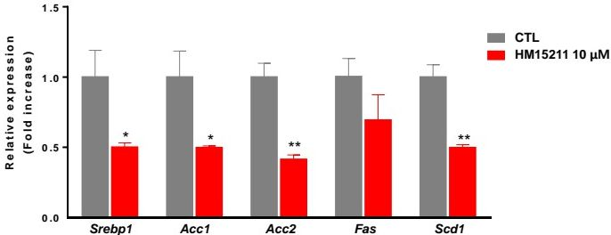

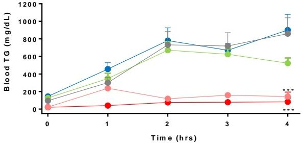

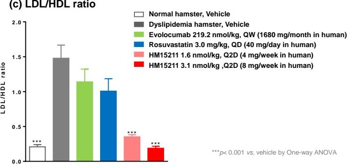

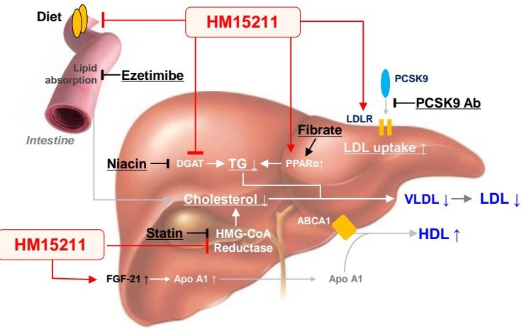

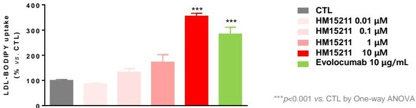

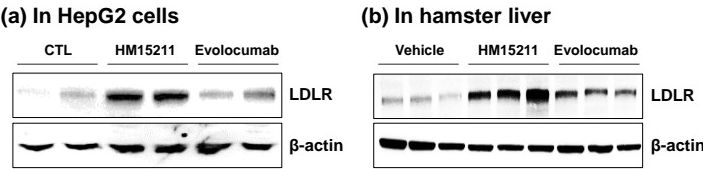

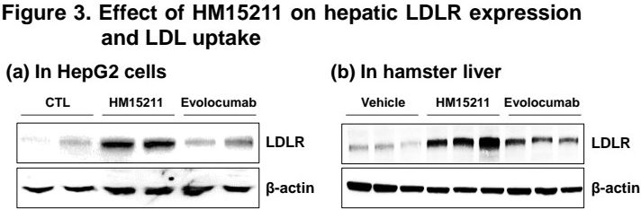

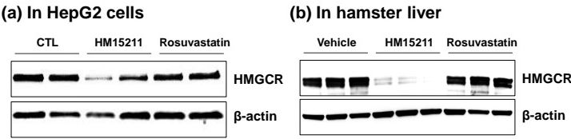

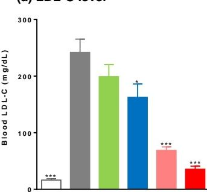

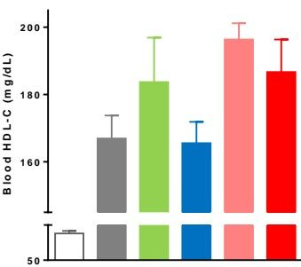
