# Potent body weight loss and efficacy in a NASH animal model by a novel long-acting GLP-1/Glucagon/GIP triple-agonist (HM15211) 1139-P Hanmi logo

In Young Choi¹, Jong Suk Lee¹, Jung Kuk Kim¹, Young Jin Park¹, Sung Youb Jung¹, Young Hoon Kim¹, Se Chang Kwon¹
¹Hanmi Pharm. Co., Ltd, Seoul, South Korea

## ABSTRACT

Obesity and related complications are an increasing threat to public health with existing therapy having only limited effectiveness. Recent clinical and pre-clinical advances indicate that simultaneous targeting of more than one signaling pathway could lead to superior metabolic efficacy with fewer adverse events. Thus, we have developed a long-acting GLP-1/glucagon/GIP triple-agonist, HM15211. HM15211 is a modified glucagon analog which binds to and activates all three receptors. This triple-agonist is conjugated to the human aglycosylated Fc fragment via a short PEG linker to enhance duration of action. Potent glucagon activity of HM15211 allows potent body weight loss (BWL) and improves lipid profiles. In addition, GLP-1 and GIP receptor agonism by HM15211 could balance glucagon induced glucose production by stimulating glucose dependent insulin release. GLP-1 may also contribute to BWL by regulating food intake. Here, we evaluated therapeutic efficacy of HM15211 for obesity and nonalcoholic steatohepatitis (NASH) in rodent models.

After 4 weeks of treatment, HM15211 showed significantly improved BWL (~3.0 fold in DIO mice, relative to liraglutide dose equivalent to 3 mg/day in humans) under similar food intake conditions. As to proposed MoA, HM15211 could induce increased energy expenditure compared to liraglutide. In addition, HM15211 had no hyperglycemic risk owing to its balanced GLP-1/GIP action. We also investigated therapeutic roles of HM15211 in NASH by using methionine choline deficient (MCD) mice, a well-established NASH model. Compared to liraglutide, HM15211 treatment showed greater reduction of hepatic triglycerides, and oxidative stress, as indicated by hepatic TBARS. Furthermore, the NAFLD activity score was significantly reduced after HM15211 treatment. Similar results were also observed when the therapeutic efficacy of HM15211 was investigated in high sucrose diet (HSD) rats. Our results suggest that GLP-1/glucagon/GIP triple agonism of HM15211 may have therapeutic potential in the treatment of obesity and related complications including NASH.

## BACKGROUND

Rationally designed Triple-agonist could have therapeutic potential in metabolic syndromes by independent MoA of each component.

Diagram showing the mechanism of action for GLP-1, GIP, and Glucagon. GLP-1: Insulin secretion ↑, Appetite ↓. GIP: Insulin secretion ↑, Liver inflammation ↓. Glucagon: Energy expenditure ↑, Lipolysis ↑, LDL clearance ↑, HDL biogenesis ↑, Blood glucose ↑. Combined effect: No hyperglycemia, Obesity & NASH.

## METHODS

* To measure intracellular cAMP levels, CHO cells stably expressing either hGLP-1R, hGCGR, or hGIPR were treated with HM15211 for 15 minutes. Native GLP-1, Glucagon, or GIP was used as reference control. Accumulated intracellular cAMP was measured using the LANCE™ cAMP assay Kit (Perkinelmer)

* Potent body weight loss efficacy of HM15211 was evaluated in DIO mice. After 4 weeks of drug treatment, changes (vs. vehicle) in body weight, food intake, and blood cholesterol were measured.

* Energy expenditure in DIO mice was investigated by using a combined indirect calorimetry system. O₂ consumption and CO₂ production were continuously monitored during indirect calorimetry occupation to determine the respiratory quotient and energy expenditure of individual mouse. To rule out body-composition effect on energy expenditure, the results were adjusted by ANCOVA.

* Therapeutic potential of HM15211 in NASH was evaluated in MCD mice and HSD rats. After 4 weeks of drug treatment, liver tissue was prepared to measure hepatic TG, oxidative stress (TBARS analysis, only for MCD mice), and NAS (NAFLD activity score).

* The effect of HM15211 on blood glucose was investigated by intraperitoneal glucose tolerance test (ipGTT) after administration of a single dose of HM15211 10 nmol/kg in normal C57BL/6 mice. To investigate the role of GLP-1 and/or GIP portion of HM15211 in blood glucose control GLP-1 antagonist (600 nmol/kg EXD(9-39)) and/or GIP antagonist (50 nmol/kg GIP (3-42)).

## RESULTS

### In vitro activity of HM15211

Figure 1. cAMP accumulation by GLP-1, GCG, and GIP receptor
(a) hGLP-1R/CHO cells (b) hGCGR/CHO cells (c) hGIPR/CHO cells

| hGLP-1R/CHO cells Concentration (nM) | hGLP-1R/CHO cells Native peptide | hGLP-1R/CHO cells HM15211 (Batch 1) | hGLP-1R/CHO cells HM15211 (Batch 2) | hGLP-1R/CHO cells HM15211 (Batch 3) | hGLP-1R/CHO cells LAPS HM T211 (B13204) | hGLP-1R/CHO cells LAPS HM T211 (B13215) |
| ---------------------------------------- | ------------------------------------ | --------------------------------------- | --------------------------------------- | --------------------------------------- | ------------------------------------------- | ------------------------------------------- |
| 10^-6                                    | 0                                    | 0                                       | 0                                       | 0                                       | 0                                           | 0                                           |
| 10^-4                                    | 5                                    | 2                                       | 2                                       | 2                                       | 1                                           | 1                                           |
| 10^-2                                    | 40                                   | 15                                      | 15                                      | 15                                      | 10                                          | 10                                          |
| 10^0                                     | 95                                   | 60                                      | 60                                      | 60                                      | 45                                          | 45                                          |
| 10^2                                     | 100                                  | 98                                      | 98                                      | 98                                      | 95                                          | 95                                          |
| 10^4                                     | 100                                  | 100                                     | 100                                     | 100                                     | 100                                         | 100                                         |
| hGCGR/CHO cells                          |                                      |                                         |                                         |                                         |                                             |                                             |
| Concentration (nM)                       | Native peptide                       | HM15211 (Batch 1)                       | HM15211 (Batch 2)                       | HM15211 (Batch 3)                       | LAPS HM T211 (B13204)                       | LAPS HM T211 (B13215)                       |
| 10^-6                                    | 0                                    | 0                                       | 0                                       | 0                                       | 0                                           | 0                                           |
| 10^-4                                    | 2                                    | 1                                       | 1                                       | 1                                       | 0                                           | 0                                           |
| 10^-2                                    | 20                                   | 10                                      | 10                                      | 10                                      | 5                                           | 5                                           |
| 10^0                                     | 85                                   | 75                                      | 75                                      | 75                                      | 60                                          | 60                                          |
| 10^2                                     | 100                                  | 100                                     | 100                                     | 100                                     | 98                                          | 98                                          |
| 10^4                                     | 100                                  | 100                                     | 100                                     | 100                                     | 100                                         | 100                                         |
| hGIPR/CHO cells                          |                                      |                                         |                                         |                                         |                                             |                                             |
| Concentration (nM)                       | Native peptide                       | HM15211 (Batch 1)                       | HM15211 (Batch 2)                       | HM15211 (Batch 3)                       | LAPS HM T211 (B13204)                       | LAPS HM T211 (B13215)                       |
| 10^-6                                    | 0                                    | 0                                       | 0                                       | 0                                       | 0                                           | 0                                           |
| 10^-4                                    | 5                                    | 2                                       | 2                                       | 2                                       | 1                                           | 1                                           |
| 10^-2                                    | 45                                   | 20                                      | 20                                      | 20                                      | 15                                          | 15                                          |
| 10^0                                     | 98                                   | 70                                      | 70                                      | 70                                      | 55                                          | 55                                          |
| 10^2                                     | 100                                  | 98                                      | 98                                      | 98                                      | 95                                          | 95                                          |
| 10^4                                     | 100                                  | 100                                     | 100                                     | 100                                     | 100                                         | 100                                         |

⮚ HM15211 possesses relatively high GCG activity and balanced GLP-1/GIP activity, which is well-reproduced in different batches

### Weight loss efficacy in obesity animal model

Figure 2. Weight loss and energy expenditure in DIO mice (QW mimic)

(a) Body weight change in DIO mice (n=6)

| Time (Days) | Vehicle | Liraglutide | HM15211 | Pair-fed Lira | Pair-fed HM |
| ----------- | ------- | ----------- | ------- | ------------- | ----------- |
| 0           | 0       | 0           | 0       | 0             | 0           |
| 4           | 1       | -5          | -8      | -4            | -6          |
| 8           | 2       | -10         | -15     | -8            | -12         |
| 12          | 3       | -12         | -22     | -10           | -18         |
| 16          | 4       | -13         | -28     | -11           | -20         |
| 20          | 5       | -13         | -32     | -12           | -21         |
| 24          | 6       | -13         | -34     | -13           | -22         |
| 28          | 7       | -13         | -35     | -13           | -22         |

\* \*\*\*p<0.001 vs. HM15211 pair-fed by One-way ANOVA

(b) Energy expenditure (n=10)

| Time (hrs)                           | Vehicle | Liraglutide | HM15211 |
| ------------------------------------ | ------- | ----------- | ------- |
| 0                                    | 11      | 12          | 13      |
| 4                                    | 10      | 11          | 12      |
| 8                                    | 10      | 11          | 12      |
| 12                                   | 13      | 14          | 15      |
| 16                                   | 14      | 15          | 16      |
| 20                                   | 13      | 14          | 15      |
| 24                                   | 11      | 12          | 13      |
| ANCOVA-adjusted aver. E.E. (kcal/hr) |         |             |         |
| Group                                | Vehicle | Liraglutide | HM15211 |
| Average E.E.                         | 11.7    | 12.8        | 13.8    |

\* \*\*\*p<0.001 vs. Vehicle by ANCOVA with multiple post-hoc comparison

⮚ Weekly mimic HM15211 shows more potent body weight loss than daily GLP-1RA despite similar food intake inhibition via more enhanced energy expenditure.

Figure 3. Weight loss in DIO mice (n=7, QM mimic)

| Time (Days) | Vehicle | Liraglutide | HM15211 Q2D | HM15211 QW |
| ----------- | ------- | ----------- | ----------- | ---------- |
| 0           | 0       | 0           | 0           | 0          |
| 4           | 1       | -5          | -10         | -12        |
| 8           | 2       | -10         | -20         | -22        |
| 12          | 3       | -14         | -30         | -32        |
| 16          | 4       | -16         | -38         | -40        |
| 20          | 5       | -17         | -42         | -44        |
| 24          | 6       | -18         | -43         | -46        |
| 28          | 7       | -18         | -43         | -47        |

\* \*\*\*p<0.001 vs. liraglutide by One-way ANOVA

⮚ Both administration cycles (weekly and monthly mimic) show similar body weight loss efficacy, which is superior than daily GLP-1RA

### Hyperglycemic risk assessment

Figure 4. ipGTT in normal mice in the presence or absence of GLP-1 and/or GIP receptor antagonist

| Group                         | AUC ipGTT (mg/dL\*hr) | % vs Vehicle |
| ----------------------------- | --------------------- | ------------ |
| Vehicle                       | \~500                 | 100%         |
| Antagonist only (GLP-1 + GIP) | \~525                 | 105%         |
| HM15211 + GLP-1 antagonist    | \~315                 | 63%          |
| HM15211 + GIP antagonist      | \~145                 | 29%          |
| HM15211 Only                  | \~145                 | 29%          |

\* \*\*\*p<0.05~0.001 vs. Vehicle by One-way ANOVA
⮚ Balanced GLP-1/GIP of HM15211 could effectively neutralize potential hyperglycemic risk induced by its potent GCG action

### Therapeutic efficacy in NASH animal models

Figure 5. Improved NASH prognosis in MCD mice (n=7)

| Group                | Hepatic TG (mg/g) | Hepatic TBARS (nmol/mg) | Lobular inflammation | NAS   |
| -------------------- | ----------------- | ----------------------- | -------------------- | ----- |
| Normal mice, Vehicle | \~35              | \~4                     | \~0.1                | \~0.2 |
| MCD mice, Vehicle    | \~130             | \~16                    | \~1.8                | \~4.5 |
| Liraglutide          | \~90              | \~14                    | \~1.4                | \~3.8 |
| HM15211              | \~45              | \~5                     | \~0.8                | \~1.8 |

\* \*\*\*p<0.05~0.001 vs. Vehicle by One-way ANOVA

(e) H&E staining of liver section
H&E staining of liver sections for Normal mice, MCD-diet mice, and Liraglutide treated mice at 200x magnification.
H&E staining of liver section for HM15211 treated mice.

⮚ Compared to daily GLP-1RA, HM15211 exerts more potent reduction in hepatic TG, TBARS (Thiobarbituric acid reactive substances, oxidative stress marker), and NAS, demonstrating its improved therapeutic potential in NASH

Figure 6. Therapeutic benefits of HM15211 in HSD (high sucrose diet) rats (n=6)

(a) Body weight change

| Time (Days) | Normal Vehicle | HSD Vehicle | Liraglutide | HM15211 Low | HM15211 High |
| ----------- | -------------- | ----------- | ----------- | ----------- | ------------ |
| 0           | 0              | 0           | 0           | 0           | 0            |
| 4           | 2              | 1           | -2          | -4          | -8           |
| 8           | 4              | 2           | -4          | -8          | -15          |
| 12          | 6              | 3           | -6          | -10         | -22          |
| 16          | 8              | 4           | -7          | -11         | -26          |
| 20          | 10             | 5           | -7          | -12         | -28          |
| 24          | 11             | 6           | -7          | -12         | -29          |
| 28          | 12             | 7           | -7          | -12         | -29          |

(b) Blood cholesterol (c) Steatosis

| Group                | Blood cholesterol (mg/dL) | Steatosis |
| -------------------- | ------------------------- | --------- |
| Normal rats, Vehicle | \~60                      | 0         |
| HSD rats, Vehicle    | \~120                     | \~1.8     |
| Liraglutide          | \~100                     | \~1.4     |
| HM15211 Low          | \~80                      | \~0.8     |
| HM15211 High         | \~65                      | \~0.4     |

\* \*\*\*p<0.05~0.001 vs. Vehicle by One-way ANOVA

(d) H&E staining of liver section
H&E staining of liver sections for Normal rats, HSD rats, Liraglutide, HM15211 Low, and HM15211 High at 200x magnification.

⮚ HM15211 shows potent body weight loss, followed by reduction in blood cholesterol, and hepatic steatosis in HSD rats, further emphasizing its therapeutic benefits in NASH

## CONCLUSIONS

* HM15211 is a novel long-acting triple-agonist with high GCG & balanced GLP-1/GIP action, optimal for next generation AOM (anti obesity medication) by providing more potent BWL efficacy than conventional AOMs including GLP-1RA

* Both weekly and monthly mimic HM15211 could exert superior BWL efficacy than daily GLP-1RA in DIO mice, which results from more potent energy expenditure induction

* Balanced GLP-1/GIP could effectively neutralize high GCG-induced hyperglycemic risk

* HM15211 reduces hepatic TG, oxidative stress, and NAS in MCD mice more than GLP-1RA, indicating therapeutic benefits in NASH

* Therapeutic benefits in NASH was further confirmed in HSD rats

## REFERENCES

* Finan B et al., Sci Transl Med. 5, 209ra(151) (2013)

* Neuschwander-Tetri BA et al., Lancet. 385, 956-65 (2015)

* Finan B et al., Nat Med. 21, 27-36 (2015)

* Harriman G et al., Proc Natl Acd Sci USA. 113, E1796-805 (2016)

American Diabetes Association’s (ADA) 77ᵗʰ Scientific Sessions, San Diego, CA, USA; June 9-13, 2017

Hanmi Pharm. Co., Ltd.

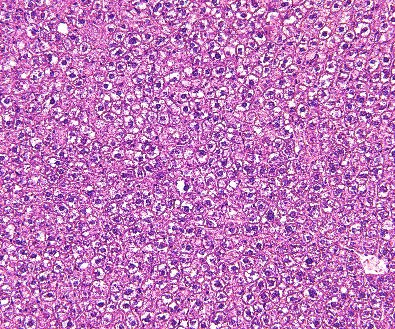

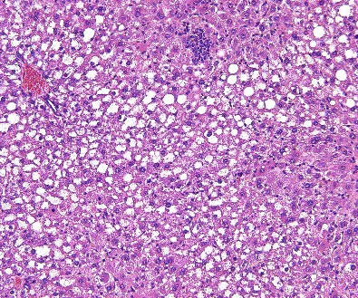

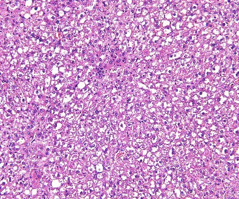

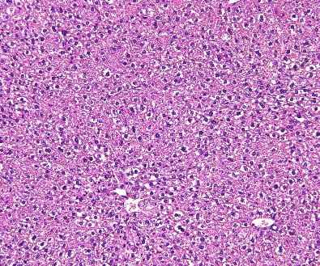

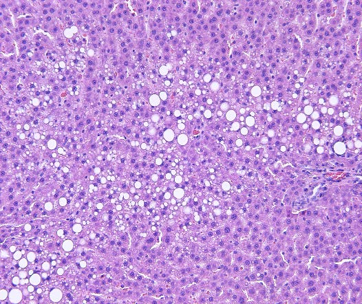

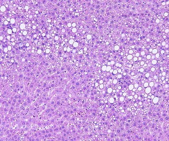

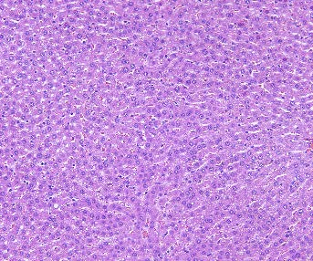

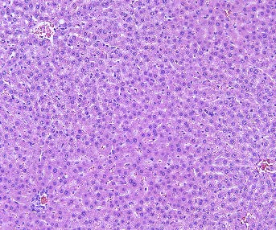

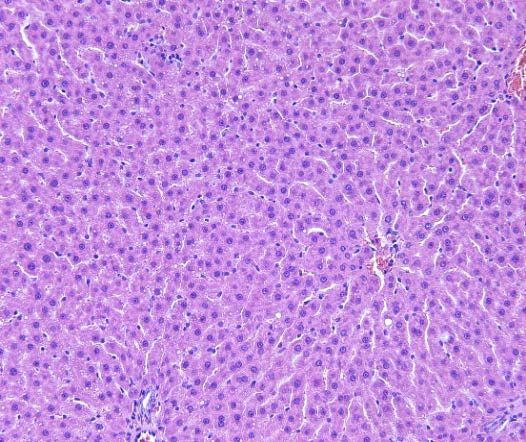

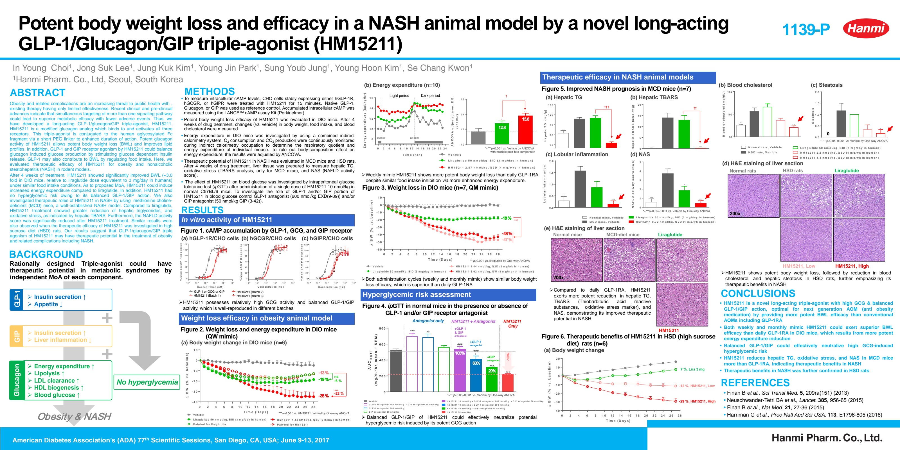

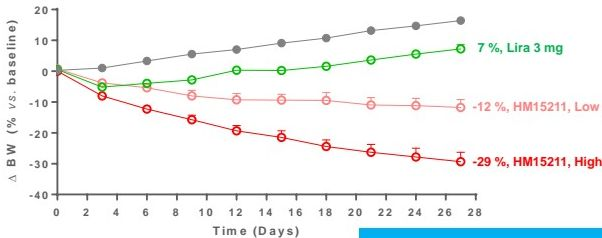

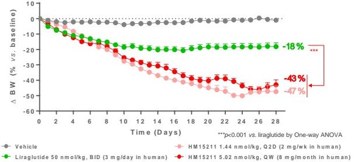

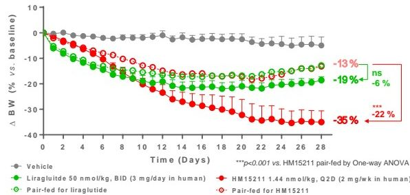

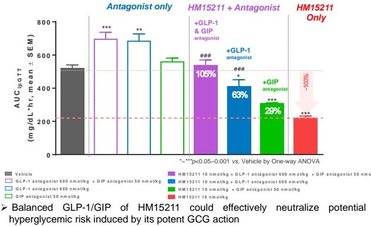

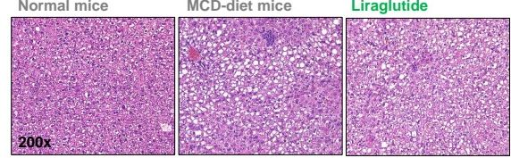

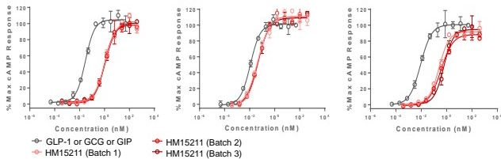

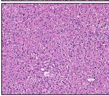

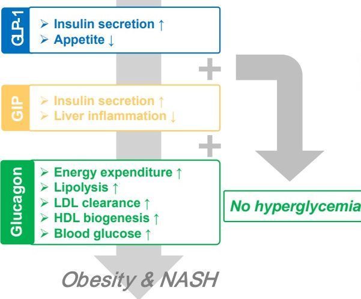

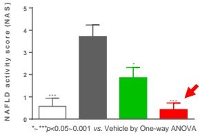

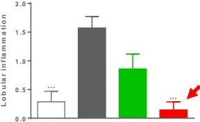

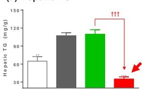

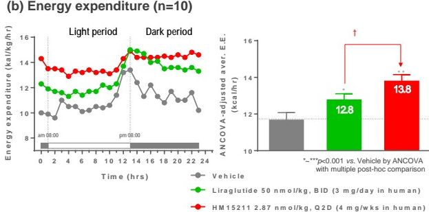

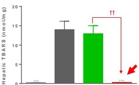

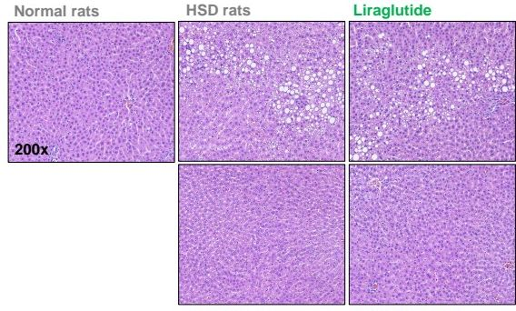

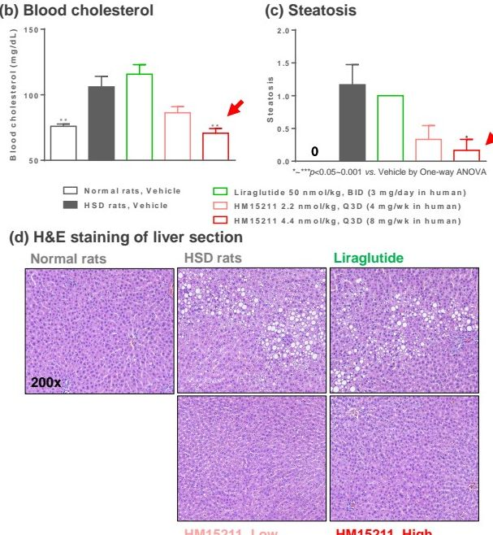

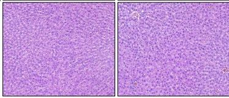
