# HM15211, a Novel GLP-1/GIP/Glucagon Triple-Receptor Co-Agonist Significantly Reduces Liver Fat and Body Weight in Obese Subjects with Non-alcoholic Fatty Liver Disease: A Phase 1b/2a, Multicenter, Randomized, Placebo-Controlled Trial
Hanmi logo

Manal F. Abdelmalek¹, JaeDuk Choi², OakPil Han², Kyounghee Seo², Marcus Hompesch³, Seungjae Baek²
¹Duke University, Durham, NC, USA, ²Hanmi Pharm. Co., Ltd, Seoul, Korea, ³ProSciento Inc., CA, USA.

# ABSTRACT

Nonalcoholic fatty liver disease (NAFLD) is increasingly prevalent cause of chronic liver disease globally. HM15211, a novel GLP-1/GIP/Glucagon triple receptor co-agonist has potential for therapeutic benefit in obese subjects with NAFLD. We present the results of a 12 week, phase 1b/2a, multicenter, randomized placebo-controlled, multiple ascending dose study to investigate the safety, tolerability, PK and PD of subcutaneous (SC) weekly doses of HM15211 for non-diabetic, obese subjects with NAFLD (MRI-PDFF ≥ 10%). Five different doses of HM15211 (0.01, 0.02, 0.04, 0.06, and 0.08 mg/kg) were tested. Subjects were randomized to HM15211 or placebo in a ratio of 3:1 with 12 subjects per cohort. 50% of the enrolled subjects were women and the baseline age, BMI and liver fat by MRI-PDFF were 46 (11.4) years, 36 (4.96) kg/m² and 19.2 (6.5) %, respectively. The relative changes in liver fat [mean (SD)] from baseline to week 8 and 12 were for 0.01 mg/kg was -14.9 (12.2) and -19.6 (12.2) % (p = 0.13 and 0.30); for 0.02 mg/kg was -43 (23.5) and -36 (28.1) % (p < 0.0001 and 0.06); for 0.04 mg/kg was -44.5 (46.6) and -38 (53.5) % (p = 0.0005 and 0.12), for 0.06 mg/kg was -71 (23.8) and -59.3 (27.6) % (p < 0.0001 / 0.0020), and for 0.08 mg/kg was -80.3 (13.2) and -81.2 (7.6) % (p < 0.0001 and p < 0.0001), respectively vs. -1.2 (24.5) and -5.7 (37.8) % for placebo group. A dose-dependent reduction in liver fat with escalating doses of HM15211 was observed with the maximum (88%) liver fat reduction noted with HM15211 0.08 mg/kg at 12 weeks. HM15211 decreased body weight compared with placebo across all treatment groups. Placebo-corrected kg and % reduction of body weight were -1.3, -1.8\*, -2.1\*, -3.1\*, and -4.3\* kg (-1.2, -1.9\*, -2.2\*, -2.9\*, and -4.4\*%) at week 8 and -2.1, -3.1\*, -1.9, -4\*, and -5.3\* kg (-1.9, -3.4\*, -2.1, -3.8\*, and -5.1\* %) at week 12 in 0.01 to 0.08 mg/kg dose cohorts, respectively (\*p < 0.05). HM15211 was shown to be well tolerated. The most common dose-dependent adverse events were mild gastrointestinal symptoms. Two subjects developed hyperglycemia which readily resolved with discontinuation of HM15211. No serious adverse events related to HM15211 occurred in any dose cohort.

# BACKGROUND

HM15211 has shown therapeutic potential in animal models of obesity, NASH (AS015) and safe profiles in a previous first in human study (FRI115).

## [General Profile of HM15211]

HM15211 is GLP-1/GIP/GCG triple agonist, conjugated with a human IgG Fc fragment via a flexible PEG linker

HM15211 structure and profile diagram
* Designed and optimized for liver targeted distribution
* Multiple mode of actions to manage steatosis, inflammation and fibrosis
* Anti-fibrosis effect is confirmed in various animal models
* The extended half life is sufficient for weekly dosing

## [Study Design]
Study Design flow chart

## [Study Objective]

**Primary objectives**

* To assess safety and tolerability of HM15211 after administration of multiple SC doses

* To assess the pharmacokinetic (PK) profile of HM15211 after administration of multiple SC doses

* To assess a reduction of liver fat after administration of multiple doses

**Exploratory objectives**

* To assess additional pharmacodynamic (PD) properties of HM15211 after multiple SC doses

# RESULTS

Table 1. Baseline Characteristics

|                                           | HM15211 0.01 mg/kg (N=9) | HM15211 0.02 mg/kg (N=10) | HM15211 0.04 mg/kg (N=12) | HM15211 0.06 mg/kg (N=9) | HM15211 0.08 mg/kg (N=9) | Placebo (N=17) |
| ----------------------------------------- | ---------------------------- | ----------------------------- | ----------------------------- | ---------------------------- | ---------------------------- | ------------------ |
| Ages: years (SD)                          | 44.2 (12.5)                  | 46.5 (9.3)                    | 49.3 (13.5)                   | 45.8 (10.3)                  | 47.3 (11.7)                  | 43.7 (11.9)        |
| Sex: M/F (%)                              | 66.7/33.3                    | 30.0/70.0                     | 33.3/66.7                     | 66.7/33.3                    | 66.7/33.3                    | 47.1/52.9          |
| Race (%)                                  |                              |                               |                               |                              |                              |                    |
| White                                     | 8 (88.9)                     | 10 (100.0)                    | 10 (83.3)                     | 9 (100.0)                    | 6 (66.7)                     | 15 (88.2)          |
| Black or African American                 | 0 (0.0)                      | 0 (0.0)                       | 1 (8.3)                       | 0 (0.0)                      | 2 (22.2)                     | 2 (11.8)           |
| Asian                                     | 1 (11.1)                     | 0 (0.0)                       | 0 (0.0)                       | 0 (0.0)                      | 0 (0.0)                      | 0 (0.0)            |
| Native Hawaiian or Other Pacific Islander | 0 (0.0)                      | 0 (0.0)                       | 1 (8.3)                       | 0 (0.0)                      | 0 (0.0)                      | 0 (0.0)            |
| Multiple                                  | 0 (0.0)                      | 0 (0.0)                       | 0 (0.0)                       | 0 (0.0)                      | 1 (11.1)                     | 0 (0.0)            |
| Weight: kg (SD)                           | 101.4 (10.7)                 | 88.0 (13.5)                   | 99.7 (20.1)                   | 112.2 (18.0)                 | 103.3 (16.9)                 | 96.6 (18.3)        |
| BMI: kg/m² (SD)                           | 35.4 (3.8)                   | 32.9 (2.8)                    | 37.0 (6.1)                    | 40.1 (7.1)                   | 35.7 (3.8)                   | 35.5 (4.3)         |
| HbA1c: % (SD)                             | 5.9 (0.3)                    | 5.73 (0.2)                    | 5.9 (0.3)                     | 5.7 (0.3)                    | 5.7 (0.3)                    | 5.6 (0.3)          |
| FPG: mg/dL (SD)                           | 97.9 (8.8)                   | 102.3 (9.0)                   | 102.2 (8.4)                   | 103.6 (10.8)                 | 103.3 (7.7)                  | 98.1 (8.6)         |
| Liver Fat: % (SD)                         | 19.6 (6.0)                   | 18.2 (4.9)                    | 18.8 (6.2)                    | 17.9 (8.7)                   | 23.6 (8.0)                   | 18.2 (5.3)         |
| Liver aminotransferases                   |                              |                               |                               |                              |                              |                    |
| AST: IU/L (SD)                            | 24.4 (11.4)                  | 21.7 (7.3)                    | 30.4 (12.2)                   | 22.2 (9.0)                   | 23.1 (10.5)                  | 30.2 (22.9)        |
| ALT: IU/L (SD)                            | 39.3 (25.3)                  | 33.8 (14.1)                   | 51.2 (24.2)                   | 31.4 (16.7)                  | 38.6 (27.2)                  | 45.9 (44.1)        |

Figure 1. Serum PK Exposure of HM15211

| Week | HM15211 0.01 mg/kg (N=9) | HM15211 0.02 mg/kg (N=10) | HM15211 0.04 mg/kg (N=12) | HM15211 0.06 mg/kg (N=9) | HM15211 0.08 mg/kg (N=9) |
| ---- | ------------------------ | ------------------------- | ------------------------- | ------------------------ | ------------------------ |
| 0    | 0                        | 0                         | 0                         | 0                        | 0                        |
| 1    | 30                       | 65                        | 135                       | 130                      | 230                      |
| 2    | 40                       | 80                        | 130                       | 300                      | 820                      |
| 3    | 40                       | 80                        | 130                       | 300                      | 820                      |
| 4    | 40                       | 80                        | 130                       | 300                      | 820                      |
| 5    | 40                       | 80                        | 130                       | 300                      | 820                      |
| 6    | 40                       | 80                        | 130                       | 300                      | 820                      |
| 7    | 40                       | 80                        | 130                       | 300                      | 820                      |
| 8    | 40                       | 80                        | 130                       | 300                      | 820                      |
| 9    | 40                       | 80                        | 130                       | 300                      | 820                      |
| 10   | 40                       | 80                        | 130                       | 300                      | 820                      |
| 11   | 40                       | 80                        | 130                       | 300                      | 820                      |
| 12   | 40                       | 80                        | 130                       | 300                      | 820                      |
| 13   | 20                       | 40                        | 80                        | 150                      | 400                      |
| 14   | 10                       | 20                        | 40                        | 80                       | 200                      |
| 15   | 5                        | 10                        | 20                        | 40                       | 100                      |
| 16   | 0                        | 0                         | 0                         | 0                        | 0                        |

Table 2. Pharmacokinetic parameters

|                      | HM15211 0.01 mg/kg W1 (N=9) | HM15211 0.01 mg/kg W12 (N=9) | HM15211 0.02 mg/kg W1 (N=10) | HM15211 0.02 mg/kg W12 (N=8) | HM15211 0.04 mg/kg W1 (N=12) | HM15211 0.04 mg/kg W12 (N=7) | HM15211 0.06 mg/kg W1 (N=9) | HM15211 0.06 mg/kg W12 (N=9) | HM15211 0.08 mg/kg W1 (N=9) | HM15211 0.08 mg/kg W12 (N=9) |
| -------------------- | ----------------------------------- | ------------------------------------ | ------------------------------------ | ------------------------------------ | ------------------------------------ | ------------------------------------ | ----------------------------------- | ------------------------------------ | ----------------------------------- | ------------------------------------ |
| Cmax (ng/mL)         | 31.22 ± 13.47                       | 41.79 ± 29.23                        | 66.32 ± 32.93                        | 83.59 ± 42.86                        | 135.46 ± 84.48                       | 131.06 ± 53.74                       | 129.59 ± 56.59                      | 306.44 ± 147.39                      | 227.56 ± 62.14                      | 820 ± 399.77                         |
| Tmax (hr)            | 48.00 ± 12.00                       | 53.33 ± 10.58                        | 40.80 ± 19.76                        | 48.00 ± 22.22                        | 50.00 ± 19.03                        | 44.57 ± 16.56                        | 61.33 ± 21.17                       | 59.56 ± 40.42                        | 74.67 ± 42.33                       | 46 ± 31.06                           |
| T1/2 (hr)            | 62.02 ± NA                          | NA ± NA                              | 93.85 ± 38.73                        | NA ± NA                              | 125.21 ± 66.73                       | 175.53 ± 110.9                       | 257.47 ± 292.75                     | 152.44 ± 81.16                       | 118.2 ± 51.78                       | 191.25 ± 75.6                        |
| AUC0-168h (ng/mL\*h) | 3579.7 ± 1333.0                     | 5554.5 ± 3638.8                      | 6538.7 ± 2488.6                      | 11770.3 ± 7192.4                     | 14859.8 ± 8099.8                     | 17938.87 ± 6840.48                   | 16512.43 ± 6781.51                  | 41053.9 ± 19947.12                   | 28130.17 ± 6965.5                   | 97616.05 ± 42147.89                  |

\* Parameters are mean with standard deviation (SD)

Table 3. Summary of Adverse Events

| TEAE Category No. of Subjects (%)     | HM15211 0.01 mg/kg (N=9) | HM15211 0.02 mg/kg (N=10) | HM15211 0.04 mg/kg (N=12) | HM15211 0.06 mg/kg (N=9) | HM15211 0.08 mg/kg (N=9) | Placebo (N=17) |
| ----------------------------------------- | ---------------------------- | ----------------------------- | ----------------------------- | ---------------------------- | ---------------------------- | ------------------ |
| Any TEAE                                  | 7 (77.8)                     | 9 (90.0)                      | 9 (75.0)                      | 8 (88.9)                     | 6 (66.7)                     | 8 (47.1)           |
| Maximum Severity of TEAE                  |                              |                               |                               |                              |                              |                    |
| Mild                                      | 7 (77.8)                     | 3 (30.0)                      | 7 (58.3)                      | 6 (66.7)                     | 2 (22.2)                     | 6 (35.3)           |
| Moderate                                  | 0 (0.0)                      | 6 (60.0)                      | 1 (8.3)                       | 2 (22.2)                     | 4 (44.4)                     | 2 (11.8)           |
| Severe                                    | 0 (0.0)                      | 0 (0.0)                       | 1 (8.3)                       | 0 (0.0)                      | 0 (0.0)                      | 0 (0.0)            |
| Any Serious TEAE                          | 0 (0.0)                      | 0 (0.0)                       | 0 (0.0)                       | 0 (0.0)                      | 0 (0.0)                      | 0 (0.0)            |
| Any TEAE Leading to Study Discontinuation | 0 (0.0)                      | 1 (10.0)                      | 1 (8.3)                       | 0 (0.0)                      | 1 (11.1)                     | 0 (0.0)            |
| Any TEAE Related to Study Medication      | 2 (22.2)                     | 5 (50.0)                      | 3 (25.0)                      | 5 (55.6)                     | 5 (55.6)                     | 1 (5.9)            |
| Gastrointestinal disorders                | 2 (22.2)                     | 5 (50.0)                      | 4 (33.3)                      | 5 (55.6)                     | 4 (44.4)                     | 5 (29.4)           |
| Abdominal discomfort                      | 0 (0.0)                      | 0 (0.0)                       | 1 (8.3)                       | 0 (0.0)                      | 0 (0.0)                      | 0 (0.0)            |
| Abdominal pain                            | 0 (0.0)                      | 1 (10.0)                      | 1 (8.3)                       | 1 (11.1)                     | 0 (0.0)                      | 3 (17.6)           |
| Abdominal faeces                          | 0 (0.0)                      | 0 (0.0)                       | 0 (0.0)                       | 0 (0.0)                      | 0 (0.0)                      | 1 (5.9)            |
| Constipation                              | 0 (0.0)                      | 0 (0.0)                       | 0 (0.0)                       | 1 (11.1)                     | 0 (0.0)                      | 0 (0.0)            |
| Diarrhea                                  | 1 (11.1)                     | 3 (30.0)                      | 1 (8.3)                       | 1 (11.1)                     | 3 (33.3)                     | 1 (5.9)            |
| Dry mouth                                 | 0 (0.0)                      | 0 (0.0)                       | 0 (0.0)                       | 1 (11.1)                     | 1 (11.1)                     | 0 (0.0)            |
| Flatulence                                | 0 (0.0)                      | 0 (0.0)                       | 0 (0.0)                       | 1 (11.1)                     | 0 (0.0)                      | 0 (0.0)            |
| Frequent bowel movements                  | 0 (0.0)                      | 0 (0.0)                       | 0 (0.0)                       | 0 (0.0)                      | 0 (0.0)                      | 1 (5.9)            |
| Gastroesophageal reflux disease           | 0 (0.0)                      | 0 (0.0)                       | 1 (8.3)                       | 0 (0.0)                      | 0 (0.0)                      | 1 (5.9)            |
| Nausea                                    | 1 (11.1)                     | 1 (10.0)                      | 2 (16.7)                      | 3 (33.3)                     | 3 (33.3)                     | 1 (5.9)            |
| Toothache                                 | 0 (0.0)                      | 0 (0.0)                       | 0 (0.0)                       | 0 (0.0)                      | 0 (0.0)                      | 1 (5.9)            |
| Vomiting                                  | 1 (11.1)                     | 0 (0.0)                       | 0 (0.0)                       | 1 (11.1)                     | 1 (11.1)                     | 1 (5.9)            |

Figure 3. Relative Liver Fat Changes by MRI-PDFF

| Treatment Group           | Week 8 (%)   | Week 12 (%)  |
| ------------------------- | ------------ | ------------ |
| Placebo (N=15)            | -1.2 (6.3)   | -5.7 (10.9)  |
| HM15211 0.01 mg/kg (N=9)  | -14.9 (4.1)  | -19.6 (4.1)  |
| HM15211 0.02 mg/kg (N=9)  | -43.0 (7.8)  | -36.0 (9.4)  |
| HM15211 0.04 mg/kg (N=10) | -44.5 (14.7) | -38.0 (17.8) |
| HM15211 0.06 mg/kg (N=9)  | -71.0 (7.9)  | -59.2 (9.2)  |
| HM15211 0.08 mg/kg (N=9)  | -80.3 (4.4)  | -81.2 (2.7)  |

\* Parameters are mean with standard error of mean (SEM)

Table 4. Subjects with Relative Liver Fat Reduction ≥ 30% and ≥ 50%

|                                                         | Placebo (N=15) | HM15211 0.01 mg/kg (N=9) | HM15211 0.02 mg/kg (N=9) | HM15211 0.04 mg/kg (N=10) | HM15211 0.06 mg/kg (N=9) | HM15211 0.08 mg/kg (N=9) |
| ------------------------------------------------------- | -------------- | ------------------------ | ------------------------ | ------------------------- | ------------------------ | ------------------------ |
| Patients Achieved ≥ 30% Relative Liver Fat Reduction at |                |                          |                          |                           |                          |                          |
| Week 8                                                  | 13.3% (2/15)   | 11.1% (1/9)              | 77.8% (7/9)              | 70% (7/10)                | 88.9% (8/9)              | 100% (9/9)               |
| Week 12                                                 | 13.3% (2/15)   | 33.3% (3/9)              | 77.8% (7/9)              | 55.6% (5/9)¹              | 88.9% (8/9)              | 100% (8/8)¹              |
| Patients Achieved ≥ 50% Relative Liver Fat Reduction at |                |                          |                          |                           |                          |                          |
| Week 8                                                  | 6.7% (1/15)    | 0% (0/9)                 | 44.4% (4/9)              | 60% (6/10)                | 88.9% (8/9)              | 100% (9/9)               |
| Week 12                                                 | 13.3% (2/15)   | 0% (0/9)                 | 22.2% (2/9)              | 55.6% (5/9)¹              | 66.7% (6/9)              | 100% (8/8)¹              |

¹One subject in each Cohort 3 and 5 discontinued IP before week 12

Figure 2. Representative Liver Fat Reduction by MRI-PDFF

Representative MRI-PDFF images showing liver fat reduction

# CONCLUSION

HM15211 was safe and well tolerated during 12 weeks treatment in non-diabetic obese subjects with NAFLD. Treatment with HM15211 significantly decreased liver fat content and body weight at 8 and 12 weeks. Further development of HM15211 as a treatment for NASH is warranted and Phase 2b trial is currently ongoing.

Contact Information:
Dr. Seungjae Baek, Executive Director, Hanmi Pharm. Co., Ltd.
e-mail: seungjae.baek@hanmi.co.kr
Phone: +82-2-410-9039

EASL logo
European Association for the Study of the Liver (EASL), THE DIGITAL INTERNATIONAL LIVER CONGRESS, 27-29 August 2020

Hanmi Pharm. Co., Ltd.

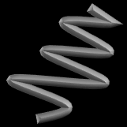

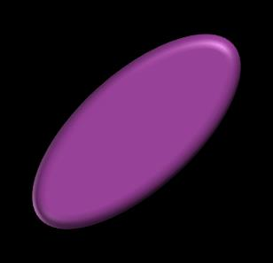

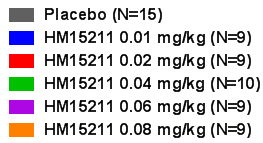

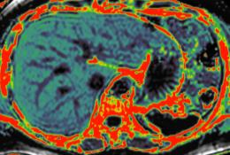

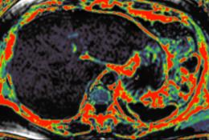

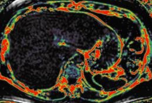

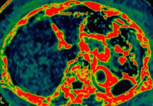

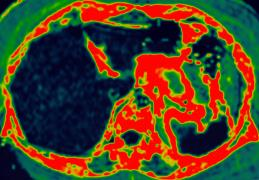

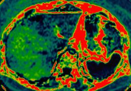

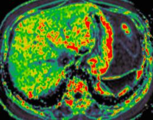

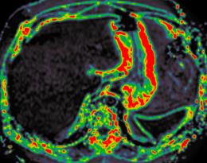

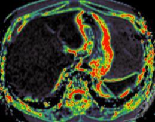

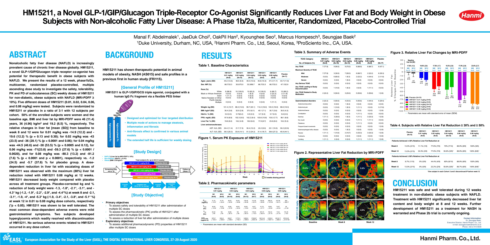

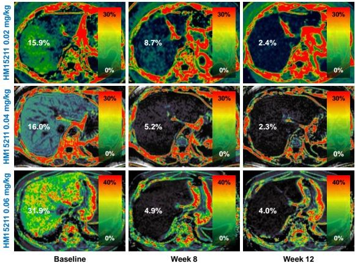

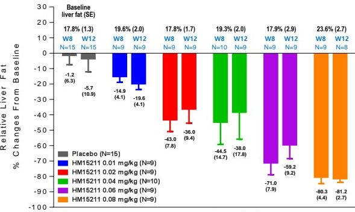

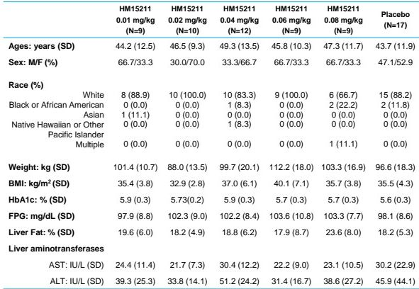

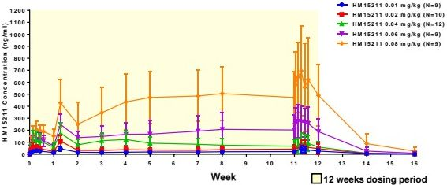

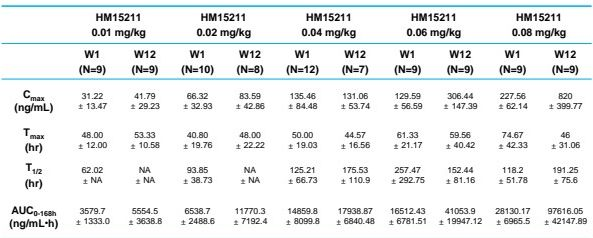

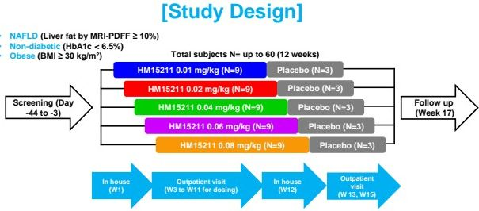

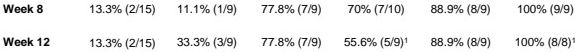

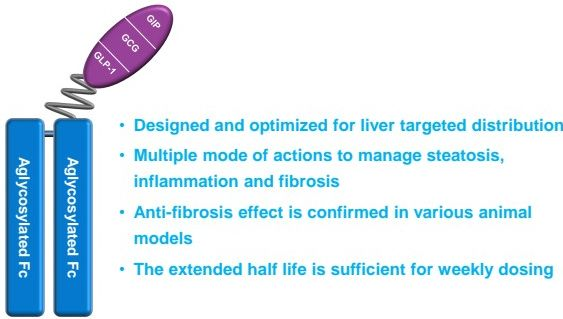

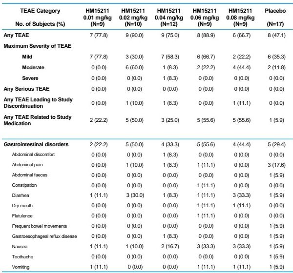

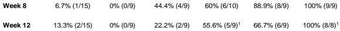

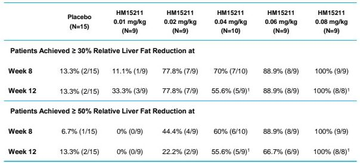
