# Effect of a novel long-acting GLP-1/GIP/Glucagon triple agonist (HM15211) in a NASH and fibrosis animal model

1106-P badge

Hanmi logo

In Young Choi¹, Jung Kuk Kim¹, Jong Suk Lee¹, Eun Jin Park¹, Dae Jin Kim¹, Young Hoon Kim¹, and Sun Jin Kim¹
¹Hanmi Pharm. Co., Ltd, Seoul, South Korea

## ABSTRACT

Nonalcoholic steatohepatitis (NASH), a potential consequence of NAFLD, may lead to end stage liver disease including cirrhosis and hepatocellular carcinoma. Despite its severity and prevalence, NASH currently lacks effective treatment. In this respect, we developed a novel long-acting, GLP-1/GIP/Glucagon triple agonist, HM15211. Previously, we showed that HM15211 exerts potent reductions in body weight and hepatic TG (triglycerides) in DIO mice, and showed a liver preferential distribution, suggesting HM15211 as a potential treatment option for NASH. Here, we evaluated the therapeutic effect of HM15211 on NASH and fibrosis by using DIO mice and MCD-diet mice.

In DIO mice, chronic HM15211 treatment favorably reprogrammed hepatic lipid metabolism as indicated by decrease in lipogenesis related gene expression (SREBP-1C, ACC1, ACC2, FAS and SCD1) and increase in β-oxidation gene expression (PGC-1α, and CPT-1). In addition, HM15211 significantly improved NAFLD activity score and hepatic TG in AMLN diet mice, clearly demonstrating beneficial effect of HM15211 on hepatic lipid metabolism.

In MCD-diet mice, chronic HM15211 treatment led to significant decrease in hepatic TG (-82.6% vs. vehicle) and TBARS (oxidative stress marker, -60.7% vs. vehicle), which coincided with significant reduction in ALT and bilirubin. Time course MRI analysis also confirmed the progressive steatosis resolution by HM15211, but not by liraglutide. Moreover, qPCR analysis indicated that HM15211 not only reduced the expression of genes involved in hepatic inflammation and HSC activation, but also inhibited fibrosis related gene expression. Consistently, HM15211, but not liraglutide, significantly reduced NAFLD activity score (1.3 for HM15211, 3.4 for liraglutide, and 2.7 for vehicle). As to fibrosis improvement, only HM15211 significantly reduced hepatic hydroxyproline contents (-47.8% vs. vehicle) in MCD-diet mice. Based on these observations, HM15211 may offer a therapeutic potential for NASH and fibrosis as well as obesity.

## BACKGROUND

HM15211, long-acting GLP-1/GIP/Glucagon tri-agonist, might have therapeutic potential in NASH by various MoA in liver.

✓ Expected benefit by HM15211 treatment on NASH progression

Diagram showing the progression from Normal liver to Dyslipidemia, NAFLD, NASH, and Cirrhosis, highlighting the mechanisms of action of HM15211 including lipid metabolism reprogramming, hepatic lipid profile improvement, oxidative stress reduction, anti-inflammation, liver function protection, and fibrosis improvement.

## METHODS

* To investigate the effects of HM15211 on hepatic lipid metabolism related gene expression, liver tissue samples were prepared after 4 weeks treatment of HM15211 in DIO mice. Then, the cDNA was synthesized from prepared liver tissues, and indicated gene expression (de novo lipogenesis: SREBP-1C, ACC1, ACC2, FAS and SCD1; β-oxidation: PGC-1α, CPT-1, LCAD, ACADVL) was determined via real time quantitative PCR (qPCR) using cognate primers.

* NAS (NAFLD activity score) and hepatic TG level were determined at the end of study after 4 weeks treatment of HM15211 in AMLN-diet mice.

* Therapeutic potential of HM15211 in NASH and fibrosis was evaluated in MCD-diet mice (6 weeks induction). After 4 weeks treatment of HM15211, liver tissue samples were prepared to measure hepatic TG, TBARS (oxidative stress marker), Inflammation & HSC activation related marker gene expression (TNF-α, F4/80, TGF-β and α-SMA) and fibrosis related marker gene expression (Collagen-1α, and TIMP-1). To non-invasively monitor the changes in hepatic lipid contents, each mouse was subjected to MRI analysis every 2 weeks.

* To determine NAS (NAFLD activity score), the same region of each liver tissue was subjected to H&E staining. For fibrosis analysis, Sirius red staining and hepatic hydroxyproline analysis were performed

## RESULTS

### Liver preferential distribution of HM15211

#### Figure 1. Time-dependent tissue distribution of HM15211 in SD rats (n=3)

| Tissue         | 4 hr | 48 hr | 168 hr |
| -------------- | ---- | ----- | ------ |
| Serum          | 2500 | 100   | 10     |
| Liver          | 2800 | 1200  | 200    |
| Heart          | 200  | 50    | 10     |
| Lung           | 400  | 100   | 20     |
| Large I.       | 150  | 50    | 10     |
| Spleen         | 200  | 50    | 10     |
| Pancreas       | 300  | 100   | 20     |
| Adipose tissue | 100  | 20    | 5      |
| Small I.       | 200  | 50    | 10     |
| Stomach        | 150  | 50    | 10     |
| Muscle         | 50   | 10    | 5      |

⮚ HM15211 was preferentially distributed to the liver, which is a main target organ for glucagon action. High glucagon activity in HM15211 might make the liver preferential distribution.

### Improved hepatic lipid metabolism in DIO mice

#### Figure 2. Effect of HM15211 on in hepatic lipid metabolism related gene and blood lipid profiles in DIO mice (n=7)

**(a) De novo lipogenesis related gene**

| Gene     | Vehicle | Liraglutide 50 nmol/kg, BID | HM15211 1.44 nmol/kg, Q2D |
| -------- | ------- | --------------------------- | ------------------------- |
| SREBP-1C | 1.0     | 0.7                         | 0.4\*                     |
| ACC1     | 1.0     | 0.8                         | 0.4\*\*                   |
| ACC2     | 1.0     | 0.9                         | 0.5\*\*                   |
| FAS      | 1.0     | 0.7                         | 0.4\*\*                   |
| SCD1     | 1.0     | 0.8                         | 0.4\*\*                   |

\*~***p<0.05~0.001 vs. vehicle by One-way ANOVA

**(b) β-oxidation related gene**

| Gene   | Vehicle | Liraglutide 50 nmol/kg, BID | HM15211 1.44 nmol/kg, Q2D |
| ------ | ------- | --------------------------- | ------------------------- |
| PGC-1α | 1.0     | 1.5                         | 4.5\*\*\*                 |
| CPT-1  | 1.0     | 1.2                         | 3.5\*\*\*                 |
| LCAD   | 1.0     | 1.8                         | 4.8\*\*\*                 |
| ACADVL | 1.0     | 1.2                         | 1.5                       |

\*~***p<0.05~0.001 vs. vehicle by One-way ANOVA

⮚ HM15211 treatment not only reduced de novo lipogenesis related gene expression but also improved β-oxidation related gene expression.

### NASH and fibrosis improvement in animal models

#### Figure 3. Effect of HM15211 on NASH prognosis markers in AMLN-diet mice (n=7)

**(a) Hepatic TG**

| Group                       | Hepatic TG (mg/dL) |
| --------------------------- | ------------------ |
| Normal vehicle              | 50                 |
| AMLN, vehicle               | 240                |
| Liraglutide 50 nmol/kg, BID | 180\*              |
| HM15211 2.88 nmol/kg, Q2D   | 70\*\*\*           |

\*~***p<0.05~0.001 vs. AMLN mice, vehicle by One-way ANOVA

**(b) NAFLD activity score**

| Group                       | NAFLD activity score |
| --------------------------- | -------------------- |
| Normal vehicle              | 0                    |
| AMLN, vehicle               | 4.5                  |
| Liraglutide 50 nmol/kg, BID | 3.5\*\*              |
| HM15211 2.88 nmol/kg, Q2D   | 2.0\*\*\*            |

\*~***p<0.05~0.001 vs. AMLN mice, vehicle by One-way ANOVA

⮚ In AMLN-diet induced NASH mice, HM15211 treatment significantly reduced NAS and hepatic TG.

#### Figure 4. Effect of HM15211 on NASH prognosis markers in MCD-diet mice (n=7)

**(c) Representative MRI**
Representative MRI images showing liver fat content at baseline, week 2, and week 4 for Normal, MCD Vehicle, Liraglutide, and HM15211 groups.

**(d) Blood ALT**

| Group                       | Blood ALT (IU/L) |
| --------------------------- | ---------------- |
| Normal vehicle              | 50               |
| MCD, vehicle                | 900              |
| Liraglutide 50 nmol/kg, BID | 500\*\*\*        |
| HM15211 1.44 nmol/kg, Q2D   | 200\*\*\*        |

**(e) Blood total bilirubin**

| Group                       | Blood total bilirubin (mg/dL) |
| --------------------------- | ----------------------------- |
| Normal vehicle              | 0.1                           |
| MCD, vehicle                | 1.2                           |
| Liraglutide 50 nmol/kg, BID | 1.0                           |
| HM15211 1.44 nmol/kg, Q2D   | 0.4\*\*\*                     |

**(a) Hepatic TG**

| Group                       | Hepatic TG (mg/g liver) |
| --------------------------- | ----------------------- |
| Normal vehicle              | 10                      |
| MCD, vehicle                | 100†                    |
| Liraglutide 50 nmol/kg, BID | 80                      |
| HM15211 0.72 nmol/kg, Q2D   | 60\*                    |
| HM15211 1.44 nmol/kg, Q2D   | 20\*\*\*                |

**(b) Hepatic TBARS**

| Group                       | Hepatic TBARS (nmol/mg liver) |
| --------------------------- | ----------------------------- |
| Normal vehicle              | 5                             |
| MCD, vehicle                | 25††                          |
| Liraglutide 50 nmol/kg, BID | 20                            |
| HM15211 0.72 nmol/kg, Q2D   | 18\*                          |
| HM15211 1.44 nmol/kg, Q2D   | 8\*\*\*                       |

⮚ HM15211 reduced blood lipid contents, followed by reduction of TBARS, a well-known lipid peroxidation marker. In addition, HM15211 could improved liver function as indicated by reduced blood ALT and bilirubin.

#### Figure 5. Effect of HM15211 on hepatic NASH/fibrosis marker gene expression in MCD-diet mice (n=7)

**(a) Inflammation & HSC activation marker gene expression**

| Gene  | Normal vehicle | MCD, vehicle | Liraglutide 50 nmol/kg, BID | HM15211 0.36 nmol/kg, Q2D | HM15211 0.72 nmol/kg, Q2D |
| ----- | -------------- | ------------ | --------------------------- | ------------------------- | ------------------------- |
| TNF-α | 0.1            | 4.2          | 3.5                         | 2.8\*                     | 1.5\*\*\*                 |
| F4/80 | 0.1            | 3.8          | 3.2                         | 2.5\*                     | 1.2\*\*\*                 |
| TGF-β | 0.1            | 2.5          | 2.2                         | 1.8                       | 1.0\*\*\*                 |
| α-SMA | 0.1            | 3.2          | 2.8                         | 2.0\*                     | 1.2\*\*\*                 |

**(b) Fibrosis marker gene expression**

| Gene        | Normal vehicle | MCD, vehicle | Liraglutide 50 nmol/kg, BID | HM15211 0.36 nmol/kg, Q2D | HM15211 0.72 nmol/kg, Q2D |
| ----------- | -------------- | ------------ | --------------------------- | ------------------------- | ------------------------- |
| Collagen-1α | 0.1            | 7.5††        | 6.0                         | 4.5\*\*                   | 2.5\*\*\*                 |
| TIMP-1      | 0.1            | 5.5††        | 4.5                         | 3.5\*\*                   | 1.8\*\*\*                 |

\*~***p<0.05~0.001 vs. MCD mice, vehicle by One-way ANOVA, ††p<0.01 vs. Liraglutide by One-way ANOVA

⮚ HM15211 not only reduced hepatic inflammation and HSC activation related marker gene expression, but also inhibited fibrosis related gene expression.

#### Figure 6. Therapeutic effect of HM15211 on NASH and fibrosis in MCD-diet mice (n=7)

**(a) NAFLD activity score**

| Group                       | NAFLD activity score |
| --------------------------- | -------------------- |
| Normal vehicle              | 0                    |
| MCD, vehicle                | 2.8                  |
| Liraglutide 50 nmol/kg, BID | 3.4                  |
| HM15211 0.72 nmol/kg, Q2D   | 1.3\*\*\* †††        |

**(b) Hepatic hydroxyproline**

| Group                       | Hydroxyproline (nmol/g liver) |
| --------------------------- | ----------------------------- |
| Normal vehicle              | 250                           |
| MCD, vehicle                | 700                           |
| Liraglutide 50 nmol/kg, BID | 600                           |
| HM15211 0.72 nmol/kg, Q2D   | 380\*\*                       |

\*~***p<0.05~0.001 vs. vehicle by One-way ANOVA, †††p<0.001 vs. Liraglutide by One-way ANOVA

**(c) H&E (above) and sirius red (below) staining**

Histological images of liver tissue stained with H&E and Sirius red for Normal vehicle, MCD vehicle, MCD Liraglutide, and MCD HM15211 groups. Scale bar 100μm.

⮚ Consistently, HM15211 significantly reduced NAS and hepatic hydroxyproline (hepatic fibrosis marker).

## CONCLUSIONS

* HM15211, a novel long-acting triple agonist, improved hepatic lipid metabolism related gene expression in DIO mice and reduced NASH prognosis markers in AMLN diet-mice

* HM15211 reduced NASH prognosis related markers including hepatic lipid contents, oxidative stress, blood ALT, and bilirubin in MCD-diet mice

* HM15211 reduced the expression of genes responsible for hepatic inflammation, HSC activation, and fibrosis in MCD-diet mice

* The therapeutic effects of HM15211 on NASH is further demonstrated as reduction of NAS and hepatic hydroxyproline contents

## REFERENCES

* Finan B et al., Sci Transl Med. 5, 209ra(151) (2013)

* Neuschwander-Tetri BA et al., Lancet. 385, 956-65 (2015)

* Finan B et al., Nat Med. 21, 27-36 (2015)

* Harriman G et al., Proc Natl Acd Sci USA. 113, E1796-805 (2016)

American Diabetes Association’s (ADA) 78ᵗʰ Scientific Sessions, Orlando, FL, USA; June 22-26, 2018

Hanmi Pharm. Co., Ltd.

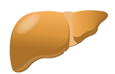

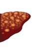

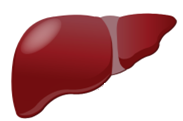

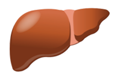

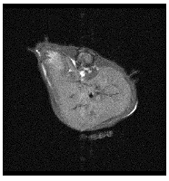

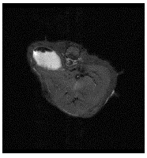

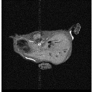

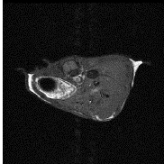

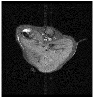

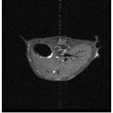

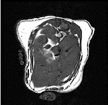

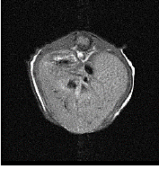

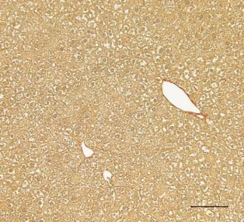

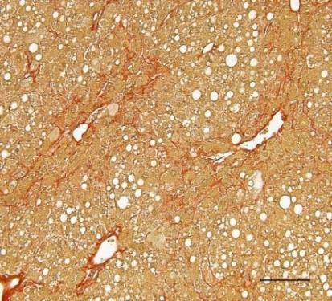

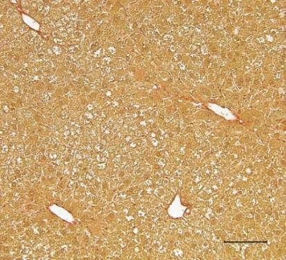

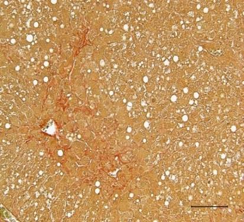

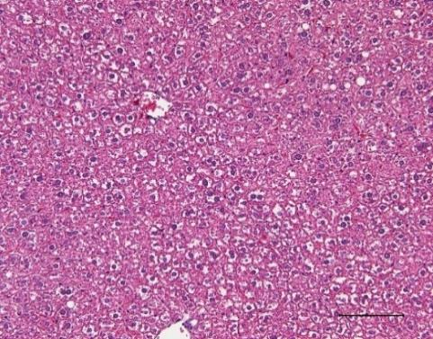

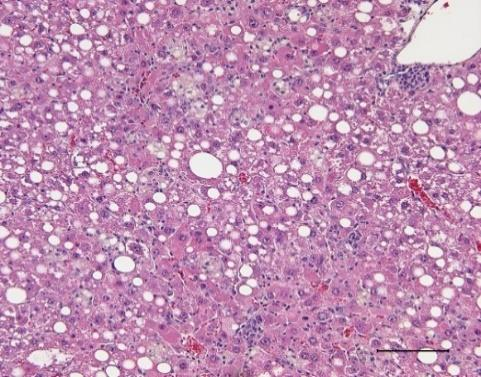

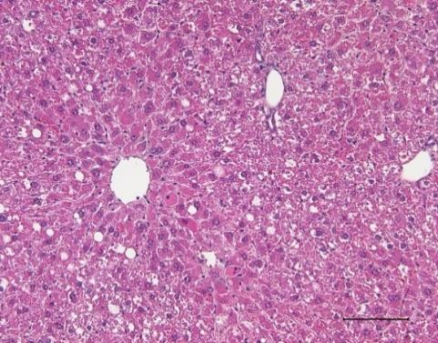

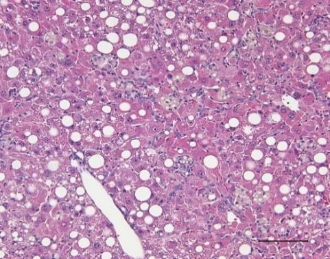

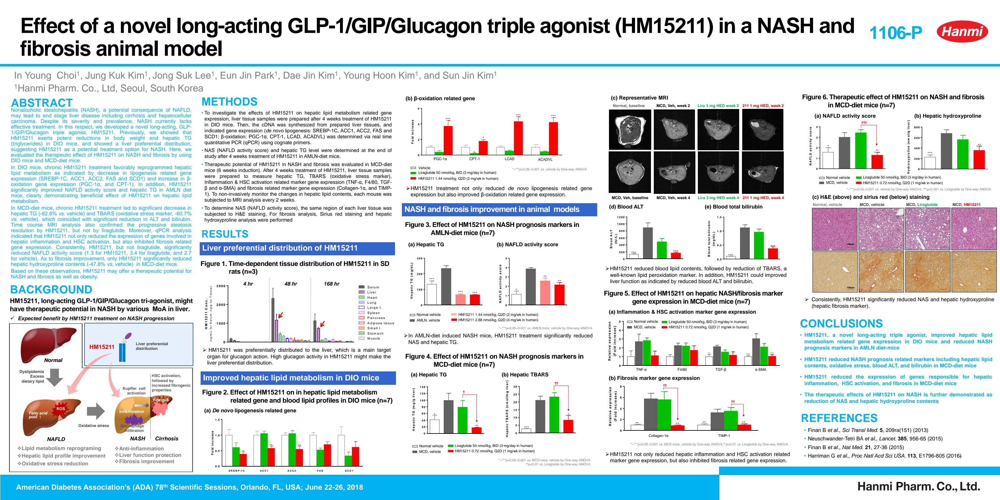

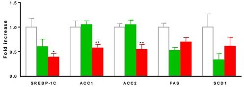

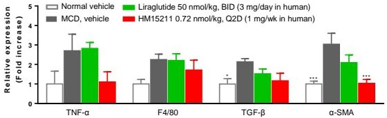

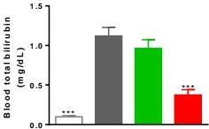

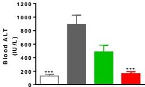

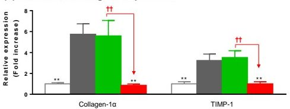

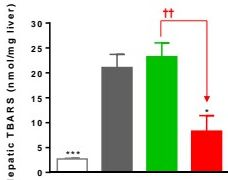

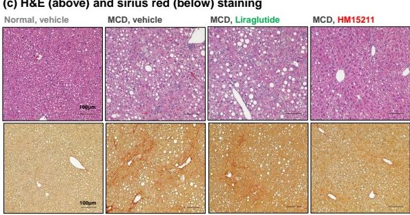

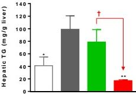

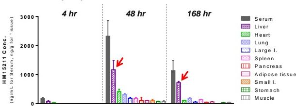

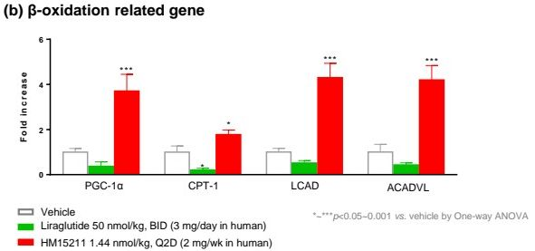

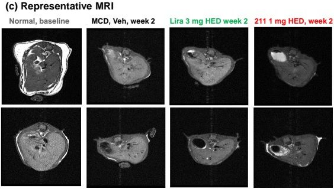

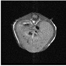

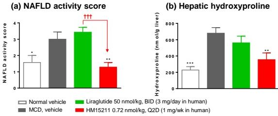

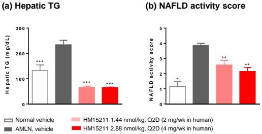

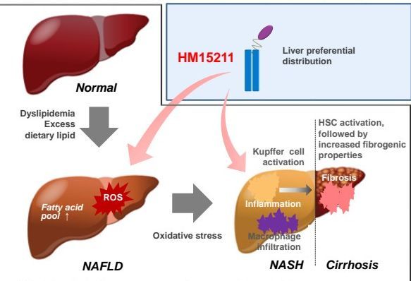
