# Neuroprotective effects of HM15211, a novel long-acting GLP-1/GIP/Glucagon triple agonist in the neurodegenerative disease models

1107-P Hanmi logo

Jeong A Kim¹, Sang Don Lee¹, Sang-Hyun Lee¹, Sung Min Bae¹, Young Hoon Kim¹, In Young Choi¹, and Sun Jin Kim¹
1Hanmi Pharm. Co., Ltd, Seoul, Korea

## ABSTRACT

HM15211 is a novel long-acting GLP-1/GIP/Glucagon triple agonist that is being developed for the treatment of obesity and non-alcoholic fatty liver disease (NASH). Accumulated evidences have shown that obesity, type 2 diabetes, and NASH increase the risk of developing progressive neurodegenerative disease such as Parkinson’s disease (PD) and Alzheimer’s disease (AD). In addition to peripheral contributions, each of incretins consisting HM15211 have neuroprotective effects in several brain diseases like AD, PD, and ischemia.

Previously, we demonstrated that HM15211 exerted neuroprotective effects in MPTP induced subacute Parkinson’s disease mice model. Here, we evaluated 1) the neuroprotective effects of HM15211 in chronic MPTP/probenecid Parkinson’s disease model, and 2) the protection of Alzheimer’s disease progression in db/db mice.

Chronic Parkinson’s disease mice model was induced by 1-methyl-4-phenyl-1,2,3,6-tetrahydropyridine (MPTP) in combination with probenecid injection, twice a week for 5 weeks. HM15211 was administered once a week for 6 weeks. Dopaminergic neuronal death by MPTP/probenecid was protected by HM15211, which was derived from anti-inflammatory effect by HM15211. Also, HM15211 decreased alpha synuclein in striatum of chronic mice PD model. Together with these efficacies, HM15211 significantly improved the MPTP/probenecid-induced motor impairments in behavior tests (rotarod, pole test, and traction test).

The db/db mice are well-established diabetic model and it was reported that db/db mice increase amyloid beta 1-42. Thus, we chose db/db mice to elucidate the prophylactic effect of HM15211 on Alzheimer’s disease. After once every 2 days subcutaneous administration for 12 weeks, HM15211 reversed inflammatory cytokines, which was increased in db/db mice. Also, increased amyloid beta 1-42 in db/db mice was decreased by HM15211.

Based on these observations, HM15211 might be a potential therapeutic option for the neurodegenerative disease.

## BACKGROUND

* Obesity is one of the risk factors of neurological disorder¹

Alzheimer's and Parkinson's disease risk factors diagram

* Neuroprotective effects of GLP-1², glucagon³ and GIP⁴

| Incretin | Target Organ   | Effect                                                                |
| -------- | -------------- | --------------------------------------------------------------------- |
| GLP-1    | Brain          | ↑ Neurite outgrowth ↑ Progenitor proliferation ↓ inflammation |
| GLP-1    | Pancreas       |                                                                       |
| GLP-1    | GI tract       |                                                                       |
| GLP-1    | Adipose tissue |                                                                       |
| GLP-1    | Heart          |                                                                       |
| Glucagon | Brain          | ↓ Glutamate neurotoxicity                                             |
| Glucagon | Heart          |                                                                       |
| GIP      | Brain          | ↑ Progenitor proliferation ↓ inflammation                         |
| GIP      | Bone tissue    |                                                                       |

## METHODS

* Chronic Parkinson’s disease mice model was induced by 1-methyl-4-phenyl-1,2,3,6-tetrahydropyridine (MPTP) in combination with probenecid intraperitoneal injection, twice a week for 5 weeks and HM15211 was subcutaneously administered once a week for 6 weeks.

* Db/db mice are well-established diabetic model. It has been reported that db/db mice increase amyloid beta 1-42⁵. Thus we chose db/db mice to elucidate the prophylactic effect of HM15211 on the development of Alzheimer’s disease. Six weeks old db/db mice were subcutaneously treated with HM15211, once every two days for 12 weeks.

## RESULTS

### Functional evaluation in chronic PD mice

Figure 1. Motor function restoring effects of HM15211

| Test                         | Vehicle | MPTP/P | MPTP/P + HM15211 5.03 nmol/kg |
| ---------------------------- | ------- | ------ | ----------------------------- |
| Traction test (score 0\~3)   | 2.8     | 1.3    | 2.5                           |
| Pole test (T-total, s)       | 12      | 48     | 25                            |
| Rotarod (falling latency, s) | 180     | 90     | 160                           |

⮚ HM15211 administration restored MPTP/P induced motor function impairment in (a) traction test, (b) pole test and (c) rotarod test.

### Neuroprotection in chronic PD mice

Figure 2. Dopaminergic neuroprotection by HM15211
(a) Dopaminergic neuron staining (TH; tyrosine hydroxylase)

Dopaminergic neuron staining images

| Group                         | TH+ cells in substantia nigra |
| ----------------------------- | ----------------------------- |
| Vehicle                       | 170                           |
| MPTP/P                        | 50                            |
| MPTP/P + HM15211 5.03 nmol/kg | 85                            |

| Group                         | α-synuclein (ng/ml) |
| ----------------------------- | ------------------- |
| Vehicle                       | 4.8                 |
| MPTP/P                        | 6.8                 |
| MPTP/P + HM15211 5.03 nmol/kg | 5.2                 |

⮚ HM15211 administration protected MPTP/P induced dopaminergic neuronal cell damage in the striatum and the substantia nigra (a, b) and also effectively inhibited the α-synuclein toxicity, which was induced by MPTP/P (c).

### Mechanisms of neuroprotection in chronic PD mice

Figure 3. Anti-inflammatory effects of HM15211
(a) Microglia staining (Iba1)

Microglia staining images

| Parameter                              | Vehicle | MPTP/P | MPTP/P + HM15211 5.03 nmol/kg |
| -------------------------------------- | ------- | ------ | ----------------------------- |
| Iba1+ area in Striatum (% vs. vehicle) | 100     | 280    | 110                           |
| IFN-γ (pg/ml)                          | 55      | 140    | 90                            |
| IL-10 (pg/ml)                          | 2200    | 1100   | 1800                          |

⮚ In striatum of MPTP/P chronic PD mouse model, HM15211 reduced the area covered by microglia (a, b) and reversed the induction of IFN-γ (c) and the reduction of IL-10 (d) levels.

### AD pathological resolution in db/db mice

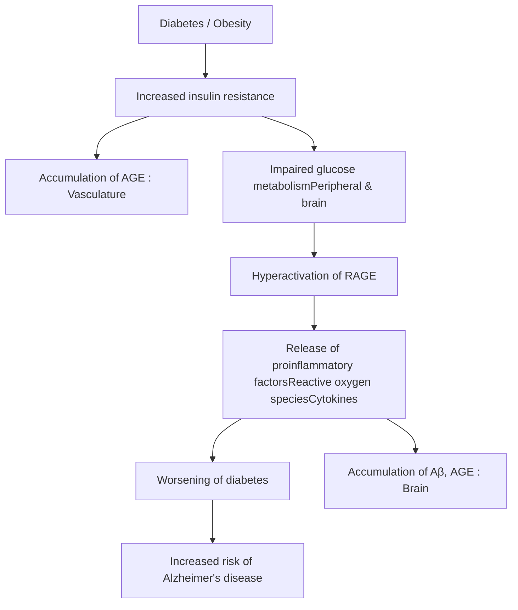

Figure 4. Inhibited accumulation of Aβ₁₋₄₂ and AGE by HM15211

| Parameter              | db/db D0 (6w) | db/m (18w) vehicle | db/db (18w) vehicle | HM15211 1.08 nmol/kg, Q2D |
| ---------------------- | ------------- | ------------------ | ------------------- | ------------------------- |
| Aβ1-42 (% vs. vehicle) | 35            | 100                | 125                 | 105                       |
| AGE (μg/ml)            | 0.6           | 1.2                | 1.4                 | 1.2                       |

⮚ The Aβ₁₋₄₂ levels in cortex was increased in db/db mice, but HM15211 prevented the accumulation of Aβ₁₋₄₂(a). Also, HM15211 effectively decreased the AGE (Advanced glycation end product), which is a factor in worsening of neurodegenerative disease.

### (c) Reduction of activated microglia in cortex and hippocampus

Microglia staining in cortex and hippocampus

⮚ HM15211 decreased of IL-1β (a) and IFN-γ (b) levels of db/db mice cortex. Also, HM15211 reduced activated microglia in cortex and hippocampus of db/db mice brain (c).

### Mechanisms of neuroprotection in db/db mice

Figure 5. Reduced inflammation by HM15211

| Parameter     | db/db D0 (6w) | db/m (18w) vehicle | db/db (18w) vehicle | HM15211 1.08 nmol/kg |
| ------------- | ------------- | ------------------ | ------------------- | -------------------- |
| IL-1β (pg/ml) | 55            | 80                 | 85                  | 50                   |
| IFN-γ (pg/ml) | 45            | 55                 | 65                  | 45                   |

## CONCLUSIONS

* In MPTP/Probenecid induced chronic Parkinson’s disease model, HM15211 inhibited the increase of alpha synuclein, which is the most prominent pathological biomarker of Parkinson’s disease.

* In aged db/db mice, pathological characters of Alzheimer’s disease such as Aβ₁₋₄₂ and AGE accumulations were shown. These were reversed by HM15211 treatment.

* These neuroprotective effects of HM15211 are derived from anti-inflammatory effect through the altered cytokine expression and reduced lipid peroxidation (data not shown).

* Based on these results, the novel long-acting GLP-1 / GIP / Glucagon tri-agonist, HM15211 might have therapeutic potential for neurodegenerative diseases.

## REFERENCES

1. Claudio Procaccini et al., Metabolism. 65(9):1376-90 (2016)

2. Yazhou Li et al., Proc Natl Acad Sci U S A. Jan 27;106(4):1285-90 (2009)

3. Rami Abu Fanne et al., Am J Physiol Regul Integr Comp Physiol 301: R668–R673 (2011)

4. Yanwei Li et al., Neuropharmacology. 101, 255e263 (2016)

5. Son SM et al., Diabetes. 61(12):3126-38 (2012)

American Diabetes Association’s (ADA) 78th Scientific Sessions, Orlando, FL, USA; June 22‐26, 2018

Hanmi Pharm. Co., Ltd.

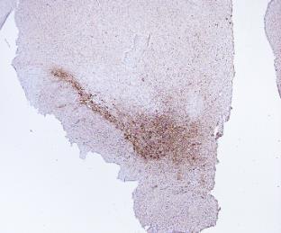

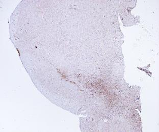

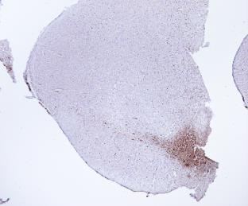

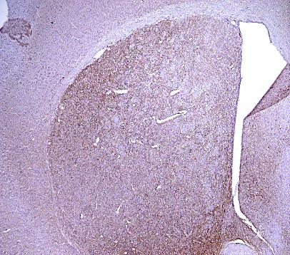

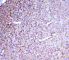

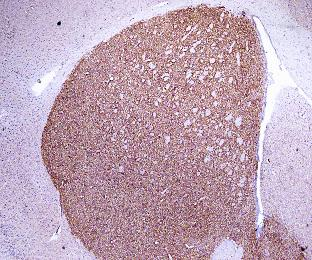

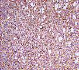

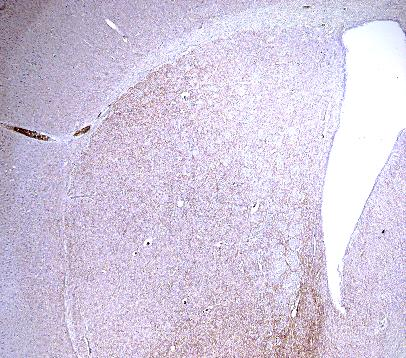

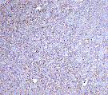

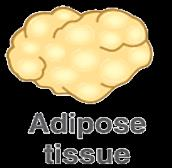

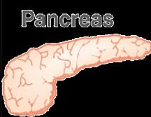

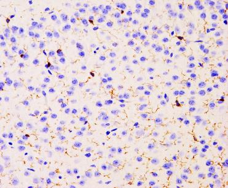

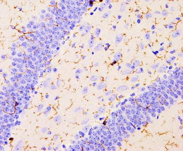

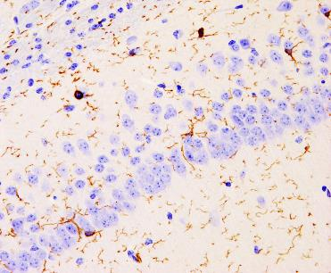

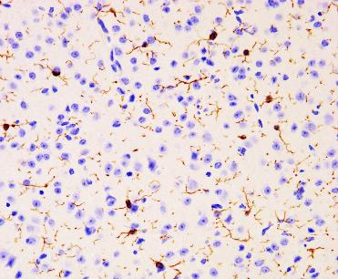

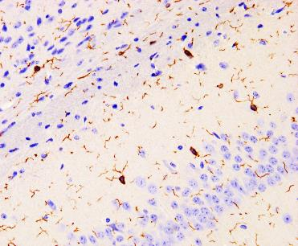

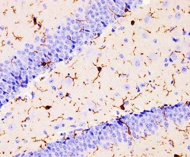

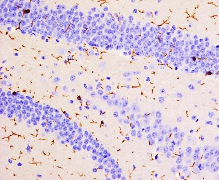

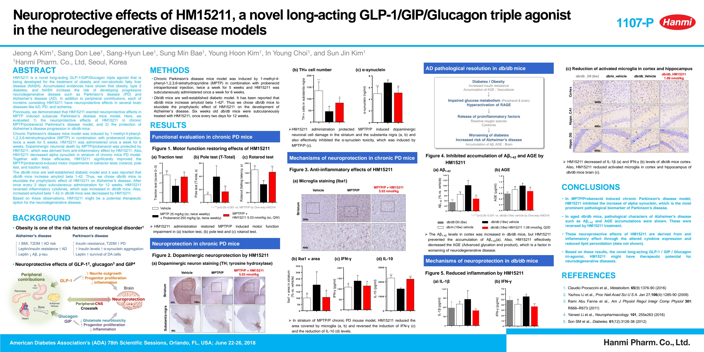

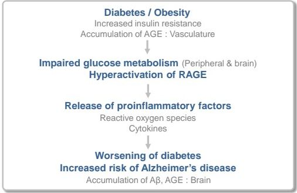

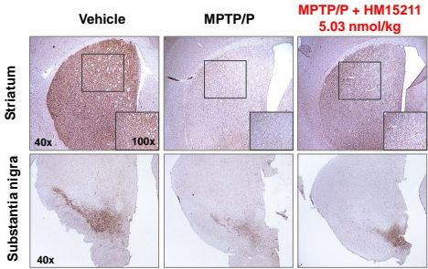

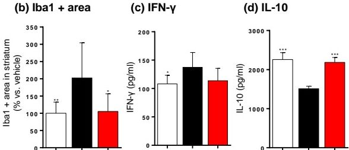

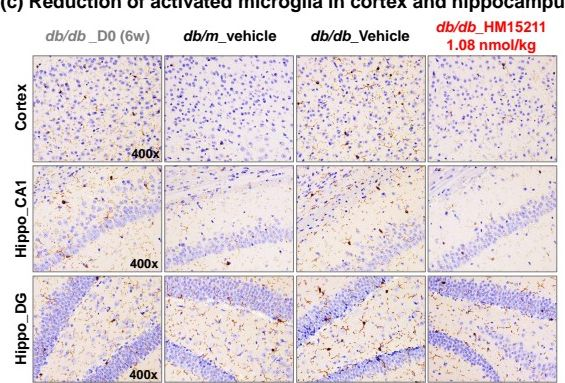

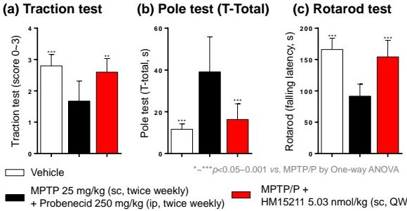

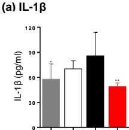

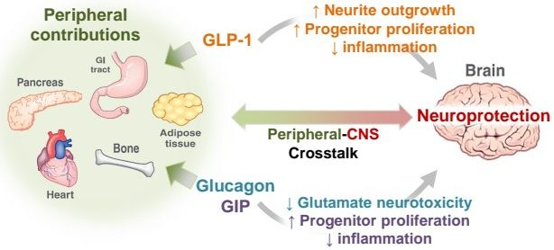

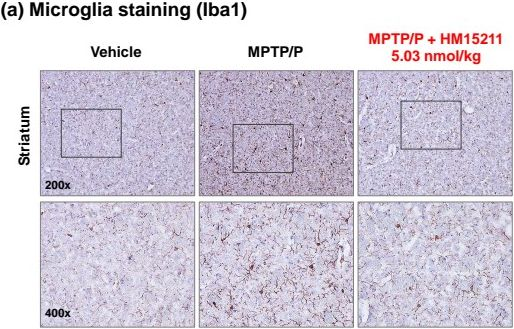

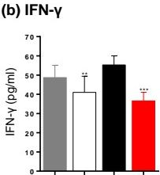

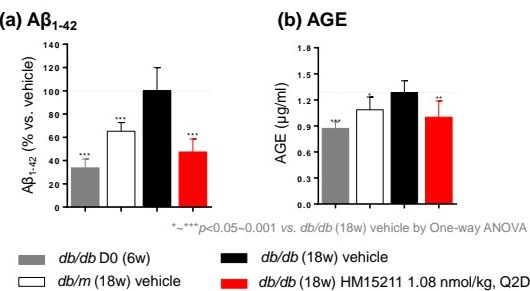

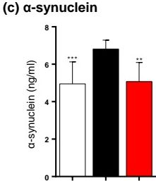

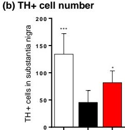

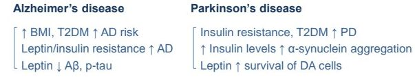
