# Innovent Biologics Clinical Data Update

Mazdutide @ 2024 ADA

June 25, 2024

TO DEVELOP AND COMMERCIALIZE HIGH QUALITY BIOPHARMACEUTICALS THAT ARE AFFORDABLE TO ORDINARY PEOPLE.

Abstract blue wave background with "Agenda" title and three numbered list items

# Agenda

**01** Introduction

**02** ADA Highlights

**03** Q&A

Confidential
Copyright© 2023 Innovent 2

# Introduction

**Prof. Linong Ji** *Leading PI; Peking University People's Hospital*
**Dr. Lei Qian** *Vice President of General Biomedicine Development*

Abstract blue wave graphic

Innovent

# <u>Opening remarks by invited guest</u>

## Prof. Linong Ji, MD

## Leading Principal Investigator; Peking University People’s Hospital

Portrait of Prof. Linong Ji

* **Director of Peking University Diabetes Center and Director of the Department of Endocrinology and Metabolism,** Peking University People's Hospital, Beijing, China.

* **President of Specialty Committee of Clinical Research on Diabetes and Metabolic Drugs of China Pharmaceutical Innovation and Research Development Association (PhIRDA),** Former Vice President of International Diabetes Federation (IDF), Former Chair of International Diabetes Federation Western Pacific Region (IDF-WPR), Former President of the Chinese Diabetes Society (CDS), Vice President of the Chinese Endocrinologist Association (CEA), President of Chinese Geriatric Endocrine and Metabolism Society, Executive board member of Asia Association for the Study of Diabetes (AASD).

* **Chief Editor of Chinese Diabetes Journal and an editorial board member of Journal of Diabetes,** Diabetes Research and Clinical Practice, Diabetes Technology & Therapeutics, Metabolism, International Journal of Diabetes.

* **Principal investigator of 60+ clinical studies. Published 500+ articles in peer-reviewed journals.**

Innovent logo

Confidential

Copyright ©2024 Innovent

4

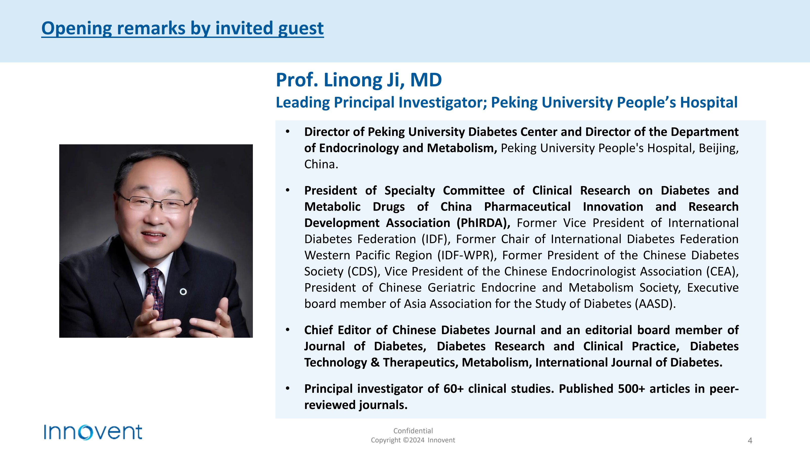

# <u>Key facts of obesity/overweight in China</u>

## China has the largest obese and overweight population, with <1% on medication

## 500m adults in China live with obesity or overweight

| Category                                      | 2019 Prevalence (%) | 2030 Projected Prevalence (%) | Population (Adults only) |
| --------------------------------------------- | ------------------- | ----------------------------- | ------------------------ |
| Overweight (BMI ≥ 24 kg/m²)                   | 50%                 | 65%                           | 1 Billion                |
| Obesity (BMI ≥ 28 kg/m²)                      | 16%                 | 23%                           | 500 Million              |
| Moderate to Severe Obesity (BMI ≥ 32.5 kg/m²) | 1%                  | 2%                            | 160 Million              |
| On Medication                                 |                     |                               | 10 Million               |

## Weight management options are limited

* Lifestyle Intervention icon **Lifestyle Intervention**: Low compliance, Non-ideal outcome

* Bariatric Surgery icon **Bariatric Surgery**: Very limited usage, Various obstacles

* Pharmacotherapy icon **Pharmacotherapy**: Limited efficacy and serious adverse effects before GLP-1 class

\* 1. Pan XF, Wang L, Pan A. Epidemiology and determinants of obesity in China. Lancet Diabetes Endocrinol. 2021 Jun;9(6):373-392. doi: 10.1016/S2213-8587(21)00045-0. Erratum in: Lancet Diabetes Endocrinol. 2021 Jul;9(7):e2. PMID: 34022156.

\* 2. Wang Y, Zhao L, Gao L, Pan A, Xue H. Health policy and public health implications of obesity in China. Lancet Diabetes Endocrinol. 2021 Jul;9(7):446-461. doi: 10.1016/S2213-8587(21)00118-2. Epub 2021 Jun 4. PMID: 34097869.

Innovent logo

Confidential
Copyright © 2024 Innovent

5

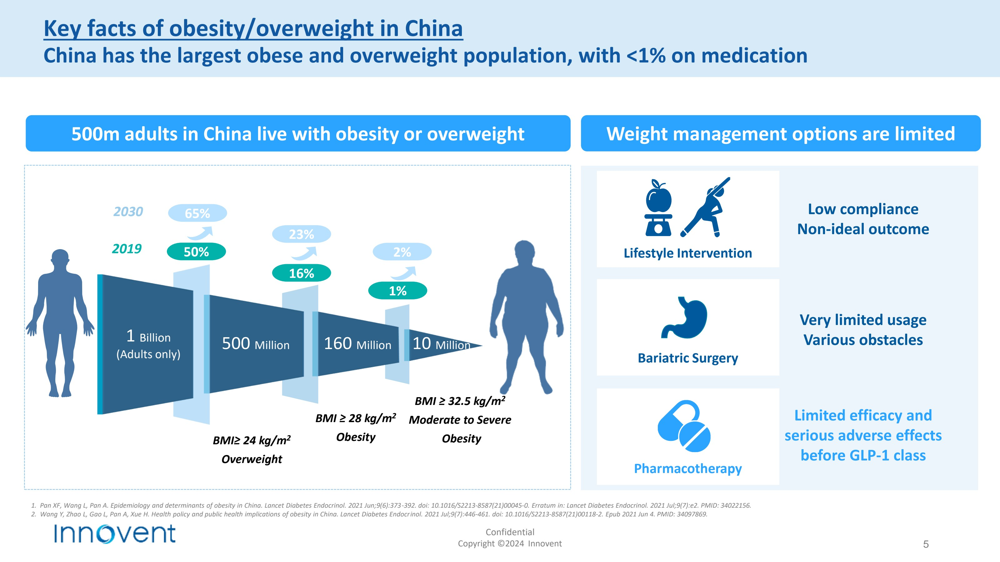

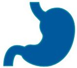

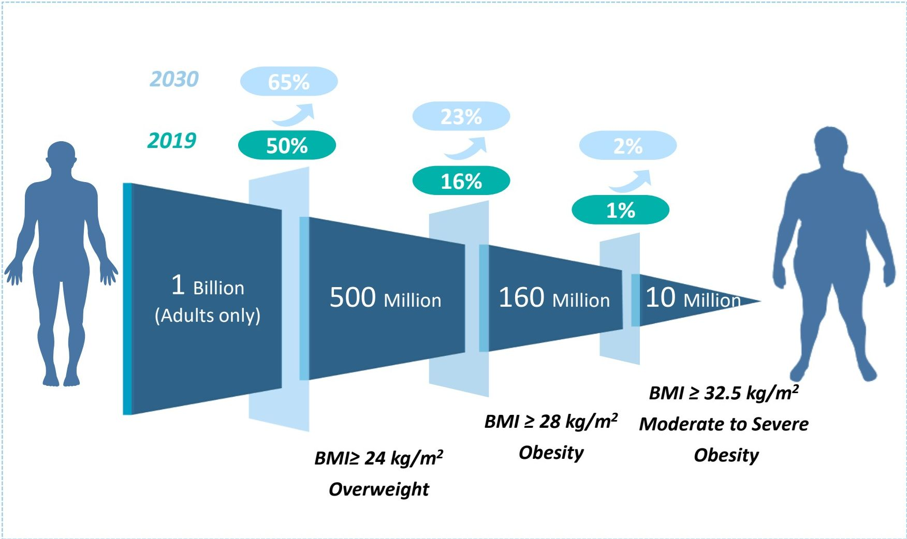

# <u>Key facts of obesity/overweight in China</u>
## High burden of comorbidities with overweight/obesity

# Prevalence of comorbidities in normal BMI, overweight or obesity in China

| Comorbidity                | Obesity (BMI≥28kg/m²) (%) | Overweight (BMI 24-28kg/m²) (%) | Normal BMI (BMI 18.5-24kg/m²) (%) |
| -------------------------- | ------------------------- | ------------------------------- | --------------------------------- |
| Fatty liver disease        | 81.8                      | 49.0                            | 13.3                              |
| Dyslipidaemia              | 42.4                      | 31.3                            | 16.9                              |
| Prediabetes (ADA criteria) | 36.9                      | 30.7                            | 23.0                              |
| Hypertension               | 36.9                      | 20.7                            | 11.2                              |
| Hyperuricaemia             | 21.1                      | 12.8                            | 6.3                               |
| Carotide plaque            | 17.3                      | 15.8                            | 14.3                              |
| Diabetes (ADA criteria)    | 14.6                      | 9.2                             | 5.2                               |
| CKD (any stage)            | 6.3                       | 4.1                             | 3.7                               |
| Cholelithiasis             | 5.0                       | 3.8                             | 2.7                               |

Chen K, Shen Z, Gu W, Lyu Z, Qi X, Mu Y, Ning Y; Meinian Investigator Group. Prevalence of obesity and associated complications in China: A cross-sectional, real-world study in 15.8 million adults. Diabetes Obes Metab. 2023 Nov;25(11):3390-3399. doi: 10.1111/dom.15238.
Data were obtained from 519 Meinian health check-up centres across 243 cities. Eligible participants were aged ≥18 years, with a routine check-up in 2019 (N = 21 771 683)

Innovent logo

Confidential
Copyright © 2024 Innovent

6

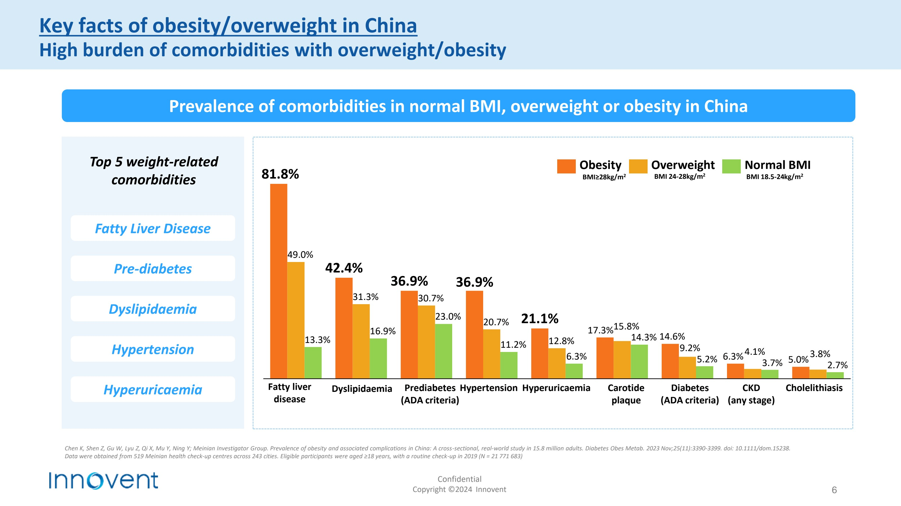

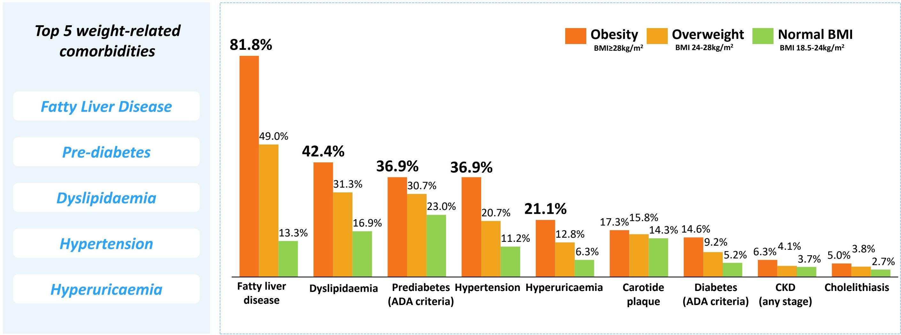

# <u>Key facts of obesity/overweight in China</u>

## Most people with overweight/obesity have one or more comorbidities

# Number of comorbidities in adults with normal BMI, overweight or obesity in China

**42% of normal BMI population have ≥1 comorbidities**
**71% of overweight population have ≥1 comorbidities**
**89% of obese population have ≥1 comorbidities**

| Number of comorbidities | Normal BMI (%) | Overweight (%) | Obese (%) |
| ----------------------- | -------------- | -------------- | --------- |
| 0                       | 58             | 29             | 11        |
| 1                       | 28             | 33             | 26        |
| 2                       | 10             | 23             | 31        |
| 3                       | 3              | 12             | 23        |
| 4                       | 1              | 3              | 8         |
| ≥5                      | 0              | 1              | 2         |

Overweight and obesity were associated with a high prevalence of cardiometabolic diseases, emphasizing the need for weight management efforts that address both excess body weight and associated comorbidities.

*Chen K, Shen Z, Gu W, Lyu Z, Qi X, Mu Y, Ning Y; Meinian Investigator Group. Prevalence of obesity and associated complications in China: A cross-sectional, real-world study in 15.8 million adults. Diabetes Obes Metab. 2023 Nov;25(11):3390-3399. doi: 10.1111/dom.15238. Data were obtained from 519 Meinian health check-up centres across 243 cities. Eligible participants were aged ≥18 years, with a routine check-up in 2019 (N = 21 771 683)*

Innovent logo

Confidential

Copyright © 2024 Innovent

7

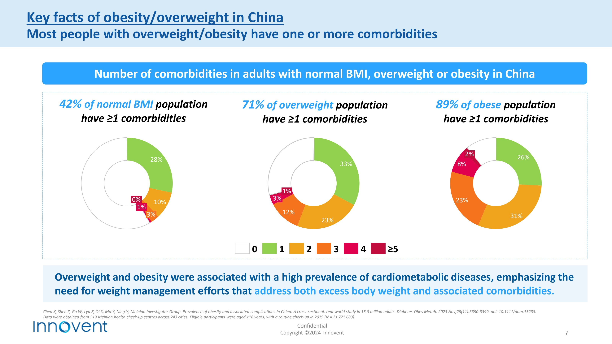

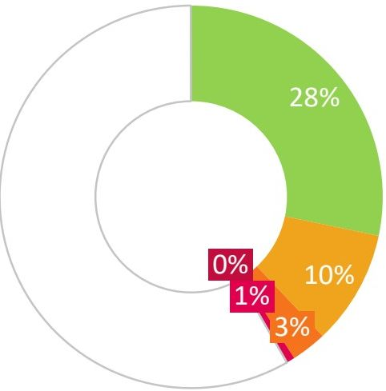

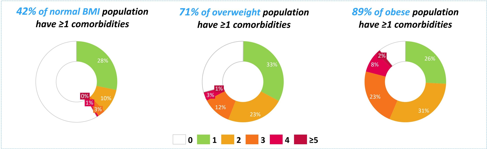

# <u>Key advantages of mazdutide in weight management</u>
## Aids obese/overweight population to achieve better weight management

***Mazdutide confers robust weight loss, special liver benefits and improvements on multiple cardiometabolic risk factors.***

| No. | Benefit                               | Details                                                                                   |
| --- | ------------------------------------- | ----------------------------------------------------------------------------------------- |
| 1   | Robust Weight Loss                    | Rapid and strong weight loss Reduce waist, hip and neck circumferences                |
| 2   | Special Liver Benefits                | Reduce liver fat content Reduce transaminase and serum uric acid                      |
| 3   | Address Obesity-related Comorbidities | Reduce key cardiometabolic risk factors including blood pressure, lipids and glucose etc. |

Innovent logo

Confidential
Copyright © 2024 Innovent

8

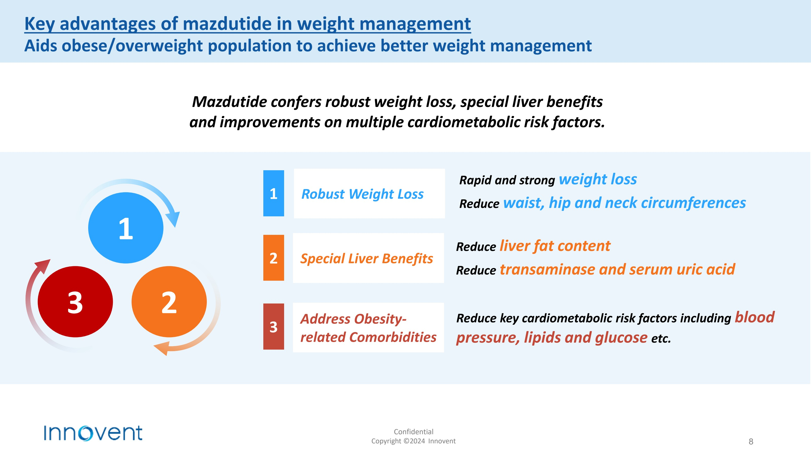

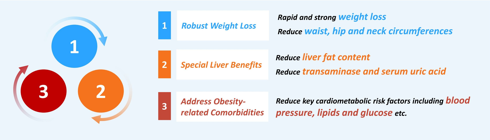

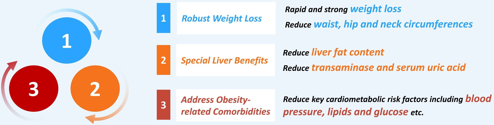

# <u>Mazdutide key mechanisms of action in weight management</u>

## Dual agonism of GLP-1R/GCGR induces robust weight loss and additional benefits

### GLP-1/GCG’s key mechanisms on weight loss (vs. GLP-1 and GLP-1/GIP)

**Stomach-Gut**
* GLP-1/GCG
* GLP-1
* GLP-1/GIP
Stomach-Gut illustration
↓Ghrelin Secretion
↓Gastric emptying

**Brain**
* GLP-1/GCG
* GLP-1
* GLP-1/GIP
Brain illustration
↓Food intake
↑Energy Expenditure

**Pancreas**
* GLP-1/GCG
* GLP-1
* GLP-1/GIP
Pancreas illustration
↑Insulin secretion

Weight Loss central graphic
**Weight Loss**

**Liver**
* GLP-1/GCG
Liver illustration
↓Hepatic lipogenesis
↑Fatty acid oxidation

**White adipose tissue**
* GLP-1/GCG
* GLP-1
* GLP-1/GIP
White adipose tissue illustration
↑Lipolysis

**Brown adipose tissue**
* GLP-1/GCG
Brown adipose tissue illustration
↑Themogenesis

* Mazdutide is an analogue of oxyntomodulin (OXM), a natural peptide hormone existing in humans that activates both GLP-1R and GCGR.

* Mazdutide can promote weight loss through various regulatory mechanisms across multiple organs (shown left).

* By additionally targeting GCGR in the liver and brown adipose tissues, mazdutide may offer metabolic benefits by enhancing energy expenditure and promoting lipolysis.

GLP-1= glucagon-like peptide-1, GIP= glucose-dependent insulin releasing peptide, GCG=glucagon, GLP-1R= glucagon-like peptide-1 receptor, GCGR=glucagon receptor

Innovent logo

Confidential
Copyright © 2024 Innovent

9

1. Conceição-Furber E, et al. Is glucagon receptor activation the thermogenic solution for treating obesity? Front Endocrinol (Lausanne) 2022;13:868037
2. Kleinert M, et al. Glucagon Regulation of Energy Expenditure. Int J Mol Sci. 2019 Oct 30;20(21):5407.
3. Sanyal, A.J., et al. Triple hormone receptor agonist retatrutide for metabolic dysfunction-associated steatotic liver disease: a randomized phase 2a trial. Nat Med (2024). https://doi.org/10.1038/s41591-024-03018-2
4. Hope DCD, Vincent ML, Tan TMM. Striking the Balance: GLP-1/Glucagon Co-Agonism as a Treatment Strategy for Obesity. Front Endocrinol (Lausanne). 2021 Sep 8;12:735019.
5. Pocai A. Action and therapeutic potential of oxyntomodulin. Mol Metab. 2014;3(3):241-251. doi:10.1016/j.molmet.2013.12.001
6. Habegger, Kirk M et al. Nature reviews. Endocrinology vol. 6,12 (2010): 689-97.

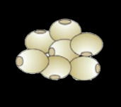

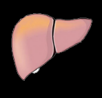

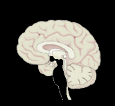

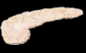

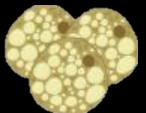

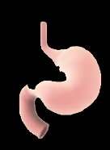

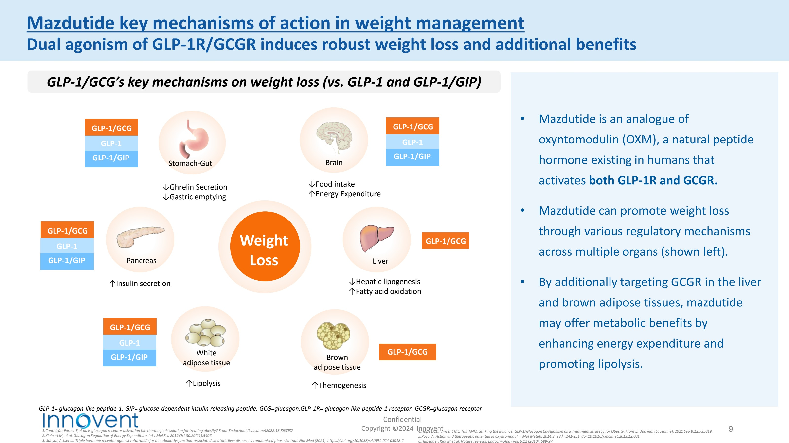

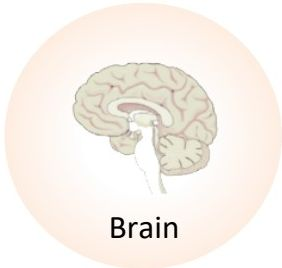

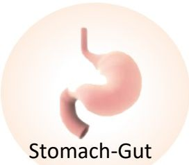

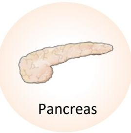

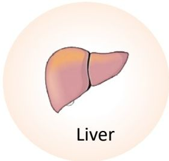

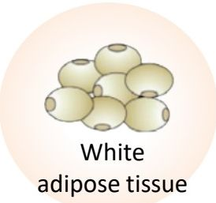

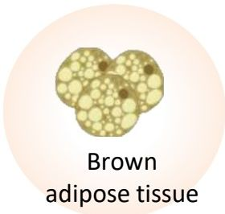

# <u>Mazdutide special liver benefits</u>

## Directly targets liver, which plays a central role in metabolic diseases

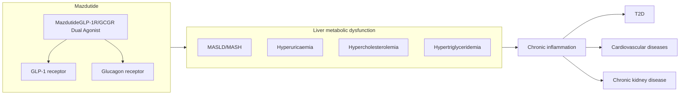
```mermaid
graph LR
    subgraph Mazdutide_Action [Mazdutide]
        M[MazdutideGLP-1R/GCGR Dual Agonist] --> GLP[GLP-1 receptor]
        M --> GCGR[Glucagon receptor]
    end

    subgraph Liver_Dysfunction [Liver metabolic dysfunction]
        L1[MASLD/MASH]
        L2[Hyperuricaemia]
        L3[Hypercholesterolemia]
        L4[Hypertriglyceridemia]
    end

    Mazdutide_Action --> Liver_Dysfunction
    Liver_Dysfunction --> CI[Chronic inflammation]

    CI --> T2D[T2D]
    CI --> CVD[Cardiovascular diseases]
    CI --> CKD[Chronic kidney disease]
```

Liver plays a central role in human metabolism. Its dysfunction can lead to chronic inflammation, which underlies the pathogenesis of various metabolic diseases such as **T2D**, **cardiovascular diseases**, **chronic kidney diseases**.

MASLD=metabolic dysfunction-associated steatotic liver disease; MASH=metabolic dysfunction-associated steatohepatitis； T2D= type 2 diabetes

innovent logo

Confidential
Copyright © 2024 Innovent

10

1. GehrkeN, Schattenberg JM. Metabolic Inflammation-A Role for Hepatic Inflammatory Pathways as Drivers of Comorbidities in Nonalcoholic Fatty Liver Disease? Gastroenterology. 2020 May;158(7):1929-1947.e6. doi: 10.1053/j.gastro.2020.02.020. Epub 2020 Feb 15. PMID: 32068022.
2. Sanyal, A.J.,etal. Triple hormone receptor agonist retatrutide for metabolic dysfunction-associated steatoticliver disease: a randomized phase 2a trial. Nat Med (2024). https://doi.org/10.1038/s41591-024-03018-2

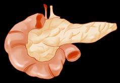

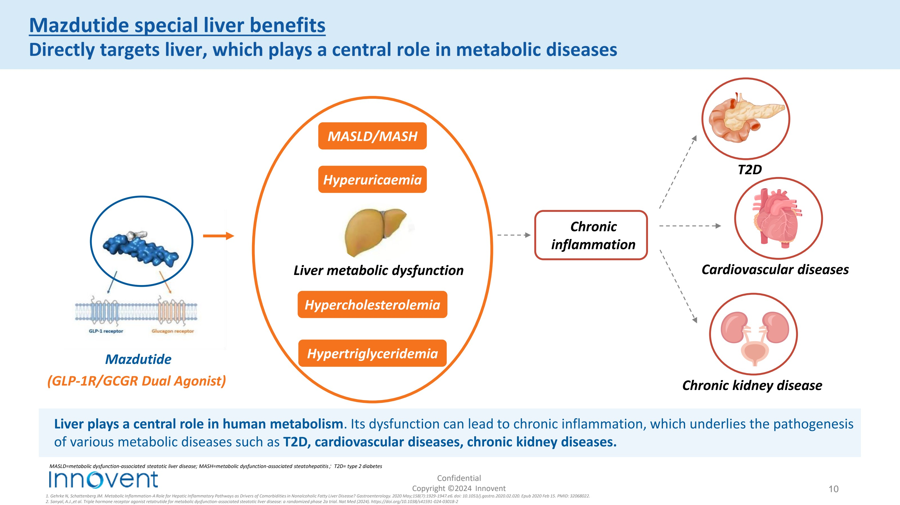

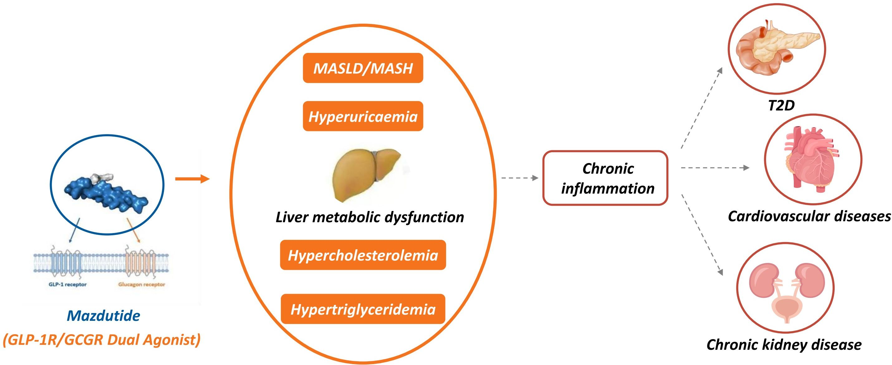

# <u>Mazdutide special liver benefits</u>

## Improves liver metabolism and reduces factors of liver metabolic dysfunction

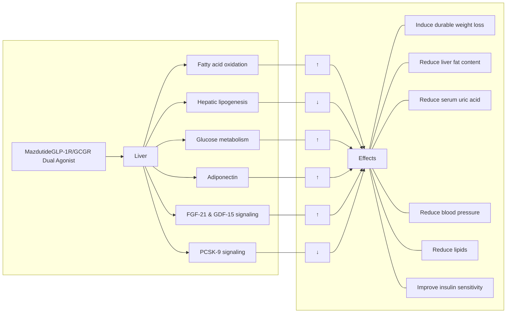
```mermaid
graph LR
    subgraph Mechanism [" "]
        M[MazdutideGLP-1R/GCGR Dual Agonist] --> L[Liver]
        L --> FAO[Fatty acid oxidation]
        L --> HL[Hepatic lipogenesis]
        L --> GM[Glucose metabolism]
        L --> AD[Adiponectin]
        L --> FGF[FGF-21 & GDF-15 signaling]
        L --> PCSK[PCSK-9 signaling]
    end

    subgraph Outcomes [" "]
        FAO --- UP1[↑]
        HL --- DOWN1[↓]
        GM --- UP2[↑]
        AD --- UP3[↑]
        FGF --- UP4[↑]
        PCSK --- DOWN2[↓]
        
        UP1 & DOWN1 & UP2 & UP3 & UP4 & DOWN2 --> Effects
        
        Effects --- WL[Induce durable weight loss]
        Effects --- LFC[Reduce liver fat content]
        Effects --- SUA[Reduce serum uric acid]
        Effects --- BP[Reduce blood pressure]
        Effects --- RL[Reduce lipids]
        Effects --- IS[Improve insulin sensitivity]
    end
```

Illustration of Mazdutide molecule and GLP-1/Glucagon receptors

**Mazdutide**
**(GLP-1R/GCGR Dual Agonist)**

Icon of a scale

Induce durable weight loss

Icon of a liver

Reduce liver fat content

Icon of uric acid crystals

Reduce serum uric acid

Icon of a blood pressure cuff

Reduce blood pressure

Icon of a lipid droplet

Reduce lipids

Icon of a pancreas

Improve insulin sensitivity

FGF-21=Fibroblast growth factor 21; GDF-15=Growth differentiation factor 15; PCSK-9=Proprotein convertase subtilisin/kexin type 9 serine protease.

Innovent logo

Confidential
Copyright © 2024 Innovent

11

1. Pocai A. Action and therapeutic potential of oxyntomodulin. Mol Metab. 2014;3 (3) :241-251. doi:10.1016/j.molmet.2013.12.001
2. Habegger, Kirk M et al. Nature reviews. Endocrinology vol. 6,12 (2010): 689-97.
3. Yanyun Chen, et al. Diabetes 2021;70(Supplement_1):682-P. <u>https://doi.org/10.2337/db21-682-P</u>

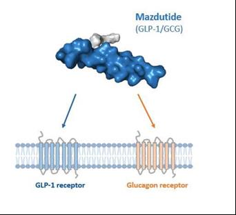

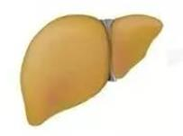

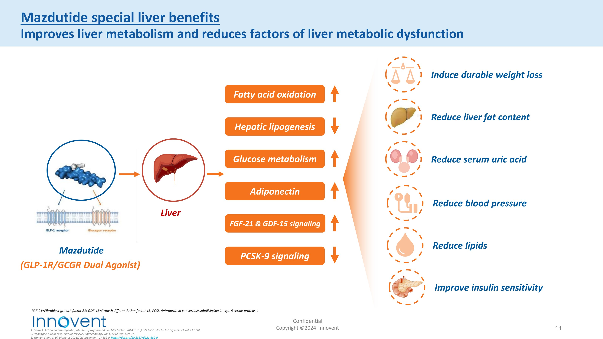

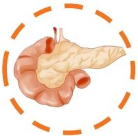

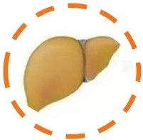

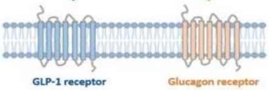

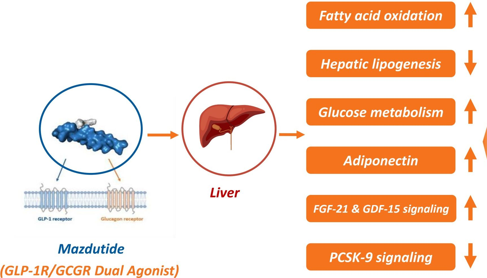

# GLORY-1 Phase 3 Results and Insights

**Dr. Lei Qian** *Vice President of General Biomedicine Development*

Innovent logo

page number 12

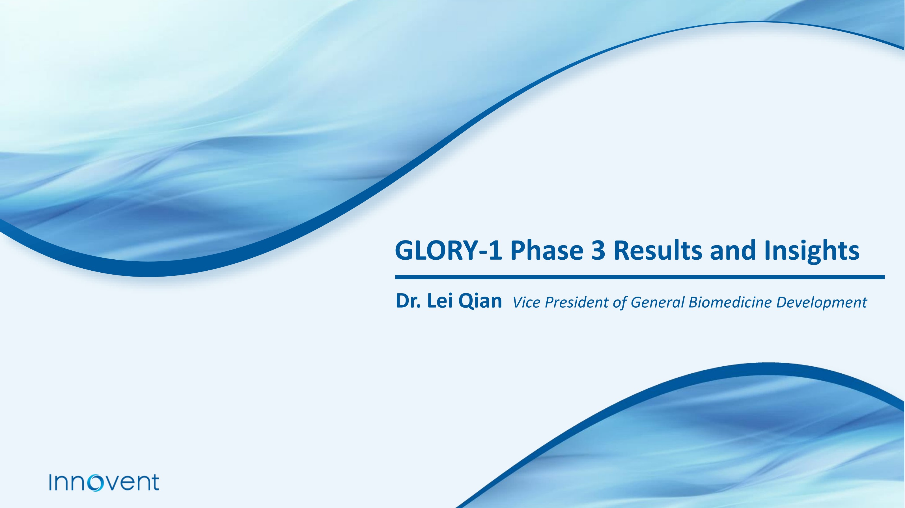

# <u>Mazdutide development programs</u>

## GLORY-1: the first and successful Phase 3 study of GLP-1/GCG dual target in weight management

### Mazdutide Development Programs and Publications

| Indications                                    | Trial          | Ph3 | NDA              | Approval    |
| ---------------------------------------------- | -------------- | --- | ---------------- | ----------- |
| **Weight Management**                          |                |     |                  |             |
| **Obesity/overweight** 4mg/6mg vs. placebo | GLORY-1 (Ph3)  |     | \[x] 2024.02 | 1H 2025 |
| **Obesity** 9mg vs. placebo                | GLORY-2 (Ph3)  |     |                  |             |
| **Obesity** Adolescent                     | Ph1 in plan    |     |                  |             |
| **Type 2 Diabetes**                            |                |     |                  |             |
| **T2D 4mg/6mg** vs. placebo                | DREAMS-1 (Ph3) |     | 2024             | 2025        |
| **T2D 4mg/6mg** vs. dulaglutide            | DREAMS-2 (Ph3) |     | 2024             | 2025        |
| **T2D 6mg** vs. semaglutide                | DREAMS-3 (Ph3) |     |                  |             |
| **Others**                                     |                |     |                  |             |
| MASH                                           | IND approved   |     |                  |             |

| eClinicalMedicine logo                                                                    | **2021.09** Phase 1b in obesity or overweight         |
| ----------------------------------------------------------------------------------------- | --------------------------------------------------------- |
| nature COMMUNICATIONS logo                                                                | **2022.06** Phase 1b in T2D                           |
| eClinicalMedicine logo                                                                    | **2022.10** Phase 1b (higher dose) in obesity         |
| American Diabetes Association 83rd Scientific Sessions logo 83rd Scientific Sessions logo | **2023.06** Preclinical research                      |
| Diabetes Care American Diabetes Association logo                                          | **2023.11** Phase 2 in T2D                            |
| nature COMMUNICATIONS logo                                                                | **2023.12** Phase 2 in obesity                        |
| American Diabetes Association 84th Scientific Sessions logo                               | **2024.06** **GLORY-1 Ph3 &** **9mg Obesity Ph2** |

Innovent logo

Confidential
Copyright© 2024 Innovent

13

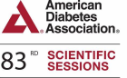

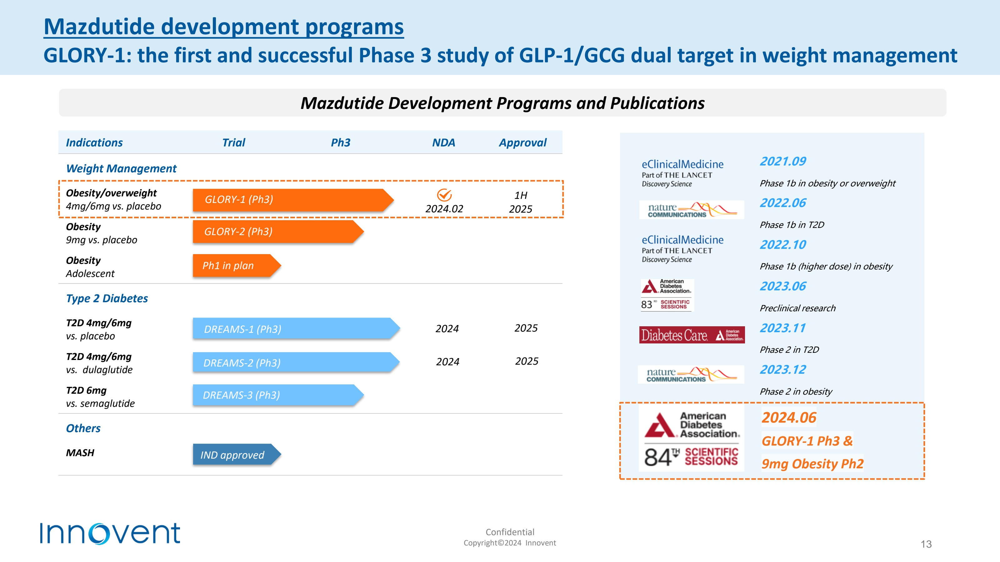

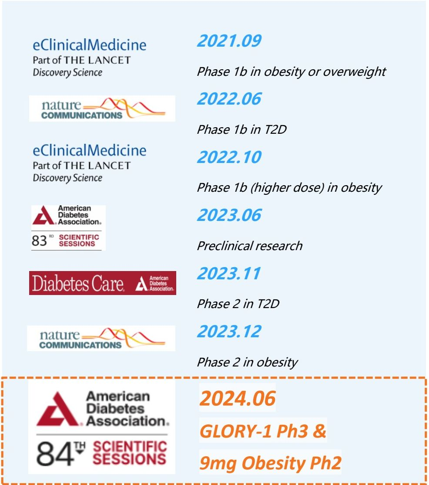

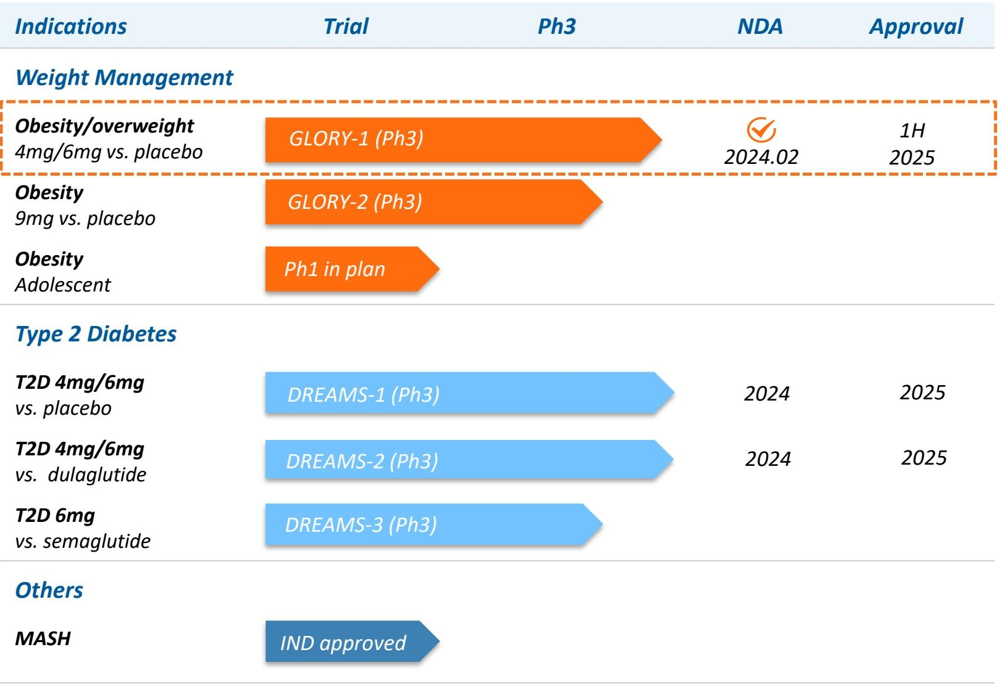

# <u>GLORY-1: trial design and baseline characteristics</u>
## Evaluating weight loss efficacy and safety in Chinese adults with obesity/overweight

**ClinicalTrials.gov ID**: NCT05607680

**Inclusion criteria**: BMI ≥28 kg/m² or BMI ≥24 kg/m² plus ≥1 weight-related comorbidity. Excluding diabetes.

**Dose regimen**

Dose regimen diagram showing three arms: Mazdutide 4mg (titrated from 2mg), Mazdutide 6mg (titrated from 2mg and 4mg), and Placebo. Screening starts at week -2, randomization 1:1:1 at week 0, primary endpoint at week 32, end of treatment at week 48, and follow-up until week 60.

**Baseline (N=610)**
Baseline characteristics were essentially balanced across treatment groups

| ≥1 Weight-related Comorbidities | Mean Age | Mean Weight | Mean BMI   | Mean Waist Circumference | Mean Height | Sex, Male |
| ------------------------------- | -------- | ----------- | ---------- | ------------------------ | ----------- | --------- |
| 89%                             | 34 yrs   | 87.2 kg     | 31.1 kg/m² | 101.5 cm                 | 167 cm      | 49%       |

63.6% participants have ≥2 weight-related comorbidities, and 35.6% participants have ≥ 3 weight-related comorbidities.

Weight-related comorbidities include dyslipidemia, fatty liver, hyperuricemia, hypertension, abnormal liver function, prediabetes, kidney disease, and weight-bearing joint pain.

Innovent logo

Confidential
Copyright © 2024 Innovent

14

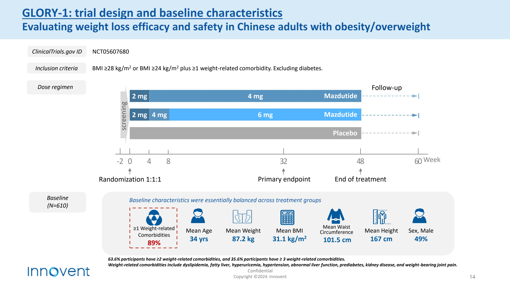

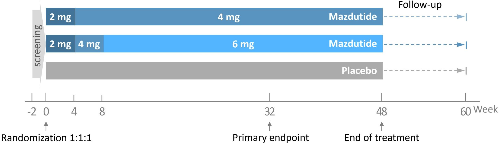

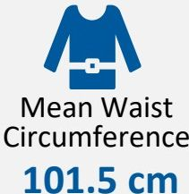

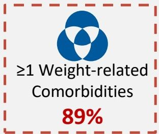

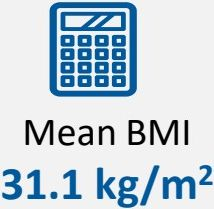

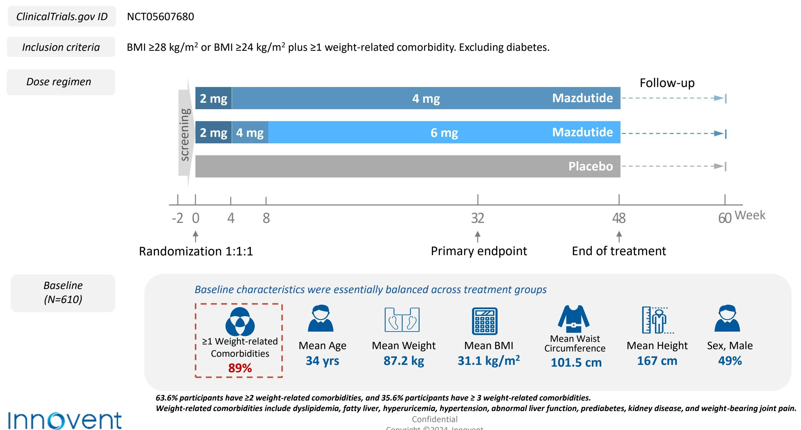

# <u>GLORY-1: 48-week treatment results summary</u>

## A safe medication that brings robust weight loss and reduces cardiometabolic risk factors

| 1 Robust Weight Loss            | 2 Liver-related Metabolic Benefits | 3 Address Obesity-related Comorbidities | 4 Safe and Convenient Dosage                                                        |
| ------------------------------- | ---------------------------------- | --------------------------------------- | ----------------------------------------------------------------------------------- |
| -14.3% Weight Loss¹         | -80.2% Liver fat content²      | -31.5% Triglycerides                | 2-4-6mg 2 steps Simplified titration                                            |
| -10.7cm Waist circumference | -26.9% ALT                     | -9.9mmHg Systolic blood pressure    | 5.9% (4mg) 4.0% (6mg) 6.3% (Placebo) Serious TEAE                               |
|                                 | -12.9% Serum uric acid         | -7.1% LDL cholesterol               | 1.5% (4mg) 0.5% (6mg) 1.0% (Placebo) TEAEs leading to treatment discontinuation |
|                                 |                                    | 85% HbA1c normalization³            |                                                                                     |
|                                 |                                    | -6.8% Total cholesterol             |                                                                                     |

All above efficacy endpoints are 48-week results of mazdutide 6mg group (treatment-policy estimand), more data presented at 2024 ADA (1856-LB) and will be published at peer-reviewed academic journals
1. Placebo-adjusted mean body weigh percentage change from baseline; 2. Evaluated in participants with baseline LFC ≥ 10% ; 3. Evaluated in participants with baseline A1c ≥ 5.7%

Innovent logo

Confidential
Copyright © 2024 Innovent

15

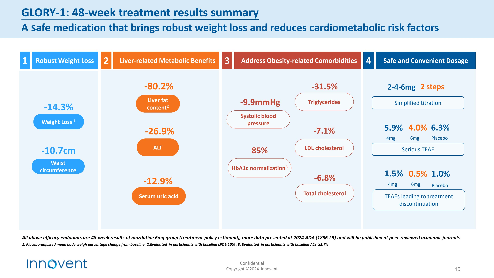

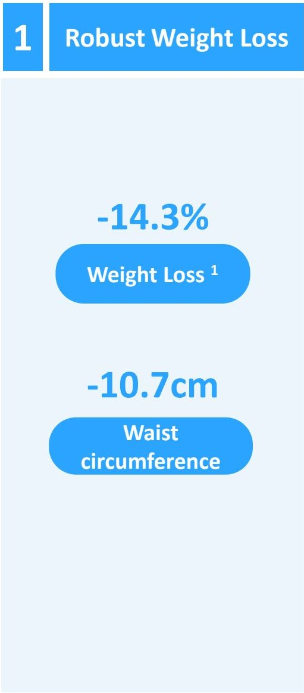

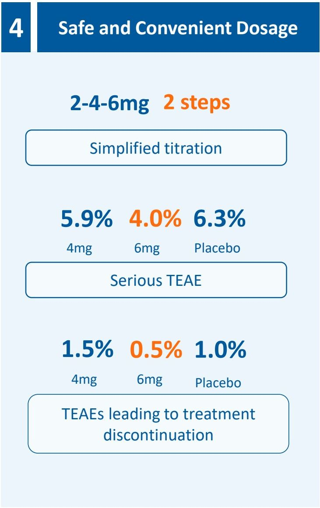

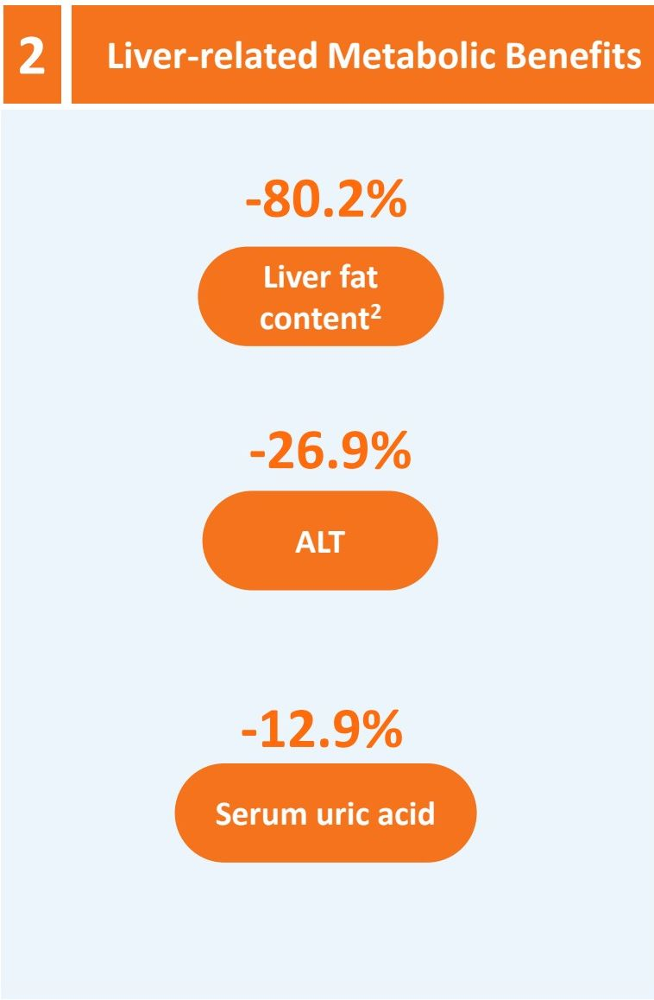

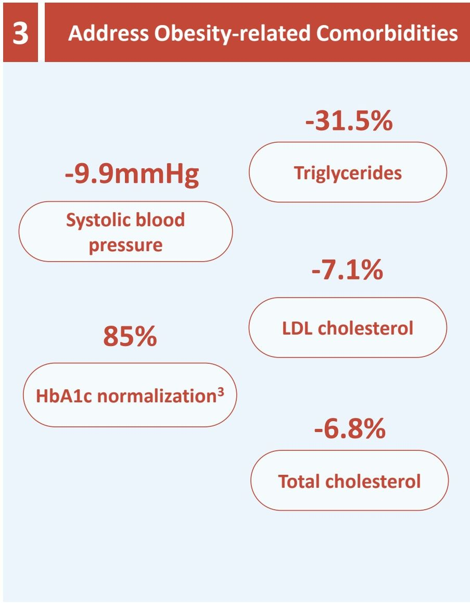

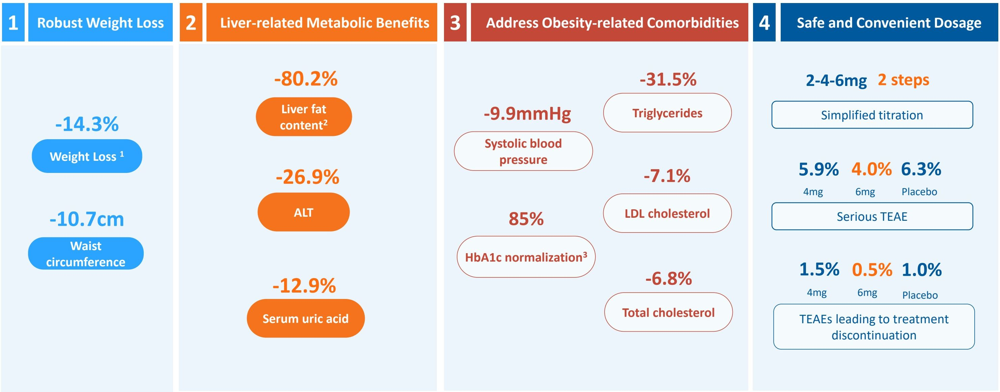

1

# <u>GLORY-1: weight loss efficacy</u>

## Robust weight-loss efficacy achieved in mazdutide treatment groups

### Placebo-adjusted mean body weight percentage change from baseline at week 48

| mazdutide 4 mg Week 32 | mazdutide 4 mg Week 48 | mazdutide 6 mg Week 32 | mazdutide 6 mg Week 48 |
| -------------------------- | -------------------------- | -------------------------- | -------------------------- |
| -10.5%                     | -11.3%                     | -13.0%                     | -14.3%                     |

\*Baseline mean weight 87.2kg

**Robust and durable weight reduction with simple regimen**

* Placebo-adjusted mean body weight reduction of -14.3% in mazdutide 6mg after 48-week treatment.

* Mazdutide has induced robust and durable weight-loss effect with its simple and tolerable two-step titration regimen.

\*The treatment-policy estimand results

Innovent logo

Confidential
Copyright © 2024 Innovent

16

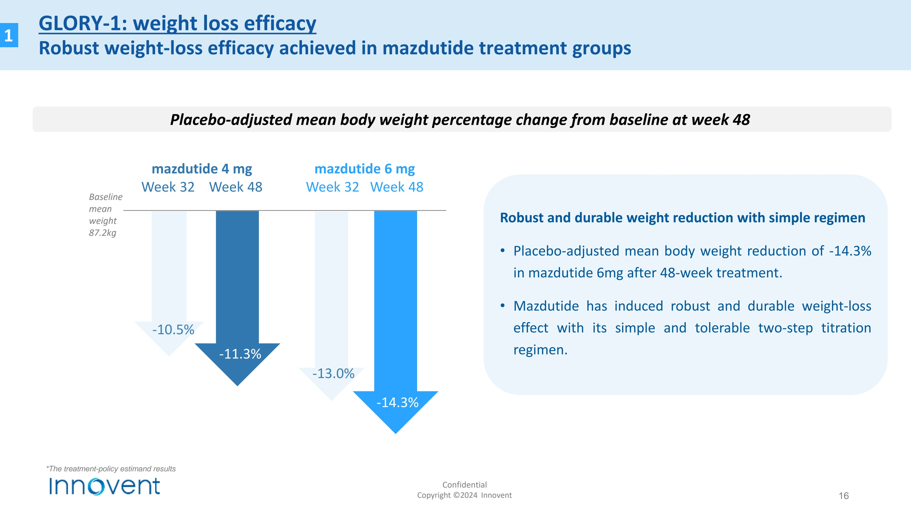

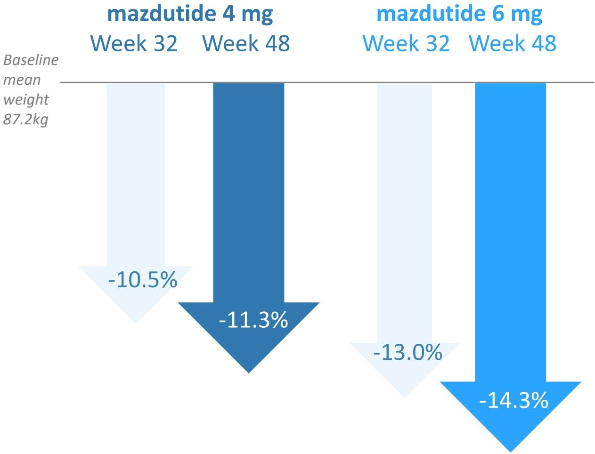

1

# <u>GLORY-1: weight loss efficacy</u>

## Half of participants receiving mazdutide 6mg achieved ≥15% weight loss

**Proportion of participants achieved ≥ 5%/10%/15% weight loss from baseline at 48 weeks**

| Weight Loss Threshold | mazdutide 4mg | mazdutide 6mg | placebo |
| --------------------- | ------------- | ------------- | ------- |
| ≥5%                   | 71.6          | 81.6          | 10.8    |
| ≥10%                  | 53.5          | 66.7          | 2.6     |
| ≥15%                  | 35.7          | 49.5          | 2.0     |

* At week 48, 81.6% and 71.6% of the participants in the mazdutide 4 mg and 6 mg group achieved 5% or more weight loss from baseline;
* 49.5% participants achieved ≥15% weight loss in mazdutide 6 mg group after 48 weeks of treatment.

\*The treatment-policy estimand results
Innovent logo

Confidential
Copyright @2024 Innovent

17

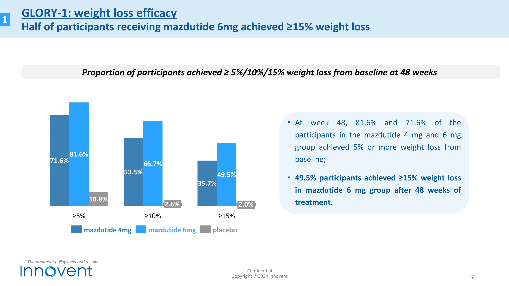

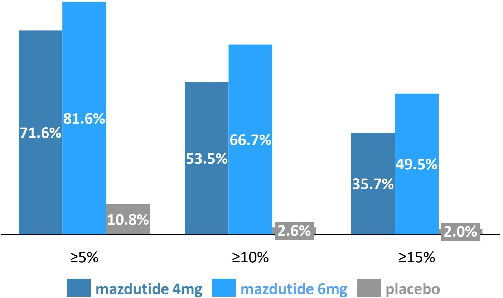

1

# <u>GLORY-1: weight loss efficacy</u>

## Mazdutide demonstrated robust weight reduction across dose levels

### Summary of placebo-adjusted mean body weight reduction (%)

| Efficacy estimand\* Clinical trial Mean BMI (kg/m²) Mean Weight (kg) Target Drug & Dose | Efficacy estimand\* STEP-7 34.0 96.4 GLP-1 Semaglutide2.4mg | Efficacy estimand\* SURMONT-CN 32.3 91.8 GLP-1/GIP Tirzepatide10mg | Efficacy estimand\* SURMONT-CN 32.3 91.8 GLP-1/GIP Tirzepatide15mg | Efficacy estimand\* Phase 2 37.6 105.9 GLP-1/GCG Survodutide4.8mg | Efficacy estimand\* GLORY-1 31.0 87.9 GLP-1/GCG Mazdutide4mg | Efficacy estimand\* GLORY-1 31.3 87.2 GLP-1/GCG Mazdutide6mg | Efficacy estimand\* Phase 2 34.3 96.9 GLP-1/GCG Mazdutide9mg |
| ----------------------------------------------------------------------------------------------------------- | ------------------------------------------------------------------------------- | -------------------------------------------------------------------------------------- | -------------------------------------------------------------------------------------- | ------------------------------------------------------------------------------------- | -------------------------------------------------------------------------------- | -------------------------------------------------------------------------------- | -------------------------------------------------------------------------------- |
| Weight reduction (%)                                                                                        | -9.9                                                                            | -11.5                                                                                  | -17.4                                                                                  | -12.1                                                                                 | -11.6                                                                            | -14.4                                                                            | -18.6                                                                            |
| Duration (weeks)                                                                                            | 44w                                                                             | 52w                                                                                    | 52w                                                                                    | 46w                                                                                   | 48w                                                                              | 48w                                                                              | 48w                                                                              |

| Treatment-policy estimand† Clinical trial Mean BMI (kg/m²) Mean Weight (kg) Target Drug & Dose | Treatment-policy estimand† STEP-7 34.0 96.4 GLP-1 Semaglutide2.4mg | Treatment-policy estimand† SURMONT-CN 32.3 91.8 GLP-1/GIP Tirzepatide10mg | Treatment-policy estimand† SURMONT-CN 32.3 91.8 GLP-1/GIP Tirzepatide15mg | Treatment-policy estimand† GLORY-1 31.0 87.9 GLP-1/GCG Mazdutide4mg | Treatment-policy estimand† GLORY-1 31.3 87.2 GLP-1/GCG Mazdutide6mg |
| ------------------------------------------------------------------------------------------------------------------ | -------------------------------------------------------------------------------------- | --------------------------------------------------------------------------------------------- | --------------------------------------------------------------------------------------------- | --------------------------------------------------------------------------------------- | --------------------------------------------------------------------------------------- |
| Weight reduction (%)                                                                                               | -8.5                                                                                   | -11.3                                                                                         | -15.1                                                                                         | -11.3                                                                                   | -14.3                                                                                   |
| Duration (weeks)                                                                                                   | 44w                                                                                    | 52w                                                                                           | 52w                                                                                           | 48w                                                                                     | 48w                                                                                     |

\* The efficacy estimand represents the average treatment effect of mazdutide relative to placebo had participants remained on their randomized treatment for the entire planned 48 weeks treatment duration. Missing data were implicitly handled by using a mixed model for repeated measures (MMRM) under the assumption of missing at random.
† The treatment policy estimand represents the average treatment effect of mazdutide relative to placebo regardless of the adherence to treatment. For analyses related to the treatment-regimen estimand, analysis of covariance (ANCOVA) was used for continuous endpoints and logistic regression was used for binary endpoints.

Innovent logo

Confidential
Copyright @2024 Innovent

18

48-week weight loss data of tirzepatide 10/15 mg were estimated from published results of SURMOUNT-CN1; semaglutide 2.4mg(CN) were published results of the STEP-7 study2; survodutide 4.8mg were published results of a Phase 2 trial3
1 Zhao L, Cheng Z, et al. JAMA. Published online May 31, 2024. doi:10.1001/jama.2024.9217
2 Prof Yiming Mu, MD, et al. The Lancet Diabetes & Endocrinology. Published online February 05, 2024. doi:10.1016/S2213-8587(23)00388-1
3 Prof Carel W le Roux, MD, et al. The Lancet Diabetes & Endocrinology. Published online February 05, 2024. doi: 10.1016/S2213-8587(23)00356-X

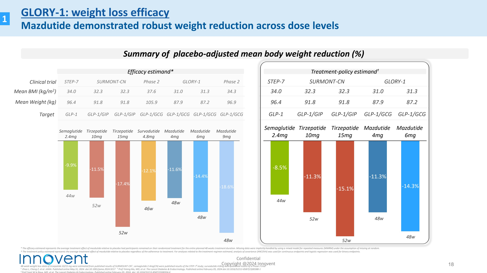

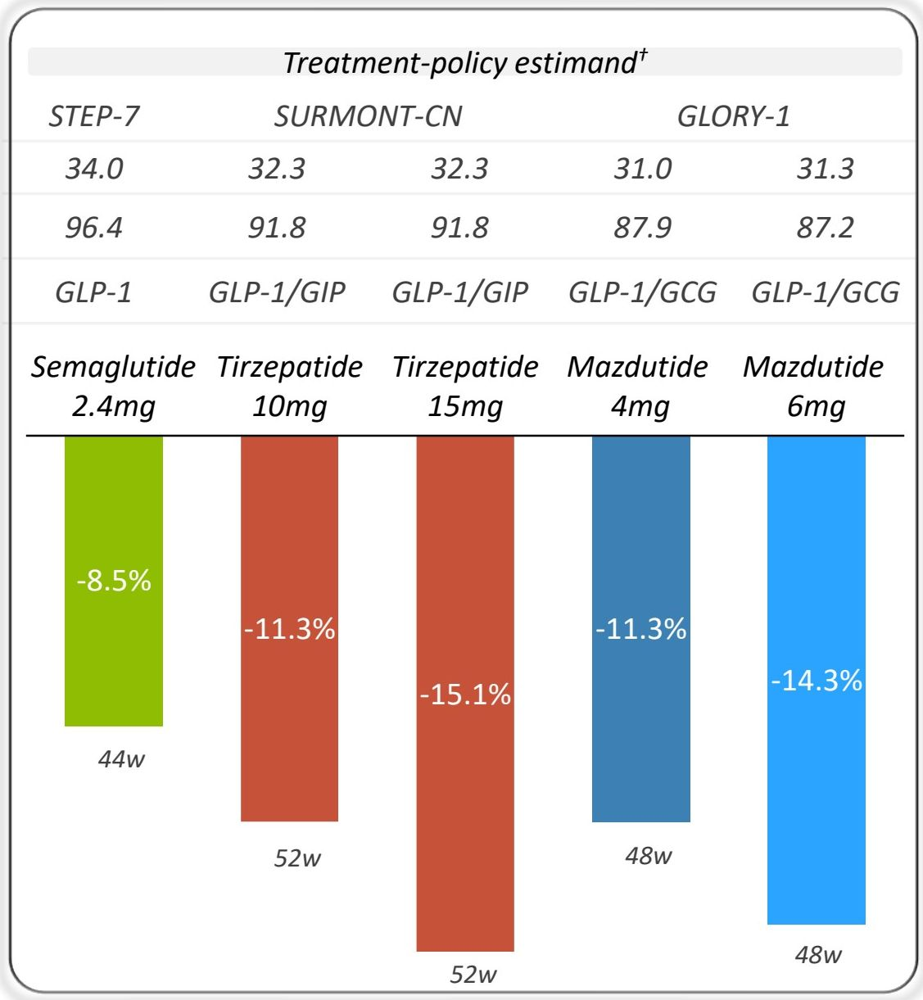

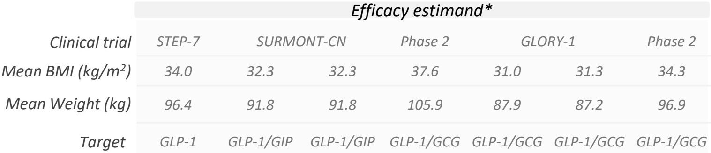

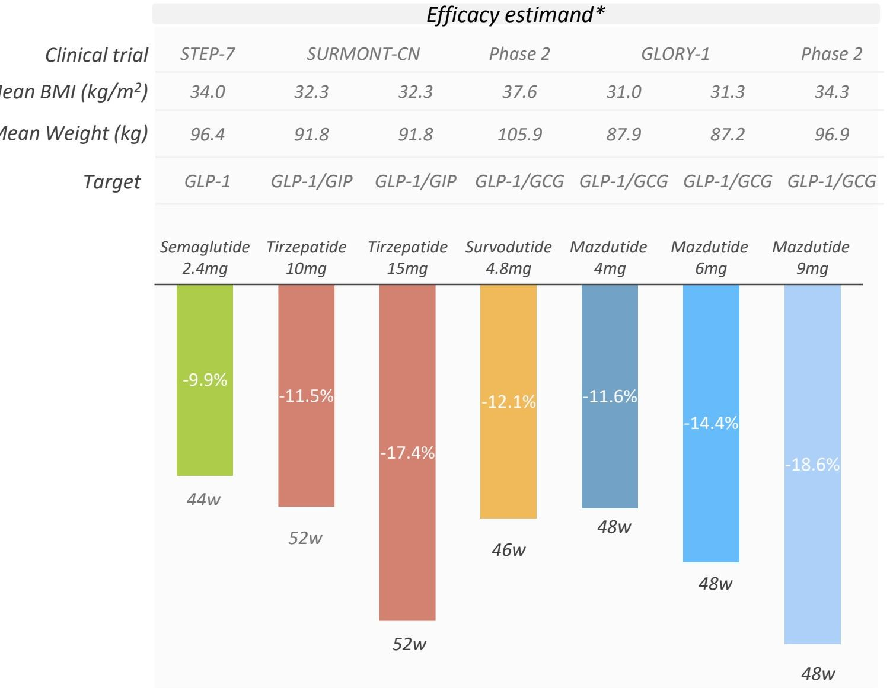

1

<u>GLORY-1: weight loss efficacy</u>

# Significantly reduced waist, hip and neck circumferences, indicating body fat reduction

## Significant reductions in waist/hip/neck circumferences at week 48

Waist circumference
mean change from baseline (cm)
*Baseline 101.47cm*

| mazdutide 4 mg | mazdutide 6 mg | placebo |
| -------------- | -------------- | ------- |
| -9.1           | -10.7          | -1.4    |

Hip circumference
mean change from baseline (cm)
*Baseline 107.65 cm*

| mazdutide 4 mg | mazdutide 6 mg | placebo |
| -------------- | -------------- | ------- |
| -7.0           | -8.6           | -1.1    |

Neck circumference
mean change from baseline (cm)
*Baseline 39.41 cm*

| mazdutide 4 mg | mazdutide 6 mg | placebo |
| -------------- | -------------- | ------- |
| -2.0           | -2.4           | -0.4    |

\*The treatment policy-estimand results

mazdutide 4 mg legend icon mazdutide 4 mg

mazdutide 6 mg legend icon mazdutide 6 mg

placebo legend icon placebo

Innovent logo

Confidential
Copyright @2024 Innovent

19

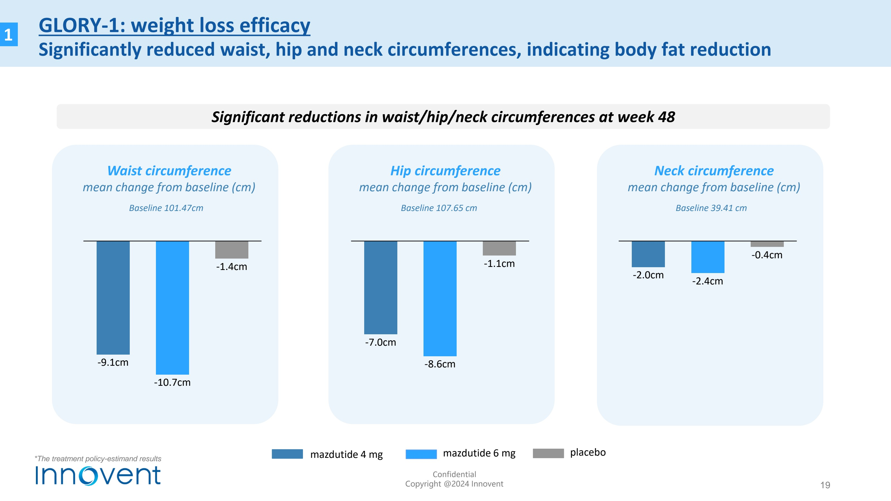

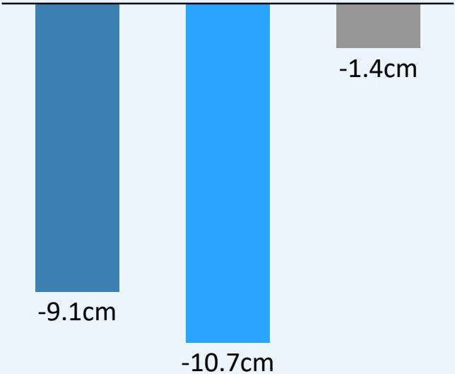

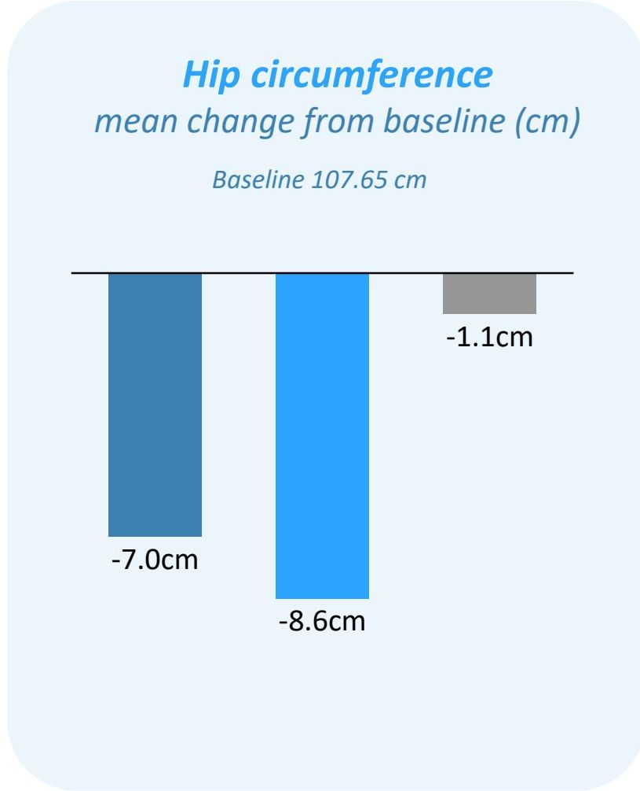

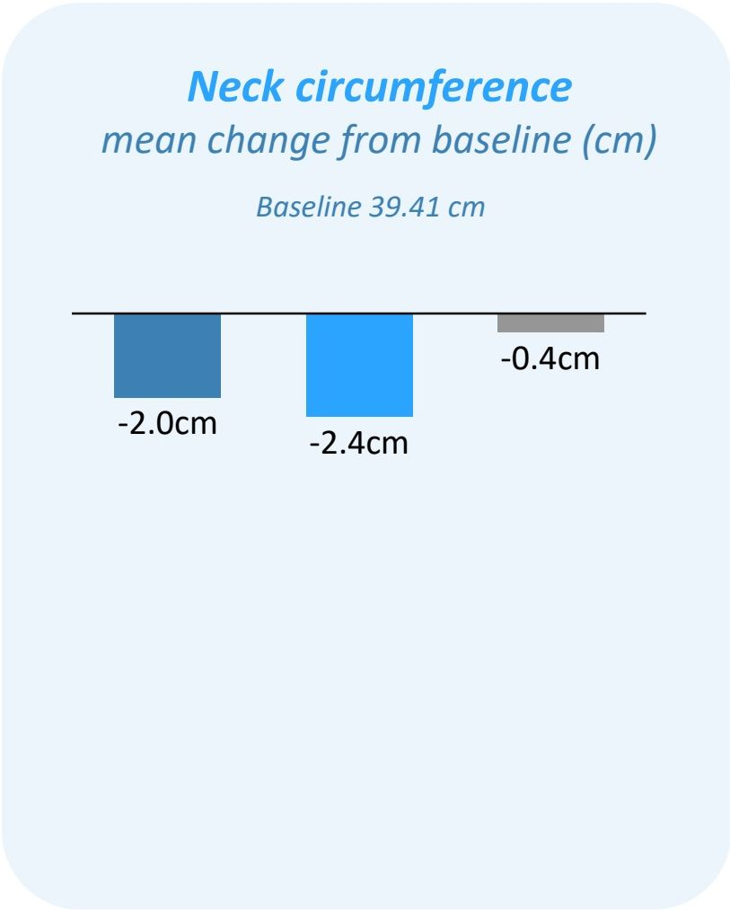

2 <u>GLORY-1: liver-related benefits</u>

# Substantially reduced liver fat content in participants with hepatic steatosis

## Liver fat content (LFC) at baseline and week 48 by MRI-PDFF

### In participants with baseline LFC ≥ 5%*

*Histologic fat fraction ≥ 5% as the reference standard for diagnosing hepatic steatosis\*\**

| Group          | Participant | Baseline LFC (%) | Week 48 LFC (%) |
| -------------- | ----------- | ---------------- | --------------- |
| Mazdutide 4 mg | 1           | 26               | 16              |
| Mazdutide 4 mg | 2           | 24               | 6               |
| Mazdutide 4 mg | 3           | 23               | 2               |
| Mazdutide 4 mg | 4           | 21               | 6               |
| Mazdutide 4 mg | 5           | 20               | 5               |
| Mazdutide 4 mg | 6           | 19               | 2               |
| Mazdutide 4 mg | 7           | 17               | 5               |
| Mazdutide 4 mg | 8           | 17               | 2               |
| Mazdutide 4 mg | 9           | 16               | 3               |
| Mazdutide 4 mg | 10          | 15               | 2               |
| Mazdutide 4 mg | 11          | 14               | 3               |
| Mazdutide 4 mg | 12          | 14               | 2               |
| Mazdutide 4 mg | 13          | 13               | 3               |
| Mazdutide 4 mg | 14          | 12               | 7               |
| Mazdutide 4 mg | 15          | 12               | 2               |
| Mazdutide 4 mg | 16          | 9                | 3               |
| Mazdutide 4 mg | 17          | 8                | 4               |
| Mazdutide 4 mg | 18          | 8                | 2               |
| Mazdutide 4 mg | 19          | 7                | 4               |
| Mazdutide 4 mg | 20          | 7                | 2               |
| Mazdutide 4 mg | 21          | 6                | 4               |
| Mazdutide 4 mg | 22          | 6                | 2               |
| Mazdutide 4 mg | 23          | 5                | 2               |
| Mazdutide 4 mg | 24          | 5                | 2               |
| Mazdutide 4 mg | 25          | 5                | 1               |
| Mazdutide 6 mg | 1           | 38               | 8               |
| Mazdutide 6 mg | 2           | 34               | 3               |
| Mazdutide 6 mg | 3           | 32               | 1               |
| Mazdutide 6 mg | 4           | 30               | 3               |
| Mazdutide 6 mg | 5           | 28               | 2               |
| Mazdutide 6 mg | 6           | 27               | 3               |
| Mazdutide 6 mg | 7           | 26               | 1               |
| Mazdutide 6 mg | 8           | 25               | 2               |
| Mazdutide 6 mg | 9           | 23               | 6               |
| Mazdutide 6 mg | 10          | 17               | 3               |
| Mazdutide 6 mg | 11          | 17               | 1               |
| Mazdutide 6 mg | 12          | 15               | 5               |
| Mazdutide 6 mg | 13          | 15               | 2               |
| Mazdutide 6 mg | 14          | 14               | 7               |
| Mazdutide 6 mg | 15          | 14               | 2               |
| Mazdutide 6 mg | 16          | 13               | 5               |
| Mazdutide 6 mg | 17          | 11               | 10              |
| Mazdutide 6 mg | 18          | 10               | 5               |
| Mazdutide 6 mg | 19          | 10               | 2               |
| Mazdutide 6 mg | 20          | 8                | 3               |
| Mazdutide 6 mg | 21          | 8                | 1               |
| Mazdutide 6 mg | 22          | 7                | 2               |
| Placebo        | 1           | 44               | 34              |
| Placebo        | 2           | 29               | 14              |
| Placebo        | 3           | 26               | 22              |
| Placebo        | 4           | 25               | 24              |
| Placebo        | 5           | 24               | 23              |
| Placebo        | 6           | 23               | 15              |
| Placebo        | 7           | 22               | 14              |
| Placebo        | 8           | 21               | 14              |
| Placebo        | 9           | 17               | 12              |
| Placebo        | 10          | 15               | 15              |
| Placebo        | 11          | 14               | 13              |
| Placebo        | 12          | 20               | 12              |
| Placebo        | 13          | 13               | 6               |
| Placebo        | 14          | 11               | 11              |
| Placebo        | 15          | 10               | 13              |
| Placebo        | 16          | 10               | 11              |
| Placebo        | 17          | 11               | 20              |
| Placebo        | 18          | 11               | 11              |
| Placebo        | 19          | 23               | 13              |
| Placebo        | 20          | 16               | 3               |
| Placebo        | 21          | 9                | 8               |
| Placebo        | 22          | 10               | 5               |
| Placebo        | 23          | 6                | 5               |
| Placebo        | 24          | 7                | 6               |

\*A total of 69 participants (25 with mazdutide 4 mg, 22 with mazdutide 6 mg and 22 with placebo) had LFC ≥5% at baseline and week 48 LFC assessment, and were included in this exploratory analysis of GLORY-1.

Innovent logo

Confidential
Copyright @2024 Innovent

20

\*\*Rinella ME, Neuschwander-Tetri BA, Siddiqui MS, Abdelmalek MF, Caldwell S, Barb D, Kleiner DE, Loomba R. AASLD Practice Guidance on the clinical assessment and management of nonalcoholic fatty liver disease. Hepatology. 2023 May 1;77(5):1797-1835.

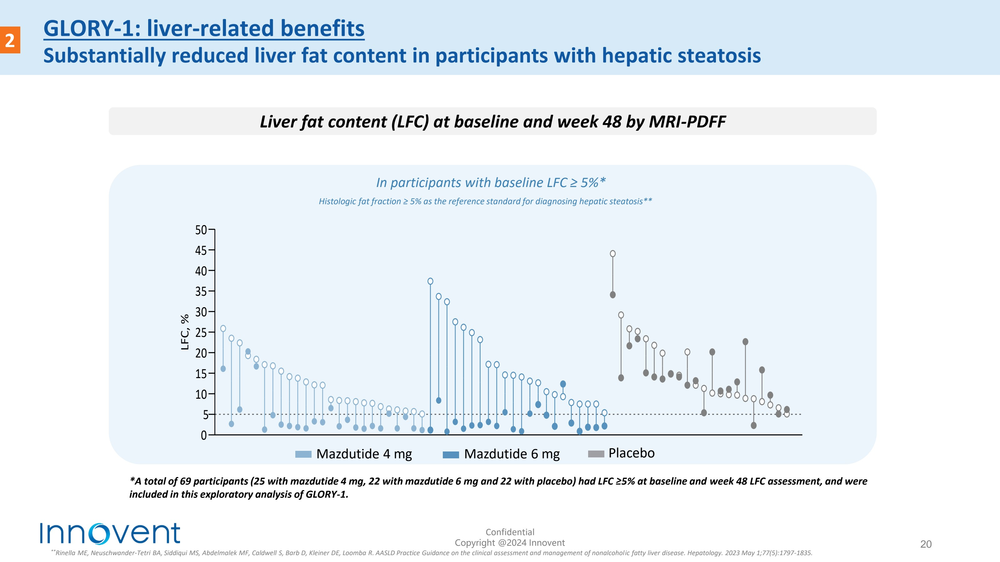

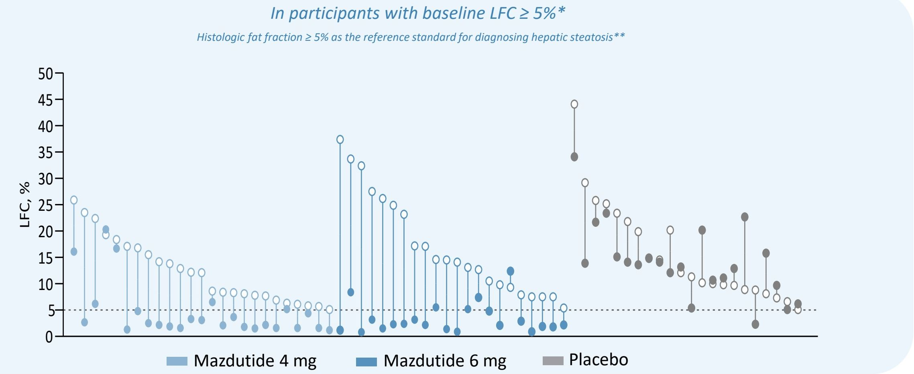

2

# <u>GLORY-1: liver-related benefits</u>

## 77.3% participants with mazdutide achieved normalization of LFC ( < 5%)

***Proportion of participants achieved ≥ 30%/50% LFC relative reduction or LFC <5% at week 48***

| Category                       | mazdutide 4mg (%) | mazdutide 6mg (%) | placebo (%) |
| ------------------------------ | ----------------- | ----------------- | ----------- |
| ≥30% relative reduction in LFC | 80.0              | 95.5              | 27.3        |
| ≥50% relative reduction in LFC | 76.0              | 90.0              | 13.6        |
| LFC<5%                         | 76.0              | 77.3              | 4.5         |

* In participants with baseline LFC ≥5%, compared to placebo, substantially more participants with mazdutide 4 mg or 6 mg treatment for 48 weeks achieved clinically meaningful LFC reduction.

* At week 48, normalization of LFC was achieved by 76.0% and 77.3% with mazdutide 4mg and 6mg while only 4.5% with placebo.

Innovent logo

Confidential
Copyright @2024 Innovent

21

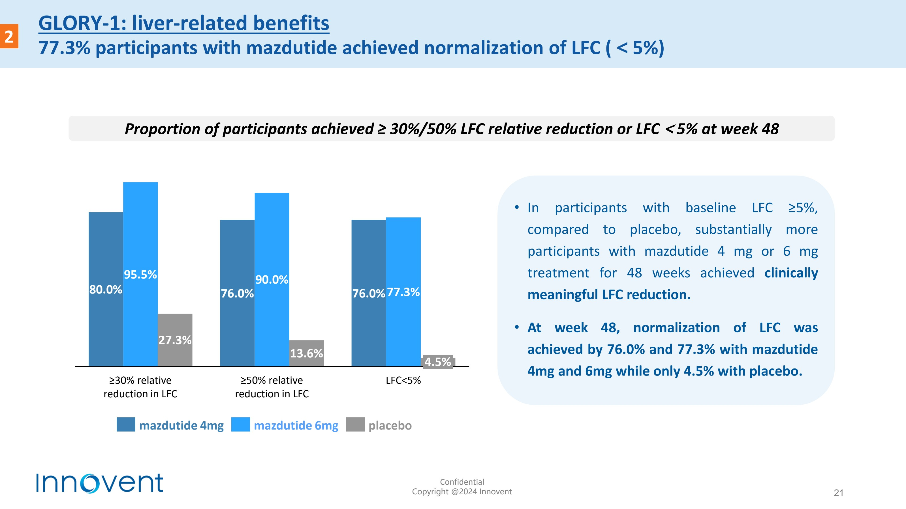

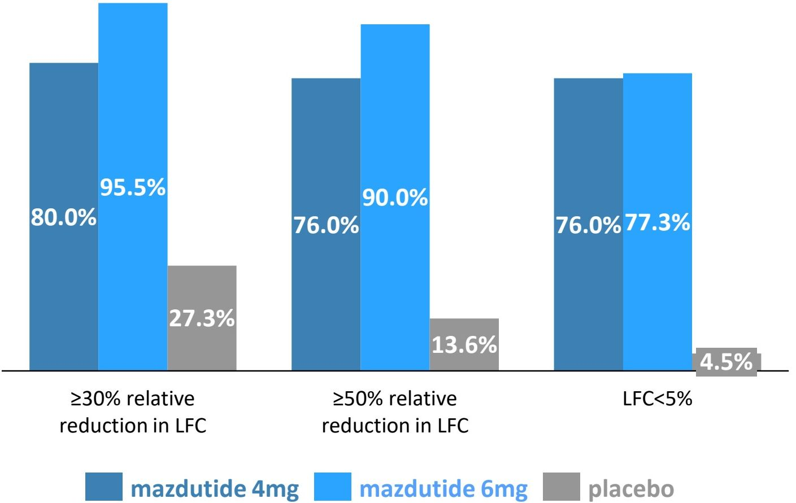

2

# <u>GLORY-1: liver-related benefits</u>

## Substantially reduced liver fat content in participants with hepatic steatosis

**Up to 80.2% liver fat content reduction observed in mazdutide groups at week 48**

### Liver Fat Content
*mean change (%) from baseline by MRI-PDFF*

| Baseline LFC Mean Change (%) Treatment | 15.3% -46.2% \\\*24w Semaglutide 2.4mg | -41.3% Tirzepatide 10mg | 18.4% -57.0% Tirzepatide 15mg | -9.8% Placebo | -60.8% Survodutide 4.8mg | 19.6% -62.0% Survodutide 6mg | -5.7% Placebo | -65.9% Mazdutide 4mg | 19.5%\* -80.2% Mazdutide 6mg | -5.3% Placebo |
| ---------------------------------------------- | ---------------------------------------------- | --------------------------- | ------------------------------------- | ----------------- | ---------------------------- | ------------------------------------ | ----------------- | ------------------------ | ------------------------------------ | ----------------- |

\*In participants with baseline LFC ≥ 10%

\*Semglutide 2.4mg were published results of a Phase 2 trial1; Tirzepatide 10mg & 15mg were published results of a Phase 2 trial2; survodutide 4.8mg were published results of a Phase 2 trial3

1 Alkhouri N,et al. Safety and efficacy of combination therapy with semaglutide, cilofexor and firsocostat in patients with non-alcoholic steatohepatitis: A randomised, open-label phase II trial. J Hepatol. 2022 Sep;77(3):607-618. doi: 10.1016/j.jhep.2022.04.003. Epub 2022 Apr 16. PMID: 35439567.
2 Loomba R, et al. SYNERGY-NASH Investigators. Tirzepatide for Metabolic Dysfunction-Associated Steatohepatitis with Liver Fibrosis. N Engl J Med. 2024 Jun 8. doi: 10.1056/NEJMoa2401943. Epub ahead of print. PMID: 38856224.
3 Sanyal AJ, et al. 1404-0043 Trial Investigators. A Phase 2 Randomized Trial of Survodutide in MASH and Fibrosis. N Engl J Med. 2024 Jun 7. doi: 10.1056/NEJMoa2401755. Epub ahead of print. PMID: 38847460.

Innovent logo

Confidential
Copyright @2024 Innovent

22

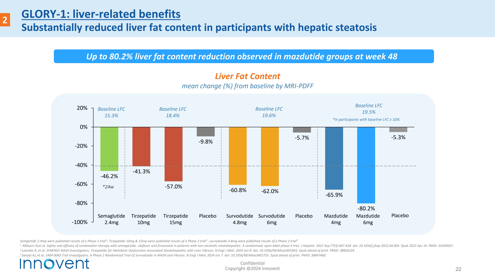

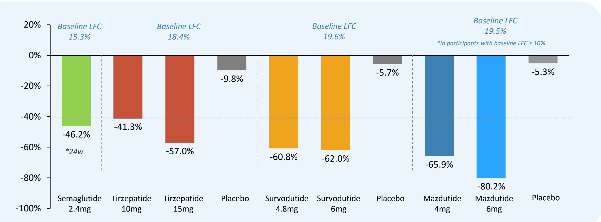

2

# <u>GLORY-1: liver-related benefits</u>

## Robust reductions in transaminase and serum uric acid

### Robust reduction in ALT and AST at week 48

| Treatment      | ALT mean change from baseline (%) |
| -------------- | --------------------------------- |
| mazdutide 4 mg | -19.4                             |
| mazdutide 6 mg | -26.9                             |
| placebo        | 5.8                               |

\*Baseline 35.5 U/L

| Treatment      | AST mean change from baseline (%) |
| -------------- | --------------------------------- |
| mazdutide 4 mg | -6.5                              |
| mazdutide 6 mg | -11.5                             |
| placebo        | 4.0                               |

\*Baseline 26.07 U/L

### Unique reduction in sUA at week 48

| Treatment      | sUA mean change from baseline (%) |
| -------------- | --------------------------------- |
| mazdutide 4 mg | -7.5                              |
| mazdutide 6 mg | -12.9                             |
| placebo        | 4.3                               |

\*Baseline 368.6 umol/L

mazdutide 4 mg legend icon mazdutide 4 mg mazdutide 6 mg legend icon mazdutide 6 mg placebo legend icon placebo

\*The treatment policy estimand results
Innovent logo

Confidential
Copyright @2024 Innovent

23

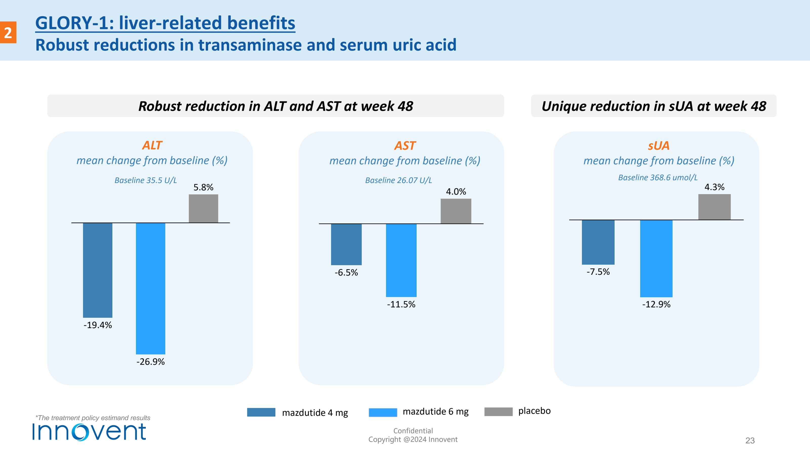

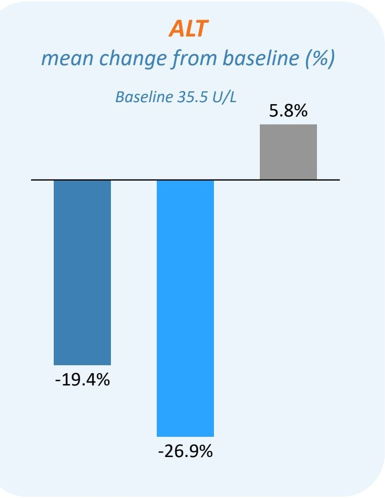

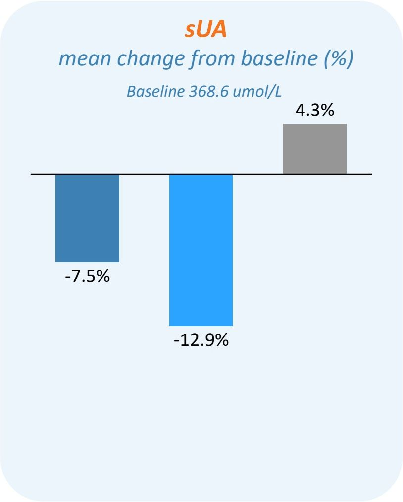

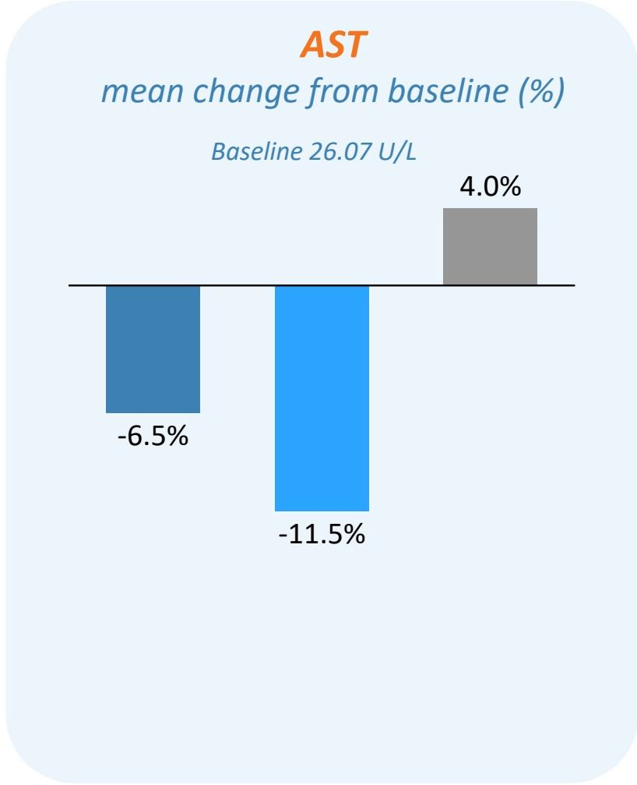

3

# <u>GLORY-1: cardio-metabolic benefits</u>

## Significantly reduced cardiometabolic risk factors, alleviating comorbidity burden

**Significant reductions in blood pressure and lipids at week 48**

### SBP
mean change from baseline (mmHg)
Baseline 122.3 mmHg

| Series         | Mean change from baseline (mmHg) |
| -------------- | -------------------------------- |
| mazdutide 4 mg | -7.3                             |
| mazdutide 6 mg | -9.9                             |
| placebo        | -2.1                             |

### Triglycerides
mean percentage change from baseline (%)
Baseline 2.0 mmol/L

| Series         | Mean percentage change from baseline (%) |
| -------------- | ---------------------------------------- |
| mazdutide 4 mg | -25.8                                    |
| mazdutide 6 mg | -31.5                                    |
| placebo        | 0.7                                      |

### Total cholesterol
mean percentage change from baseline (%)
Baseline 4.8 mmol/L

| Series         | Mean percentage change from baseline (%) |
| -------------- | ---------------------------------------- |
| mazdutide 4 mg | -3.0                                     |
| mazdutide 6 mg | -6.8                                     |
| placebo        | 4.4                                      |

### LDL-C
mean percentage change from baseline (%)
Baseline 3.2 mmol/L

| Series         | Mean percentage change from baseline (%) |
| -------------- | ---------------------------------------- |
| mazdutide 4 mg | -3.2                                     |
| mazdutide 6 mg | -7.1                                     |
| placebo        | 5.0                                      |

\*The treatment-policy estimand results

| Legend                         | Legend         |
| ------------------------------ | -------------- |
| mazdutide 4 mg color indicator | mazdutide 4 mg |
| mazdutide 6 mg color indicator | mazdutide 6 mg |
| placebo color indicator        | placebo        |

Innovent logo

Confidential
Copyright @2024 Innovent

24

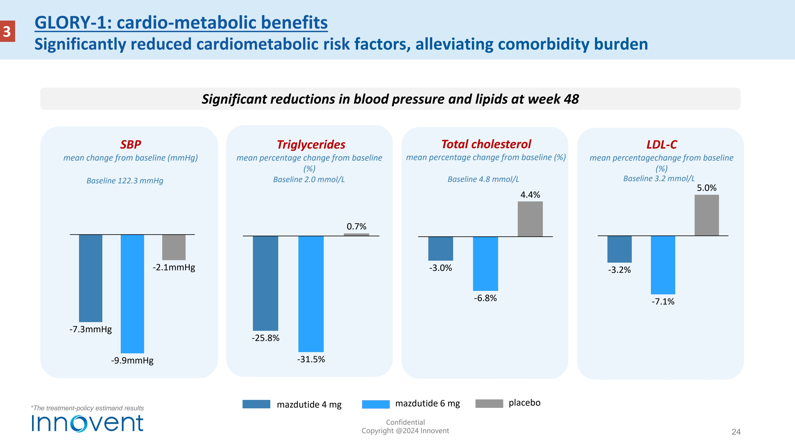

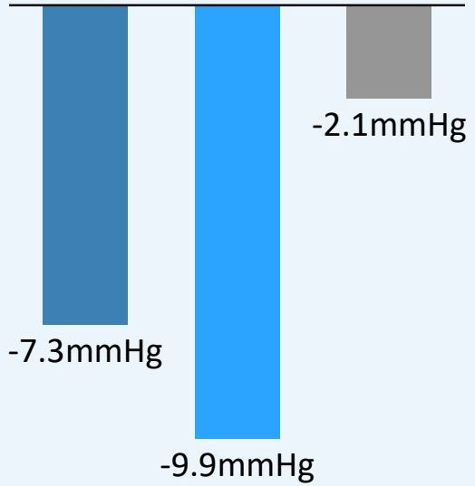

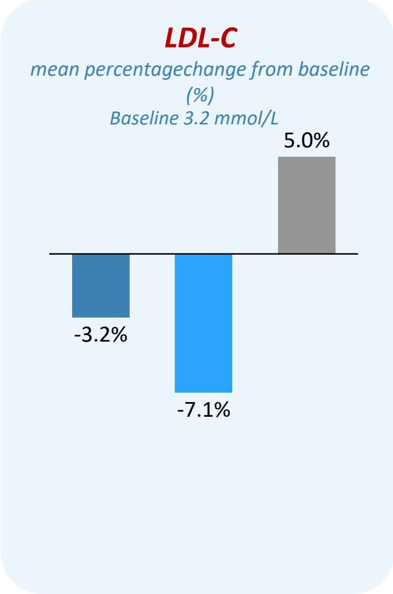

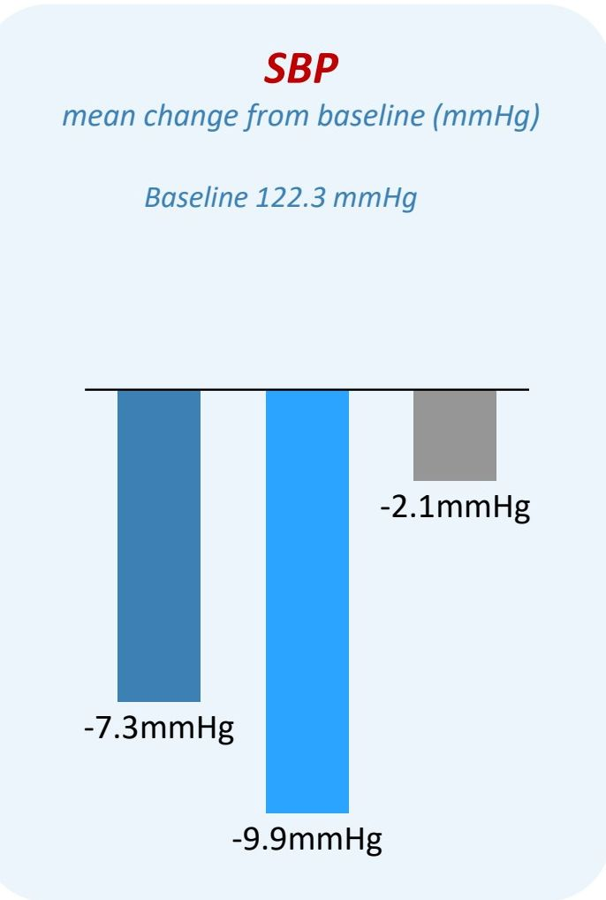

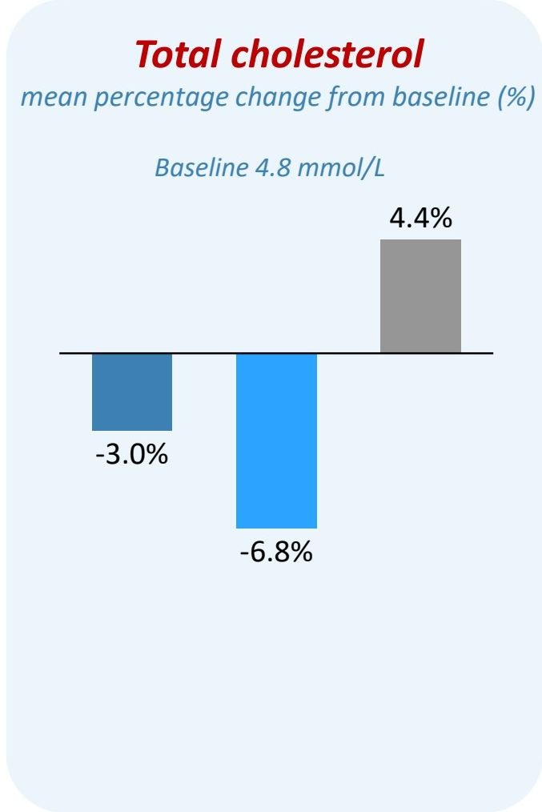

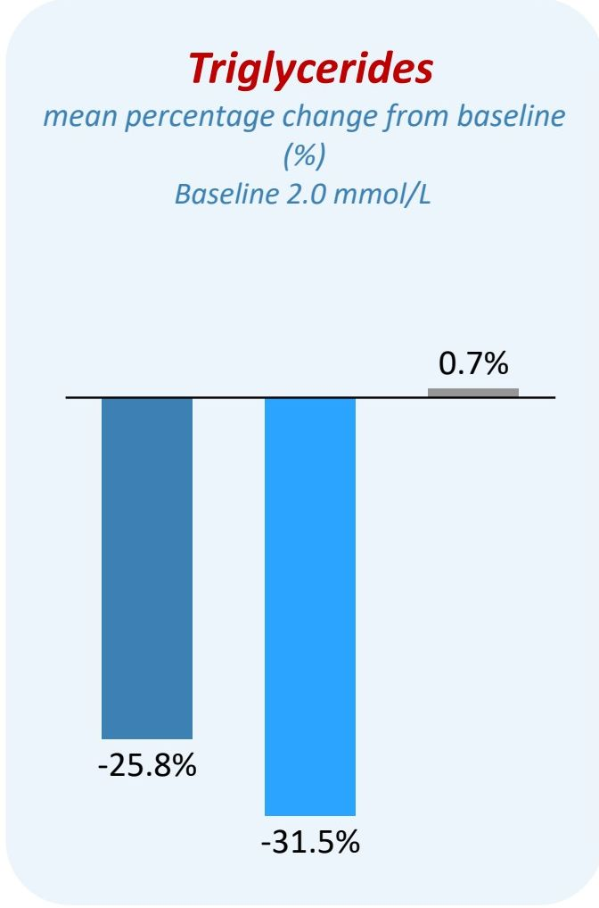

3

# <u>GLORY-1: glycemic benefit</u>

## Significantly normalized blood sugar level for participants with HbA1C ≥5.7 %

**Proportion of participants with baseline HbA1c ≥5.7% achieved A1c normalization at week 48**

| Treatment     | Timepoint        | HbA1C ≥ 5.7% (%) | HbA1C < 5.7% (%) |
| ------------- | ---------------- | ---------------- | ---------------- |
| mazdutide 4mg | Week 0 (n=203)   | 52               | 48               |
| mazdutide 4mg | Week 48 (n=52\*) | 27               | 73               |
| mazdutide 6mg | Week 0 (n=202)   | 51               | 49               |
| mazdutide 6mg | Week 48 (n=47\*) | 15               | 85               |
| placebo       | Week 0 (n=205)   | 54               | 46               |
| placebo       | Week 48 (n=49\*) | 69               | 31               |

\*Number of participants with baseline A1c ≥5.7% and evaluable data at week 48.

Innovent logo

Confidential
Copyright @2024 Innovent

25

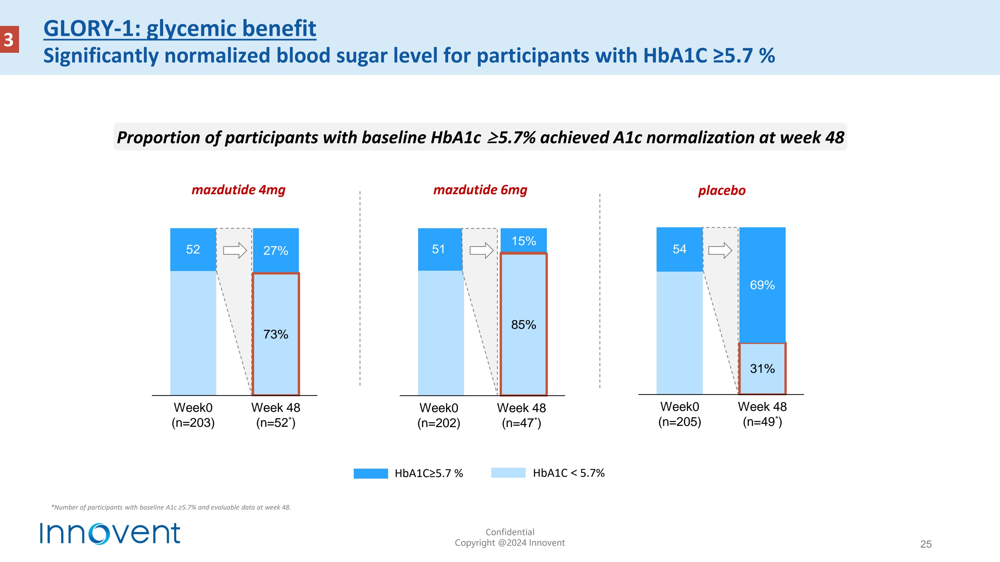

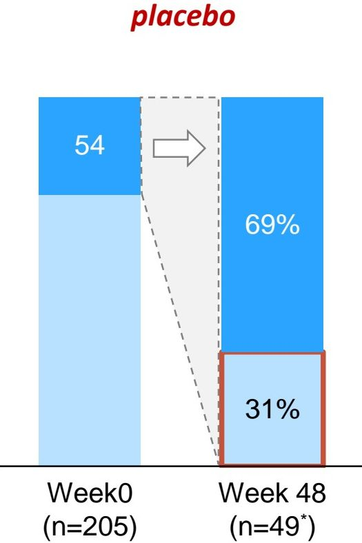

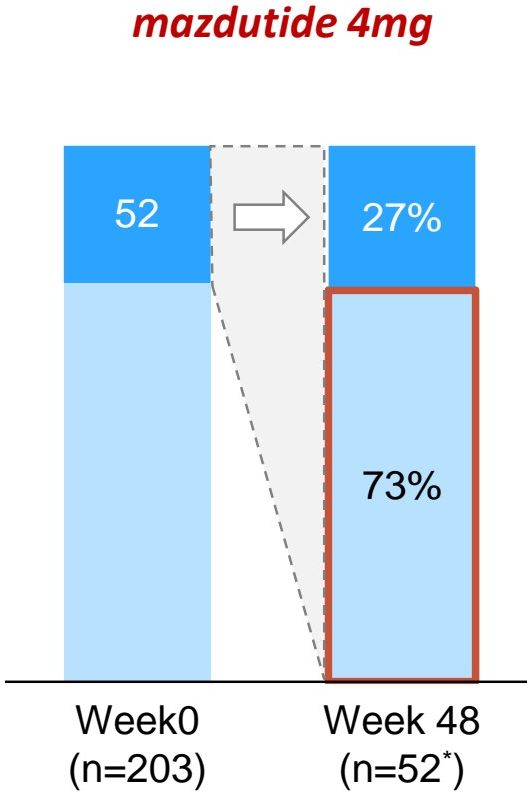

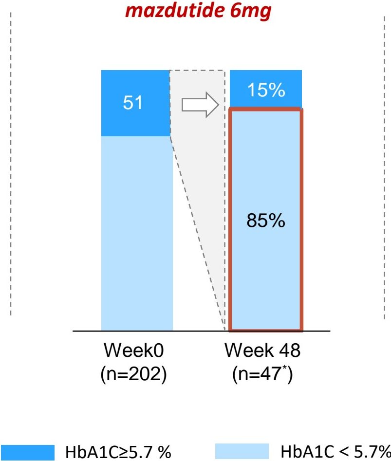

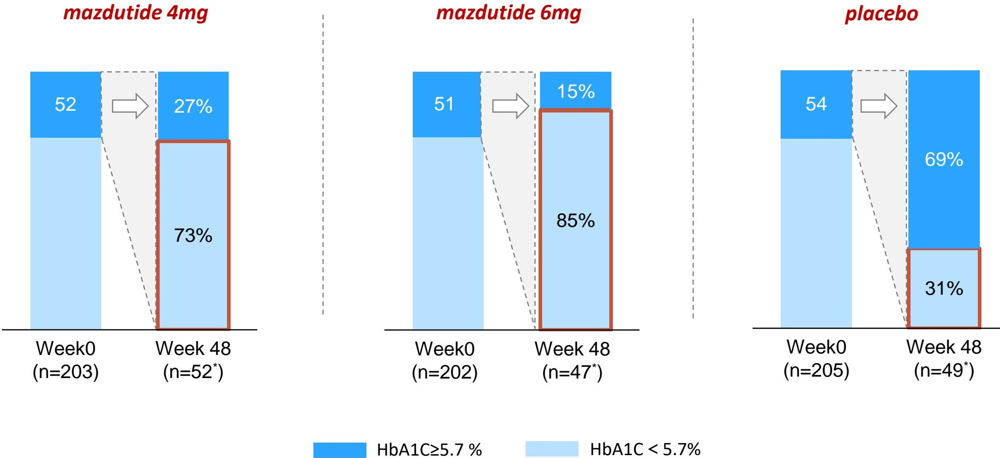

4

# <u>GLORY-1: safety profile</u>

## Favorable tolerability and safety profile of mazdutide

### Serious adverse events %

| Treatment Group   | Active Drug (%) | Placebo (%) |
| ----------------- | --------------- | ----------- |
| Semaglutide 2.4mg | 5.2             | 6.3         |
| Tirzepatide 10mg  | 4.3             | 8.7         |
| Tirzepatide 15mg  | 11.3            | 8.7         |
| Mazdutide 4mg     | 4.4             | 6.3         |
| Mazdutide 6mg     | 3.5             | 6.3         |

### Adverse events leading to discontinuation %

| Treatment Group   | Active Drug (%) | Placebo (%) |
| ----------------- | --------------- | ----------- |
| Semaglutide 2.4mg | 2.8             | 1.6         |
| Tirzepatide 10mg  | 2.9             | 1.4         |
| Tirzepatide 15mg  | 7.0             | 1.4         |
| Mazdutide 4mg     | 1.5             | 1.0         |
| Mazdutide 6mg     | 0.5             | 1.0         |

* Gastrointestinal symptoms (nausea, vomiting and diarrhea) were the most common adverse events, **mostly mild or moderate severity**.
* Most gastrointestinal adverse events occurred during the dose escalation period.

Safety data of semaglutide 2.4 mg, tirzepatide 10/15 mg were from published results of SURMOUNT-CN¹ and STEP-7² studies, respectively.

¹ Zhao L, Cheng Z, et al. JAMA. Published online May 31, 2024. doi:10.1001/jama.2024.9217 ² Prof Yiming Mu, MD, et al. The Lancet Diabetes & Endocrinology. Published online February 05, 2024.doi:10.1016/S2213-8587(23)00388-1

Innovent logo

Confidential
Copyright @2024 Innovent

26

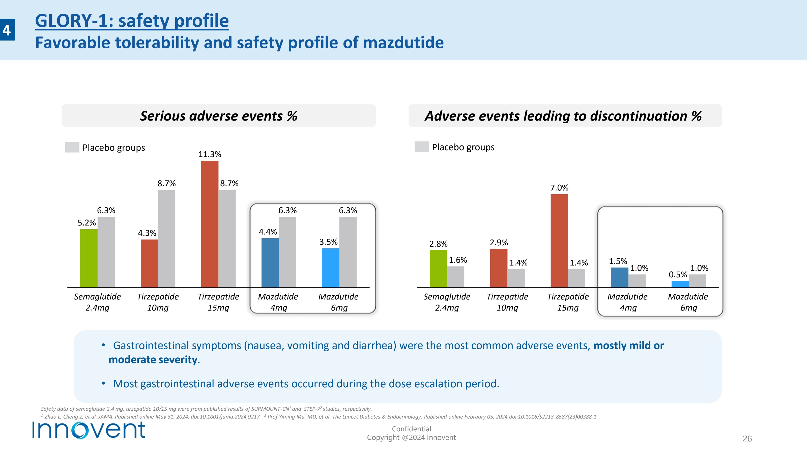

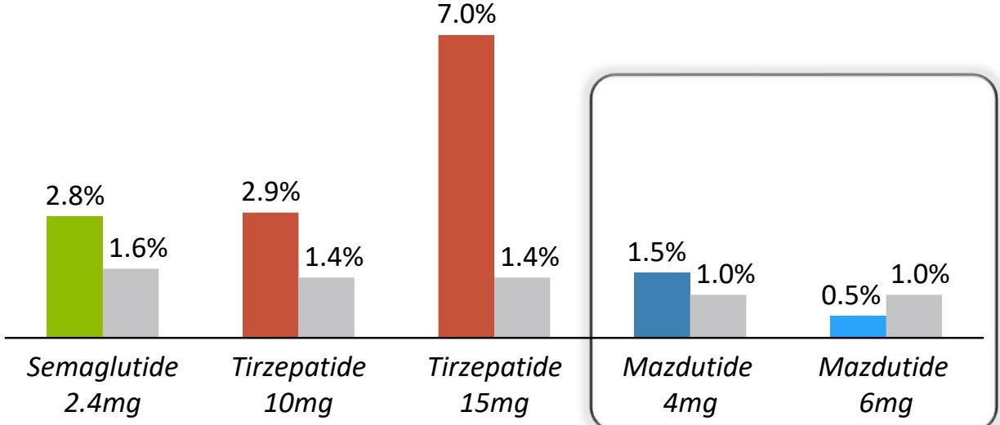

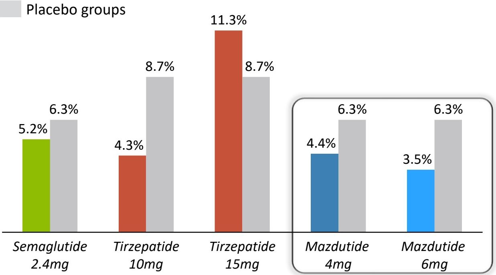

4 <u>GLORY-1: safety profile</u>

# No signal of increased cardiovascular risk was observed throughout the 48-week treatment

### Mean heart rate change from baseline over 48-week treatment (beats/min)

| weeks | mazdutide 4mg | mazdutide 6mg | placebo |
| ----- | ------------- | ------------- | ------- |
| 0     | 0             | 0             | 0       |
| 4     | 4.6           | 2.6           | 0.5     |
| 12    | 4.6           | 3.7           | -0.1    |
| 24    | 3.8           | 3.6           | -0.8    |
| 32    | 4.1           | 2.4           | -0.9    |
| 48    | 2.6           | 2.6           | -1.1    |

* **The increase in heart rate in the mazdutide groups was mild and mainly in dose-escalation stage.** Mean changes from baseline were no more than 5 beats/min throughout the 48-week treatment period for both mazdutide groups.
* **No safety signal of increased cardiovascular risk** was observed throughout the treatment period.

Innovent logo

Confidential
Copyright @2024 Innovent

27

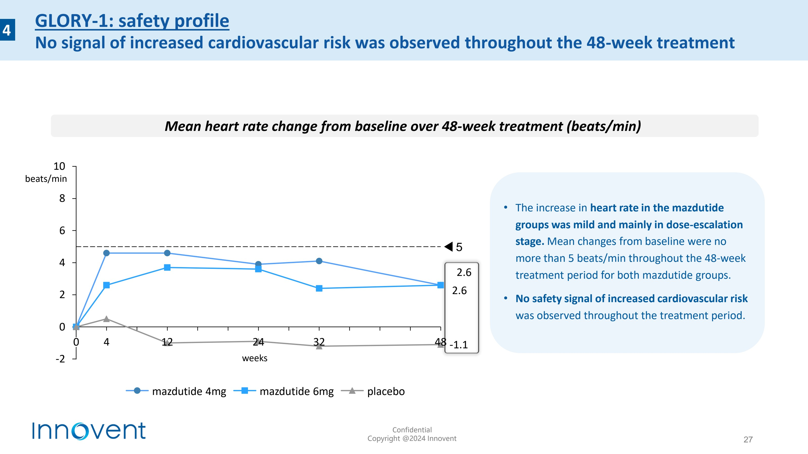

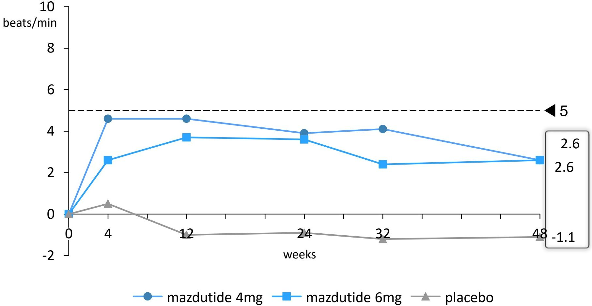

<u>Summary and takeaway 1:</u>

# GLORY-1 reinforces mazdutide’s advantage as a potent medication for weight management

* Weight loss icon **Robust and rapid weight-loss efficacy**
    * Mean weight loss from baseline of -14.3%
    * Half patients achieved ≥15% weight loss
    > Competitive weight loss effect and strong clinical evidence in Chinese population

* Liver icon **80% LFC reduction and liver benefits**
    * Differentiated benefits in significantly reducing LFC, ALT and serum uric acid levels
    > Implication of the additional benefit of GCGR agonism through direct activation on liver

* Comorbidities icon **Improvements in related comorbidities indicators**
    * Significant reduction in waist circumference, SBP, TG, TC, LDL-C levels etc.
    > Potential to improve healthy outcomes for people living with obesity and associated comorbidities

* Safety icon Shield icon **Favorable and superior safety and tolerability**
    * Most GI AEs are of mild or moderate severity
    * Relatively low SAEs and drop-out rate
    * Heart rate increase was mild and stable, no increased cardiovascular risk observed
    > Facilitate treatment compliance and quality of life under convenient, safe and tolerable two-step dose regimen

Innovent logo

Confidential
Copyright @2024 Innovent

28

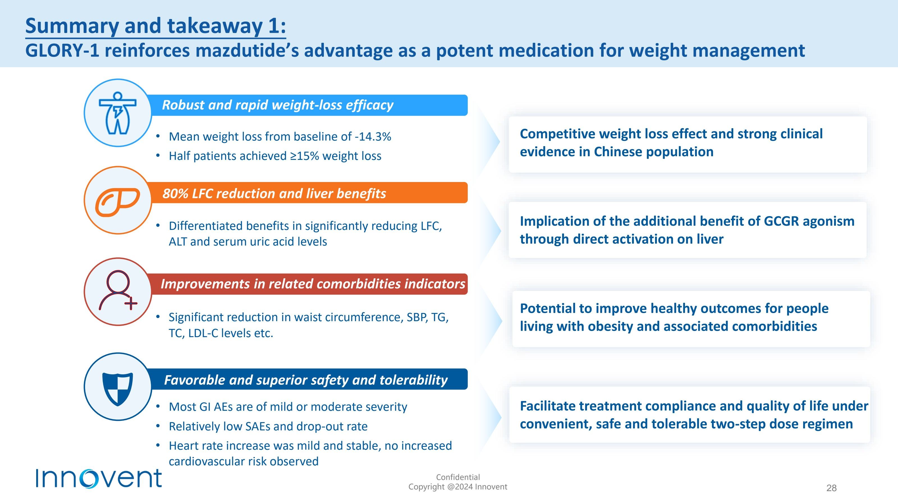

# Summary and takeaway 2:

# Expand indication exploration of mazdutide and innovate in early-stage pipeline

| Indication / Modality                          | Program Category                                    |
| ---------------------------------------------- | --------------------------------------------------- |
| Weight management (GLORY-1, GLORY-2)           | Mazdutide development programs: late-stage and more |
| Type 2 diabetes (DREAMS-1, DREAMS-2, DREAMS-3) | Mazdutide development programs: late-stage and more |
| MASH                                           | Mazdutide development programs: late-stage and more |
| Adolescent obesity                             | Mazdutide development programs: late-stage and more |
| More indications                               | Mazdutide development programs: late-stage and more |
| Oral delivery                                  | New waves of novel assets                           |
| Novel modalities                               | New waves of novel assets                           |
| Pediatric & aging diseases                     | New waves of novel assets                           |

| Mazdutide development programs: late-stage and more | New waves of novel assets |
| --------------------------------------------------- | ------------------------- |

* Evaluate and advance mazdutide to address significant unmet medical needs in other key metabolic diseases

* Continue to innovate in more early-stage metabolic pipeline

Innovent logo

Confidential
Copyright @2024 Innovent
29

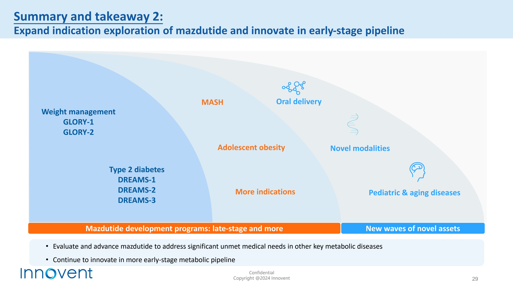

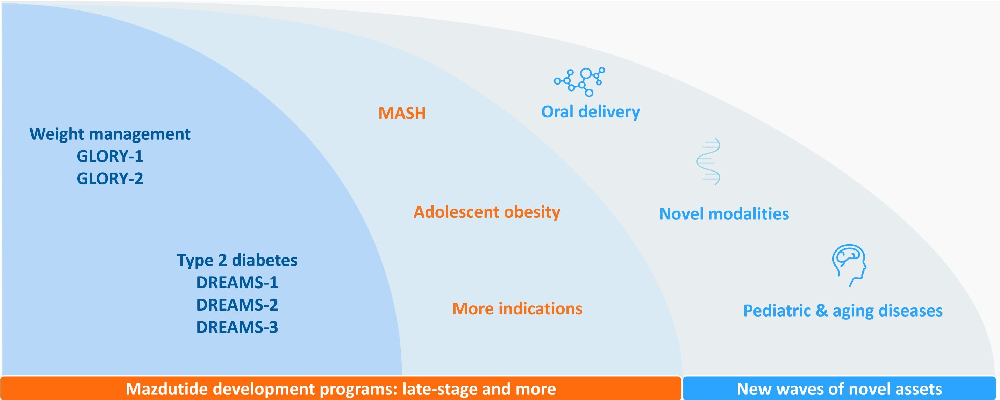

# Q&A

**All management**

Innovent

decorative blue wave graphic
30

# Disclaimer

This presentation includes forward-looking statements. All statements contained in this presentation other than statements of historical facts, including statements regarding future results of operations and financial position of Innovent Biologics ("Innovent" "we," "us" or "our"), our business strategy and plans, the clinical development of our product candidates and our objectives for future operations, are forward-looking statements. The words "anticipate," "believe," "continue," "estimate," "expect," "intend," "may," "will" and similar expressions are intended to identify forward-looking statements. We have based these forward-looking statements largely on our current expectations and projections about future events and financial trends that we believe may affect our financial condition, results of operations, business strategy, clinical development, short-term and long-term business operations and objectives and financial needs. These forward-looking statements are subject to a number of risks, uncertainties and assumptions. Moreover, we operate in a very competitive and rapidly changing environment. New risks emerge from time to time. It is not possible for our management to predict all risks, nor can we assess the impact of all factors on our business or the extent to which any factor, or combination of factors, may cause actual results to differ materially from those contained in any forward-looking statements we may make. In light of these risks, uncertainties and assumptions, the future events and trends discussed in this presentation may not occur and actual results could differ materially and adversely from those anticipated or implied in the forward-looking statements.

Although we believe that the expectations reflected in the forward-looking statements are reasonable, we cannot guarantee future results, levels of activity, performance, achievements or events and circumstances reflected in the forward-looking statements will occur. We are under no duty to update any of these forward-looking statements after the date of this presentation to conform these statements to actual results or revised expectations, except as required by law. You should, therefore, not rely on these forward-looking statements as representing our views as of any date subsequent to the date of this presentation.

This presentation also contains estimates and other statistical data made by independent parties and by us relating to market size and growth and other data about our industry. This data involves a number of assumptions and limitations, and you are cautioned not to give undue weight to such estimates. Neither we nor any other person makes any representation as to the accuracy or completeness of such data or undertakes any obligation to update such data after the date of this presentation. In addition, projections, assumptions and estimates of our future performance and the future performance of the markets in which we operate are necessarily subject to a high degree of uncertainty and risk.

This presentation may not be all inclusive and may not contain all of the information that you may consider material. Neither Innovent nor any of its affiliates, shareholders, directors, officers, employees, agents and advisors makes any expressed or implied representation or warranty as to the completeness, fairness, reasonableness of the information contained herein, and none of them shall accept any responsibility or liability for any loss or damage, whether or not arising from any error or omission in compiling such information or as a result of any party's reliance or use of such information. By attending or receiving this presentation you acknowledge that you will be solely responsible for your own assessment of our business, the market and our market position and that you will conduct your own analysis and be solely responsible for forming your own view of the potential future performance of our business.

This presentation is intended solely for investors that are qualified institutional buyers or institutional accredited investors solely for the purposes of familiarizing such investors with Innovent and determining whether such investors might have an interest in a securities offering contemplated by Innovent. Any such offering of securities will only be made pursuant to an exemption from, or in a transaction not subject to, the registration requirements of the U.S. Securities Act of 1933, as amended, or by means of a registration statement (including a prospectus) filed with the SEC, after such registration statement becomes effective. No such registration statement has been filed, or become effective, as of the date of this presentation. This presentation shall not constitute an offer to sell or the solicitation of an offer to buy any securities, nor shall there be any sale of any securities in any state or jurisdiction in which such offer, solicitation or sale would be unlawful prior to registration or qualification under the securities laws of any such state or jurisdiction.

Innovent logo

Confidential
Copyright @2024 Innovent

31

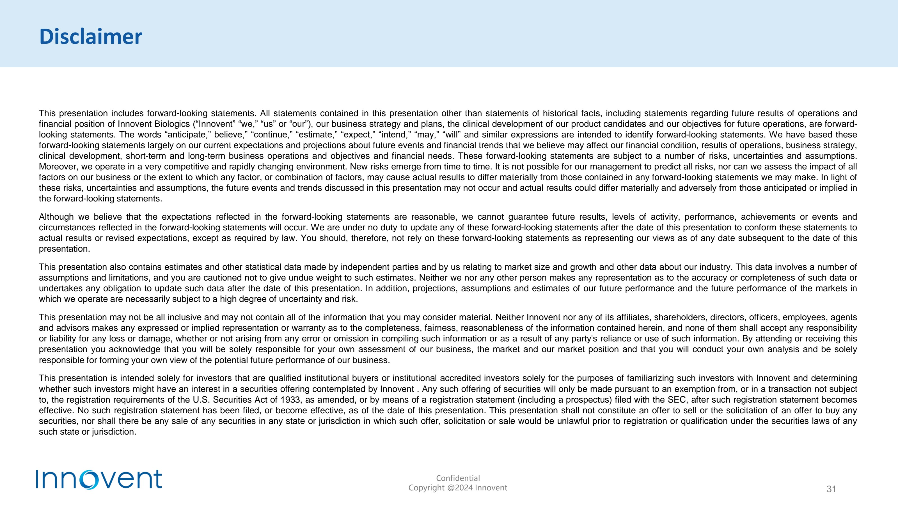

# Innovent

Confidential
Copyright© 2023 Innovent 32

