Innovent logo and DNA helix background

# Innovent Biologics Clinical Data Update

## Mazdutide (IBI362) Higher Dose 9mg
## Phase 2 Clinical Study in Obesity

*May 11, 2023*

TO DEVELOP AND COMMERCIALIZE HIGH QUALITY BIOPHARMACEUTICALS THAT ARE AFFORDABLE TO ORDINARY PEOPLE.

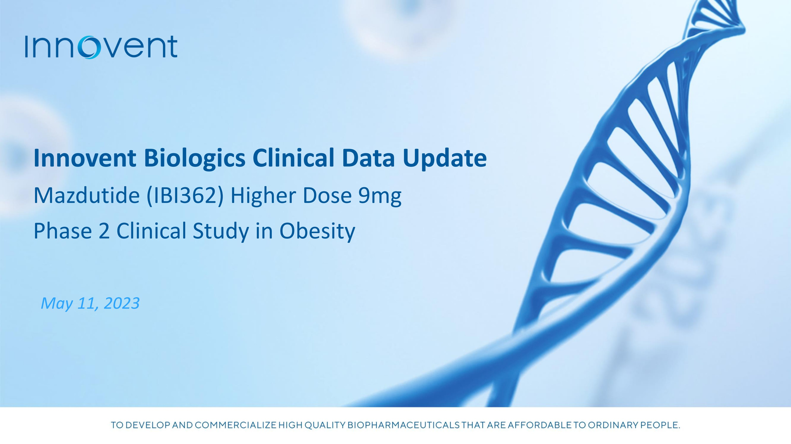

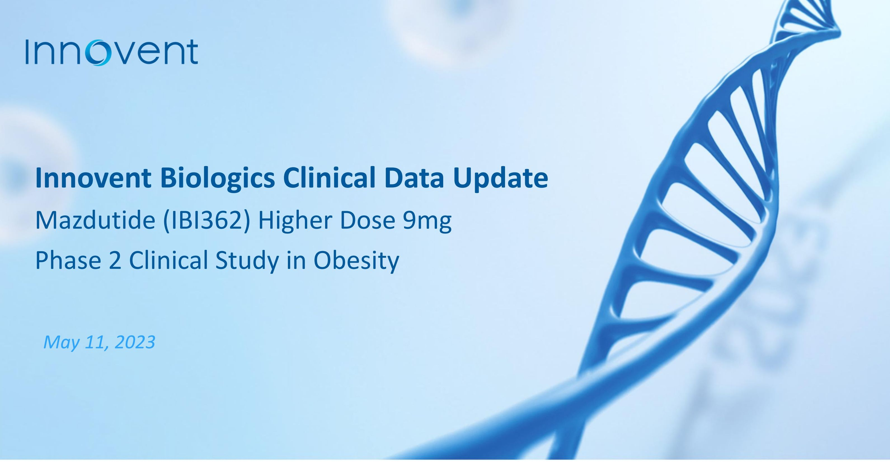

Disclaimer innovent

# Agenda and Speakers

This presentation includes forward-looking statements. All statements contained in this presentation other than statements of historical facts, including statements regarding future results of operations and financial position of Innovent Biologics ("Innovent," "we," "us" or "our"), our business strategy and plans, the clinical development of our product candidates and our objectives for future operations, are forward-looking statements. The words "anticipate," "believe," "continue," "estimate," "expect," "intend," "may," "will" and similar expressions are intended to identify forward-looking statements. We have based these forward-looking statements largely on our current expectations and projections about future events and financial trends that we believe may affect our financial condition, results of operations, business strategy, clinical development, short-term and long-term business operations and objectives and financial needs. These forward-looking statements are subject to a number of risks, uncertainties and assumptions. In light of these risks, uncertainties and assumptions, the future events and trends discussed in this presentation may not occur and actual results could differ materially and adversely from those anticipated or implied in the forward-looking statements.

Although we believe that the expectations reflected in the forward-looking statements are reasonable, we cannot guarantee future results, levels of activity, performance, achievements or events and circumstances reflected in the forward-looking statements will occur. We are under no duty to update any of these forward-looking statements after the date of this presentation to conform these statements to actual results or revised expectations, except as required by law. You should, therefore, not rely on these forward-looking statements as representing our views as of any date subsequent to the date of this presentation.

This presentation also contains estimates and other statistical data made by independent parties and by us relating to market size and growth and other data about our industry. This data involves a number of assumptions and limitations, and you are cautioned not to give undue weight to such estimates. Neither we nor any other person makes any representation as to the accuracy or completeness of such data or undertakes any obligation to update such data after the date of this presentation. In addition, projections, assumptions and estimates of our future performance and the future performance of the markets in which we operate are necessarily subject to a high degree of uncertainty and risk.

This presentation may not be all inclusive and may not contain all of the information that you may consider material. Neither Innovent nor any of its affiliates, shareholders, directors, officers, employees, agents and advisors makes any expressed or implied representation or warranty as to the completeness, fairness, reasonableness of the information contained herein, and none of them shall accept any responsibility or liability for any loss or damage, whether or not arising from any error or omission in compiling such information or as a result of any party's reliance or use of such information. By attending or receiving this presentation you acknowledge that you will be solely responsible for your own assessment of our business, the market and our market position and that you will conduct your own analysis and be solely responsible for forming your own view of the potential future performance of our business.

| 1 | Overview:           | Obesity and Overweight in China                   |
| - | ------------------- | ------------------------------------------------- |
|   | **Prof. Linong Ji** | *Leading PI; Peking University People's Hospital* |
| 2 | Mazdutide:          | Development Overview and Clinical Update          |
|   | **Dr. Lei Qian**    | *VP, Non-oncology Clinical Development*           |
| 3 | Q\&A                |                                                   |
|   | All                 |                                                   |

This presentation is not intended to be, and should not be construed as, an offer to sell or a solicitation of an offer to buy any securities in any jurisdiction. This presentation is being provided to you for information purposes only and is not intended to be used as the basis for any investment decision. This presentation is being provided to you on a confidential basis and may not be reproduced, redistributed or passed on, in whole or in part, to any other person. This presentation is being provided to you on the basis that you are a person to whom an offer of securities may be made without a prospectus or other disclosure document under the laws of the jurisdiction in which you are located. This presentation is not a prospectus, product disclosure statement or other disclosure document for the purposes of the Corporations Act 2001 (Cth) or any other applicable law. This presentation has not been and will not be lodged with the Australian Securities and Investments Commission or any other regulatory authority.

This presentation is being provided to you on the basis that you are a "qualified institutional buyer" (as defined in Rule 144A under the U.S. Securities Act of 1933, as amended (the "Securities Act")) or a person outside the United States in an "offshore transaction" (as defined in Regulation S under the Securities Act). This presentation is not an offer of securities for sale in the United States. Securities may not be offered or sold in the United States absent registration or an exemption from registration under the Securities Act. Innovent does not intend to register any portion of any offering in the United States or to conduct a public offering of securities in the United States.

This presentation is being provided to you on the basis that you are a person to whom an offer of securities may be made without a prospectus or other disclosure document under the laws of the jurisdiction in which you are located. This presentation is not a prospectus, product disclosure statement or other disclosure document for the purposes of the Corporations Act 2001 (Cth) or any other applicable law. This presentation has not been and will not be lodged with the Australian Securities and Investments Commission or any other regulatory authority.

Innovent Confidential Confidential 25
Copyright©2023 Innovent Copyright© 2023 Innovent 2

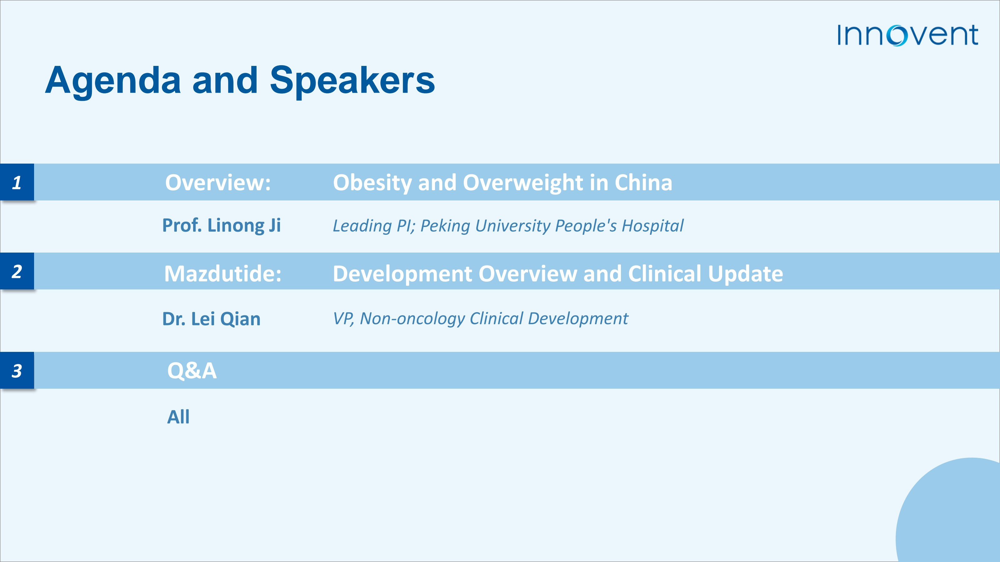

# Prof. Linong Ji, MD

## Leading Principal Investigator; Peking University People’s Hospital

Portrait of Prof. Linong Ji

* Professor Linong Ji is **Director of Peking University Diabetes Center** and **Director of the Department of Endocrinology and Metabolism**, Peking University People's Hospital, Beijing, China.

* **He is also President of Specialty Committee of Clinical Research on Diabetes and Metabolic Drugs of China Pharmaceutical Innovation and Research Development Association (PhIRDA)**, Past Vice President of International Diabetes Federation (IDF), Past Chair of International Diabetes Federation Western Pacific Region (IDF-WPR), Past President of the Chinese Diabetes Society (CDS), Vice President of the Chinese Endocrinologist Association (CEA), President of Chinese Geriatric Endocrine and Metabolism Society, Executive board member of Asia Association for the Study of Diabetes (AASD).

* **He is Chief Editor of Chinese Diabetes Journal and an editorial board member of Journal of Diabetes, Diabetes Research and Clinical Practice, Diabetes Technology & Therapeutics, Metabolism, International Journal of Diabetes.**

* **He is the leading principal investigator of 60+ clinical studies. He published 500+ articles in peer-reviewed journals.**

Innovent logo

Confidential
Copyright© 2023 Innovent

3

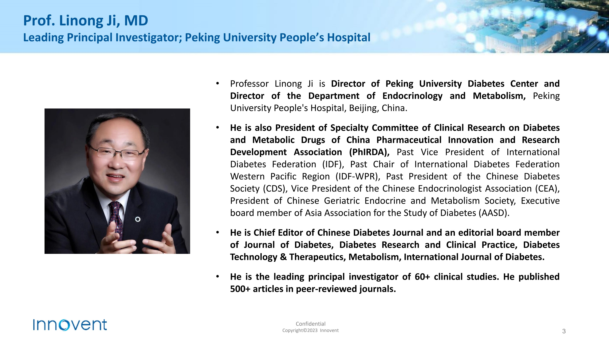

# Obesity and Overweight in China

**Prof. Linong Ji**

*Leading PI; Peking University People's Hospital*

Innovent logo

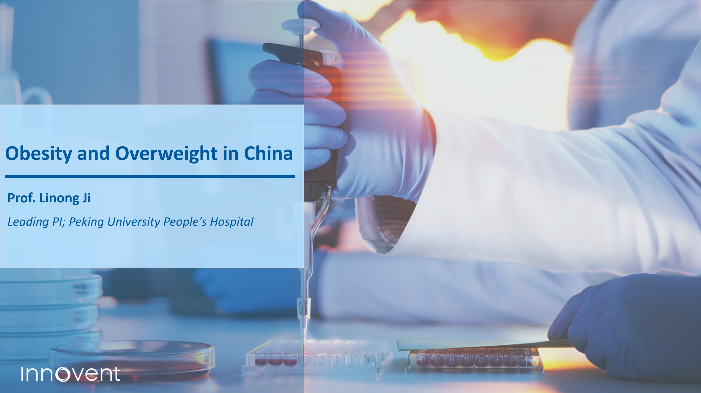

# Obesity — a Growing Public Health Issue in China

*   **01** **1 out of 2 adults** in China are living with obesity or overweight¹
*   **02** Overweight and obesity are **established risk factors** for major non-communicable diseases²'³
*   **03** **Clear unmet needs** for more effective and tolerable therapies to achieve ideal outcomes
*   **04** Obesity is a serious chronic disease that needs **long-term management**
*   **05** Obesity associated healthcare costs could reach **RMB 400+B** in China by 2030²

\*1. Pan XF, Wang L, Pan A. Epidemiology and determinants of obesity in China. Lancet Diabetes Endocrinol. 2021 Jun;9(6):373-392. doi: 10.1016/S2213-8587(21)00045-0. Erratum in: Lancet Diabetes Endocrinol. 2021 Jul;9(7):e2. PMID: 34022156.

\*2. Wang Y, Zhao L, Gao L, Pan A, Xue H. Health policy and public health implications of obesity in China. Lancet Diabetes Endocrinol. 2021 Jul;9(7):446-461. doi: 10.1016/S2213-8587(21)00118-2. Epub 2021 Jun 4. PMID: 34097869.

\*3. Institute for Health Metrics and Evaluation. Global Health Data Exchange. GBD results tool. http://ghdx.healthdata.org/gbd-resultstool (accessed Jan 10, 2021).

Innovent logo

Confidential
Copyright© 2023 Innovent

5

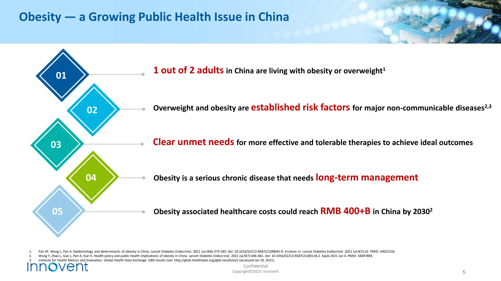

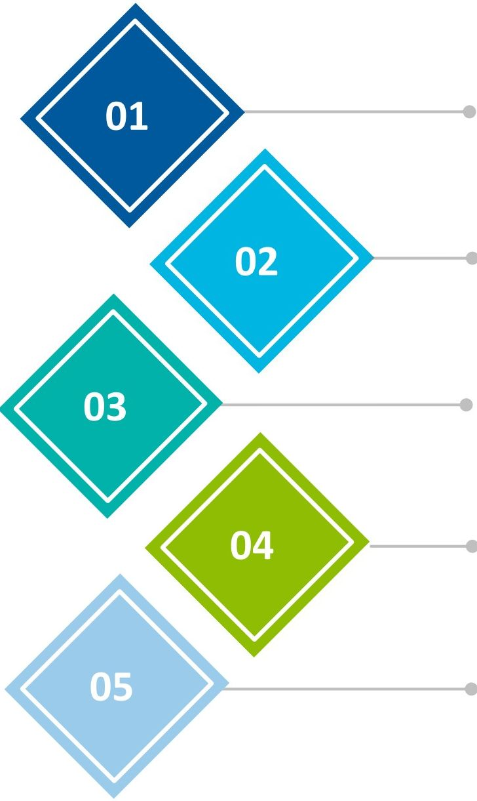

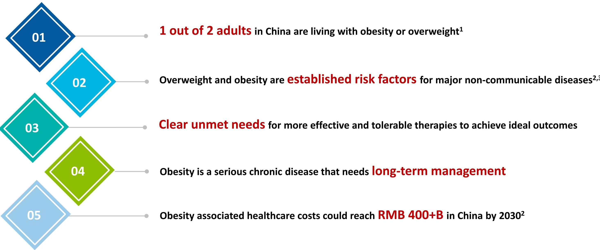

# China Has the Largest Obese and Overweight Population

~500M adults in China are living with obesity or overweight, potentially the largest in the worldi,1.

* Overweight (BMI 24-27.9kg/m²): 340M

* Obesity (BMI ≥ 28kg/m²): 160M

* Moderate to severe obesity (BMI ≥ 32.5kg/m²): 10M

| Category                   | Population  | Prevalence (2019) | Prevalence (2030) | BMI Criteria     |
| -------------------------- | ----------- | ----------------- | ----------------- | ---------------- |
| Adults                     | 1 Billion   | 50%               | 65%               |                  |
| Overweight                 | 500 Million | 16%               | 23%               | BMI ≥ 24 kg/m²   |
| Obesity                    | 160 Million | 1%                | 2%                | BMI ≥ 28 kg/m²   |
| Moderate to Severe Obesity | 10 Million  |                   |                   | BMI ≥ 32.5 kg/m² |

\*i: WHO criteria define overweight in adults as a BMI of 25.0–29.9 kg/m² and obesity as a BMI of 30.0 kg/m² or higher. However, accumulated evidence has shown that Chinese people are likely to have higher percentages of body fat (as shown via imaging techniques) and higher rates of cardiovascular risk factors and all-cause mortality than White people at given BMI levels.

Innovent logo

Confidential

Copyright© 2023 Innovent

25 6

1. Pan XF, Wang L, Pan A. Epidemiology and determinants of obesity in China. Lancet Diabetes Endocrinol. 2021 Jun;9(6):373-392. doi: 10.1016/S2213-8587(21)00045-0. Erratum in: Lancet Diabetes Endocrinol. 2021 Jul;9(7):e2. PMID: 34022156.

2. Wang Y, Zhao L, Gao L, Pan A, Xue H. Health policy and public health implications of obesity in China. Lancet Diabetes Endocrinol. 2021 Jul;9(7):446-461. doi: 10.1016/S2213-8587(21)00118-2. Epub 2021 Jun 4. PMID: 34097869.

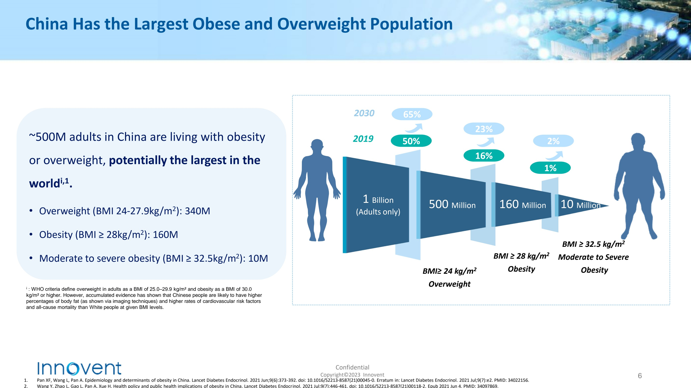

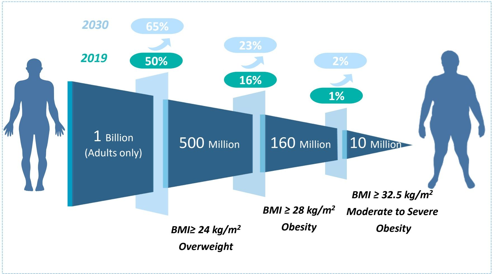

# Raised BMI is a Major Risk Factor for >200 Non-communicable Diseases

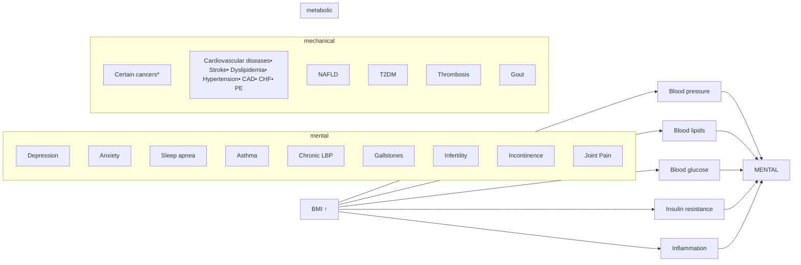
```mermaid
graph LR
    BMI[BMI ↑] --> BP[Blood pressure]
    BMI --> BL[Blood lipids]
    BMI --> BG[Blood glucose]
    BMI --> IR[Insulin resistance]
    BMI --> INF[Inflammation]

    BP --> MENTAL
    BL --> MENTAL
    BG --> MENTAL
    IR --> MENTAL
    INF --> MENTAL

    subgraph mental
        Depression
        Anxiety
        Sleep_apnea[Sleep apnea]
        Asthma
        Chronic_LBP[Chronic LBP]
        Gallstones
        Infertility
        Incontinence
        Joint_Pain[Joint Pain]
    end

    subgraph mechanical
        Certain_cancers[Certain cancers*]
        Cardiovascular_diseases[Cardiovascular diseases• Stroke• Dyslipidemia• Hypertension• CAD• CHF• PE]
        NAFLD
        T2DM
        Thrombosis
        Gout
    end

    subgraph metabolic
        %% This region is visually indicated by the color coding of the boxes and the legend at the top right.
    end
```

\*Including breast cancer, colorectal cancer, ovarian cancer, cervical cancer, esophageal cancer, renal cancer, prostate cancer, etc.
CAD: coronary artery disease CHF: congestive heart failure PE: pulmonary embolism LBP: Low Back Pain
NAFLD: nonalcoholic fatty liver disease

* Overweight and obesity contribute to **11.1% of deaths** associated with non-communicable diseases;

* Overweight and obesity are also associated with **significantly increased morbidity**, which can affect almost every organ system. The organs affected by obesity can be broadly grouped into three classes: metabolic, mechanical, and mental.

Innovent logo
1. Obes Rev. 2010;11:808-9;
2. BMC Public Health 2009;9:88;
3. Arch Gen Psychiatry 2010;67:220–9;
4. Arch Gen Psychiatry 2006;63:824–30;
5. Gastroenterology 2006;130:2023–30;
6. Prev Med 2010;51:18–23;
7. Prev Chronic Dis 2009;6:A48.

Confidential
Copyright© 2023 Innovent

7

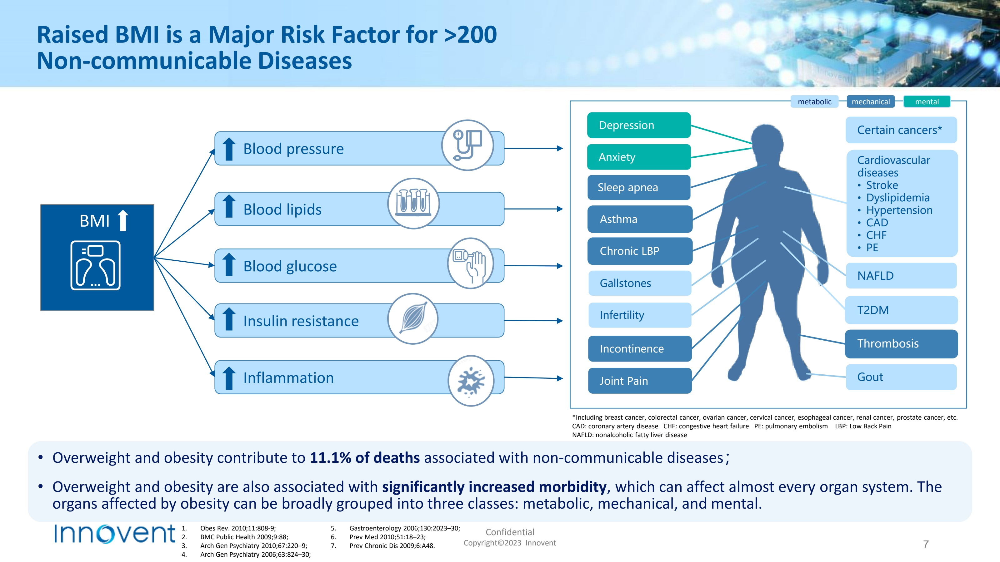

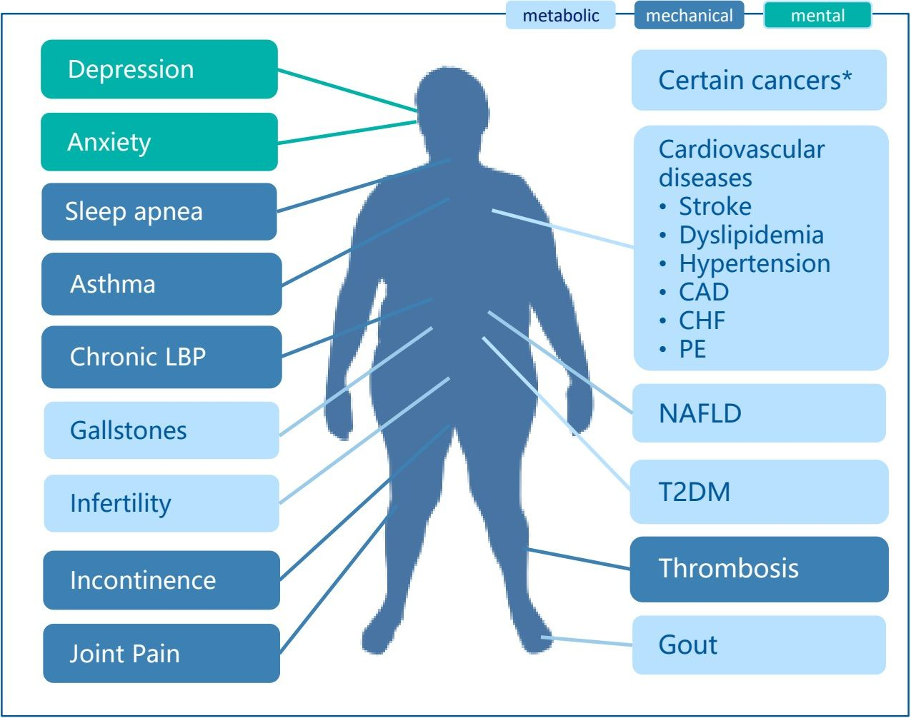

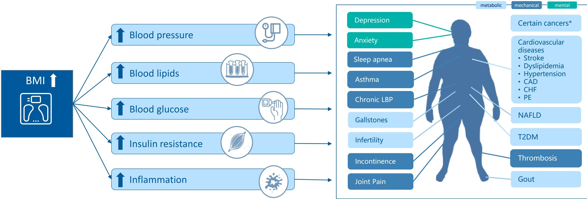

# Obesity Management Could Reverse Disease Trajectory

* **5%-15% weight loss within 6 months is recommended for patients with obesity or overweight with complications.**
* **Increased weight loss percentage is associated with increased improvements in obesity-related risk factors and comorbidities, and could be of significant benefit for patients.**

| Weight Loss (%)       | 0-5%                                     | 5-10%                                                                   | 10-15%                                                                                                                              | ≥15%                                                    |
| --------------------- | ---------------------------------------- | ----------------------------------------------------------------------- | ----------------------------------------------------------------------------------------------------------------------------------- | ------------------------------------------------------- |
| \*\*Comorbidities\*\* | \[x] Hypertension \[x] Hyperglycemia | \[x] T2DM Prevention \[x] NAFLD \[x] Dyslipidemia \[x] PCOS | \[x] T2DM Remission \[x] Incontinence \[x] GERD \[x] NASH \[x] Sleep Apnea \[x] CV diseases \[x] Joint Pain | \[x] T2DM Remission \[x] CHF \[x] CV death rate |

1. AMERICAN ASSOCIATION OF CLINICAL ENDOCRINOLOGISTS AND AMERICAN COLLEGE OF ENDOCRINOLOGY COMPREHENSIVE CLINICAL PRACTICE GUIDELINES FOR MEDICAL CARE OF PATIENTS WITH OBESITY; Endocr Pract. 2016 Jul;22 Suppl 3:1-203. doi: 10.4158/EP161365.GL. Epub 2016 May 24 .

PCOS: polycystic ovary syndrome NASH: Non-alcoholic steatohepatitis GERD: gastroesophageal reflux disease

Innovent logo

Confidential
Copyright© 2023 Innovent

8

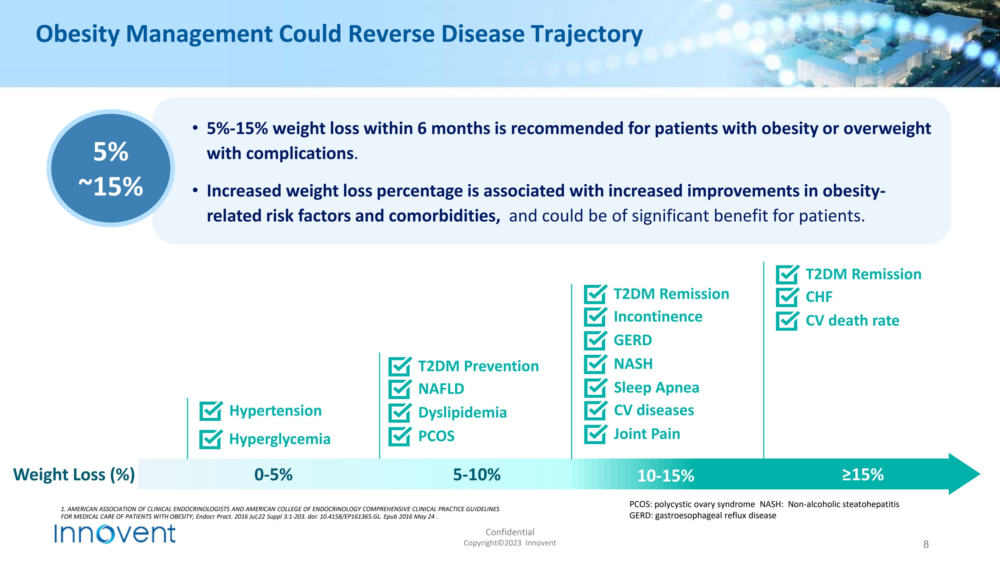

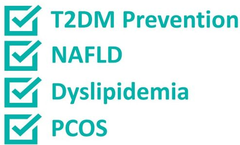

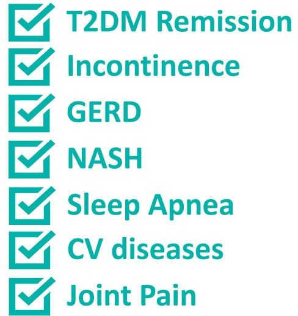

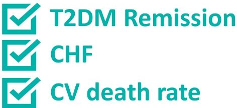

Innovent building background

# Obesity Management is Highly Beneficial in T2DM Treatment

Two digit or more significant weight loss may lead to the remission of T2DM

## ~50% T2DM adult patients
in China are living with overweight or obesity

| Category             | Population (M) |
| -------------------- | -------------- |
| Diabetes             | 140M           |
| Overweight / Obesity | 500M           |

**T2DM incidence rates in Chinese population:**

* 8.8% in BMI< 25 group;
* 13.8% in 25≤BMI<30 group;
* **20.1% in BMI≥30 group.**

Disease Progression and Weight Loss diagram showing icons for person, stomach, blood drop with plus, and hand with glucose monitor. Arrows indicate Disease Progression moving right and Weight Loss moving left.

* <u>**T2DM prevention:**</u> There is strong and consistent evidence that obesity management can delay the progression from prediabetes to T2DM.

* <u>**Beneficial in T2DM treatment:**</u> In patients with T2DM who also have overweight or obesity, modest and sustained weight loss (>5%) has been shown to improve glycemic control, reduce the need for glucose-lowering medications and result in metabolic benefits including lowering of blood pressure and blood lipids, improving insulin resistant and β-cell function.

* <u>**Potential of T2DM remission:**</u> Increased weight loss percentage was associated with increased odds of T2DM remission, starting with 10–15%.

\* 1. JAMA. 2021 Dec 28;326(24):2498-2506. doi: 10.1001/jama.2021.22208.Prevalence and Treatment of Diabetes in China, 2013-2018

\* 2. Chinese Diabetes Society, Guideline for the prevention and treatment of type 2 diabetes mellitus in China(2020 edition)

\* 3. American Diabetes Association; 8. Obesity Management for the Treatment of Type 2 Diabetes: Standards of Medical Care in Diabetes—2021. Diabetes Care 1 January 2021; 44 (Supplement_1): S100–S110.

\* 4. Hou X, Lu J, Weng J, Ji L, Shan Z, Liu J, et al. (2013) Impact of Waist Circumference and Body Mass Index on Risk of Cardiometabolic Disorder and Cardiovascular Disease in Chinese Adults: A National Diabetes and Metabolic Disorders Survey. PLoS ONE 8(3): e57319.
\* 5. Ameena Meerasa, Satya Dash; Weighing in on Type 2 Diabetes Remission. Diabetes Care 5 January 2022; 45 (1): 28–30.

Innovent logo

Confidential
Copyright© 2023 Innovent

9

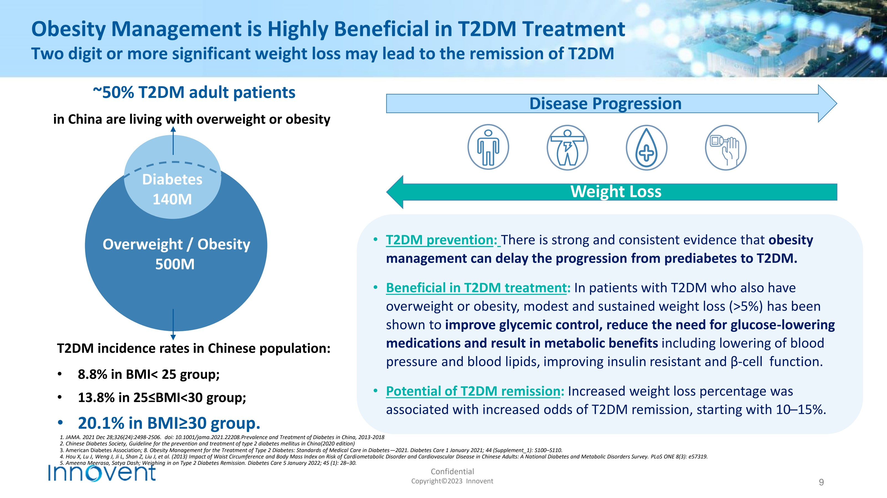

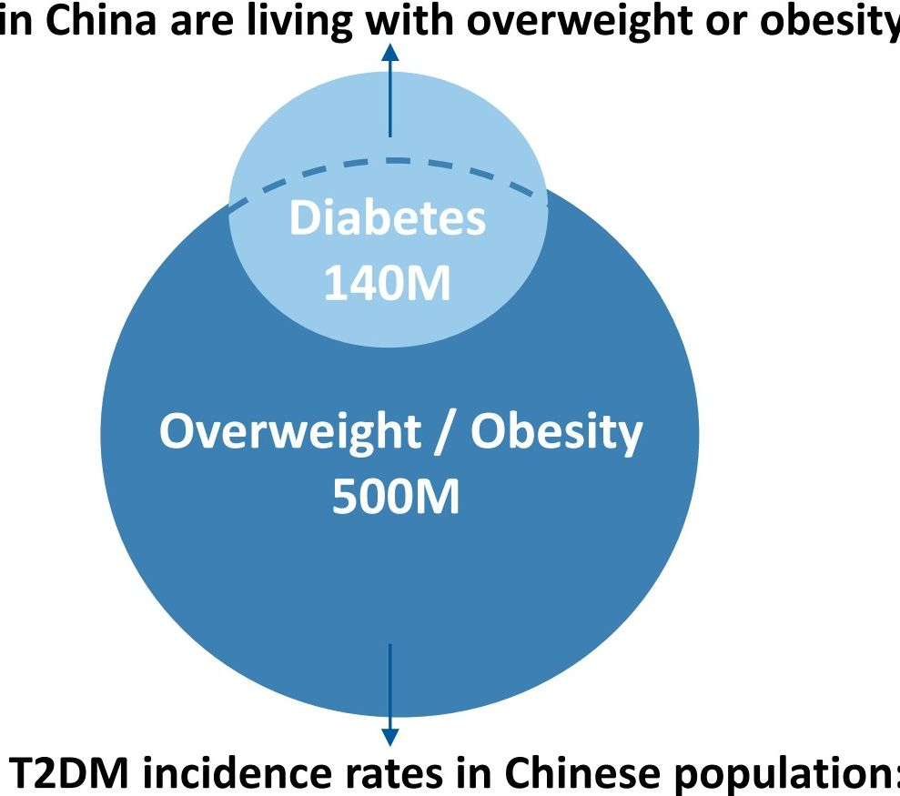

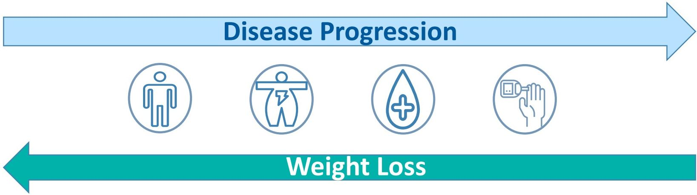

# Lack of Satisfactory Measures Calls for Breakthrough in Obesity Management for Huge Population in China

Lifestyle Intervention icon

## Lifestyle Intervention

**Low Compliance**

* Lack of established approach

* Intensive time commitment

* Self-management disparities

* Non-ideal outcome

China is in lack of established and comprehensive lifestyle intervention approach for widespread use

Pharmacotherapy icon

## Pharmacotherapy

**<1% treated**

* Lack of effective medicines

* Insufficient response

* Safety and tolerability issues of current thearpy

* Concomitant medications limit

Only Orlistat is approved for weight loss use in China. It is difficult to meet various clinical needs and has limited efficacy and serious adverse effects.

Bariatric Surgery icon

## Bariatric Surgery

**~0.25% treated**

* Psychological resistance

* Considerable cost

* Weight rebound

* Short / long term complications

The adoption of bariatric surgery in China faces many obstacles, such as a series of serious postoperative complications

Innovent logo

Confidential

Copyright© 2023 Innovent

10

1. Zeng Q, et al. Lancet Diabetes Endocrinol. 2021; 9(6): 393-405

2. Greater China Bariatric and Metabolic Surgery Database 2020 Annual Report[J]. Chinese Journal of Practical Surgery,2021,41(5):533-542.

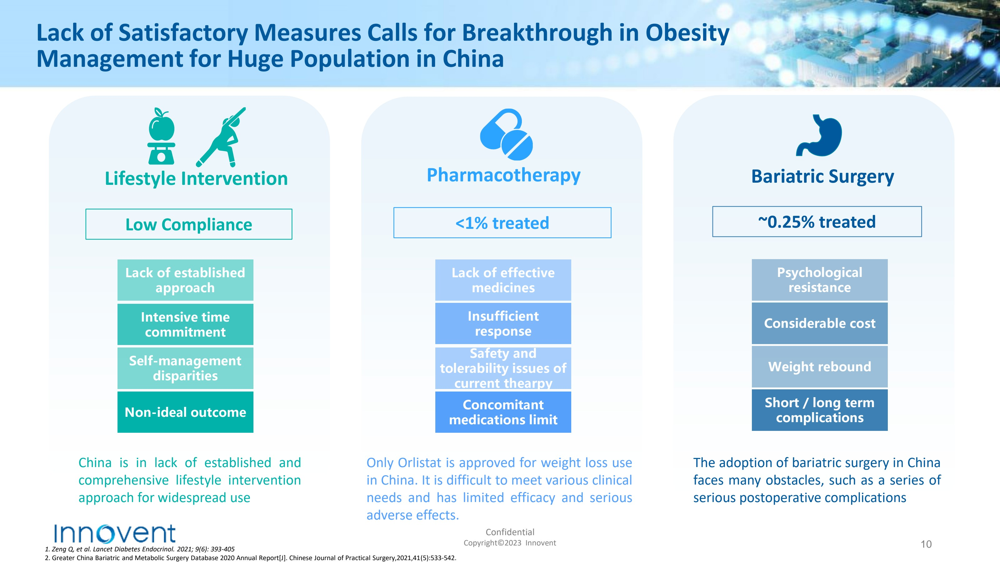

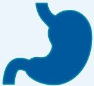

# Mazdutide Development Overview and Clinical Update

**Dr. Lei Qian**

*VP, Non-oncology Clinical Development*

Innovent logo

# <u>Mazdutide (IBI362) : Globally First GLP-1R/GCGR Dual Agonist in Phase 3</u>
## Potentially best-in-class therapy for obesity and diabetes

| Mazdutide Development Overview | Mazdutide Development Overview Ph2 | Mazdutide Development Overview Ph3 | Mazdutide Development Overview Expected launch |
| ------------------------------ | -------------------------------------- | -------------------------------------- | -------------------------------------------------- |
| Obesity (6mg)                  | GLORY-1 (Ph3) initiated in 22Q4        |                                        | Late 2024\~ early 2025                         |
| Obesity (9mg)                  | Ph2 readout in 23Q2                    | Ph3 planned in 23                      | 2026                                               |
| T2DM (6mg)                     | DREAMS-1 (Ph3) initiated in 23Q1       |                                        | 2025                                               |
|                                | DREAMS-2 (Ph3) initiated in 23Q1       |                                        | 2025                                               |
| NASH                           | IND received                           |                                        |                                                    |

* **Potential best-in-class therapy to change treatment regimen for huge obese and overweight population**

* **Unique clinical development strategy to address needs of different population**

    - 6mg for obesity and overweight: Phase 3 ongoing since 22Q4; robust weight loss effect for broad obese and certain overweight population

    - 9mg for obesity: Phase 2 achieved primary endpoint in 23Q2 with potentially bariatric surgery equivalent efficacy for moderate to severe obesity

    - 6mg T2DM: Phase 3 ongoing since 23Q1; both weight loss and glycemic control for long-term disease management benefits of diabetes

Innovent logo

Confidential
Copyright© 2023 Innovent

12

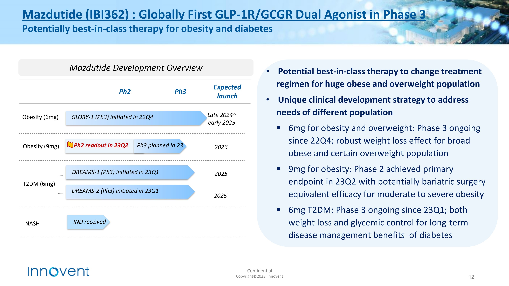

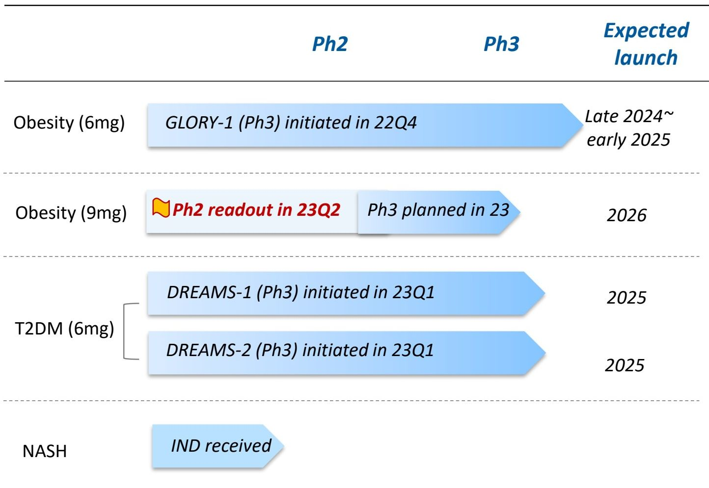

# <u>Mazdutide 9 mg Phase 2 in Chinese Adults with Obesity</u>

## A potentially more ideal treatment for moderate to severe obesity than surgery

> *Among the GLP-1 class drugs approved and under clinical development globally, mazdutide 9mg is...*

Icon of a person with a weight scale symbol

* The **first** study suitable for **moderate to severe obesity** where metabolic surgery is the only main treatment option today

Icon of a star on a pedestal

* The **first** dual-target agonist achieved **>15%** weight loss in 24-week treatment, showing **surgery-equivalent** weight loss efficacy

Icon of a bar chart with an upward arrow

* The **first** to develop different dose regimes for **different degrees of obesity**, with robust weight loss in both 6mg and 9mg mazdutide

Icon of a shield with a checkmark

* **Consistently favorable** tolerability and safety profile in 9mg mazdutide as previously seen in 6mg mazdutide

Innovent logo

Confidential
Copyright© 2023 Innovent

13

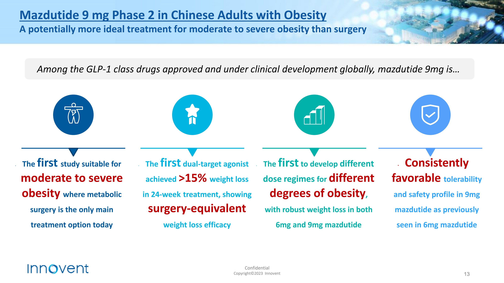

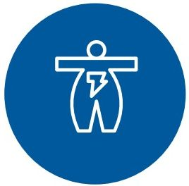

# Mazdutide 9 mg Phase 2 in Chinese Adults with Obesity

## Study design

Study design diagram showing titration of Mazdutide 9.0 mg vs Placebo over 48 weeks, with primary endpoint at 24 weeks and baseline characteristics: Mean Age 34 yrs, Mean Height 168.0 cm, Mean Weight 96.9 kg, Mean BMI 34.3 kg/m²

* A randomized, double-blind, placebo-controlled Phase 2 clinical study (NCT04904913).

* Primary endpoint: percentage change in body weight from baseline versus placebo after 24 weeks of treatment.

* The study will also extend treatment to 48 weeks.

Innovent logo

Confidential
Copyright© 2023 Innovent

14

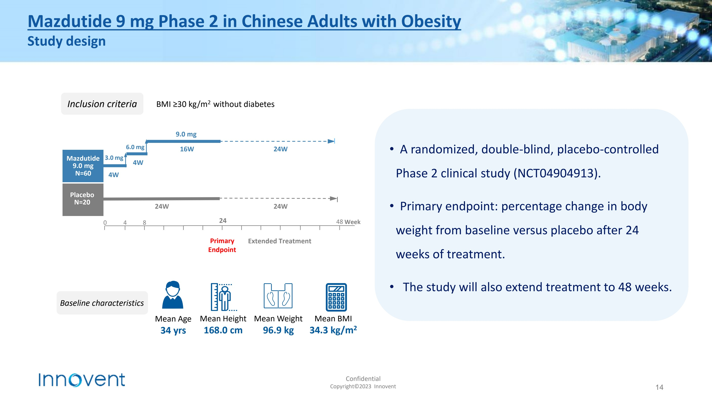

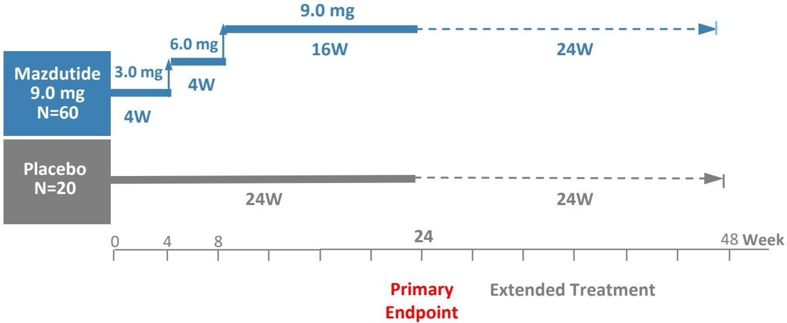

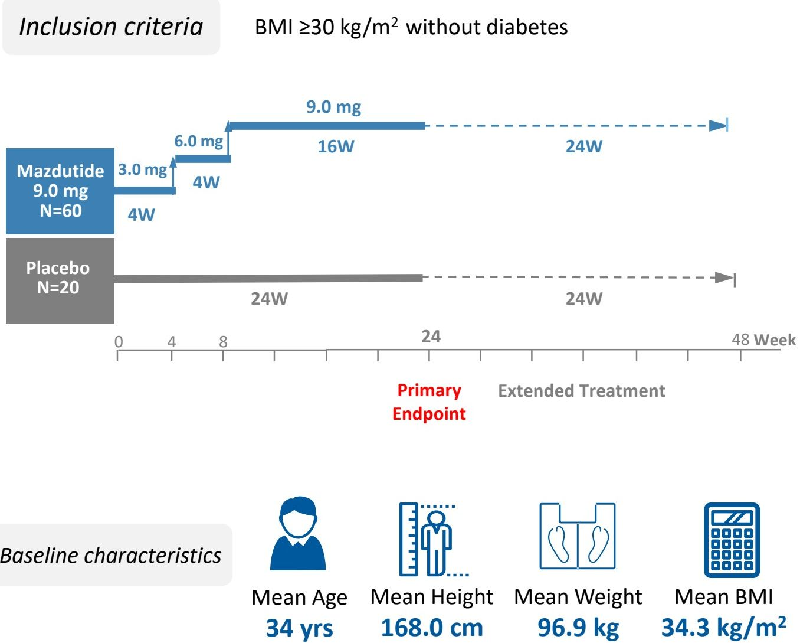

# <u>Mazdutide 9 mg Phase 2 in Chinese Adults with Obesity</u>
## Positive topline results with 15.4% mean weight loss versus placebo

### Primary Endpoint

Placebo-adjusted mean body weight change from baseline: mazdutide 9mg at Week 24

<u>mean baseline weight 96.9 kg</u>

Graphic showing a large downward arrow indicating weight loss for Mazdutide 9 mg. Inside the arrow are the values -15.4% and -14.7 kg.

* Mazdutide 9mg demonstrated superior body weight loss to placebo.

* After 24 weeks, treatment difference of mazdutide 9mg versus placebo:

    - -15.4% (95%CI: -18.8%, -11.9%) mean body weight percent change from baseline, P<0.0001;

    - -14.7 kg (95%CI: -17.9 kg, -11.5 kg) mean body weight change from baseline, P<0.0001.

* A trend of continuous decline of body weight was observed at Week 24 and we expect longer treatment will bring more weight loss.

Innovent logo

Confidential
Copyright© 2023 Innovent

15

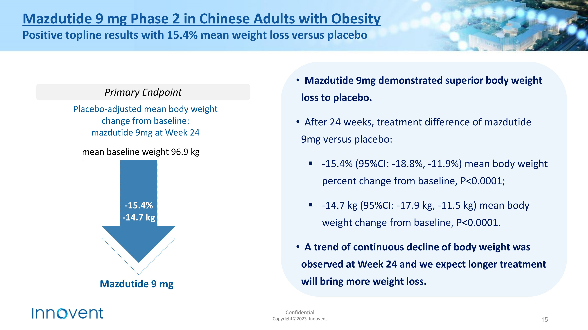

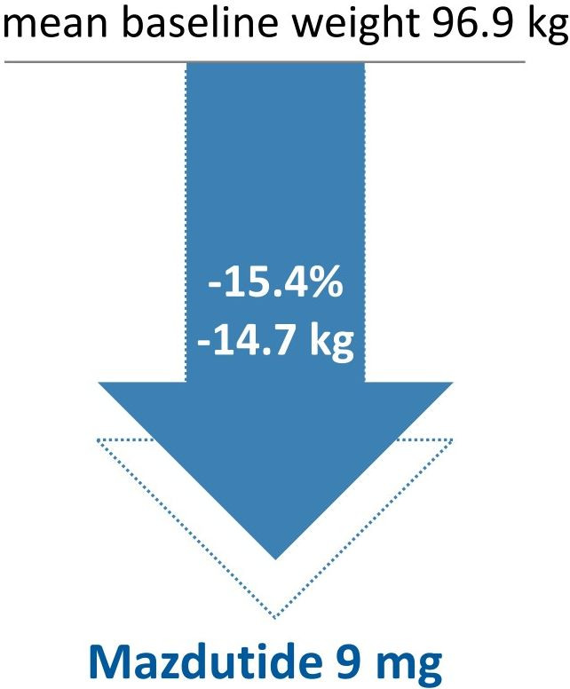

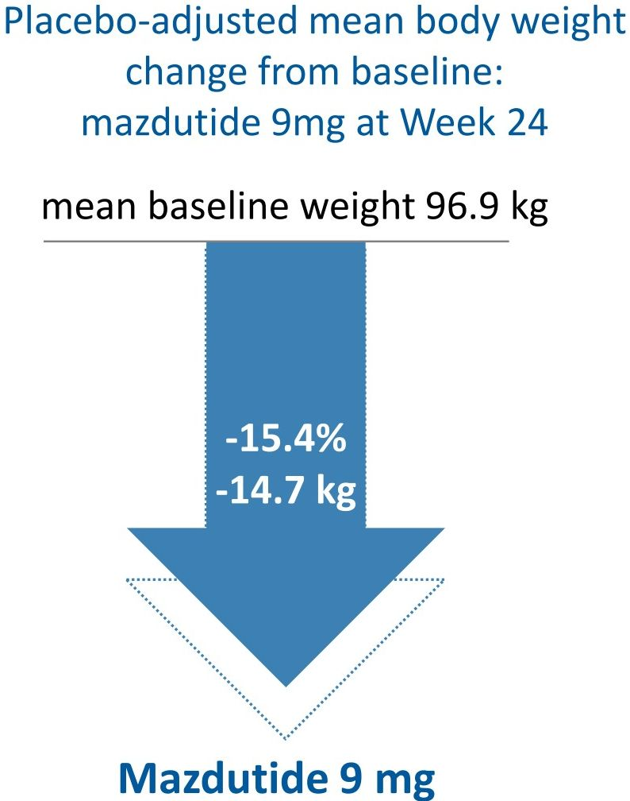

# <u>Mazdutide 9 mg Phase 2 in Chinese Adults with Obesity</u>

## 21.7% participants achieved ≥20% weight loss at Week 24

> *Key Secondary Endpoint*

Proportion of participants achieved ≥ 5% weight loss from baseline: mazdutide 9mg at Week 24

| Category         | Percentage of participants (%) |
| ---------------- | ------------------------------ |
| Weight Loss ≥5%  | 81.7                           |
| Weight Loss ≥10% | 65.0                           |
| Weight Loss ≥15% | 31.7                           |
| Weight Loss ≥20% | 21.7                           |

* At Week 24, 81.7%, 65.0%, 31.7% and 21.7% of participants in the mazdutide 9 mg group achieved ≥5%, ≥10%, ≥15% and ≥20% weight loss, respectively.

* No subject in placebo group lost 5% or more of body weight.

Innovent logo

Confidential
Copyright© 2023 Innovent

16

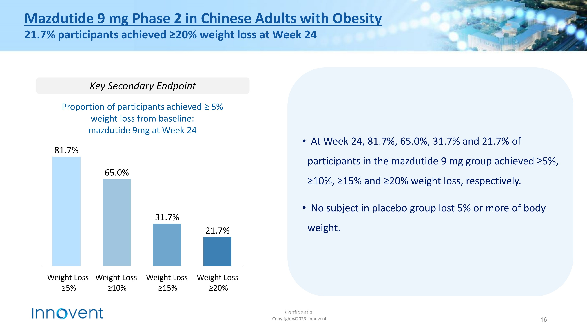

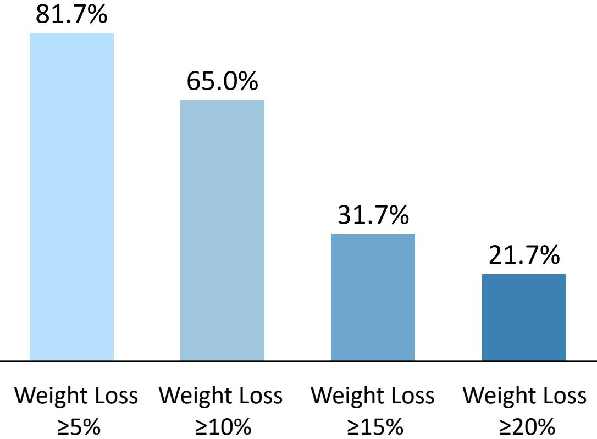

# <u>Mazdutide 9 mg Phase 2 in Chinese Adults with Obesity</u>

## Overall tolerability and safety profile was favorable

* Stomach icon Except for COVID-19 infection, the most commonly reported adverse events were gastrointestinal-related adverse events, most of which were **mild or moderate and transient**.

* Exit icon The **drop-out rate** of the mazdutide group was **lower than** that of the placebo group.

* Person with pencil icon **No subject** in the mazdutide group discontinued treatment due to adverse events.

* Cross icon **No serious adverse events occurred.**

The study is still in progress. Full data and analysis of primary endpoints, other secondary and exploratory endpoints, and safety profile will be further analyzed and disclosed after the completion of the study.

Innovent logo

Confidential
Copyright© 2023 Innovent

17

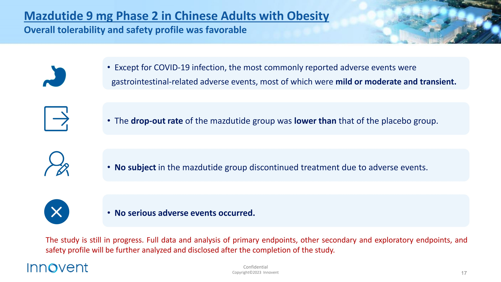

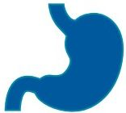

# <u>Mazdutide in Obesity or Overweight</u>

## Potentially best-in-class weight reduction

### Indirect comparison of GLP-1 class drugs

#### Placebo-adjusted mean body weight reduction at Week 24

| Drug                    | mean baseline weight | BMI  | Weight reduction (%) | Weight reduction (kg) |
| ----------------------- | -------------------- | ---- | -------------------- | --------------------- |
| Liraglutide\* 3 mg (QD) | 106.2 kg             |      | -5.0%                | -5.2KG                |
| Semaglutide\* 2.4 mg    | 105.6 kg             |      | -8.0%                | -7.7KG                |
| Tirzepatide\* 15 mg     | 105.4 kg             |      | -12.0%               | -13.0KG               |
| Mazdutide 6 mg          | 89.3 kg              | 31.8 | -12.6%               | -10.9KG               |
| Mazdutide 9 mg          | 96.9 kg              | 34.3 | -15.4%               | -14.7KG               |

\* Not approved in China for obesity

* After 24 weeks of treatment, mazdutide 6 mg & 9 mg regimens can induce a weight loss of 12.6% (10.9kg) and 15.4% (14.7kg) respectively in different baseline group.

* The results are **competitive to** the most effective multi-target GLP-1 receptor agonist drug.

* Mazdutide 9mg even demonstrated **bariatric surgery equivalent efficacy**. Single-target GLP-1 drugs have limited efficacy in this population and hardly can achieve placebo-adjusted 15% weight loss.

innovent logo

Confidential Copyright© 2023 Innovent

24-week weight loss data of liraglutide 3 mg, semaglutide 2.4 mg and tirzepatide 15 mg were estimated from published results of SCALE1, STEP-12 and SURMOUNT-13 study, respectively.

1Pi-Sunyer X, et al. N Engl J Med. 2015. 2Khoo TK, et al. N Engl J Med. 2021. 3Jastreboff AM, et al. N Engl J Med. 2022

18

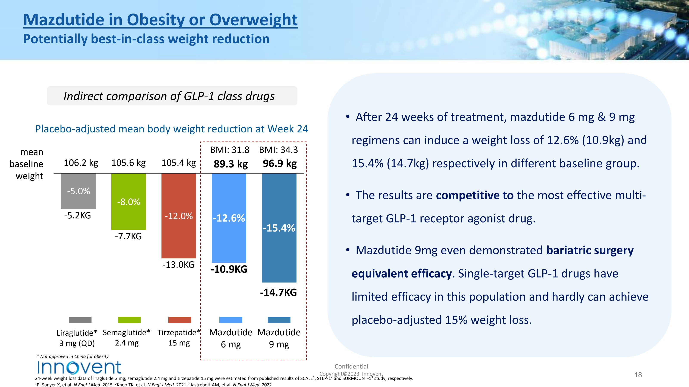

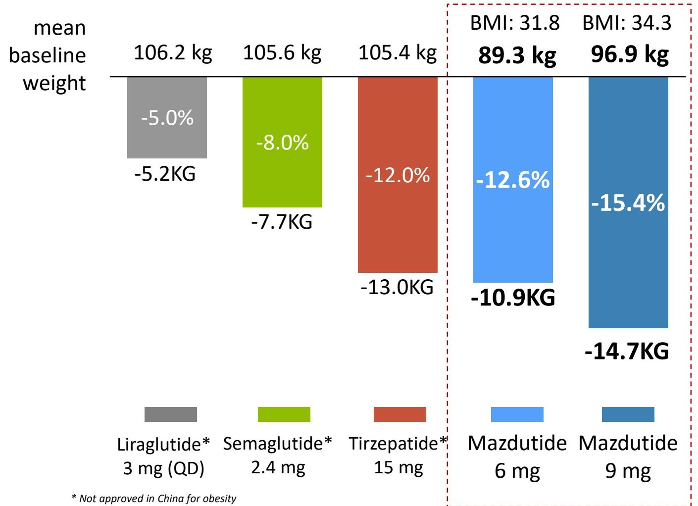

# <u>Mazdutide 9mg and 6mg</u>

## Developing two dose regimens to treat different degrees of obesity

| Intervention Type                        | Min Weight Loss (%) | Max Weight Loss (%) |
| ---------------------------------------- | ------------------- | ------------------- |
| Lifestyle Intervention                   | 3                   | 10                  |
| Lifestyle Intervention + Pharmacotherapy | 5                   | 22                  |
| Bariatric Surgery                        | 17                  | 35                  |

* Potential best-in-class weight loss efficacy

* Broader coverage indicated for obese (BMI≥28kg/m²) and certain overweight (24 kg/m²≤ BMI < 28 kg/m²)* population

\*Body mass Index (BMI) ≥28 kilograms per square meter (kg/m²), or ≥24 kg/m² and previous diagnosis with at least one of the following comorbidities: prediabetes, hypertension, dyslipidemia, fatty liver, weight bearing joint pain, dyspnea or obstructive sleep apnea caused by obesity/overweight.

| Treatment      | Weight Loss at 24W (%) |
| -------------- | ---------------------- |
| Mazdutide 6 mg | 12.6                   |

A trend of continuous decline of body weight was observed at Week 24 and expect longer treatment should bring more weight loss.

* Superior, bariatric-surgery-like efficacy

* Filling the pharmacotherapy gap for moderate and severe obese population with substantial unmet need.

| Treatment      | Weight Loss at 24W (%) |
| -------------- | ---------------------- |
| Mazdutide 9 mg | 15.4                   |

A trend of continuous decline of body weight was observed at Week 24 and expect longer treatment should bring more weight loss.

Innovent logo

Confidential
Copyright©2023 Innovent

19

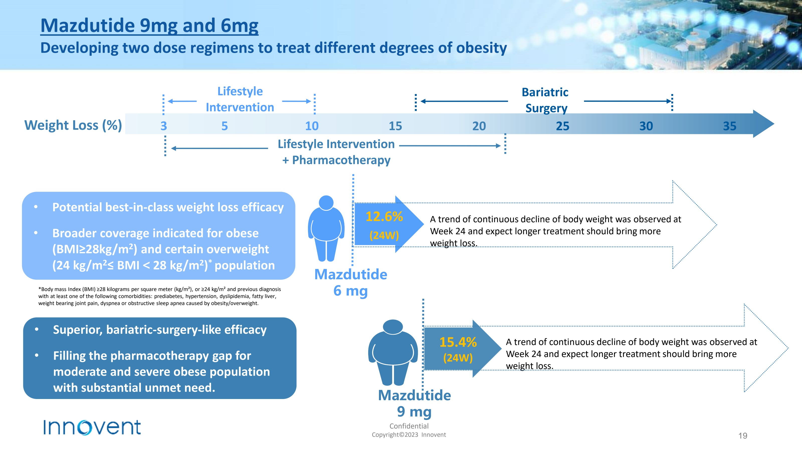

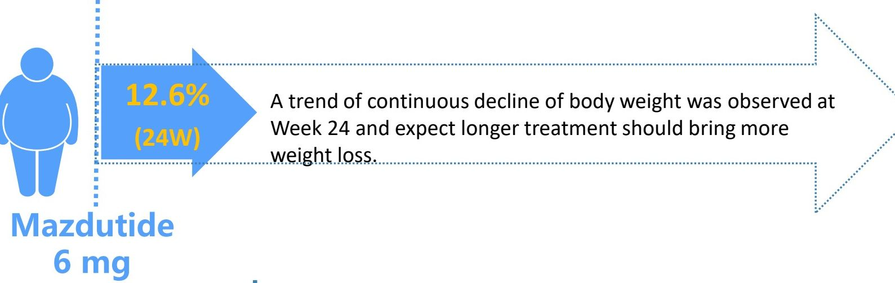

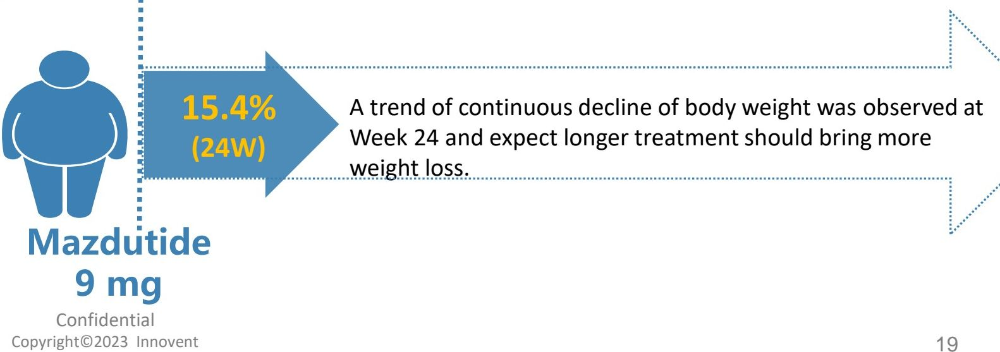

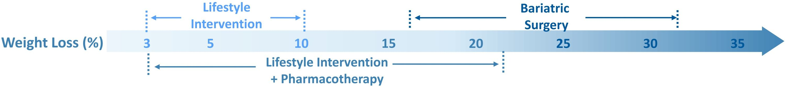

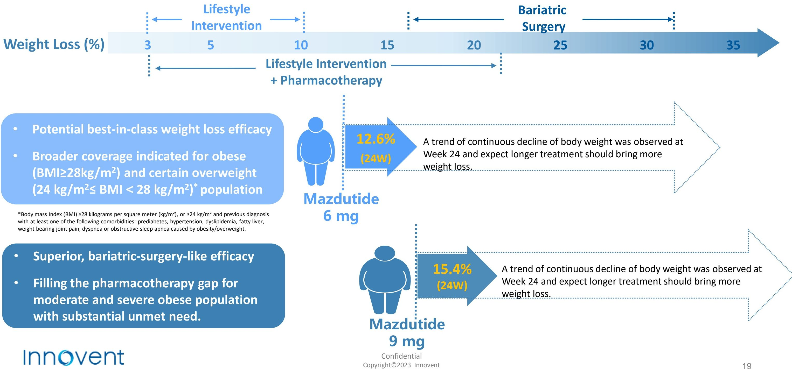

# <u>Mazdutide 6mg Phase 2 in Chinese T2DM Patients</u>

## Achieve both weight loss and glycemic control for long-term benefits

### Primary & Key Secondary Endpoints

**HbA1c reduction from baseline at Week 20**

| Time (weeks) | Mazdutide 6 mg | Dulaglutide 1.5 mg | Placebo |
| ------------ | -------------- | ------------------ | ------- |
| 0            | 0              | 0                  | 0       |
| 4            | -0.55          | -0.8               | 0       |
| 8            | -0.95          | -1.2               | 0.05    |
| 12           | -1.25          | -1.4               | 0.05    |
| 16           | -1.4           | -1.4               | 0.1     |
| 20           | -1.55          | -1.35              | 0.03    |

* HbA1c reduction trend is sustained in patients receiving 6mg mazdutide at Week 20.

* At Week 20, 49% patients in the mazdutide 6mg group achieved HbA1c <7.0% and body weight reduction ≥5% from baseline, compared to 12% in dulaglutide 1.5mg group and 0% in placebo group, while weight loss is highly beneficial in T2DM treatment and may even lead to T2DM remission.

**Proportion of participants achieving HbA1c and weight loss targets at Week 20**

| Target                        | Mazdutide 6 mg | Dulaglutide 1.5 mg | Placebo |
| ----------------------------- | -------------- | ------------------ | ------- |
| ≥5% weight loss               | 57             | 18                 | 10      |
| ≥10% weight loss              | 24             | 0                  | 0       |
| ≥5% weight loss and HbA1c <7% | 49             | 12                 | 0       |

* Multiple metabolic benefits observed in patients receiving mazdutide including reduction in waist circumference, BMI, blood pressure, lipid levels and serum uric acid.

Innovent logo

Confidential
Copyright© 2023 Innovent

20

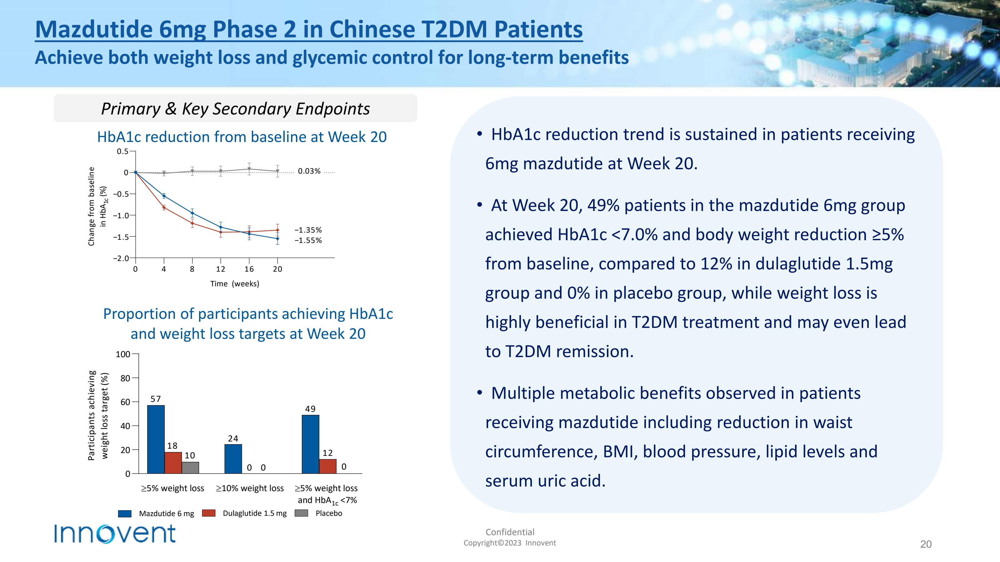

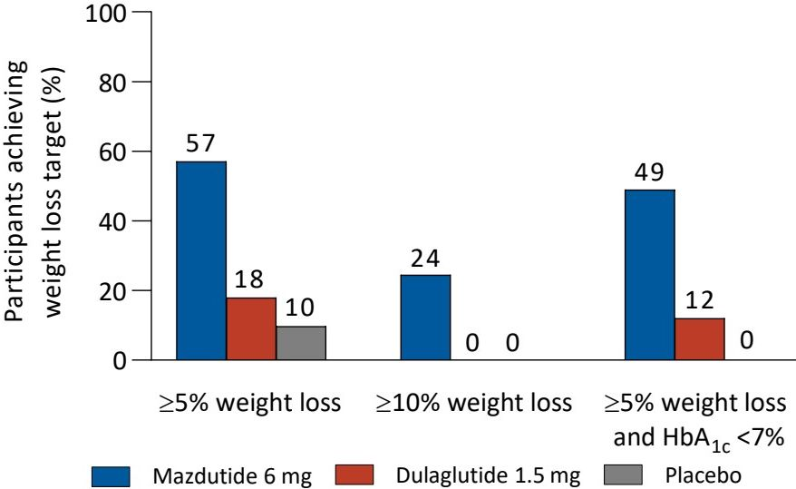

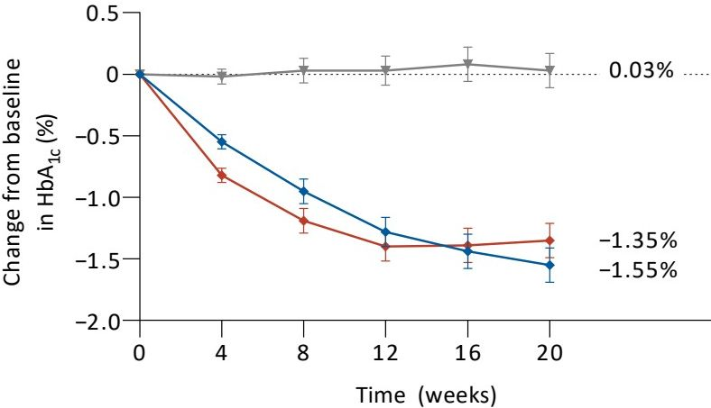

# Overall Safety Profile and Metabolic benefits Observed for Mazdutide

## Overall tolerability and safety profiles are favorable

## Multiple metabolic benefits observed

* Favorable and tolerable safety profile in over 1500 subjects exposed to mazdutide in all clinical programs; the most common adverse reactions (AEs) were gastrointestinal related AEs, most of which were mild to moderate and transient.

* Overall safety profiles are similar to other GLP-1 based therapies as reported.

<mark>More data and full analysis of Phase 2 study of mazdutide 6mg for obesity and Phase 2 study of mazdutide 6mg for T2DM is planned to be disclosed in future academic journals.</mark>

Diagram showing multiple metabolic benefits: Triglyceride, LDL cholesterol, Total cholesterol, Blood glucose, Liver Enzyme, Insulin sensitivity, Blood pressure, and Serum uric acid.

Innovent logo

Confidential
Copyright© 2023 Innovent

21

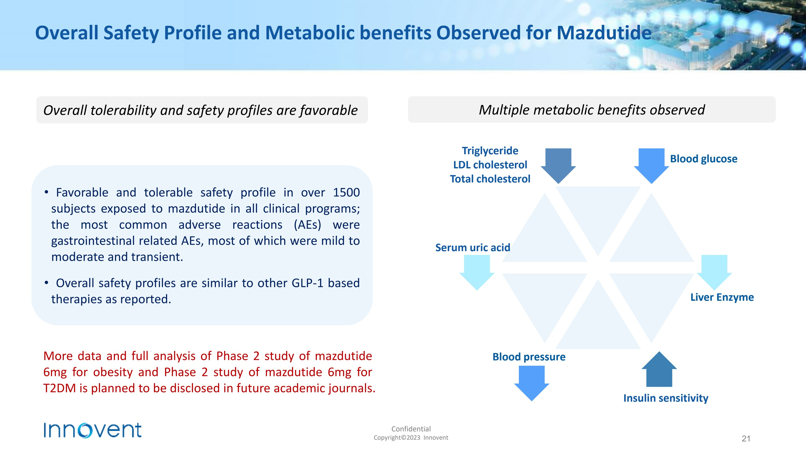

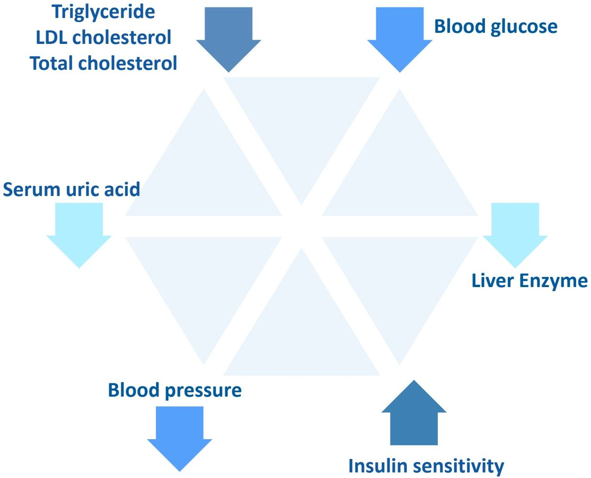

# Mazdutide Simplified Dose-Escalation Regimen

## Only two steps to enter maintenance dose

**Mazdutide 6mg/9mg**
* 3 strengths (pens)
* 8-week dose-escalation

| Time Period       | Mazdutide 6mg Dose | Mazdutide 9mg Dose |
| ----------------- | ------------------ | ------------------ |
| 0W - 4W           | 2.0 mg             | 3.0 mg             |
| 4W - 8W           | 4.0 mg             | 6.0 mg             |
| 8W+ (Maintenance) | 6.0 mg             | 9.0 mg             |

**Semaglutide 2.4mg**
* 5 strengths (pens)
* 16-week dose-escalation

| Time Period        | Semaglutide 2.4mg Dose |
| ------------------ | ---------------------- |
| 0W - 4W            | 0.25 mg                |
| 4W - 8W            | 0.5 mg                 |
| 8W - 12W           | 1.0 mg                 |
| 12W - 16W          | 1.7 mg                 |
| 16W+ (Maintenance) | 2.4 mg                 |

**Tirzepatide 15mg**
* 6 strengths (pens)
* 20-week dose-escalation

| Time Period        | Tirzepatide 15mg Dose |
| ------------------ | --------------------- |
| 0W - 4W            | 2.5 mg                |
| 4W - 8W            | 5.0 mg                |
| 8W - 12W           | 7.5 mg                |
| 12W - 16W          | 10.0 mg               |
| 16W - 20W          | 12.5 mg               |
| 20W+ (Maintenance) | 15.0 mg               |

Innovent logo

Confidential
Copyright© 2023 Innovent
22

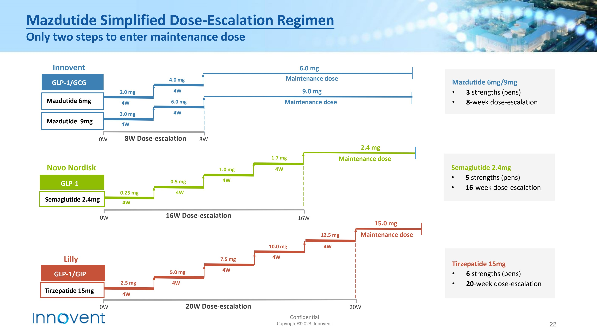

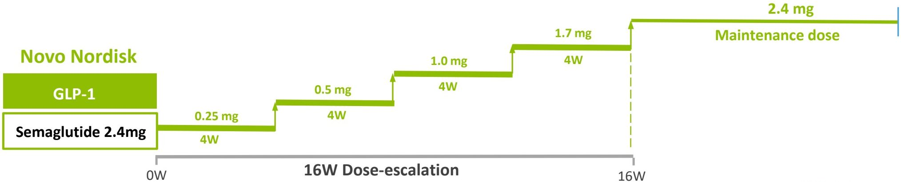

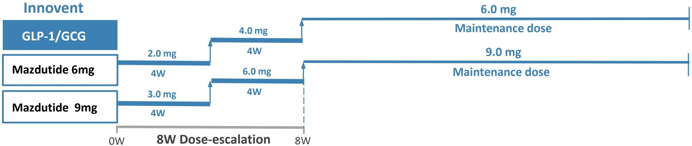

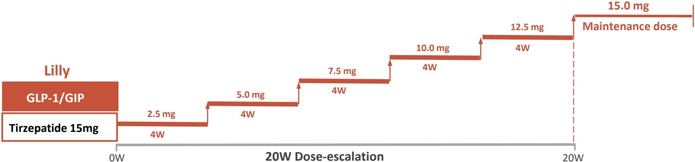

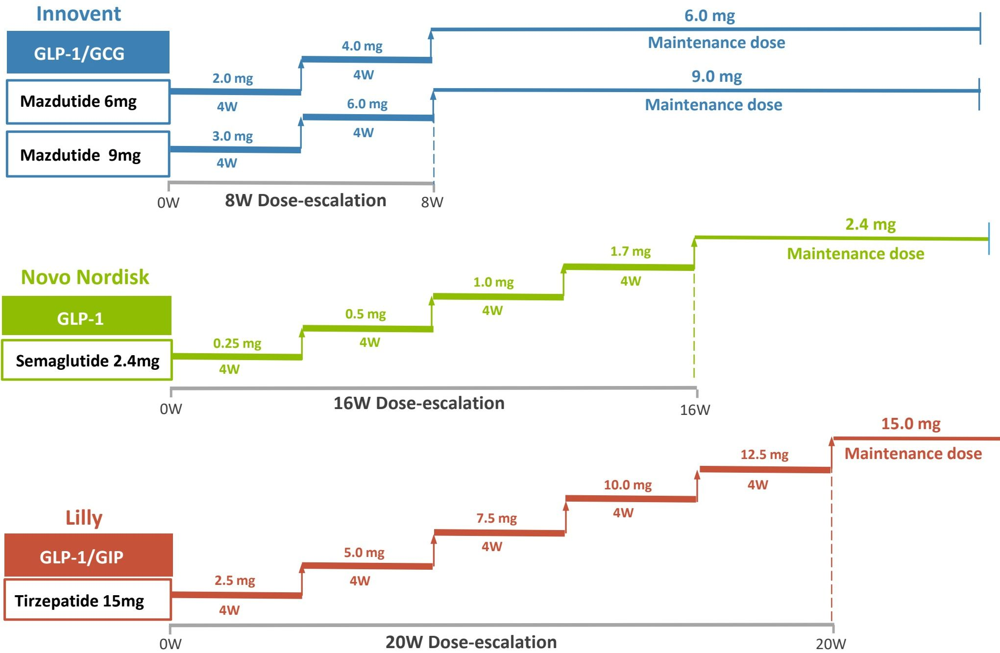

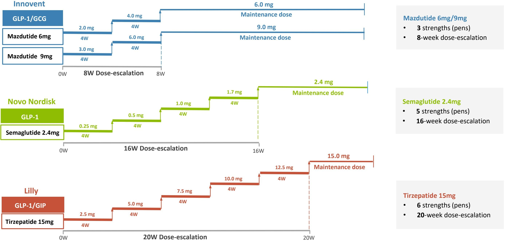

# Summary and Key Takeaways

**Substantial Unmet Medical Need in Obesity and T2DM in China**
* Overweight and obesity are established risk factors for major NCDs
* Over 500m adults, including 50% T2DM patients live with obesity or overweight in China, with huge unmet need for effective weight management measures

**Superior Clinical Profile of Mazdutide**
* Best-in-class weight loss effect; both glycemic control and weight loss for diabetes management benefit
* Favorable and tolerable safety profile in over 1500 subjects exposed to mazdutide in all programs
* Multiple metabolic benefits observed

**Frontrunner to Potentially Change China’s Obese Treatment Standard**
* No GLP-1 class drug has filed NDA in China for obesity till now
* One of the only two dual agonists in registrational stage in China; NDA planned in end-23 to early-24
* High quality and efficient product development platform to advance mazdutide development on track

**Reliable Supply and Commercialization Plan**
* Established manufacturing capacity in plan to meet the potential huge demand
* Product potential backed by Innovent’s differentiated CVM portfolio and commercialization capability

Innovent

Confidential
Copyright© 2023 Innovent

25

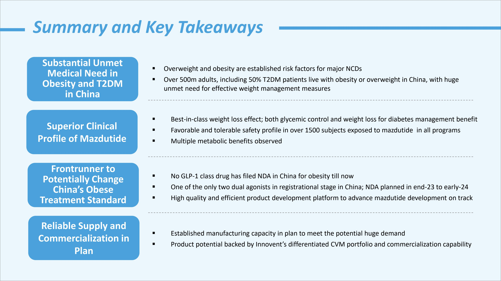

Background image of a scientist using a pipette in a laboratory setting

# Q&A

Innovent logo

# Disclaimer

This presentation includes forward-looking statements. All statements contained in this presentation other than statements of historical facts, including statements regarding future results of operations and financial position of Innovent Biologics ("Innovent" "we," "us" or "our"), our business strategy and plans, the clinical development of our product candidates and our objectives for future operations, are forward-looking statements. The words "anticipate," "believe," "continue," "estimate," "expect," "intend," "may," "will" and similar expressions are intended to identify forward-looking statements. We have based these forward-looking statements largely on our current expectations and projections about future events and financial trends that we believe may affect our financial condition, results of operations, business strategy, clinical development, short-term and long-term business operations and objectives and financial needs. These forward-looking statements are subject to a number of risks, uncertainties and assumptions. Moreover, we operate in a very competitive and rapidly changing environment. New risks emerge from time to time. It is not possible for our management to predict all risks, nor can we assess the impact of all factors on our business or the extent to which any factor, or combination of factors, may cause actual results to differ materially from those contained in any forward-looking statements we may make. In light of these risks, uncertainties and assumptions, the future events and trends discussed in this presentation may not occur and actual results could differ materially and adversely from those anticipated or implied in the forward-looking statements.

Although we believe that the expectations reflected in the forward-looking statements are reasonable, we cannot guarantee future results, levels of activity, performance, achievements or events and circumstances reflected in the forward-looking statements will occur. We are under no duty to update any of these forward-looking statements after the date of this presentation to conform these statements to actual results or revised expectations, except as required by law. You should, therefore, not rely on these forward-looking statements as representing our views as of any date subsequent to the date of this presentation.

This presentation also contains estimates and other statistical data made by independent parties and by us relating to market size and growth and other data about our industry. This data involves a number of assumptions and limitations, and you are cautioned not to give undue weight to such estimates. Neither we nor any other person makes any representation as to the accuracy or completeness of such data or undertakes any obligation to update such data after the date of this presentation. In addition, projections, assumptions and estimates of our future performance and the future performance of the markets in which we operate are necessarily subject to a high degree of uncertainty and risk.

This presentation may not be all inclusive and may not contain all of the information that you may consider material. Neither Innovent nor any of its affiliates, shareholders, directors, officers, employees, agents and advisors makes any expressed or implied representation or warranty as to the completeness, fairness, reasonableness of the information contained herein, and none of them shall accept any responsibility or liability for any loss or damage, whether or not arising from any error or omission in compiling such information or as a result of any party's reliance or use of such information. By attending or receiving this presentation you acknowledge that you will be solely responsible for your own assessment of our business, the market and our market position and that you will conduct your own analysis and be solely responsible for forming your own view of the potential future performance of our business.

This presentation is intended solely for investors that are qualified institutional buyers or institutional accredited investors solely for the purposes of familiarizing such investors with Innovent and determining whether such investors might have an interest in a securities offering contemplated by Innovent. Any such offering of securities will only be made pursuant to an exemption from, or in a transaction not subject to, the registration requirements of the U.S. Securities Act of 1933, as amended, or by means of a registration statement (including a prospectus) filed with the SEC, after such registration statement becomes effective. No such registration statement has been filed, or become effective, as of the date of this presentation. This presentation shall not constitute an offer to sell or the solicitation of an offer to buy any securities, nor shall there be any sale of any securities in any state or jurisdiction in which such offer, solicitation or sale would be unlawful prior to registration or qualification under the securities laws of any such state or jurisdiction.

Innovent

Confidential
Copyright© 2023 Innovent

25

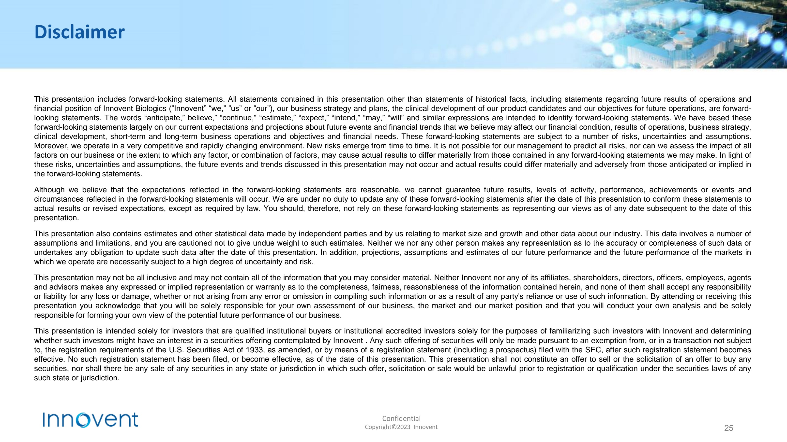

# Innovent
# Disclaimer

This presentation includes forward-looking statements. All statements contained in this presentation other than statements of historical facts, including statements regarding future results of operations and financial position of Innovent Biologics ("Innovent," "we," "us" or "our"), our business strategy and plans, the clinical development of our product candidates and our objectives for future operations, are forward-looking statements. The words "anticipate," "believe," "continue," "estimate," "expect," "intend," "may," "will" and similar expressions are intended to identify forward-looking statements. We have based these forward-looking statements largely on our current expectations and projections about future events and financial trends that we believe may affect our financial condition, results of operations, business strategy, clinical development, short-term and long-term business operations and objectives and financial needs. These forward-looking statements are subject to a number of risks, uncertainties and assumptions. Moreover, we operate in a very competitive and rapidly changing environment. New risks emerge from time to time. It is not possible for our management to predict all risks, nor can we assess the impact of all factors on our business or the extent to which any factor, or combination of factors, may cause actual results to differ materially from those contained in any forward-looking statements we may make. In light of these risks, uncertainties and assumptions, the future events and trends discussed in this presentation may not occur and actual results could differ materially and adversely from those anticipated or implied in the forward-looking statements.

Although we believe that the expectations reflected in the forward-looking statements are reasonable, we cannot guarantee future results, levels of activity, performance, achievements or events and circumstances reflected in the forward-looking statements will occur. We are under no duty to update any of these forward-looking statements after the date of this presentation to conform these statements to actual results or revised expectations, except as required by law. You should, therefore, not rely on these forward-looking statements as representing our views as of any date subsequent to the date of this presentation.

This presentation also contains estimates and other statistical data made by independent parties and by us relating to market size and growth and other data about our industry. This data involves a number of assumptions and limitations, and you are cautioned not to give undue weight to such estimates. Neither we nor any other person makes any representation as to the accuracy or completeness of such data or undertakes any obligation to update such data after the date of this presentation.

This presentation may not be all inclusive and may not contain all of the information that you may consider material. Neither Innovent nor any of its affiliates, shareholders, directors, officers, employees, agents or representatives makes any representation or warranty, expressed or implied, as to the accuracy or completeness of any of the information or opinions contained herein.

Confidential
Copyright© 2023 Innovent 26

