Innovent logo

# Innovent Biologics Clinical Data Update

Mazdutide (IBI362) Higher Dose 9mg
Phase 2 Clinical Update in Obesity (48 Weeks)

*October 30, 2023*

TO DEVELOP AND COMMERCIALIZE HIGH QUALITY BIOPHARMACEUTICALS THAT ARE AFFORDABLE TO ORDINARY PEOPLE.

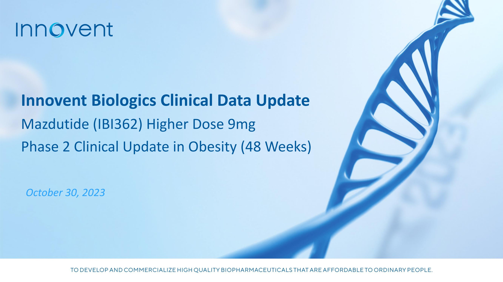

# Content

1 Mazdutide: Higher Dose 9mg Phase 2 Clinical Update

2 Appendix: Obesity and Overweight in China

This presentation includes forward-looking statements. All statements contained in this presentation other than statements of historical facts, including statements regarding future results of operations and financial position of Innovent Biologics ("Innovent" "we," "us" or "our"), our business strategy and plans, the clinical development of our product candidates and our objectives for future operations, are forward-looking statements. The words "anticipate," "believe," "continue," "estimate," "expect," "intend," "may," "will" and similar expressions are intended to identify forward-looking statements. We have based these forward-looking statements largely on our current expectations and projections about future events and financial trends that we believe may affect our financial condition, results of operations, business strategy,

clinical development, short-term and long-term business operations and objectives and financial needs. These forward-looking statements are subject to a number of risks, uncertainties and assumptions. Moreover, we operate in a very competitive and rapidly changing environment. New risks emerge from time to time. It is not possible for our management to predict all risks, nor can we assess the impact of all factors on our business or the extent to which any factor, or combination of factors, may cause actual results to differ materially from those contained in any forward-looking statements we may make. In light of these risks, uncertainties and assumptions, the future events and trends discussed in this presentation may not occur and actual results could differ materially and adversely from those anticipated or implied in the forward-looking statements. Although we believe that the expectations reflected in the forward-looking statements are reasonable, we cannot guarantee future results, levels of activity, performance, achievements or events and circumstances reflected in the forward-looking statements will occur. We are under no duty to update any of these forward-looking statements after the date of this presentation to conform these statements to actual results or revised expectations, except as required by law. You should, therefore, not rely on these forward-looking statements as representing our views as of any date subsequent to the date of this presentation.

This presentation also contains estimates and other statistical data made by independent parties and by us relating to market size and growth and other data about our industry. This data involves a number of assumptions and limitations, and you are cautioned not to give undue weight to such estimates. Neither we nor any other person makes any representation as to the accuracy or completeness of such data or undertakes any obligation to update such data after the date of this presentation. In addition, projections, assumptions and estimates of our future performance and the future performance of the markets in which we operate are necessarily subject to a high degree of uncertainty and risk. This presentation may not be all inclusive and may not contain all of the information that you may consider material. Neither Innovent nor any of its affiliates, shareholders, directors, officers, employees, agents and advisors makes any expressed or implied representation or warranty as to the completeness, fairness, reasonableness of the information contained herein, and none of them shall accept any responsibility or liability for any loss or damage, whether or not arising from any error or omission in compiling such information or as a result of any party's reliance or use of such information. By attending or receiving this presentation you acknowledge that you will be solely responsible for your own assessment of our business, the market and our market position and that you will conduct your own analysis and be solely responsible for forming your own view of the potential future performance of our business. This presentation is intended solely for investors that are qualified institutional buyers or institutional accredited investors solely for the purposes of familiarizing such investors with Innovent and determining whether such investors might have an interest in a securities offering contemplated by Innovent. Any such offering of securities will only be made pursuant to an exemption from, or in a transaction not subject to, the registration requirements of the U.S. Securities Act of 1933, as amended, or by means of a registration statement (including a prospectus) filed with the SEC, after such registration statement becomes effective. No such registration statement has been filed, or become effective, as of the date of this presentation. This presentation shall not constitute an offer to sell or the solicitation of an offer to buy any securities in any state or jurisdiction in which such offer, solicitation or sale would be unlawful prior to registration or qualification under the securities laws of any such state or jurisdiction.

Innovent logo Confidential Copyright © 2023 Innovent 2

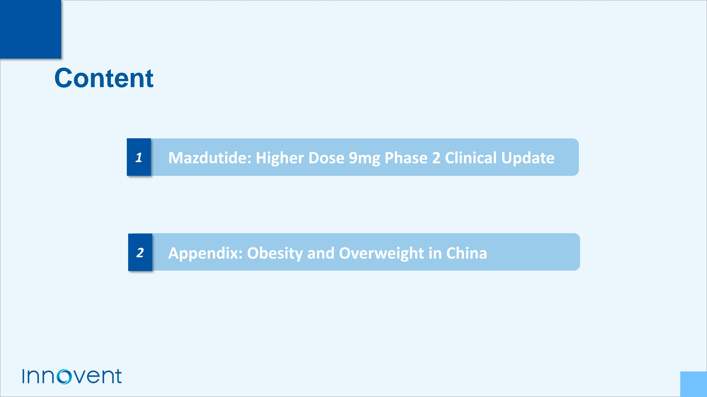

# Mazdutide Higher Dose 9mg
# Phase 2 Clinical Update in Obesity

Innovent logo

# <u>Differentiated Mechanism of Mazdutide as a Novel GLP-1R/GCGR Dual Agonist</u>

## GCGR agonism may provide additional benefits in treating obesity and metabolic disorder

*Targeting GLP-1R and GCGR may act on both sides of the energy balance equation*

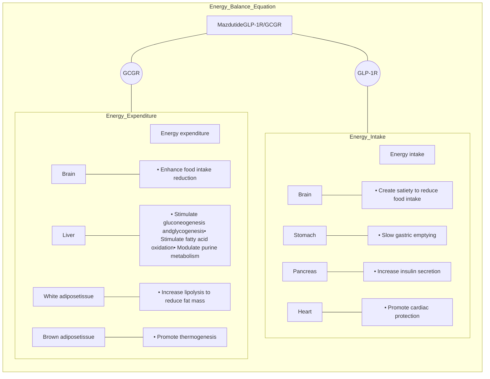
```mermaid
graph TD
    subgraph Energy_Balance_Equation
        direction TB
        M[MazdutideGLP-1R/GCGR]
        
        subgraph Energy_Intake
            direction LR
            EI_Icon[Energy intake]
            Brain_L[Brain] --- L1["• Create satiety to reduce food intake"]
            Stomach[Stomach] --- L2["• Slow gastric emptying"]
            Pancreas[Pancreas] --- L3["• Increase insulin secretion"]
            Heart[Heart] --- L4["• Promote cardiac protection"]
        end

        subgraph Energy_Expenditure
            direction LR
            EE_Icon[Energy expenditure]
            Brain_R[Brain] --- R1["• Enhance food intake reduction"]
            Liver[Liver] --- R2["• Stimulate gluconeogenesis andglycogenesis• Stimulate fatty acid oxidation• Modulate purine metabolism"]
            WAT[White adiposetissue] --- R3["• Increase lipolysis to reduce fat mass"]
            BAT[Brown adiposetissue] --- R4["• Promote thermogenesis"]
        end

        M --- GLP1R((GLP-1R))
        M --- GCGR((GCGR))
        
        GLP1R --- Energy_Intake
        GCGR --- Energy_Expenditure
    end
```

**GCGR agonism may provide additional benefits in treating obesity and metabolic disorder**

* GCGR agonism activates energy expenditure and increase metabolic rate to drive weight loss;

* GCGR is expressed in several key metabolic organs/tissues especially in liver, where the activation of GCGR could further enhance fat consumption and basal metabolism.

1. Conceição-Furber E, et al. Is glucagon receptor activation the thermogenic solution for treating obesity? Front Endocrinol (Lausanne) 2022;13:868037
2. Kleinert M, et al. Glucagon Regulation of Energy Expenditure. Int J Mol Sci. 2019 Oct 30;20(21):5407.
3. Jastreboff AM, et al. Retatrutide Phase 2 Obesity Trial Investigators. Triple-Hormone-Receptor Agonist Retatrutide for Obesity - A Phase 2 Trial. N Engl J Med. 2023 Aug 10;389(6):514-526.
4. Hope DCD, Vincent ML, Tan TMM. Striking the Balance: GLP-1/Glucagon Co-Agonism as a Treatment Strategy for Obesity. Front Endocrinol (Lausanne). 2021 Sep 8;12:735019.

Innovent logo

Confidential
Copyright @2023 Innovent
4

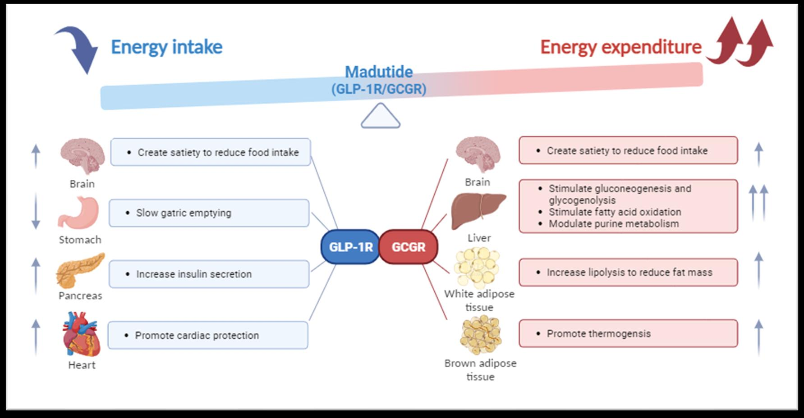

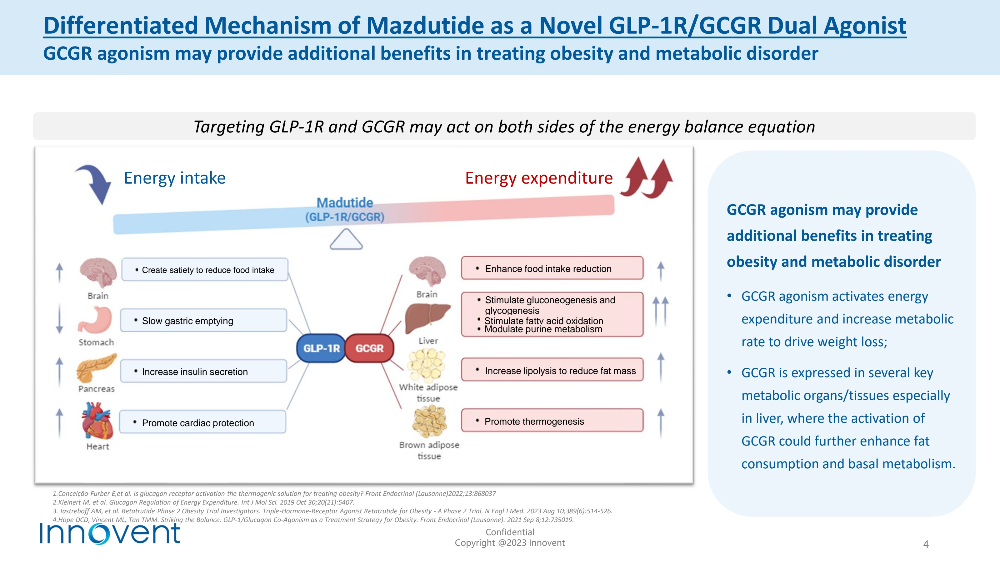

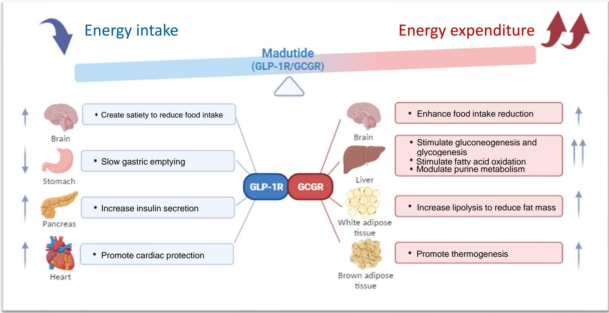

# <u>Mazdutide: Globally First GLP-1R/GCGR Dual Agonist Entered Phase 3</u>

## Potentially BIC therapy for obesity and diabetes, the 4ᵗʰ Phase 3 trial to be initiated soon

### Mazdutide Development Overview

|                   | Ph2                                                                   | Ph3                       | Launch(exp)                |
| ----------------- | --------------------------------------------------------------------- | ------------------------- | -------------------------- |
| Obesity (6mg)     | GLORY-1 (Ph3) initiated in 22Q4                                       |                           | Late 2024\~ early 2025 |
| T2DM (6mg)        | DREAMS-1 (Ph3) initiated in 23Q1 DREAMS-2 (Ph3) initiated in 23Q1 |                           | 2025 2025              |
| **Obesity (9mg)** | Ph2 readout in 23                                                     | Ph3 to initiate by end 23 | 2026                       |
| NASH              | IND received                                                          |                           |                            |

* **T2DM (6mg):** both weight loss and glycemic control for long-term disease management benefits of diabetes;
* **Obesity/Overweight (6mg):** robust weight loss effect for broad obese and overweight population;
* **Obesity (9mg):** potentially bariatric surgery equivalent efficacy for moderate to severe obesity;
* Exploration for more therapeutic areas is underway.

Innovent logo

Confidential
Copyright @2023 Innovent

5

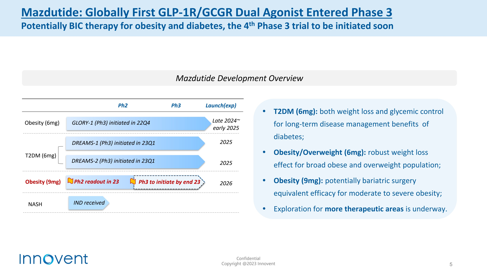

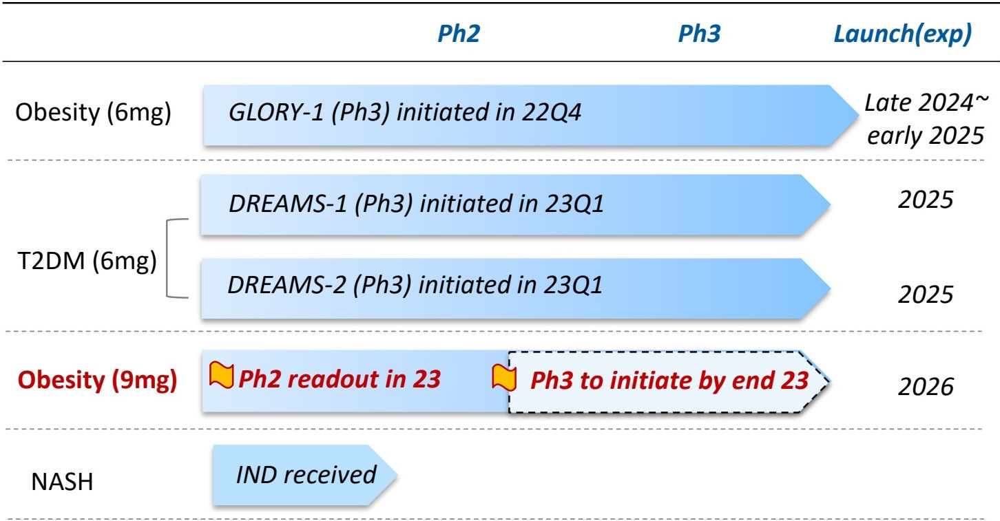

# <u>Summary of Mazdutide 9mg Phase 2 in Obesity Clinical Update (48 week)</u>

## Mazdutide showed robust weight loss, differentiated cardiometabolic benefits and superior safety profile

*Dual agonist to enhance metabolism and weight loss*

**Mazdutide (GLP-1R/GCGR)**

*Balanced design to optimize safety and efficacy*

### icon Robust and rapid weight-loss efficacy further confirmed

* Globally competitive weight loss data and the highest in Chinese population based studies: mean percent change in body weight from baseline versus placebo of **-18.6% after 48 weeks** of treatment;

* Significantly more patients achieved ≥15%/20% weight loss at 48 weeks.

### icon Favorable and superior safety profile

* No SAE throughout 48 weeks treatment of mazdutide 9mg;

* Similar heart rate increases between mazdutide and placebo at week 24, no further increase till week 48;

* No signal of increased cardiovascular risk throughout treatment period.

### icon Differentiated metabolic benefits; 73.3% reduction in LFC

* Significant reduction in waist circumstance, TG, TC, LDL-C, ALT and AST levels etc.; stable HDL-C throughout 48 weeks;

* Differentiated benefits in significantly reducing liver fat content (LFC) and serum uric acid levels.

### icon Good compliance and simple dose regimen

* No AE leading to treatment discontinuation in mazdutide group;

* Simple and tolerable two-step titration dose regimen to enter maintenance dose.

\*TG: Triglycerols; LDL-C: Low-density lipoprotein cholesterol; TC: Total cholesterol; ALT: Alanine transaminase; AST: Aspartate aminotransferase; HDL-C: High-density lipoprotein cholesterol

Innovent logo

Confidential
Copyright @2023 Innovent
6

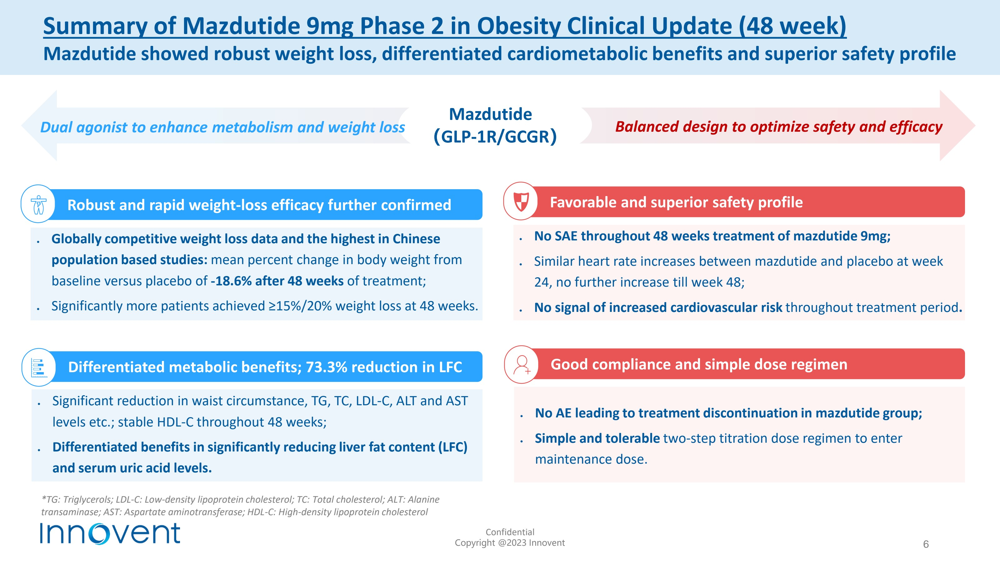

# <u>Mazdutide 9 mg Phase 2 in Chinese Adults with Obesity</u>

## An extension study to 48 weeks of treatment after 24-week primary endpoint was met

Study design diagram showing dose escalation of Mazdutide 9.0 mg (3.0 mg for 4W, 6.0 mg for 4W, then 9.0 mg for 16W) vs Placebo over 24 weeks, followed by an extension study to 48 weeks. Includes baseline and 48-week subject characteristics.

| Baseline Subjects | Baseline Mean Age | Baseline Mean Height | Baseline Mean Weight | Baseline Mean BMI | Extension Study Subjects | Extension Study Mean Age | Extension Study Mean Height | Extension Study Mean Weight | Extension Study Mean BMI |
| --------------------- | --------------------- | ------------------------ | ------------------------ | --------------------- | ---------------------------- | ---------------------------- | ------------------------------- | ------------------------------- | ---------------------------- |
| N=80                  | 34 yrs                | 168.0 cm                 | 96.9 kg                  | 34.3 kg/m²            | N=59                         | 34 yrs                       | 168.4 cm                        | 98.4 kg                         | 34.7 kg/m²                   |

* A total of 80 subjects were enrolled and randomized in a 3:1 ratio to mazdutide 9 mg group or placebo group.

* Primary endpoint achieved in May 2023: percentage change in body weight from baseline versus placebo after 24 weeks of treatment.

* Extend treatment to 48 weeks in subjects that agreed to receive additional 24 weeks of double blind extension treatment.

* 59 subjects (43 in the mazdutide 9.0mg group and 16 in the placebo group) accepted treatment till 48 weeks.

Innovent logo

Confidential
Copyright @2023 Innovent
7

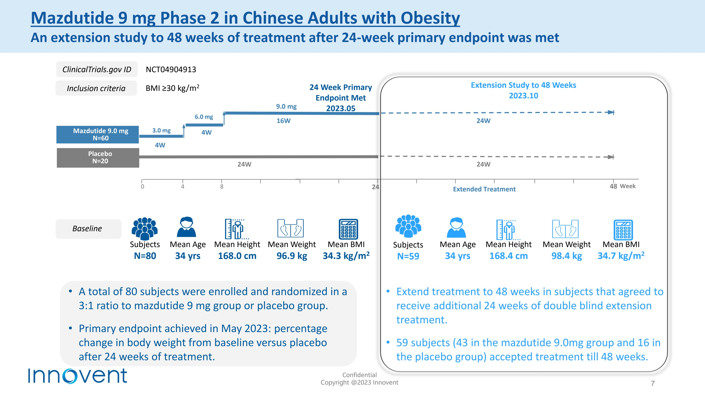

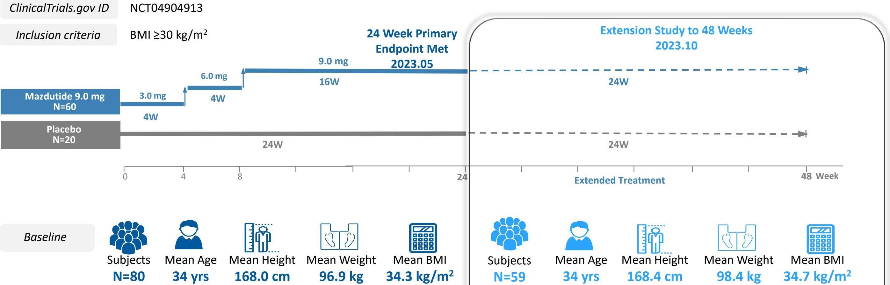

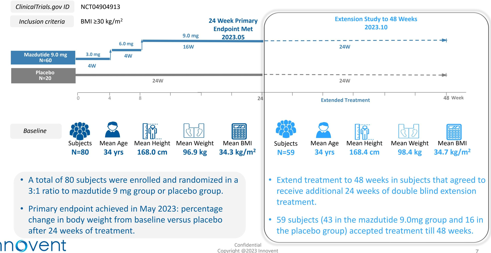

# <u>Mazdutide 9 mg Phase 2 in Chinese Adults with Obesity</u>

## Robust and rapid weight-loss efficacy with 18.6% mean weight loss versus placebo at 48 weeks

### Placebo-adjusted mean body weight change from baseline at 48 weeks

| Treatment Group         | Mean BMI (kg/m²) | Mean Baseline Weight (kg) | Mean Weight Loss (%) | Mean Weight Loss (kg) |
| ----------------------- | ---------------- | ------------------------- | -------------------- | --------------------- |
| Mazdutide 9 mg 48 weeks | 34.7             | 98.4                      | -18.6%               | -17.8                 |

Infographic showing weight loss results for Mazdutide 9 mg at 48 weeks: -18.6% and -17.8 kg from a mean baseline weight of 98.4 kg and BMI of 34.7 kg/m².

### Robust and durable weight reduction

* Long-lasting and robust weight reduction momentum, with mean percent change in body weight from baseline versus placebo of **-18.6% after 48 weeks** of treatment, and mean change in body weight from baseline versus placebo of **-17.8 kg**;

* A potential **superior treatment option than bariatric surgery*** for chronic weight management of moderate to severe obesity.

\*Note: metabolic surgery is recommended for Chinese population with a BMI of 32.5 kg/m² or above.

### Rapid onset weight-loss with simple regimen

* Mazdutide has induced **rapid onset** of weight-loss effect with its simple and tolerable two-step titration regimen.

Innovent logo

Confidential
Copyright @2023 Innovent

8

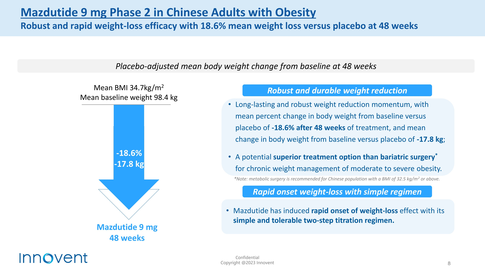

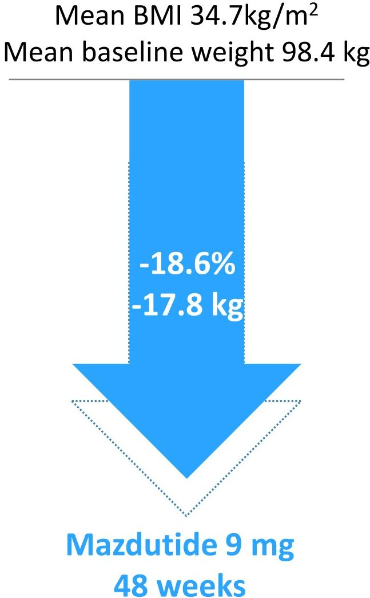

# <u>Mazdutide 9 mg Phase 2 in Chinese Adults with Obesity</u>

## Significantly proportion of patients achieved ≥15% and ≥20% weight loss

*Proportion of participants achieved ≥ 5% weight loss from baseline at 48 weeks*

| Weight Loss Threshold | Percentage of Participants (%) |
| --------------------- | ------------------------------ |
| Weight Loss ≥5%       | 83.7                           |
| Weight Loss ≥10%      | 69.8                           |
| Weight Loss ≥15%      | 51.2                           |
| Weight Loss ≥20%      | 34.9                           |

**Mazdutide 9 mg 48 weeks**

* 51.2% and 34.9% of the subjects in the mazdutide 9 mg group achieved 15% or more and 20% or more weight loss from baseline;

* Significantly more subjects achieved ≥15% and ≥20% weight loss when extended to 48 weeks of mazdutide 9mg treatment;

* No subject in placebo group lost 5% or more of body weight.

Innovent logo

Confidential
Copyright @2023 Innovent
9

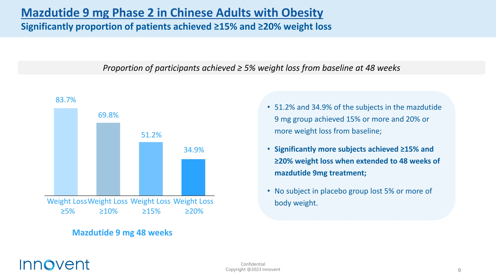

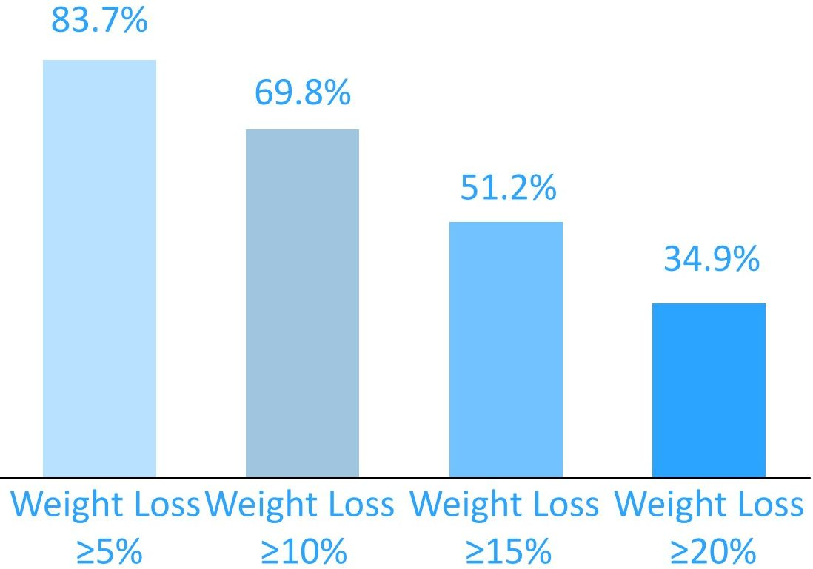

# <u>Summary of Weight Reduction in Major GLP-1 Class Drugs in 48 weeks</u>
## Forefront weight loss efficacy of mazdutide as a GLP-1R and GCGR dual agonist

48-week mean body weight reduction% (indirect comparison, placebo-adjusted)

| Mean BMI (kg/m²) Mean Weight (kg) Target Drug & Dosage | Global population oriented trials 38.3 106.2 GLP-1 Liraglutide3mg(QD) | Global population oriented trials 37.9 105.3 GLP-1 Semaglutide2.4mg(QW) | Global population oriented trials 36.8-38.7 105.2-112.1 Oral GLP-1 Orforglipron45mg(QD) | Global population oriented trials NA 104.3-107 GLP-1/GCG Survodutide4.8mg(QW) | Global population oriented trials 38.0 104.8 GLP-1/GIP Tirzepatide10mg(QW) | Global population oriented trials 38.0 104.8 GLP-1/GIP Tirzepatide15mg(QW) | Global population oriented trials 37.3 107.7 GGG Retatrutide12mg(QW) | Chinese population oriented trials 34.0 96.4 GLP-1 Semaglutide2.4mg(QW) | Chinese population oriented trials 32.3 91.8 GLP-1/GIP Tirzepatide10mg(QW) | Chinese population oriented trials 32.3 91.8 GLP-1/GIP Tirzepatide15mg(QW) | Chinese population oriented trials 34.3 96.9 GLP-1/GCG Mazdutide9mg(QW) |
| ------------------------------------------------------------------ | ------------------------------------------------------------------------------------- | --------------------------------------------------------------------------------------- | ------------------------------------------------------------------------------------------------------- | --------------------------------------------------------------------------------------------- | ------------------------------------------------------------------------------------------ | ------------------------------------------------------------------------------------------ | ------------------------------------------------------------------------------------ | --------------------------------------------------------------------------------------- | ------------------------------------------------------------------------------------------ | ------------------------------------------------------------------------------------------ | --------------------------------------------------------------------------------------- |
| Reduction %                                                        | -5.9%                                                                                 | -12.3%                                                                                  | -12.4% \\\*36w                                                                                          | -16.7% \\\*46w                                                                                | -16.8%                                                                                     | -18.0%                                                                                     | -22.1%                                                                               | -9.9% \\\*44w                                                                           | -11.5%                                                                                     | -17.4%                                                                                     | -18.6%                                                                                  |

48-week weight loss data of liraglutide 3 mg, semaglutide 2.4 mg, tirzepatide 10/15 mg and retatrutide 12mg were estimated from published results of SCALE1, STEP-12, SURMOUNT-13, SURMOUNT-CN4 and a Phase II (NCT04881760)5 studies, respectively; while 48-week weight loss data of orforglipron 45mg, survodutide 4.8mg and semaglutide 2.4mg(CN) were published results of a Phase II (NCT05051579)6, a Phase II (NCT04667377)7 and STEP-78 studies, respectively.

Confidential

Innovent logo

Copyright @2023 Innovent

10

1Pi-Sunyer X, et al. N Engl J Med. 2015. 2Khoo TK, et al. N Engl J Med. 2021. 3Jastreboff AM, et al. N Engl J Med. 2022. 4Lin Zhao, et al. Presented at EASD 2023, October 2023. 5Ania M, Jastreboff, et al. N Engl J Med. 2023. 6Wharton S, et al. N Engl J Med. 2023. 7Le Roux, C. Presented at the 2023 ADA, 8Hansen MR, et al. Presented at the 30th ECO, May 2023

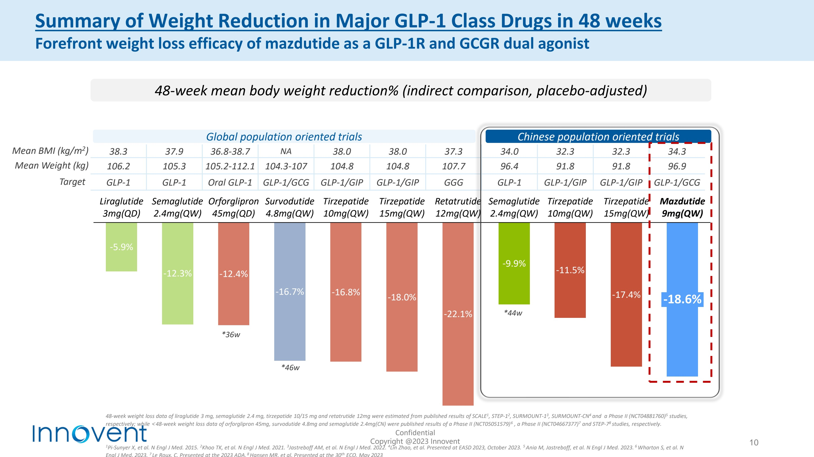

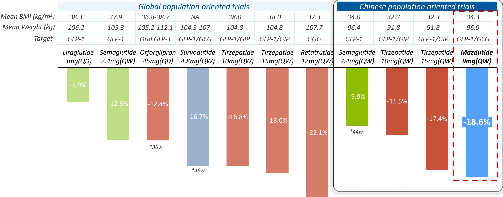

# <u>Metabolic Benefits Summary of Mazdutide</u>

## Multiple and differentiated benefits observed as a GLP-1R/GCGR dual agonist

Diagram showing the GLP-1R/GCGR Mechanism Effect on various metabolic markers including Weight Loss, sUA, Liver fat, Liver enzyme, Triglycerides, Total cholesterol, LDL cholesterol, Blood pressure, Insulin sensitivity, Fasting glucose, Blood glucose, and Waist circumference.

* Corresponding to changes in body weight, the mean waist circumference and blood pressure of subjects in the mazdutide group decreased.

* After 24-week treatment, mazdutide 9 mg significantly reduced TG, TC, LDL-C, ALT/AST levels and improved insulin sensitivity, the effects were maintained during the extended treatment period. HDL-C level was stable throughout the treatment period.

* Mazdutide showed differentiated benefits in significantly reducing liver fat content (LFC) and uric acid levels, with innovative mechanism of action (MoA) as a GLP-1R/GCGR dual agonist .

Innovent logo

Confidential
Copyright @2023 Innovent

11

\*Note: Mazdutide can significantly reduced HbA1c, fasting blood glucose, postprandial blood glucose levels as demonstrated in results of another Phase 2 trial in T2DM patients

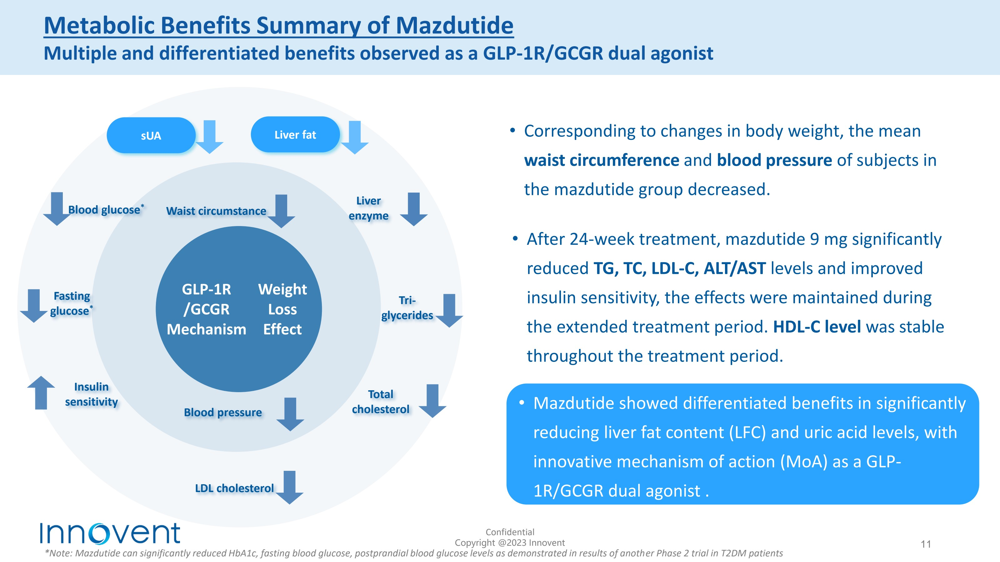

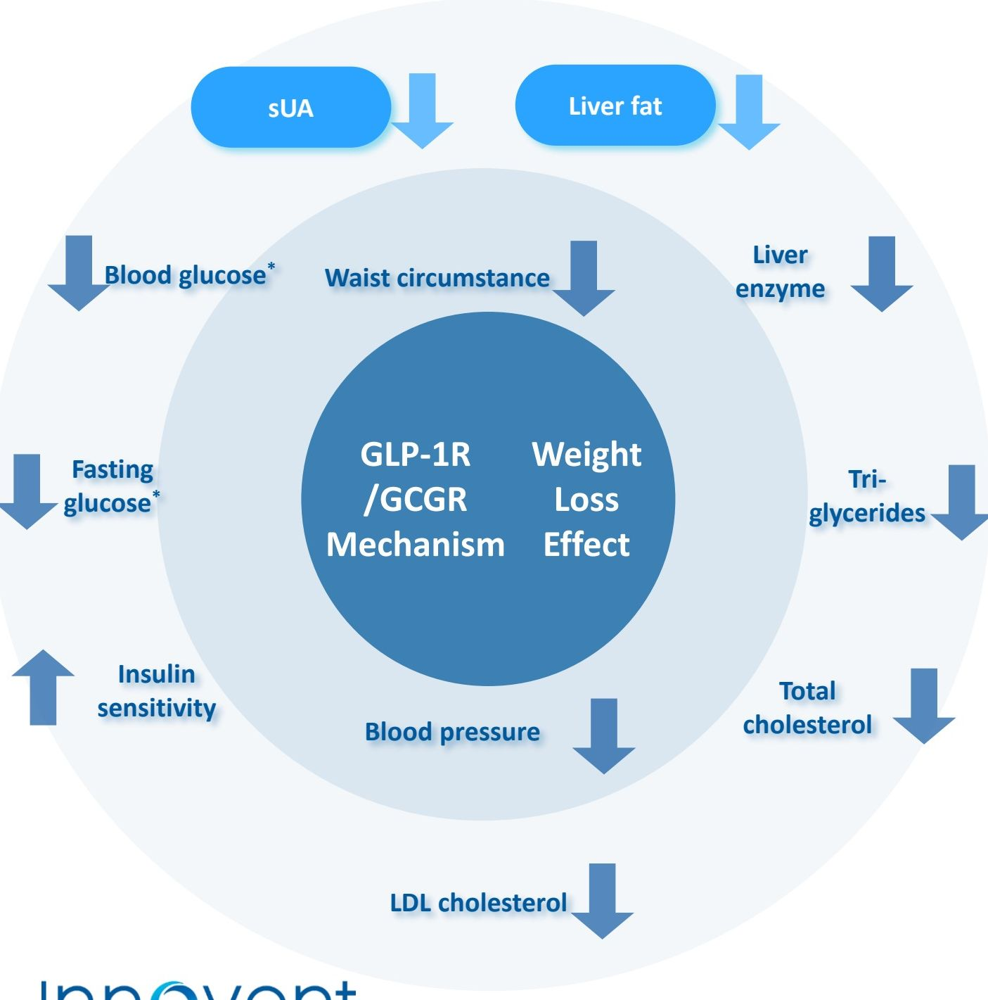

# <u>Metabolic Benefits Highlights of Mazdutide</u>

## Significantly reduced liver fat content, ALT, AST and sUA levels

### 73% liver fat content reduction

Mean liver fat content change (%) from baseline by MRI-PDFF at 24 weeks*

**In subjects with baseline liver fat content ≥ 5%

| Group           | Mean liver fat content change (%) |
| --------------- | --------------------------------- |
| Mazdutide 9.0mg | -73.3                             |
| Placebo         | -6.5                              |

\*\*Histologic fat fraction ≥ 5% as the reference standard for diagnosing hepatic steatosis

### Significant ALT and AST levels reduction

Mean ALT change (%) from baseline at 24 weeks* | Mean AST change (%) from baseline at 24 weeks*

| Group           | Mean ALT change (%) | Mean AST change (%) |
| --------------- | ------------------- | ------------------- |
| Mazdutide 9.0mg | -32.8               | -25.1               |
| Placebo         | 12.7                | 3.8                 |

### Significant sUA level reduction

Mean sUA change (%) from baseline at 24 weeks*

| Group           | Mean sUA change (%) |
| --------------- | ------------------- |
| Mazdutide 9.0mg | -23.2               |
| Placebo         | -3.0                |

\*Note: The above benefits were maintained during extended treatment period to 48 weeks.

Innovent logo

Confidential
Copyright @2023 Innovent

12

\*\*Rinella ME, Neuschwander-Tetri BA, Siddiqui MS, Abdelmalek MF, Caldwell S, Barb D, Kleiner DE, Loomba R. AASLD Practice Guidance on the clinical assessment and management of nonalcoholic fatty liver disease. Hepatology. 2023 May 1;77(5):1797-1835.

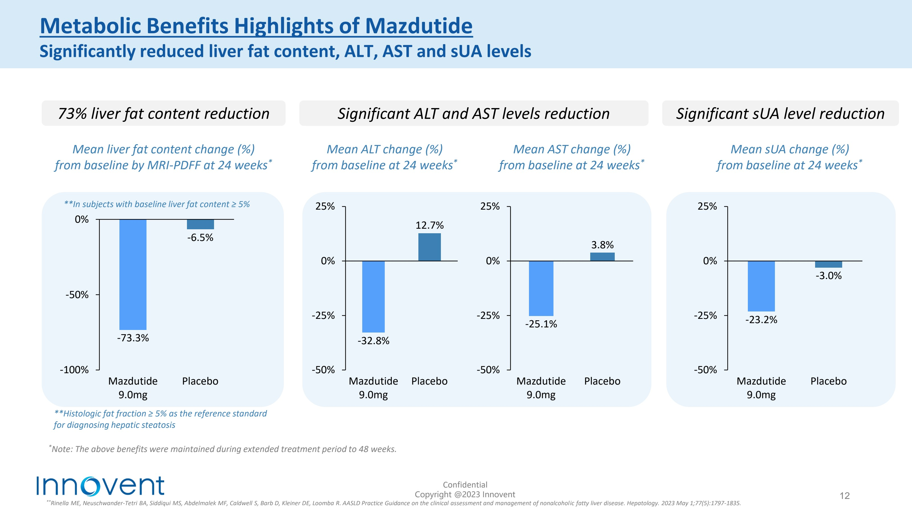

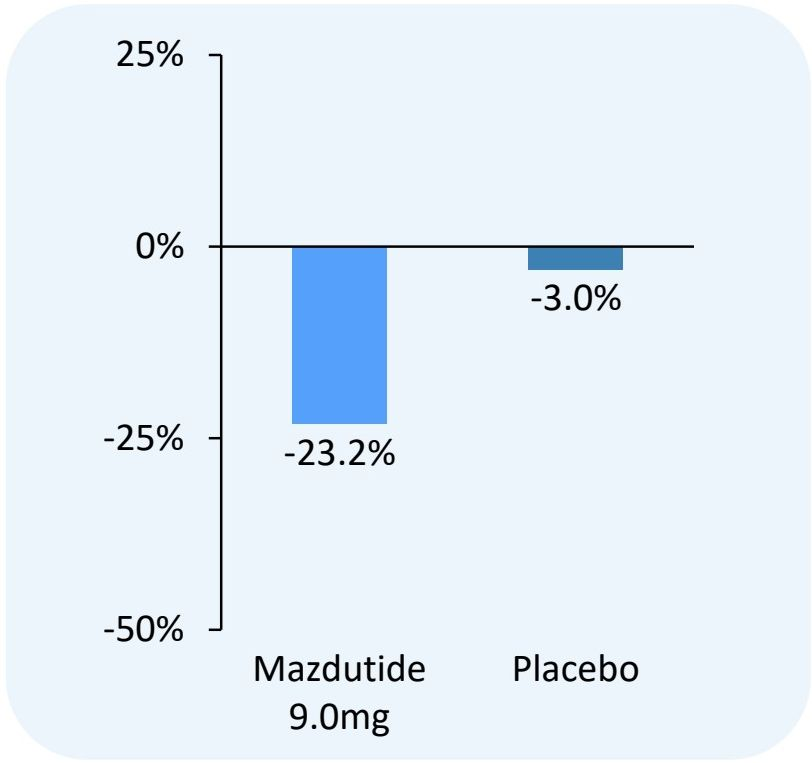

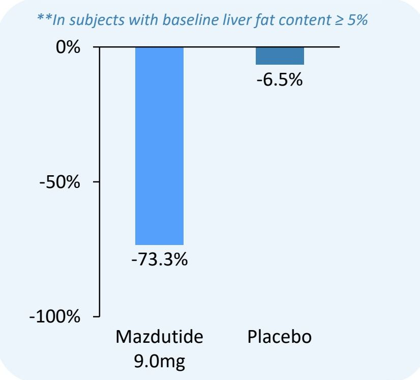

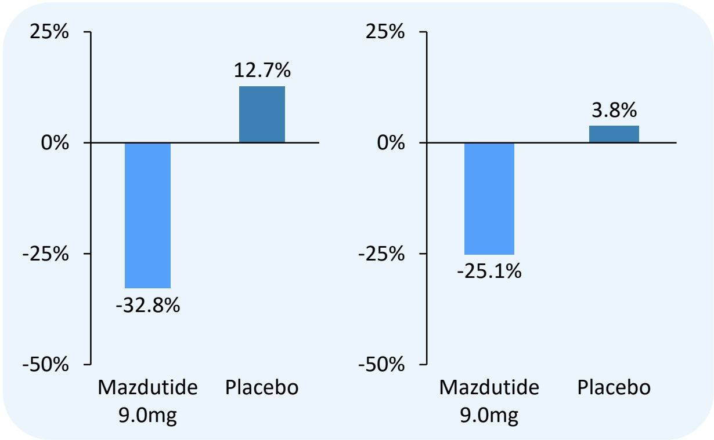

# <u>Key Safety Profile of Mazdutide</u>

## Favorable and superior tolerability and safety profile of mazdutide

Stomach icon
**Overall AE Profile**
* Gastrointestinal adverse reactions (nausea, vomiting and diarrhea) were the most common adverse events, most of **mild or moderate** severity. The incidence of gastrointestinal adverse reactions reduced during the extended treatment period, and most are mild.
* The profile of adverse events was **consistent with** that observed in previous studies of mazdutide and other **GLP-1 drugs**, with no new safety signals observed.

Lightbulb icon
**No SAE**
* **No subject** in the mazdutide group **discontinued treatment due to adverse events**.
* **No serious adverse events** occurred.

Heart with pulse line icon
**Cardiovascular Profile**
* The increase in **heart rate in the mazdutide group was similar** to that in the placebo group after 24 weeks of treatment, **with no further increase** in heart rate being observed during the extended treatment period.
* **No signal of increased cardiovascular risk** was observed throughout the treatment period.

*Note: After the completion of the study, the 24-week primary endpoint and the 48-week extended treatment period, other secondary and exploratory endpoints, and safety profile will be further analyzed and fully disclosed at academic conferences and journals.*

Innovent logo

Confidential

Copyright @2023 Innovent

13

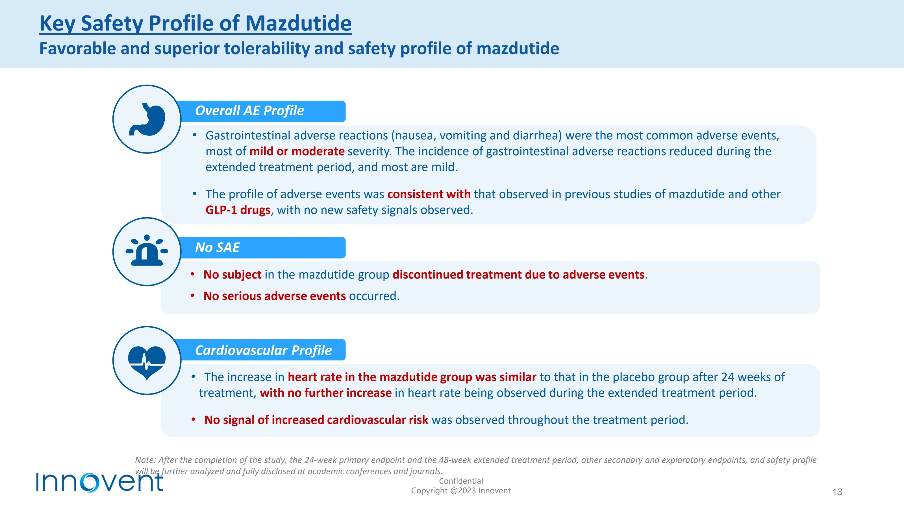

# <u>SAE and AE-led Drop-out in Major GLP-1 Class Drugs</u>

## Favorable and superior tolerability and safety profile of mazdutide

*Serious adverse events % during treatment (indirect comparison)*

| Drug                               | Dose      | Placebo (%) | Treatment (%) |
| ---------------------------------- | --------- | ----------- | ------------- |
| Liraglutide                        | 3.0mg(QD) | 6           | 5             |
| Semaglutide                        | 2.4mg     | 10          | 6             |
| Orforglipron                       | 45mg(QD)  | 3           | 0             |
| Survodutide                        | 4.8mg     | 5           | 7             |
| Tirzepatide                        | 10mg      | 7           | 7             |
| Tirzepatide                        | 15mg      | 5           | 7             |
| Retatrutide                        | 12mg      | 3           | 4             |
| Chinese population oriented trials |           |             |               |
| Semaglutide                        | 2.4mg     | 5           | 6             |
| Tirzepatide                        | 10mg      | 4           | 9             |
| Tirzepatide                        | 15mg      | 11          | 9             |
| Mazdutide                          | 9mg       | 0           | 0             |

*Adverse events leading to withdrawal/ discontinuation % (indirect comparison)*

| Drug                               | Dose      | Placebo (%) | Treatment (%) |
| ---------------------------------- | --------- | ----------- | ------------- |
| Liraglutide                        | 3.0mg(QD) | 10          | 4             |
| Semaglutide                        | 2.4mg     | 7           | 3             |
| Orforglipron                       | 45mg(QD)  | 15          | 2             |
| Survodutide                        | 4.8mg     | 29          | 4             |
| Tirzepatide                        | 10mg      | 7           | 3             |
| Tirzepatide                        | 15mg      | 6           | 3             |
| Retatrutide                        | 12mg      | 16          | 0             |
| Chinese population oriented trials |           |             |               |
| Semaglutide                        | 2.4mg     | 3           | 2             |
| Tirzepatide                        | 10mg      | 3           | 1             |
| Tirzepatide                        | 15mg      | 7           | 1             |
| Mazdutide                          | 9mg       | 0           | 0             |

| Drug                   | Target     |
| ---------------------- | ---------- |
| Liraglutide            | GLP-1      |
| Semaglutide            | GLP-1      |
| Orforglipron           | Oral GLP-1 |
| Survodutide            | GLP-1/GCG  |
| Tirzepatide (10mg)     | GLP-1/GIP  |
| Tirzepatide (15mg)     | GLP-1/GIP  |
| Retatrutide            | GGG        |
| Semaglutide (CN)       | GLP-1      |
| Tirzepatide (10mg, CN) | GLP-1/GIP  |
| Tirzepatide (15mg, CN) | GLP-1/GIP  |
| Mazdutide              | GLP-1/GCG  |

Balance scale icon
Mazdutide 9mg demonstrated superior safety profile under leading weight loss efficacy and simple two-step titration dose regimen.

Innovent logo

Safety data of liraglutide 3 mg, semaglutide 2.4 mg, tirzepatide 10/15 mg, retatrutide 12mg orforglipron 45mg, survodutide 4.8mg and semaglutide 2.4mg(CN) were from published results of SCALE1, STEP-12, SURMOUNT-13, SURMOUNT-CN4 and a Phase II (NCT04881760)5 a Phase II (NCT05051579)6, a Phase II (NCT04667377)7 and STEP-78 studies, respectively.

*Confidential*

Copyright @2023 Innovent
1Pi-Sunyer X, et al. N Engl J Med. 2015. 2Khoo TK, et al. N Engl J Med. 2021. 3Jastreboff AM, et al. N Engl J Med. 2022. 4Lin Zhao, et al. Presented at EASD 2023, October 2023. 5Ania M, Jastreboff, et al. N Engl J Med. 2023. 6Wharton S, et al. N Engl J Med. 2023. 7Le Roux, C. Presented at the 2023 ADA, 8Hansen MR, et al. Presented at the 30th ECO, May 2023
14

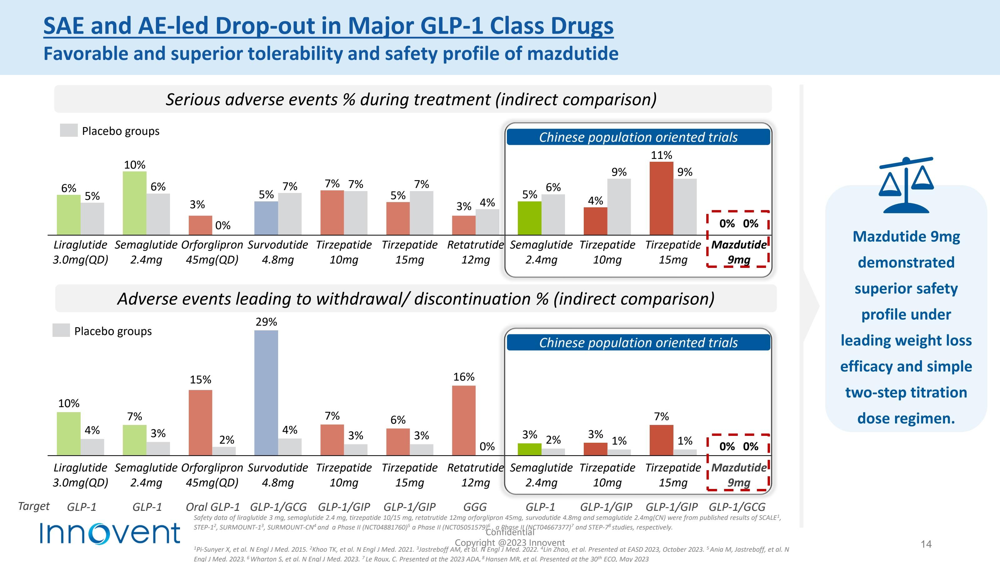

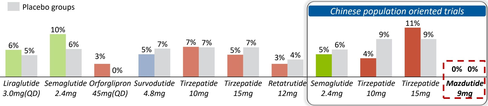

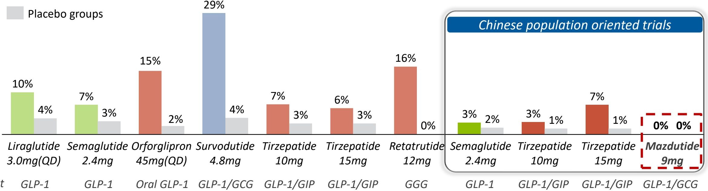

# <u>Mazdutide Simplified Dose-Escalation Regimen</u>

## Only two steps to enter maintenance dose

| Product       | Step 1 (4W) | Step 2 (4W) | Maintenance Dose |
| ------------- | ----------- | ----------- | ---------------- |
| Mazdutide 6mg | 2.0 mg      | 4.0 mg      | 6.0 mg           |
| Mazdutide 9mg | 3.0 mg      | 6.0 mg      | 9.0 mg           |

**Mazdutide 6mg/9mg**
* **3 strengths (pens)**
* **8-week dose-escalation**

| Product           | Step 1 (4W) | Step 2 (4W) | Step 3 (4W) | Step 4 (4W) | Maintenance Dose |
| ----------------- | ----------- | ----------- | ----------- | ----------- | ---------------- |
| Semaglutide 2.4mg | 0.25 mg     | 0.5 mg      | 1.0 mg      | 1.7 mg      | 2.4 mg           |

**Semaglutide 2.4mg**
* **5 strengths (pens)**
* **16-week dose-escalation**

| Product          | Step 1 (4W) | Step 2 (4W) | Step 3 (4W) | Step 4 (4W) | Step 5 (4W) | Maintenance Dose |
| ---------------- | ----------- | ----------- | ----------- | ----------- | ----------- | ---------------- |
| Tirzepatide 15mg | 2.5 mg      | 5.0 mg      | 7.5 mg      | 10.0 mg     | 12.5 mg     | 15.0 mg          |

**Tirzepatide 15mg**
* **6 strengths (pens)**
* **20-week dose-escalation**

Innovent logo

Confidential
Copyright @2023 Innovent

15

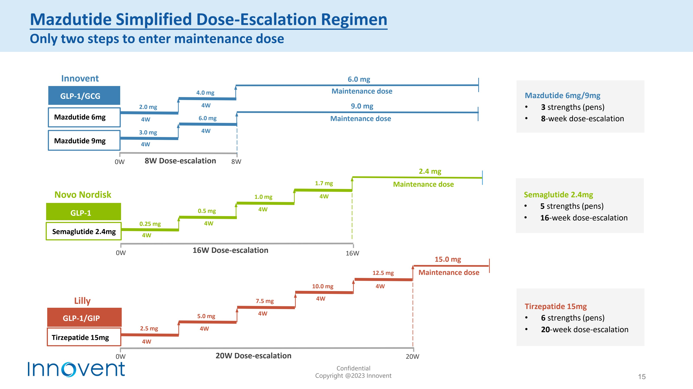

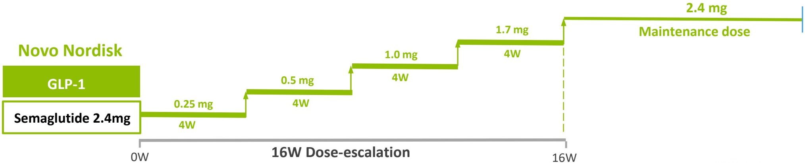

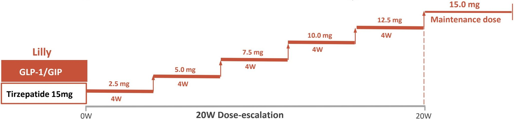

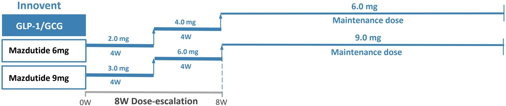

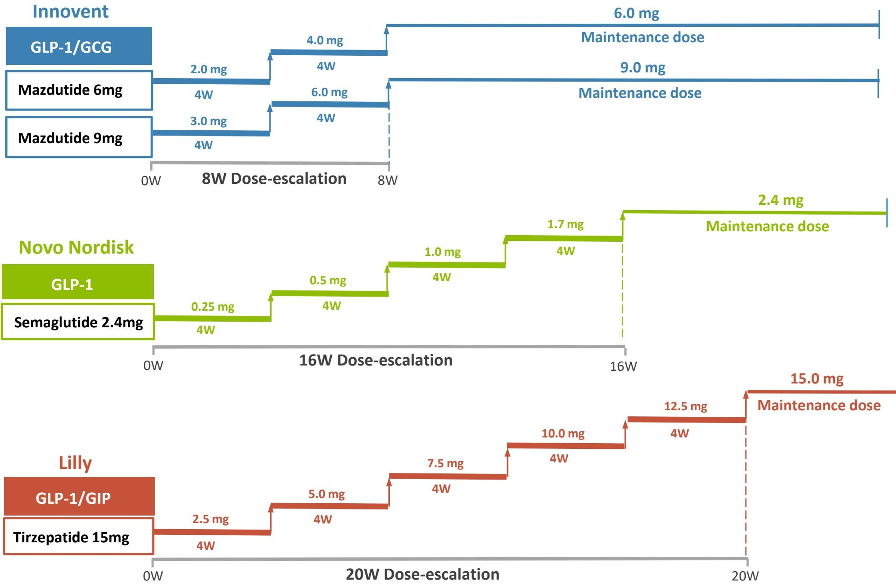

# Mazdutide Near-term Catalysts

**Obesity/Overweight (6mg)**

* NDA submission in late 2023 to early 2024
* Phase 2 results will have full manuscript publication by the end of 2023

**Obesity (9mg)**

* Phase 3 to be initiated by the end of 2023
* Phase 2 results further publication at future academic conferences or journals

**T2DM (6mg)**

* NDA submission in 2024
* Phase 2 results will have full manuscript publication in late 2023 to early 2024

**More indications**

* More indication opportunities are under exploration

Innovent logo

Confidential
Copyright @2023 Innovent

16

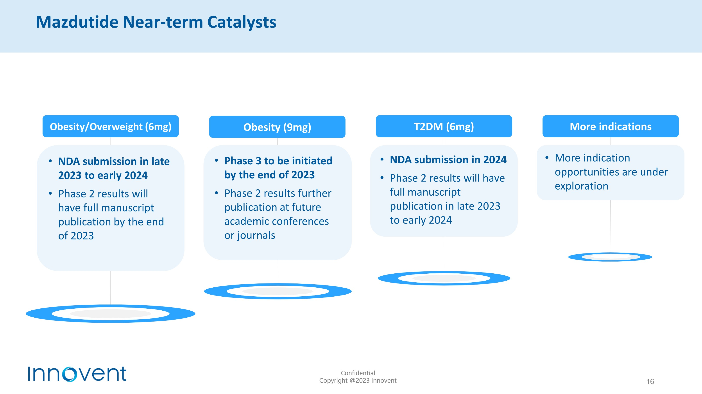

# Innovent’s Strategy in CVM: Build Strong Franchise and Expand Next-generation Pipeline

## Next Wave Innovation

* Oral CVM projects icon Oral CVM projects

* Other novel modalities icon Other novel modalities

* Pediatric and aging diseases icon Pediatric and aging diseases

## Expanding Pipeline of Blockbusters

### Approved Product

SINTBILO logo

SINTBILO® (tafolecimab injection)

### Mid-to-Late Stage Assets

**Mazdutide (6mg)**
* Ph3 – Overweight/Obesity
* Ph3 – T2DM

**IBI128 (Tigulixostat)**
* MRCT Ph3 – Gout
(overseas, LG Chem)

**Mazdutide (9mg)**
* Ph2 – Obesity(moderate-to-severe)

**IBI311**
* Ph3 - TED

## Huge Market Potential

~500M patients
Impacted

Market potential icons

~RMB 100B
CVM Market in China

Innovent logo

Confidential
Copyright @2023 Innovent

17

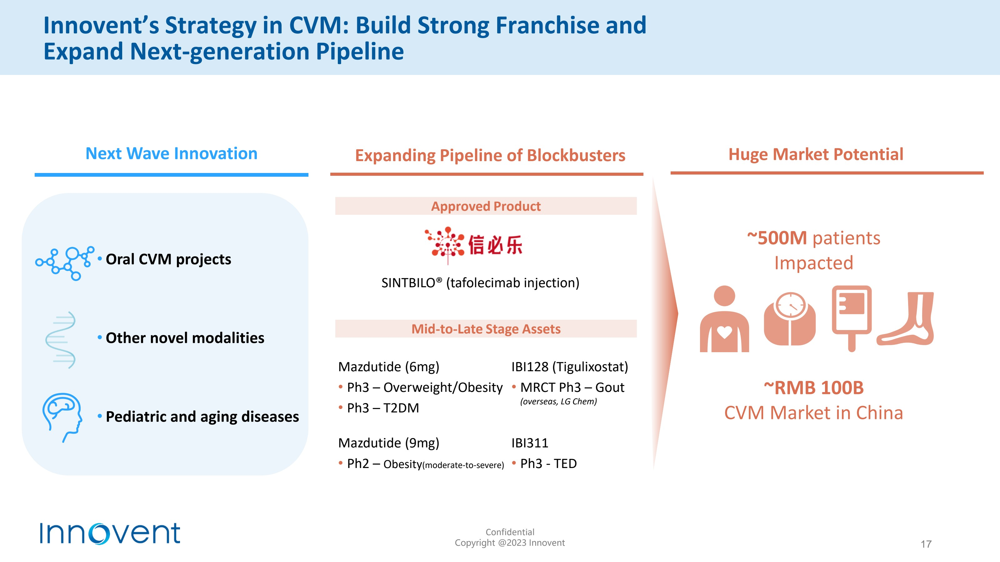

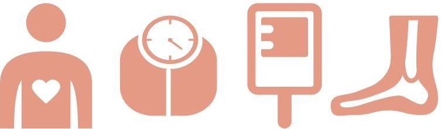

# Supplemental Slides:
# Obesity and Overweight in China

Innovent logo

# Obesity — a Growing Public Health Issue in China

*   **01** **1 out of 2 adults** in China are living with obesity or overweight¹
*   **02** Overweight and obesity are **established risk factors** for major non-communicable diseases²,³
*   **03** **Clear unmet needs** for more effective and tolerable therapies to achieve ideal outcomes
*   **04** Obesity is a serious chronic disease that needs **long-term management**
*   **05** Obesity associated healthcare costs could reach **RMB 400+B** in China by 2030²

1. Pan XF, Wang L, Pan A. Epidemiology and determinants of obesity in China. Lancet Diabetes Endocrinol. 2021 Jun;9(6):373-392. doi: 10.1016/S2213-8587(21)00045-0. Erratum in: Lancet Diabetes Endocrinol. 2021 Jul;9(7):e2. PMID: 34022156.

2. Wang Y, Zhao L, Gao L, Pan A, Xue H. Health policy and public health implications of obesity in China. Lancet Diabetes Endocrinol. 2021 Jul;9(7):446-461. doi: 10.1016/S2213-8587(21)00118-2. Epub 2021 Jun 4. PMID: 34097869.

3. Institute for Health Metrics and Evaluation. Global Health Data Exchange. GBD results tool. http://ghdx.healthdata.org/gbd-resultstool (accessed Jan 10, 2021).

Innovent logo

Confidential

Copyright @2023 Innovent

19

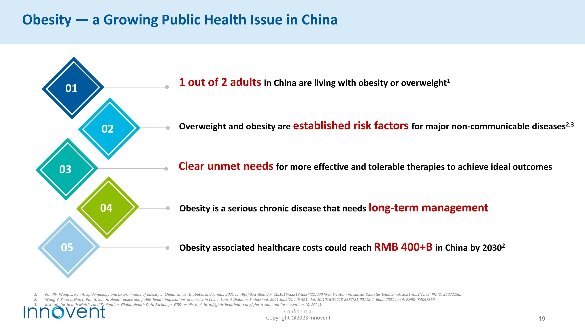

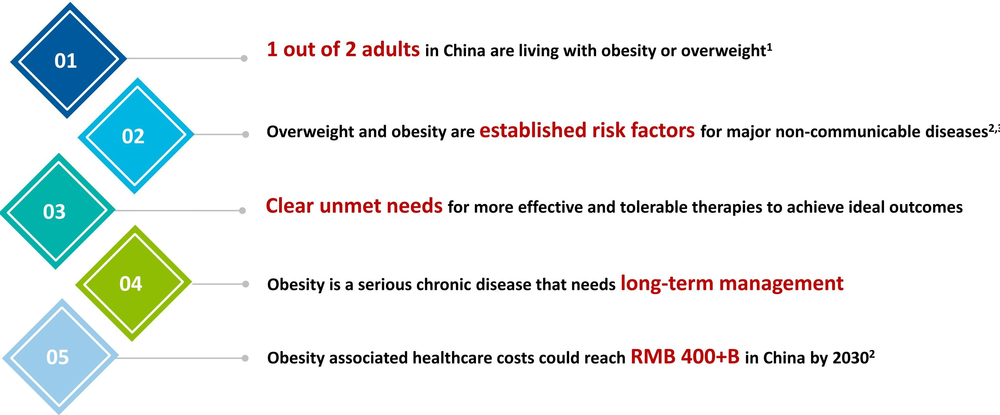

# China Has the Largest Obese and Overweight Population

~500M adults in China are living with obesity or overweight, potentially the largest in the worldi,1.

* Overweight (BMI 24-27.9kg/m²): 340M

* Obesity (BMI ≥ 28kg/m²): 160M

* Moderate to severe obesity (BMI ≥ 32.5kg/m²): 10M

| BMI Category                                  | Population              | 2019 Prevalence | 2030 Prevalence |
| --------------------------------------------- | ----------------------- | --------------- | --------------- |
| BMI ≥ 24 kg/m² (Overweight)                   | 1 Billion (Adults only) | 50%             | 65%             |
| BMI ≥ 28 kg/m² (Obesity)                      | 500 Million             | 16%             | 23%             |
| BMI ≥ 32.5 kg/m² (Moderate to Severe Obesity) | 160 Million             | 1%              | 2%              |
|                                               | 10 Million              |                 |                 |

\*i: WHO criteria define overweight in adults as a BMI of 25.0–29.9 kg/m² and obesity as a BMI of 30.0 kg/m² or higher. However, accumulated evidence has shown that Chinese people are likely to have higher percentages of body fat (as shown via imaging techniques) and higher rates of cardiovascular risk factors and all-cause mortality than White people at given BMI levels.

1. Pan XF, Wang L, Pan A. Epidemiology and determinants of obesity in China. Lancet Diabetes Endocrinol. 2021 Jun;9(6):373-392. doi: 10.1016/S2213-8587(21)00045-0. Erratum in: Lancet Diabetes Endocrinol. 2021 Jul;9(7):e2. PMID: 34022156.
2. Wang Y, Zhao L, Gao L, Pan A, Xue H. Health policy and public health implications of obesity in China. Lancet Diabetes Endocrinol. 2021 Jul;9(7):446-461. doi: 10.1016/S2213-8587(21)00118-2. Epub 2021 Jun 4. PMID: 34097869.

Innovent logo

Confidential
Copyright @2023 Innovent

20

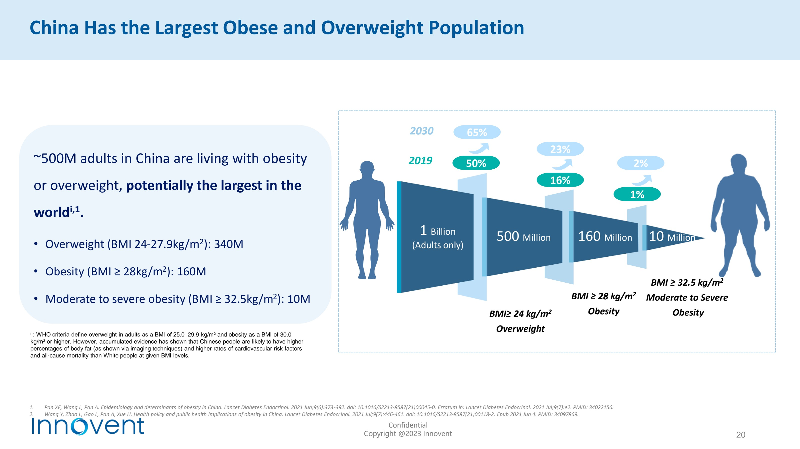

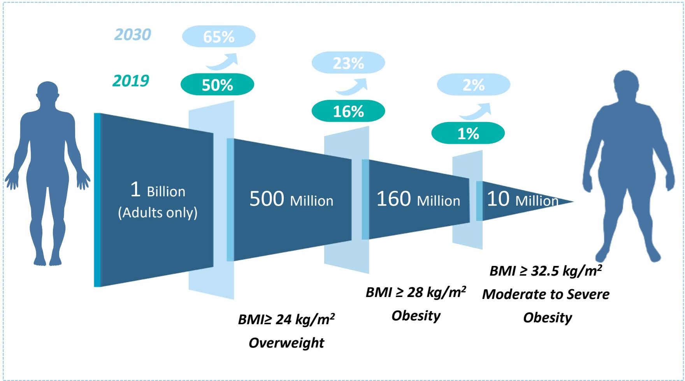

# Raised BMI is a Major Risk Factor for >200 Non-communicable Diseases

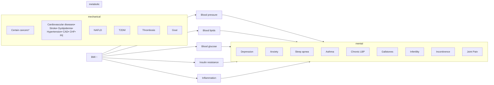
```mermaid
graph LR
    BMI[BMI ↑] --> BP[Blood pressure]
    BMI --> BL[Blood lipids]
    BMI --> BG[Blood glucose]
    BMI --> IR[Insulin resistance]
    BMI --> INF[Inflammation]

    BP --> MENTAL
    BL --> MENTAL
    BG --> MENTAL
    IR --> MENTAL
    INF --> MENTAL

    subgraph MENTAL [mental]
        Depression
        Anxiety
        Sleep_apnea[Sleep apnea]
        Asthma
        Chronic_LBP[Chronic LBP]
        Gallstones
        Infertility
        Incontinence
        Joint_Pain[Joint Pain]
    end

    subgraph MECHANICAL [mechanical]
        Cancers[Certain cancers*]
        CVD[Cardiovascular diseases• Stroke• Dyslipidemia• Hypertension• CAD• CHF• PE]
        NAFLD
        T2DM
        Thrombosis
        Gout
    end

    subgraph METABOLIC [metabolic]
        %% This category is represented by the initial physiological changes
    end
```

\*Including breast cancer, colorectal cancer, ovarian cancer, cervical cancer, esophageal cancer, renal cancer, prostate cancer, etc.
CAD: coronary artery disease CHF: congestive heart failure PE: pulmonary embolism LBP: Low Back Pain
NAFLD: nonalcoholic fatty liver disease

* Overweight and obesity contribute to **11.1% of deaths** associated with non-communicable diseases;

* Overweight and obesity are also associated with **significantly increased morbidity**, which can affect almost every organ system. The organs affected by obesity can be broadly grouped into three classes: metabolic, mechanical, and mental.

Innovent logo

1. Obes Rev. 2010;11:808-9;
2. BMC Public Health 2009;9:88;
3. Arch Gen Psychiatry 2010;67:220–9;
4. Arch Gen Psychiatry 2006;63:824–30;
5. Gastroenterology 2006;130:2023–30;
6. Prev Med 2010;51:18–23;
7. Prev Chronic Dis 2009;6:A48.

Confidential
Copyright @2023 Innovent

21

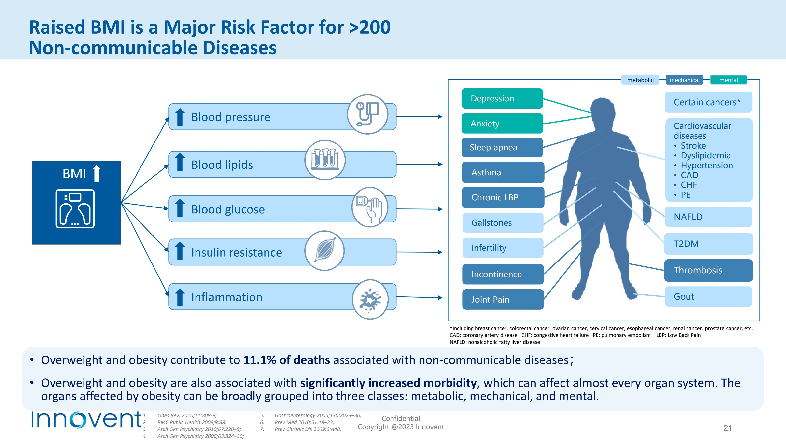

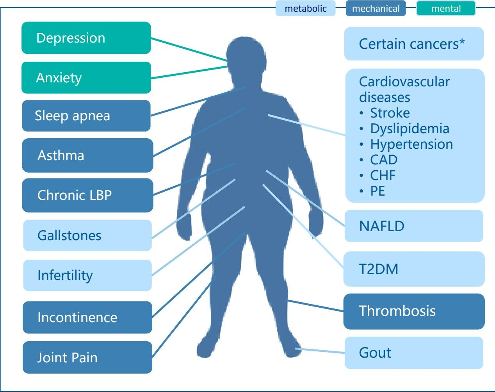

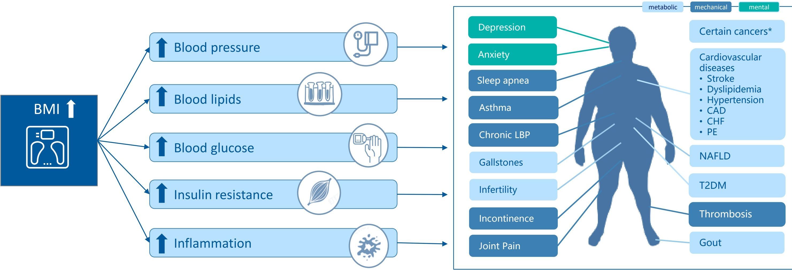

# Obesity Management Could Reverse Disease Trajectory

* **5%-15% weight loss within 6 months is recommended for patients with obesity or overweight with complications.**
* **Increased weight loss percentage is associated with increased improvements in obesity-related risk factors and comorbidities, and could be of significant benefit for patients.**

| 0-5%            | 5-10%             | 10-15%           | ≥15%             |
| --------------- | ----------------- | ---------------- | ---------------- |
| x Hypertension  | x T2DM Prevention | x T2DM Remission | x T2DM Remission |
| x Hyperglycemia | x NAFLD           | x Incontinence   | x CHF            |
|                 | x Dyslipidemia    | x GERD           | x CV death rate  |
|                 | x PCOS            | x NASH           |                  |
|                 |                   | x Sleep Apnea    |                  |
|                 |                   | x CV diseases    |                  |
|                 |                   | x Joint Pain     |                  |

1. AMERICAN ASSOCIATION OF CLINICAL ENDOCRINOLOGISTS AND AMERICAN COLLEGE OF ENDOCRINOLOGY COMPREHENSIVE CLINICAL PRACTICE GUIDELINES FOR MEDICAL CARE OF PATIENTS WITH OBESITY; Endocr Pract. 2016 Jul;22 Suppl 3:1-203. doi: 10.4158/EP161365.GL. Epub 2016 May 24 .

PCOS: polycystic ovary syndrome NASH: Non-alcoholic steatohepatitis
GERD: gastroesophageal reflux disease

Innovent logo

Confidential
Copyright @2023 Innovent

22

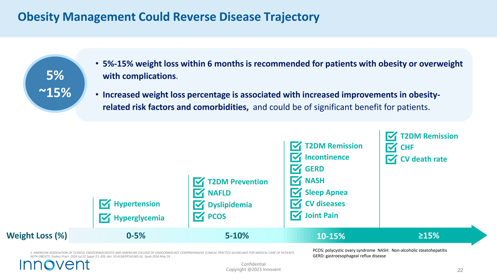

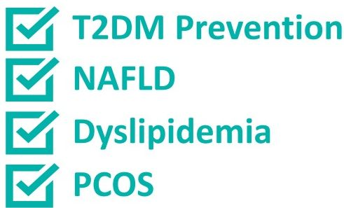

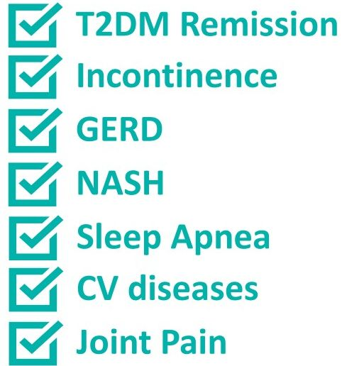

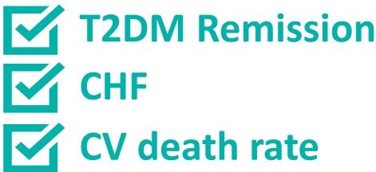

# Obesity Management is Highly Beneficial in T2DM Treatment

**Two digit or more significant weight loss may lead to the remission of T2DM**

## ~50% T2DM adult patients

in China are living with overweight or obesity

| Category             | Value |
| -------------------- | ----- |
| Overweight / Obesity | 500M  |
| Diabetes             | 140M  |

T2DM incidence rates in Chinese population:

* 8.8% in BMI< 25 group;
* 13.8% in 25≤BMI<30 group;
* 20.1% in BMI≥30 group.

**Disease Progression**

**Weight Loss**

* <mark>T2DM prevention:</mark> There is strong and consistent evidence that **obesity management can delay the progression from prediabetes to T2DM.**
* <mark>Beneficial in T2DM treatment:</mark> In patients with T2DM who also have overweight or obesity, modest and sustained weight loss (>5%) has been shown to **improve glycemic control, reduce the need for glucose-lowering medications and result in metabolic benefits** including lowering of blood pressure and blood lipids, improving insulin resistant and β-cell function.
* <mark>Potential of T2DM remission:</mark> Increased weight loss percentage was associated with increased odds of T2DM remission, starting with 10–15%.

diagram icon

diagram icon

diagram icon

diagram icon

Innovent logo

1. JAMA. 2021 Dec 28;326(24):2498-2506. doi: 10.1001/jama.2021.22208. Prevalence and Treatment of Diabetes in China, 2013-2018
2. Chinese Diabetes Society, Guideline for the prevention and treatment of type 2 diabetes mellitus in China(2020 edition)
3. American Diabetes Association; 8. Obesity Management for the Treatment of Type 2 Diabetes: Standards of Medical Care in Diabetes—2021. Diabetes Care 1 January 2021; 44 (Supplement_1): S100–S110.
4. Hou X, Lu J, Weng J, Li L, Shan Z, Liu J, et al. (2013) Impact of Waist Circumference and Body Mass Index on Risk of Cardiometabolic Disorder and Cardiovascular Disease in Chinese Adults: A National Diabetes and Metabolic Disorders Survey. PLoS ONE 8(3): e57319.
5. Ameenamaer A, Satyad Dsh; Weighting on Type 2 Diabetes Remission. Diabetes Care 5 January 2022; 45 (1): 28–30.

<page_number>23</page_number>

Confidential
Copyright @2023 Innovent

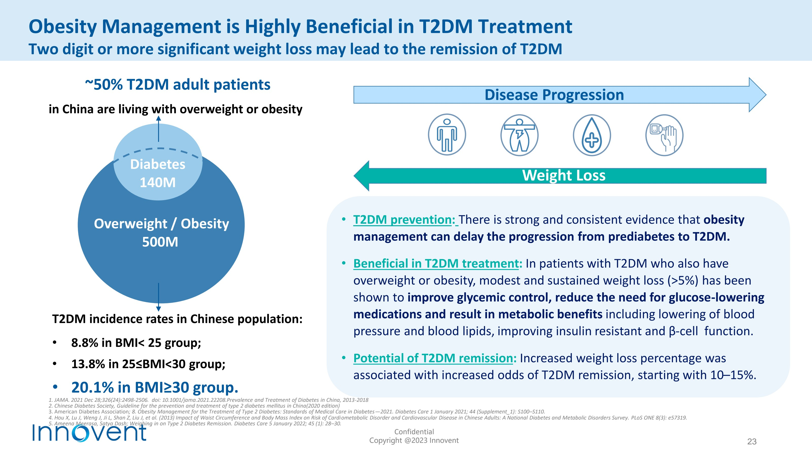

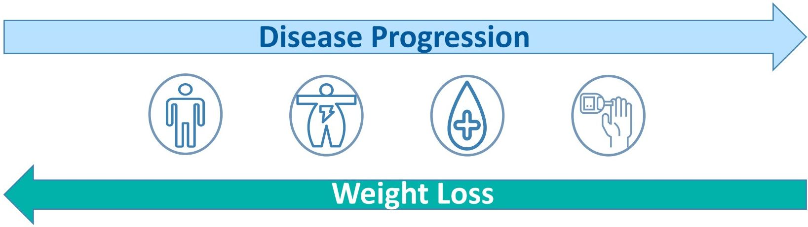

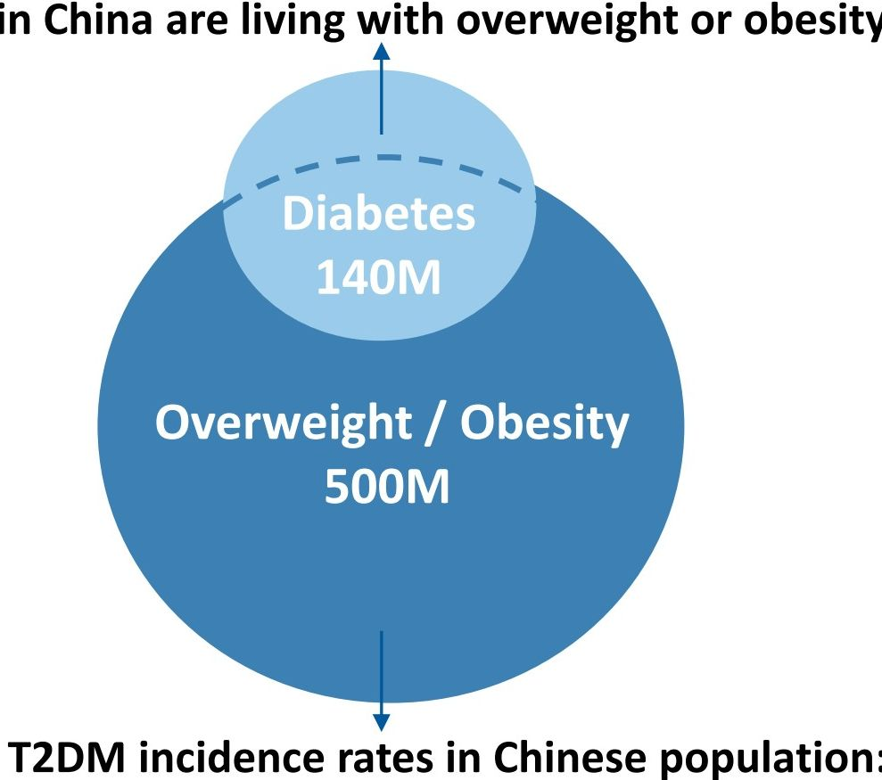

# Lack of Satisfactory Measures Calls for Breakthrough in Obesity Management for Huge Population in China

Lifestyle Intervention icon
## Lifestyle Intervention

**Low Compliance**

* Lack of established approach

* Intensive time commitment

* Self-management disparities

* Non-ideal outcome

China is in lack of established and comprehensive lifestyle intervention approach for widespread use

Pharmacotherapy icon
## Pharmacotherapy

**<1% treated**

* Lack of effective medicines

* Insufficient response

* Safety and tolerability issues of current thearpy

* Concomitant medications limit

Only Orlistat is approved for weight loss use in China. It is difficult to meet various clinical needs and has limited efficacy and serious adverse effects.

Bariatric Surgery icon
## Bariatric Surgery

**~0.25% treated**

* Psychological resistance

* Considerable cost

* Weight rebound

* Short / long term complications

The adoption of bariatric surgery in China faces many obstacles, such as a series of serious postoperative complications

Innovent logo

1. Zeng Q, et al. Lancet Diabetes Endocrinol. 2021; 9(6): 393-405

2. Greater China Bariatric and Metabolic Surgery Database 2020 Annual Report[J]. Chinese Journal of Practical Surgery,2021,41(5):533-542.

Confidential

Copyright @2023 Innovent

24

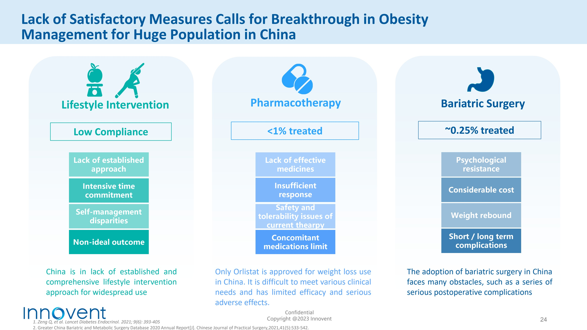

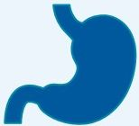

# Disclaimer

This presentation includes forward-looking statements. All statements contained in this presentation other than statements of historical facts, including statements regarding future results of operations and financial position of Innovent Biologics ("Innovent" "we," "us" or "our"), our business strategy and plans, the clinical development of our product candidates and our objectives for future operations, are forward-looking statements. The words "anticipate," "believe," "continue," "estimate," "expect," "intend," "may," "will" and similar expressions are intended to identify forward-looking statements. We have based these forward-looking statements largely on our current expectations and projections about future events and financial trends that we believe may affect our financial condition, results of operations, business strategy, clinical development, short-term and long-term business operations and objectives and financial needs. These forward-looking statements are subject to a number of risks, uncertainties and assumptions. Moreover, we operate in a very competitive and rapidly changing environment. New risks emerge from time to time. It is not possible for our management to predict all risks, nor can we assess the impact of all factors on our business or the extent to which any factor, or combination of factors, may cause actual results to differ materially from those contained in any forward-looking statements we may make. In light of these risks, uncertainties and assumptions, the future events and trends discussed in this presentation may not occur and actual results could differ materially and adversely from those anticipated or implied in the forward-looking statements.

Although we believe that the expectations reflected in the forward-looking statements are reasonable, we cannot guarantee future results, levels of activity, performance, achievements or events and circumstances reflected in the forward-looking statements will occur. We are under no duty to update any of these forward-looking statements after the date of this presentation to conform these statements to actual results or revised expectations, except as required by law. You should, therefore, not rely on these forward-looking statements as representing our views as of any date subsequent to the date of this presentation.

This presentation also contains estimates and other statistical data made by independent parties and by us relating to market size and growth and other data about our industry. This data involves a number of assumptions and limitations, and you are cautioned not to give undue weight to such estimates. Neither we nor any other person makes any representation as to the accuracy or completeness of such data or undertakes any obligation to update such data after the date of this presentation. In addition, projections, assumptions and estimates of our future performance and the future performance of the markets in which we operate are necessarily subject to a high degree of uncertainty and risk.

This presentation may not be all inclusive and may not contain all of the information that you may consider material. Neither Innovent nor any of its affiliates, shareholders, directors, officers, employees, agents and advisors makes any expressed or implied representation or warranty as to the completeness, fairness, reasonableness of the information contained herein, and none of them shall accept any responsibility or liability for any loss or damage, whether or not arising from any error or omission in compiling such information or as a result of any party's reliance or use of such information. By attending or receiving this presentation you acknowledge that you will be solely responsible for your own assessment of our business, the market and our market position and that you will conduct your own analysis and be solely responsible for forming your own view of the potential future performance of our business.

This presentation is intended solely for investors that are qualified institutional buyers or institutional accredited investors solely for the purposes of familiarizing such investors with Innovent and determining whether such investors might have an interest in a securities offering contemplated by Innovent . Any such offering of securities will only be made pursuant to an exemption from, or in a transaction not subject to, the registration requirements of the U.S. Securities Act of 1933, as amended, or by means of a registration statement (including a prospectus) filed with the SEC, after such registration statement becomes effective. No such registration statement has been filed, or become effective, as of the date of this presentation. This presentation shall not constitute an offer to sell or the solicitation of an offer to buy any securities, nor shall there be any sale of any securities in any state or jurisdiction in which such offer, solicitation or sale would be unlawful prior to registration or qualification under the securities laws of any such state or jurisdiction.

Innovent

Confidential
Copyright© 2023 Innovent

25

# Innovent
# Disclaimer

This presentation includes forward-looking statements. All statements contained in this presentation other than statements of historical facts, including statements regarding future results of operations and financial position of Innovent Biologics ("Innovent," "we," "us" or "our"), our business strategy and plans, the clinical development of our product candidates and our objectives for future operations, are forward-looking statements. The words "anticipate," "believe," "continue," "estimate," "expect," "intend," "may," "will" and similar expressions are intended to identify forward-looking statements. We have based these forward-looking statements largely on our current expectations and projections about future events and financial trends that we believe may affect our financial condition, results of operations, business strategy, clinical development, short-term and long-term business operations and objectives and financial needs. These forward-looking statements are subject to a number of risks, uncertainties and assumptions. Moreover, we operate in a very competitive and rapidly changing environment. New risks emerge from time to time. It is not possible for our management to predict all risks, nor can we assess the impact of all factors on our business or the extent to which any factor, or combination of factors, may cause actual results to differ materially from those contained in any forward-looking statements we may make. In light of these risks, uncertainties and assumptions, the future events and trends discussed in this presentation may not occur and actual results could differ materially and adversely from those anticipated or implied in the forward-looking statements.

Although we believe that the expectations reflected in the forward-looking statements are reasonable, we cannot guarantee future results, levels of activity, performance, achievements or events and circumstances reflected in the forward-looking statements will occur. We are under no duty to update any of these forward-looking statements after the date of this presentation to conform these statements to actual results or revised expectations, except as required by law. You should, therefore, not rely on these forward-looking statements as representing our views as of any date subsequent to the date of this presentation.

This presentation also contains estimates and other statistical data made by independent parties and by us relating to market size and growth and other data about our industry. This data involves a number of assumptions and limitations, and you are cautioned not to give undue weight to such estimates. Neither we nor any other person makes any representation as to the accuracy or completeness of such data or undertakes any obligation to update such data after the date of this presentation.

This presentation may not be all inclusive and may not contain all of the information that you may consider material. Neither Innovent nor any of its affiliates, shareholders, directors, officers, employees, agents or advisors makes any representations or warranties (express or implied) as to, or accepts any responsibility or liability for, the accuracy or completeness of the information contained in, or for any omissions from, this presentation or any other written or oral communication transmitted or made available to any interested party or its advisors, and any liability in respect of any such information or any inaccuracy or omission is hereby expressly disclaimed.

Confidential
Copyright© 2023 Innovent 26

