# Efficacy and Safety of HRS9531, a Novel Dual GLP-1/GIP Receptor Agonist, in Chinese Adults with Obesity without Diabetes—Up to 52-Week Treatment

Lin Zhao1, Dan Zhu2, Tianrong Pan3, Dongji Wang4, Hongwei Ling5, Ya Li6, Hanqing Cai7, Zhifeng Cheng8, Dexue Liu9, Yuan Hui10, Xianfeng Zhang11, **Hong Chen**12, Yue Zuo12, Yuqi Sun12, Xiaoying Li1

1 Zhongshan Hospital, Fudan University, Shanghai, China; 2 Peking University Third Hospital, Beijing, China; 3 The Second Hospital of Anhui Medical University, Anhui, China; 4 Lianyungang Hospital of TCM, Lianyungang, China; 5 The Affiliated Hospital of Xuzhou Medical University, Xuzhou, China;

6 The First Affiliated Hospital of Xi'an Medical University, Xi'an, China; 7 The Second Hospital of Jilin University, Changchun, China; 8 The 4th Affiliated Hospital of Harbin Medical University, Harbin, China; 9 The First Affiliated Hospital of Nanyang Medical College, Nanyang, China;

10 The First People’s Hospital of Lianyungang, Lianyungang, China; 11 Hangzhou First People‘s Hospital, Hangzhou, China; 12 Jiangsu Hengrui Pharmaceuticals Co., Ltd., Shanghai, China.

85TH SCIENTIFIC SESSIONS logo

JUNE 20–23, 2025
CHICAGO, IL

Abstract: #2566

American Diabetes Association logo

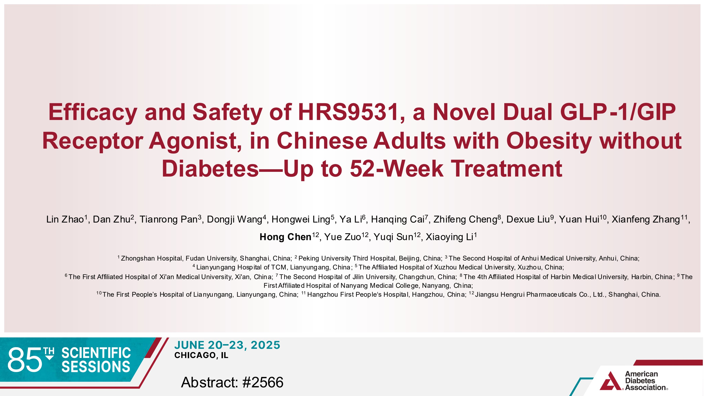

## FINANCIAL DISCLOSURE

➢ The principal investigator, Professor Xiaoying Li, reports no relevant financial relationships to disclose.

➢ This study is sponsored by Jiangsu Hengrui Pharmaceuticals Co., Ltd (China).

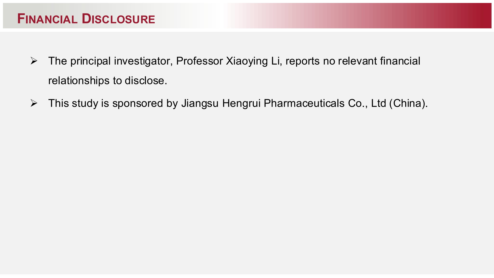

## BACKGROUND/OBJECTIVE

➢ Dual GLP-1/GIP receptor agonists (RAs) are emerging as a key therapeutic option in obesity treatment [1].

➢ HRS9531, a novel dual GLP-1/GIP RA, previously demonstrated clinically significant weight loss in obese adults over 24 weeks [2] and is currently in Phase 2/3 development for obesity, type 2 diabetes mellitus (T2DM), and obstructive sleep apnea.

➢ This study assessed the long-term efficacy and safety of HRS9531 in Chinese adults with obesity without diabetes over a treatment period of up to 52 weeks.

## References:

> [1] Neumiller JJ, et al. Diabetes Care. 2025 Feb 1;48(2):177-181.

> [2] Lin Zhao, et al. Diabetes 2024;73(Supplement\_1):1861-LB.

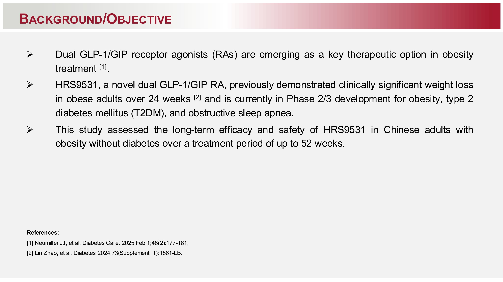

# METHODS AND MATERIALS

* Chinese adults (BMI 28–40 kg/m²) were randomized 1:1:1:1:1 to receive once-weekly (QW) subcutaneous HRS9531 (1.0, 3.0, 4.5, or 6.0 mg) or placebo during a 24-week core treatment period, followed by a 28-week extension (ClinicalTrials.gov identifier: NCT05881837). Results from the core period were previously reported [²].

* During the 28-week extension period, participants maintained their original treatments and doses for the first 8 weeks. Subsequently, all received HRS9531 for 20 weeks: those initially assigned to placebo or the 1.0 mg group transitioned to a 3.0 mg QW dose, while participants in other dose groups were re-randomized to receive either QW or biweekly (every two weeks; Q2W) dosing **(Figure 1)**.

| Initial Group (Wk24-Wk32)                                                                                         | Transition/Re-randomization (Wk32-Wk52)                                       | Follow-up (Wk52-Wk64) |
| ----------------------------------------------------------------------------------------------------------------- | ----------------------------------------------------------------------------- | --------------------- |
| Stage 1 of the extension phase (Wk24-Wk32) \| Stage 2 of the extension phase (Wk32-Wk52) \| Follow-up (Wk52-Wk64) |                                                                               |                       |
| HRS9531 6.0 mg QW                                                                                                 | HRS9531 6.0 mg QW                                                             | Follow-up             |
|                                                                                                                   | HRS9531 6.0 mg Q2W                                                            | Follow-up             |
| HRS9531 4.5 mg QW                                                                                                 | HRS9531 4.5 mg QW                                                             | Follow-up             |
|                                                                                                                   | HRS9531 4.5 mg Q2W                                                            | Follow-up             |
| HRS9531 3.0 mg QW                                                                                                 | HRS9531 3.0 mg QW                                                             | Follow-up             |
|                                                                                                                   | HRS9531 3.0 mg Q2W                                                            | Follow-up             |
| HRS9531 1.0 mg QW                                                                                                 | 2.0 mg QW (Wk32-Wk36) → HRS9531 3.0 mg QW (Wk36-Wk52)                         | Follow-up             |
| Placebo                                                                                                           | 1.0 mg QW (Wk32-Wk36) → 2.0 mg QW (Wk36-Wk40) → HRS9531 3.0 mg QW (Wk40-Wk52) | Follow-up             |

Figure 1. Study design of the extension phase

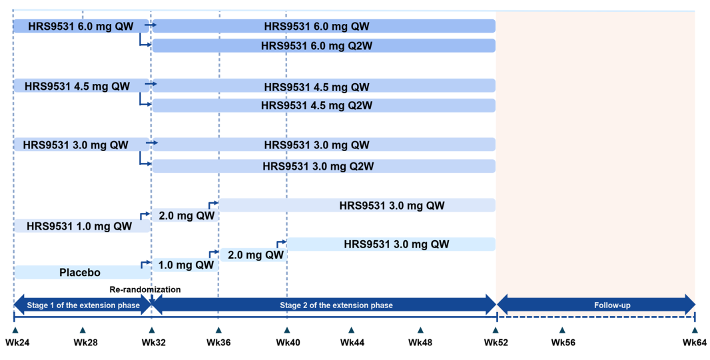

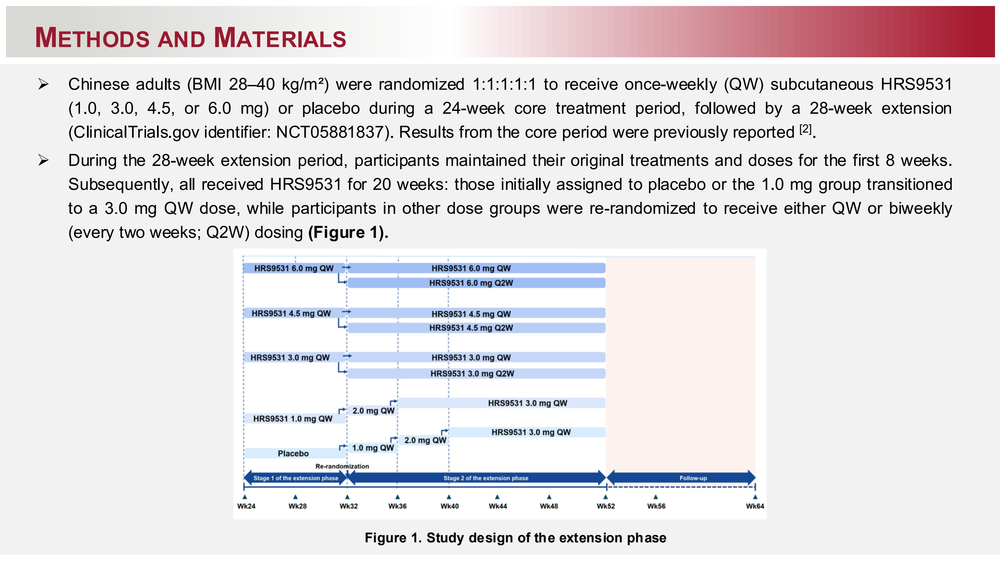

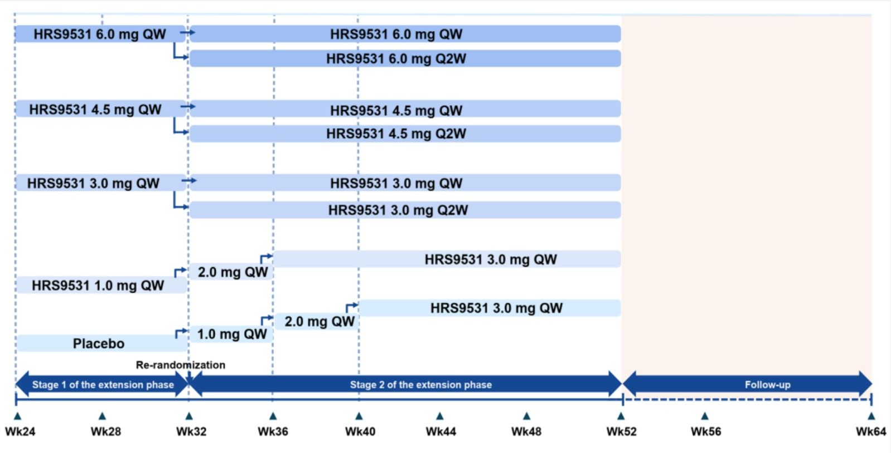

# RESULTS

## <u>Participants</u>

* Of 249 enrolled participants, 248 received at least one post-randomization dose of the study treatment, and 240 completed the 24-week core period.

* Subsequently, 168 participants entered the optional extension phase, of whom 166 completed the first 8 weeks of their original treatment. Thereafter, 163 participants were re-randomized to receive HRS9531 for a 20-week extension, and 154 completed this treatment.

* During the extension phase (both Stage 1 and Stage 2), no participants discontinued treatment because of an adverse event.

## <u>Efficacy</u>

* At week 32, across HRS9531 doses, the mean percentage change in body weight from baseline ranged up to -18.0% in the 6.0 mg weekly (QW) group, compared to a 0.7% increase in the placebo group (**Figure 2**).

* Proportions achieving ≥5% and ≥10% body weight reductions reached as high as 100% and 88.5% in HRS9531 dose groups, respectively, versus 12.5% and 9.4% in the placebo group (**Figure 3**).

| Treatment         | Percentage change (%) |
| ----------------- | --------------------- |
| HRS9531 1.0 mg QW | -5.6                  |
| HRS9531 3.0 mg QW | -15.2                 |
| HRS9531 4.5 mg QW | -15.9                 |
| HRS9531 6.0 mg QW | -18.0                 |
| Placebo           | 0.7                   |

Figure 2. Percentage change in body weight from baseline at Wk32 (Mean [SE]; observed cases)

| Treatment         | ≥5% (%) | ≥10% (%) |
| ----------------- | ------- | -------- |
| HRS9531 1.0 mg QW | 50.0    | 16.7     |
| HRS9531 3.0 mg QW | 100.0   | 77.4     |
| HRS9531 4.5 mg QW | 95.0    | 70.0     |
| HRS9531 6.0 mg QW | 96.2    | 88.5     |
| Placebo           | 12.5    | 9.4      |

Figure 3. Proportion of participants achieving weight reduction targets at Wk32 (observed cases)

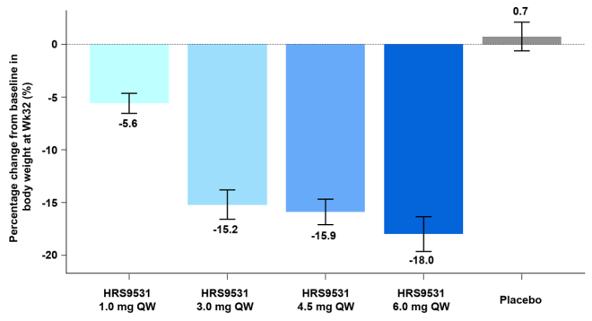

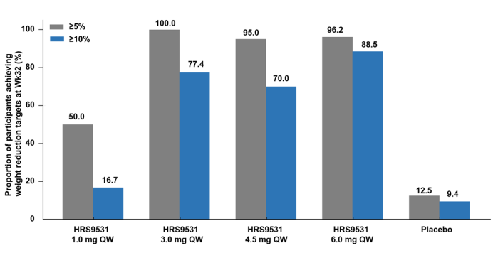

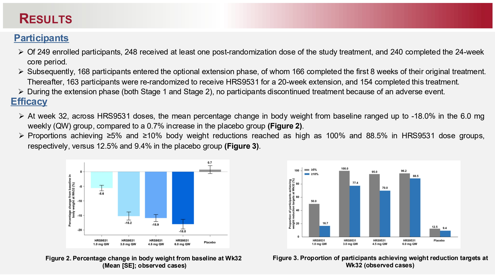

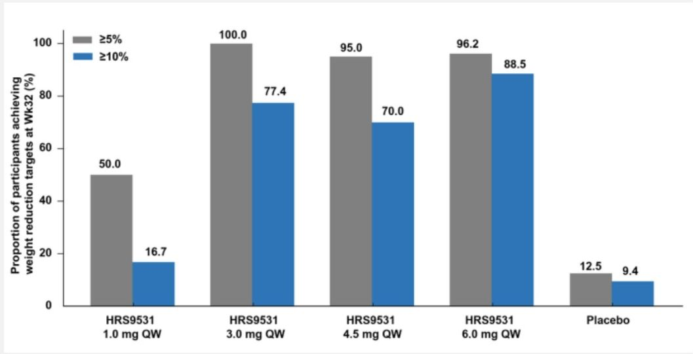

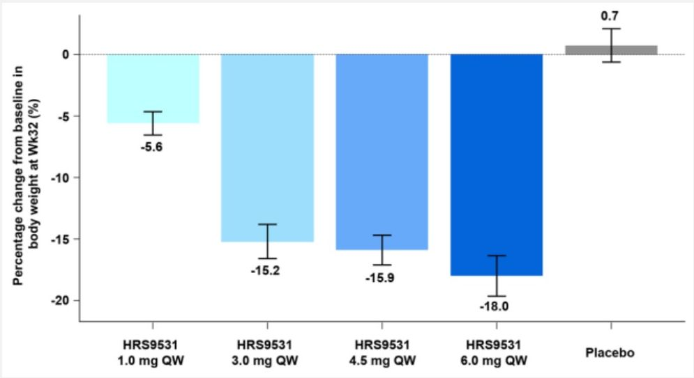

# RESULTS

## <u>Efficacy</u>

* For waist circumference, the mean reduction from baseline reached up to - 13.8 cm in the 6.0 mg QW group, versus -2.0 cm in the placebo group **(Figure 4)**.

* From week 32 to week 52, the mean percentage change in body weight ranged from -0.76% to 0.01% in the HRS9531 Q2W groups versus -3.45% to -0.02% in the HRS9531 QW groups **(Figure 5)**.

* At week 32, HRS9531 outperformed placebo in improving BMI, blood pressure, and glycemic control, as well as in reducing triglyceride, uric acid, and ALT levels **(Table 1)**.

* The Q2W regimen maintained weight stability, suggesting that less frequent dosing may be adequate for long-term weight loss maintenance.

| Treatment Group   | Change from baseline in waist circumference at Wk32 (cm) |
| ----------------- | -------------------------------------------------------- |
| HRS9531 1.0 mg QW | -4.6                                                     |
| HRS9531 3.0 mg QW | -13.4                                                    |
| HRS9531 4.5 mg QW | -13.1                                                    |
| HRS9531 6.0 mg QW | -13.8                                                    |
| Placebo           | -2.0                                                     |

Figure 4. Changes in waist circumference from baseline at Wk32 (Mean [SE]; observed cases)

| Treatment Group    | Percentage change in body weight from Wk32 to Wk 52 (%) |
| ------------------ | ------------------------------------------------------- |
| HRS9531 3.0 mg QW  | -0.82                                                   |
| HRS9531 3.0 mg Q2W | 0.01                                                    |
| HRS9531 4.5 mg QW  | -3.45                                                   |
| HRS9531 4.5 mg Q2W | -0.73                                                   |
| HRS9531 6.0 mg QW  | -0.02                                                   |
| HRS9531 6.0 mg Q2W | -0.76                                                   |

Figure 5. Mean (SE) percentage change in body weight from Wk32 during the 20-week extension phase (Wk52; observed cases)
“HRS9531 3.0 mg QW” refers only to participants who received HRS9531 3.0 mg QW during the core period and stayed on that regimen after re-randomization.

Table 1. Change from baseline at Wk32

|               | HRS9531 1.0 mg QW (n=37) | HRS9531 3.0 mg QW (n=32) | HRS9531 4.5 mg QW (n=40) | HRS9531 6.0 mg QW (n=26) | Placebo (n=33) |
| ------------- | ---------------------------- | ---------------------------- | ---------------------------- | ---------------------------- | ------------------ |
| BMI, kg/m2\*  | -1.8 (1.9)                   | -5.1 (2.6)                   | -5.2 (2.6)                   | -5.8 (2.8)                   | 0.3 (2.4)          |
| SBP, mmHg\*   | -3.6 (9.5)                   | -7.5 (13.2)                  | -9.0 (9.0)                   | -10.8 (9.9)                  | 0.3 (7.3)          |
| DBP, mmHg\*   | -3.5 (7.4)                   | -3.2 (8.6)                   | -4.1 (7.9)                   | -6.8 (7.8)                   | -0.5 (6.9)         |
| HbA1c, %\*    | -0.2 (0.2)                   | -0.4 (0.2)                   | -0.4 (0.2)                   | -0.4 (0.2)                   | 0.1 (0.2)          |
| TG, %#        | -15.9 (32.9)                 | -28.9 (22.3)                 | -28.1 (30.6)                 | -33.4 (24.5)                 | 2.2 (34.9)         |
| Uric acid, %# | -16.6 (13.7)                 | -17.5 (20.8)                 | -19.8 (15.8)                 | -18.9 (14.5)                 | 1.0 (17.9)         |
| ALT, %#       | -22.0 (36.8)                 | -31.4 (45.4)                 | -17.3 (88.0)                 | -30.8 (36.2)                 | 27.6 (96.4)        |

“n” refers to the number of participants who received treatment in Stage 1 of the extension phase.

\*Data are value changes from baseline at W32 and presented in observed mean (SD).
\#Data are percentage changes from baseline at W32 and presented in observed mean (SD).
SBP, systolic blood pressure; DBP, diastolic blood pressure; TG, triglycerides; ALT, alanine aminotransferase.

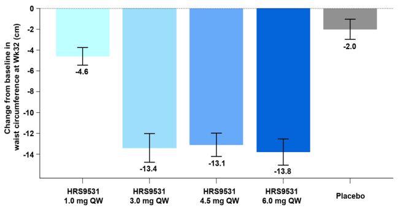

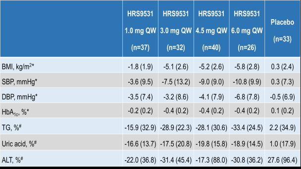

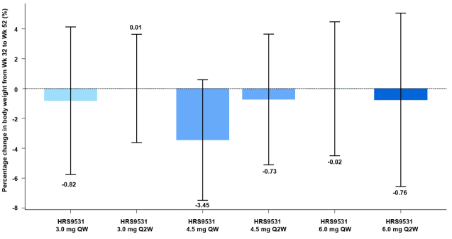

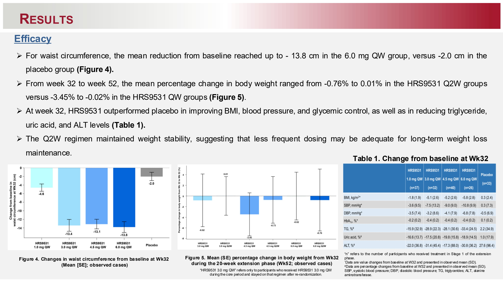

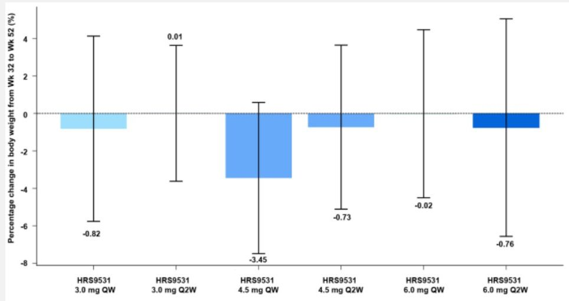

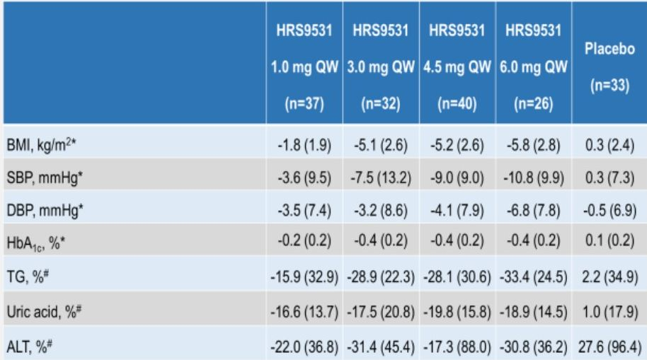

# RESULTS

## <u>Safety</u>

* During the 32-week placebo-controlled treatment period, treatment-emergent adverse events (TEAEs) were reported in 75.5% to 91.8% of participants across HRS9531 dose groups, compared with 85.7% in the placebo group (**Table 2**).

* Most TEAEs were mild to moderate in severity, with gastrointestinal events being the most common.

* No new safety signals emerged for HRS9531 through 52 weeks of treatment, and its tolerability mirrored that of established GLP-1/GIP RAs.

**Table 2. Treatment-emergent adverse events during the 32-week placebo-controlled treatment period**

|                                                          | HRS9531 1.0mg QW(n=49) | HRS9531 3.0mg QW(n=51) | HRS9531 4.5mg QW(n=50) | HRS9531 6.0mg QW(n=49) | Placebo(n=49) |
| -------------------------------------------------------- | ---------------------- | ---------------------- | ---------------------- | ---------------------- | ------------- |
| Any TEAEs                                                | 37 (75.5)              | 45 (88.2)              | 40 (80.0)              | 45 (91.8)              | 42 (85.7)     |
| TESAEs                                                   | 1 (2.0)                | 2 (3.9)                | 3 (6.0)                | 0                      | 3 (6.1)       |
| TEAEs leading to treatment discontinuation               | 1 (2.0)                | 1 (2.0)                | 0                      | 0                      | 1 (2.0)       |
| Gastrointestinal disorders with ≥5% frequency in any arm |                        |                        |                        |                        |               |
| Nausea                                                   | 8 (16.3)               | 14 (27.5)              | 16 (32.0)              | 16 (32.7)              | 4 (8.2)       |
| Diarrhea                                                 | 5 (10.2)               | 18 (35.3)              | 15 (30.0)              | 16 (32.7)              | 4 (8.2)       |
| Vomiting                                                 | 3 (6.1)                | 10 (19.6)              | 12 (24.0)              | 14 (28.6)              | 1 (2.0)       |
| Abdominal distension                                     | 1 (2.0)                | 9 (17.6)               | 3 (6.0)                | 4 (8.2)                | 0             |
| Dyspepsia                                                | 0                      | 4 (7.8)                | 1 (2.0)                | 1 (2.0)                | 0             |
| Constipation                                             | 1 (2.0)                | 3 (5.9)                | 1 (2.0)                | 3 (6.1)                | 0             |
| Abdominal pain                                           | 0                      | 3 (5.9)                | 4 (8.0)                | 1 (2.0)                | 0             |
| Eructation                                               | 0                      | 2 (3.9)                | 2 (4.0)                | 4 (8.2)                | 0             |

Data are n (%).

TEAE, treatment-emergent adverse event; TESAEs, treatment-emergent serious adverse events.

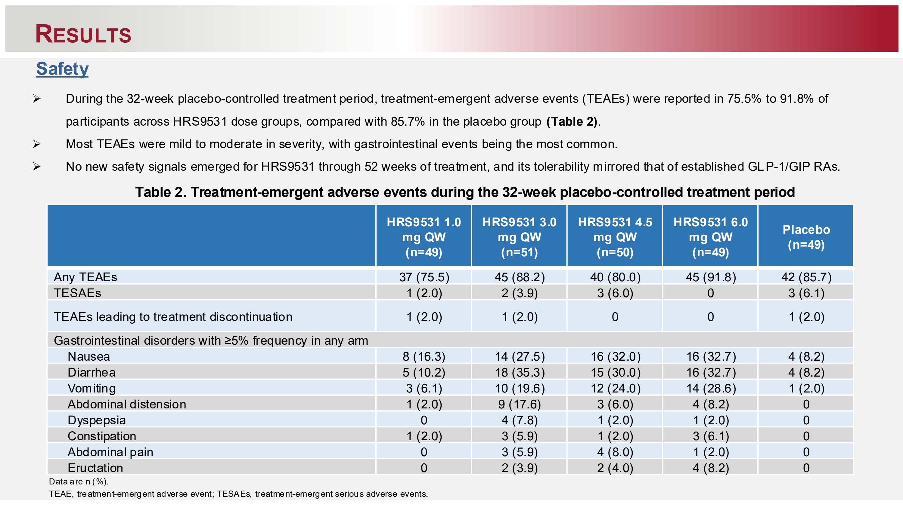

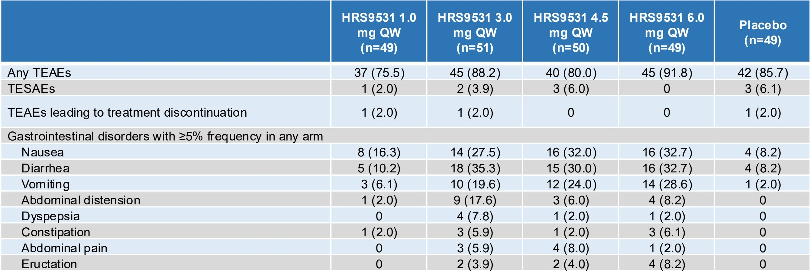

## CONCLUSION

➢ In Chinese adults with obesity without diabetes, HRS9531 demonstrated clinically significant body weight reduction compared to placebo over the 32-week treatment period.

➢ The Q2W (every 2 weeks) dosing regimen effectively sustained the weight loss achieved during the initial 32-week phase through week 52.

➢ HRS9531 exhibited a tolerable and manageable safety profile, aligning with the established safety patterns of other GLP-1/GIP RAs.

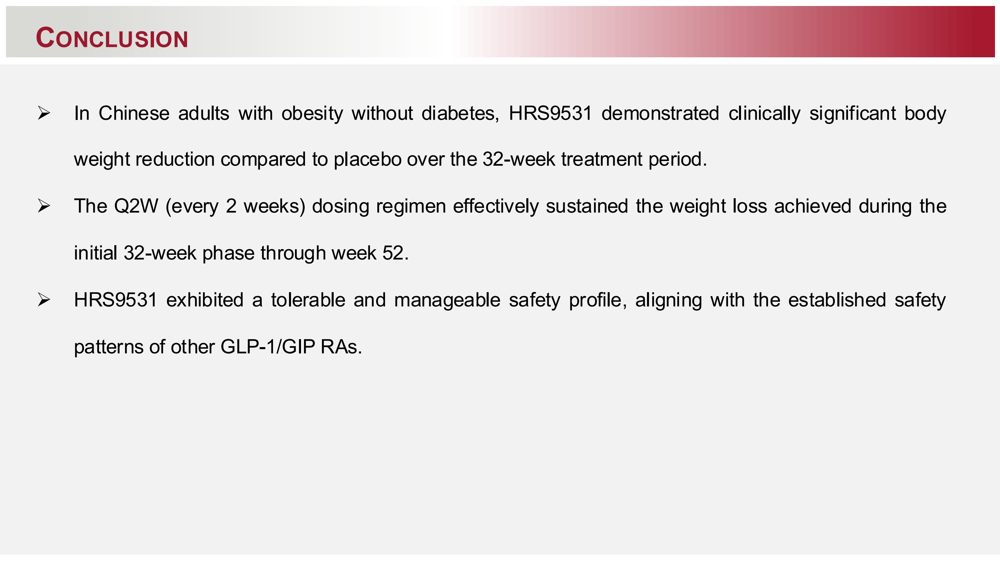
