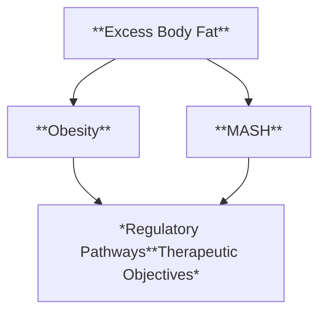
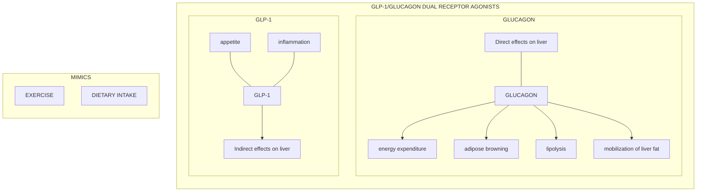
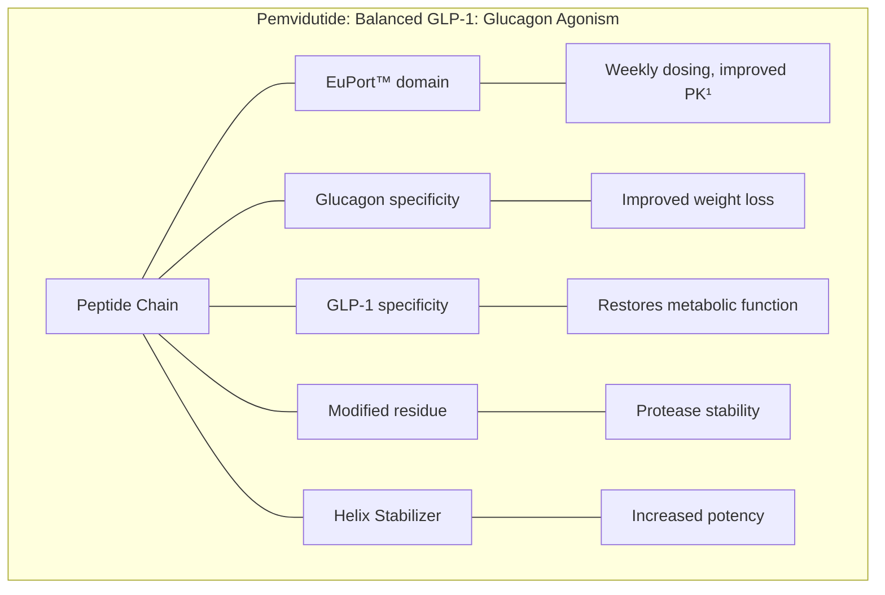

# Role of Glucagon-Containing Dual and Triple Agonists in the Treatment of Obesity and MASH

M. Scott Harris, MD
Chief Medical Officer
Altimmune, Inc.

7ᵗʰ Global MASLD Congress
25 June 2024

altimmune logo | 

 NASDAQ: ALT

# Forward-looking statements

**Safe-Harbor Statement**

This presentation has been prepared by Altimmune, Inc. ("we," "us," "our," "Altimmune" or the "Company") and includes certain "forward-looking statements" within the meaning of the Private Securities Litigation Reform Act of 1995, including statements regarding the timing of clinical development and funding milestones for our clinical assets as well as statements relating to future financial or business performance, conditions, plans, prospects, trends, or strategies and other financial and business matters, and the prospects for commercializing or selling any product or drug candidates. In addition, when or if used in this presentation, the words "may," "could," "should," "anticipate," "believe," "estimate," "expect," "intend," "plan," "predict" and similar expressions and their variants, as they relate to the Company may identify forward-looking statements. The Company cautions that these forward-looking statements are subject to numerous assumptions, risks, and uncertainties, which change over time. Important factors that may cause actual results to differ materially from the results discussed in the forward looking statements or historical experience include risks and uncertainties, including risks relating to: potential impacts due to the COVID-19 pandemic such as delays in regulatory review, manufacturing and supply chain interruptions, adverse effects on healthcare systems and disruption of the global economy, the timing and reliability of the results of the studies relating to human safety and possible adverse effects resulting from the administration of the Company's product candidates; our lack of financial resources and access to capital; clinical trials and the commercialization of proposed product candidates (such as marketing, regulatory, product liability, supply, competition, dependence on third parties and other risks); the timing of regulatory applications and the regulatory approval process; dependence on intellectual property and reimbursement and regulation. Further information on the factors and risks that could affect the Company's business, financial conditions and results of operations are contained in the Company's filings with the U.S. Securities and Exchange Commission, including under the heading "Risk Factors" in the Company's annual reports on Form 10-K and quarterly reports on Form 10-Q filed with the SEC, which are available at <u>www.sec.gov</u>. The statements made herein speak only as of the date stated herein, and any forward-looking statements contained herein are based on assumptions that the Company believes to be reasonable as of this date. The Company undertakes no obligation to update these statements as result of new information or future events.

altimmune logo

# OBESITY AND FATTY LIVER DISEASE

DISEASES WITH UNMET NEED APPROACHING EPIDEMIC PROPORTIONS

| Category              | Population |
| --------------------- | ---------- |
| US Obesity Population | 108M       |
| US MASLD Population   | 82.3M      |
| MASH                  | 16.4M      |

The recent successes of semaglutide (Wegovy®) and tirzepatide (Zepbound®) have created optimism for other incretin-based therapies

* GLP-1/GCG dual receptor agonists

* GLP-1/ amylin combination agents

* GLP-1/GIP mAb

* Oral GLP-1 monotherapies

> GLP-1: glucagon-like peptide-1
> GCG: glucagon
> mAB: monoclonal Ab

Hales CM et al. NCHS Data Brief. 2020 Feb;(360):1-8. PMID: 32487284.

3

Younossi ZM et all. Gut. 2020 Mar;69(3):564-568.

https://liverfoundation.org/liver-diseases/fatty-liver-disease/nonalcoholic-steatohepatitis-nash/

altimmune logo

# OBESITY-RELATED CO-MORBIDITIES ARE THE MOST FREQUENT CAUSE OF DEATH IN PATIENTS WITH MASLD

| Outcome                        | n (%)       |
| ------------------------------ | ----------- |
| Death or liver transplantation | 193 (100.0) |
| Cardiovascular disease         | 74 (38.3)   |
| Non-liver cancer               | 36 (18.7)   |
| Cirrhosis complications        | 15 (7.8)    |
| Infections                     | 15 (7.8)    |
| HCC                            | 2 (1.0)     |
| Liver transplantation          | 1 (0.5)     |
| Other                          | 35 (18.1)   |
| Unknown                        | 15 (7.8)    |

619 patients with biopsy confirmed MASH

4

Adapted from Angulo, Gastroenterology 2015;149: 389–397

altimmune logo

# OBESITY AND MASH SYNERGIES

DISTINCT REGULATORY PATHWAYS BUT SIMILAR THERAPEUTIC OBJECTIVES

* **Reduce body weight**

* **Reduce liver fat**

* Improve serum lipid profile

* Reduce liver inflammation

* Reduce cardiovascular risk factors

* Reduce body weight

5

altimmune logo

# NON-INCRETIN AGENTS FAIL TO ACHIEVE MEANINGFUL WEIGHT LOSS

SNAPSHOT OF COMPOUNDS IN ADVANCED MASH DEVELOPMENT

| Agent                  | Mechanism     | Change in Body Weight | MASH Resolution | Fibrosis Improvement |
| ---------------------- | ------------- | --------------------- | --------------- | -------------------- |
| Obeticholic acid       | FXR agonist   | -2%                   | No              | Yes                  |
| Resmetirom             | THRβ agonist  | no change             | Yes             | Yes                  |
| Lanifibranor (1200 mg) | PanPPAR       | +3.1%                 | Yes             | Yes                  |
| Pegozafermin           | FGF21 agonist | -0.6%                 | Yes             | Yes                  |
| Efruxifermin (70 mg)   | FGF21 agonist | -2.6%                 | Yes             | Yes                  |

6 Younossi, YM 2019, Lancet 394: 2184-96; Harrison, SA 2019, Lancet 394: 2012-24; Harrison SA 2022 , AASLD, The Liver Meeting 2022; Franque SM, 2021; NEJM 385: 1547-57

altimmune logo

# SEMAGLUTIDE—WEIGHT LOSS IN PHASE 2 MASH CLINICAL TRIAL

SUBJECTS WITH AND WITHOUT DIABETES

## All randomized patients

| Weeks                    | Semaglutide 0.1 mg/day | Semaglutide 0.2 mg/day | Semaglutide 0.4 mg/day | Placebo |
| ------------------------ | ---------------------- | ---------------------- | ---------------------- | ------- |
| 0                        | 98                     | 98                     | 98                     | 102     |
| 4                        | 96                     | 95                     | 95                     | 101.5   |
| 12                       | 94                     | 92                     | 91                     | 101.5   |
| 20                       | 93                     | 90                     | 88                     | 101     |
| 28                       | 92                     | 89                     | 87                     | 101.5   |
| 36                       | 92                     | 88.5                   | 85.5                   | 101.5   |
| 44                       | 91.5                   | 88                     | 85                     | 101     |
| 52                       | 91                     | 87.5                   | 84.5                   | 100.5   |
| 62                       | 91.5                   | 87.5                   | 84.5                   | 100.5   |
| 72                       | 91.5                   | 87                     | 84                     | 100.5   |
| Change from Baseline (%) | -4.8%\*                | -8.9%\*                | -12.5%\*               | -0.6%   |

7

Newsome PN 2020, DOI: 10.1056/NEJMoa2028395

altimmune logo

# SEMAGLUTIDE—MASH RESOLUTION <u>WITHOUT</u> FIBROSIS IMPROVEMENT

RESULTS OF A 68-WEEK, PHASE 2, MULTICENTER TRIAL

## MASH Resolution

| Treatment Group                                                         | N      | Weekly dose | Percentage of Patients |
| ----------------------------------------------------------------------- | ------ | ----------- | ---------------------- |
| Semaglutide 0.1 mg                                                      | (N=57) | 0.7 mg      | 40                     |
| Semaglutide 0.2 mg                                                      | (N=59) | 1.4 mg      | 36                     |
| Semaglutide 0.4 mg                                                      | (N=56) | 2.8 mg      | 59                     |
| Placebo                                                                 | (N=58) |             | 17                     |
| Odds ratio, 3.36 (95% CI, 1.29–8.86) \[for 0.1 mg vs Placebo]           |        |             |                        |
| Odds ratio, 2.71 (95% CI, 1.06–7.56) \[for 0.2 mg vs Placebo]           |        |             |                        |
| Odds ratio, 6.87 (95% CI, 2.60–17.63); P<0.001 \[for 0.4 mg vs Placebo] |        |             |                        |

## Fibrosis Improvement

| Treatment Group                                                       | N      | Weekly dose | Percentage of Patients |
| --------------------------------------------------------------------- | ------ | ----------- | ---------------------- |
| Semaglutide 0.1 mg                                                    | (N=57) | 0.7 mg      | 49                     |
| Semaglutide 0.2 mg                                                    | (N=59) | 1.4 mg      | 32                     |
| Semaglutide 0.4 mg                                                    | (N=56) | 2.8 mg      | 43                     |
| Placebo                                                               | (N=58) |             | 33                     |
| Odds ratio, 1.96 (95% CI, 0.86–4.51) \[for 0.1 mg vs Placebo]         |        |             |                        |
| Odds ratio, 1.00 (95% CI, 0.43–2.32) \[for 0.2 mg vs Placebo]         |        |             |                        |
| Odds ratio, 1.42 (95% CI, 0.62–3.28); P=0.48 \[for 0.4 mg vs Placebo] |        |             |                        |

Newsome, NEJM 2020; Nov 13. doi: 10.1056/NEJMoa2028395

8

altimmune logo

# GLP-1 AND GIP AGENTS HAVE ONLY MODEST EFFECTS ON LIVER FAT CONTENT

EFFECTS DRIVEN BY SOLELY BY WEIGHT LOSS DUE TO ABSENCE OF GLP-1 AND GIP RECEPTORS IN LIVER

| Agent                              | Week | LFC relative change from baseline (%) |
| ---------------------------------- | ---- | ------------------------------------- |
| Semaglutide (GLP-1) 0.4 mg/day     | 24   | -34%¹                                 |
| Semaglutide (GLP-1) 0.4 mg/day     | 48   | -57%¹                                 |
| Tirzepatide (GLP-1/GIP) 15 mg/week | 52   | -57%²                                 |

\*¹ Flint, Aliment Pharm Ther 2021; ² Sanyal EASL 2024

9

altimmune logo

# THE IMPACT OF WEIGHT LOSS ON LIVER FIBROSIS MAY BE SLOW

IMPROVEMENT ON FIBROSIS MAY TAKE AS LONG 5 YEARS IN THE ABSENCE OF DIRECT LIVER EFFECTS

Evolution of Fibrosis after Bariatric Surgery
p<.001 p<.001

| Time Point | F0 (%) | F1 (%) | F2 (%) | F3 (%) | F4 (%) |
| ---------- | ------ | ------ | ------ | ------ | ------ |
| Baseline   | 7      | 41     | 14     | 34     | 4      |
| 1 year     | 25     | 29     | 22     | 20     | 4      |
| 5 years    | 58     | 16     | 11     | 11     | 4      |

**Brunt Fibrosis Score**
* F0 [ ]
* F1 [ ]
* F2 [ ]
* F3 [ ]
* F4 [ ]

10

Lassailly Gastroenterology 2020

altimmune logo

# MRI-PDFF REDUCTION STRONGLY PREDICTED OF BIOPSY RESPONSES ON NASH RESOLUTION AND FIBROSIS IMPROVEMENT

## Relationship of Δ MRI-PDFF and Biopsy Response

| %Change from baseline PDFF at Week 52 | Fibrosis Improvement (%) | NASH Resolution (%) |
| ------------------------------------- | ------------------------ | ------------------- |
| -100                                  | 55                       | 70                  |
| -90                                   | 50                       | 62                  |
| -80                                   | 45                       | 55                  |
| -70                                   | 40                       | 48                  |
| -60                                   | 35                       | 42                  |
| -50                                   | 30                       | 35                  |
| -40                                   | 27                       | 28                  |
| -30                                   | 24                       | 23                  |
| -20                                   | 20                       | 18                  |
| -10                                   | 18                       | 14                  |
| 0                                     | 15                       | 10                  |

\* Placebo FI (Fibrosis Improvement) is indicated at approx. 15% response.
\* Placebo NR (NASH Resolution) is indicated at approx. 10% response.

## Receiver Operating Curve (ROC)

| False Positives (100%-Specificity) (%) | ROC (%) | 95% CI Lower (%) | 95% CI Upper (%) |
| -------------------------------------- | ------- | ---------------- | ---------------- |
| 0                                      | 0       | 0                | 0                |
| 20                                     | 65      | 45               | 85               |
| 40                                     | 82      | 65               | 92               |
| 60                                     | 90      | 78               | 96               |
| 80                                     | 95      | 88               | 98               |
| 100                                    | 100     | 100              | 100              |

\* 41.5% MRI-PDFF reduction corresponds to approx. 80% Sensitivity and 25% False Positive rate.

Noureddin, EASL 2024 and Loomba, EASL 2020

11

# FIBROSIS IMPROVEMENT DRIVEN BY LIVER FAT REDUCTION

## Fibrosis Improvement Achieved

| Compound     | Dose      | Mechanism | Liver Fat Reduction | Duration of Treatment | Fibrosis Improvement Treatment | Fibrosis Improvement Placebo | Fibrosis Improvement Δ |
| ------------ | --------- | --------- | ------------------- | --------------------- | ---------------------------------- | -------------------------------- | -------------------------- |
| Resmetirom   | 100 mg QD | THR-β     | 48%                 | 52 weeks              | 26%†                               | 14%                              | 12%                        |
| Pegozafermin | 44 mg Q2W | FGF21     | 54%                 | 24 weeks              | 27%†                               | 7%                               | 20%                        |
| Tirzepatide  | 15 mg QW  | GLP-1/GIP | 57%                 | 52 weeks              | 51%                                | 30%                              | 21%                        |
| Survodutide  | 6.0 mg QW | GLP-1/GCG | 64%                 | 48 weeks 2            | 42%                                | 18%                              | 24%                        |
| Efruxifermin | 50 mg QW  | FGF21     | 64%                 | 24 weeks              | 41%†                               | 20%                              | 21%                        |
| Pemvidutide  | 1.8 mg QW | GLP-1/GCG | 75%                 | 24 weeks              | TBD                                | TBD                              | TBD                        |

## Fibrosis Improvement Not Achieved

| Compound    | Dose      | Mechanism | Liver Fat Reduction | Duration of Treatment | Fibrosis Improvement Treatment | Fibrosis Improvement Placebo | Fibrosis Improvement Δ |
| ----------- | --------- | --------- | ------------------- | --------------------- | ---------------------------------- | -------------------------------- | -------------------------- |
| Semaglutide | 0.4 mg QD | GLP-1     | 30-35%1             | 72 weeks              | 43%                                | 33%                              | 10%                        |

12

\* p < 0.05 1 Estimated at Week 24; 2 ITT analysis

12

# GLP-1/GLUCAGON DUAL RECEPTOR AGONISTS

Optimized for weight loss and MASH

Designed for significant reductions in:

Icon of a scale representing body weight

**BODY WEIGHT**

Icon of a liver representing liver fat, inflammation, and fibrosis

**LIVER FAT, INFLAMMATION, & RESULTING FIBROSIS**

* **GLUCAGON** (Direct effects on liver)
    * energy expenditure
    * adipose browning
    * lipolysis
    * mobilization of liver fat
* **GLP-1** (Indirect effects on liver)
    * appetite
    * inflammation
* **MIMICS**
    * EXERCISE
    * DIETARY INTAKE

13

# PEMVIDUTIDE

BALANCED AGONIST WITH PROLONGED SERUM HALF-LIFE AND DELAYED TIME TO PEAK CONCENTRATION

\*Nestor JJ et al, Peptide Science. 2021;113:e24221

14

altimmune logo

# Weight Loss of 15.6% Achieved at Week 48 on 2.4 mg

MEAN WEIGHT LOSS OF 32.2 LBS AND MAXIMAL WEIGHT LOSS OF 87.1 LBS

\* \*\* p < 0.001 vs. placebo (MMRM)

Relative Weight Loss (%)

| Treatment Group           | LS Mean Weight Loss (%) |
| ------------------------- | ----------------------- |
| placebo (N=97)            | -2.2%                   |
| 1.2 mg pemvidutide (N=98) | -10.3%\*\*\*            |
| 1.8 mg pemvidutide (N=99) | -11.2%\*\*\*            |
| 2.4 mg pemvidutide (N=97) | -15.6%\*\*\*            |

Relative Weight Loss (%)

| Week | placebo | 1.2 mg pemvidutide | 1.8 mg pemvidutide | 2.4 mg pemvidutide |
| ---- | ------- | ------------------ | ------------------ | ------------------ |
| 0    | 0       | 0                  | 0                  | 0                  |
| 4    | -1.9    | -3.8               | -3.8               | -4.0               |
| 8    | -2.2    | -5.4               | -5.8               | -6.2               |
| 12   | -2.5    | -6.4               | -7.1               | -8.1               |
| 16   | -2.5    | -7.2               | -7.9               | -9.4               |
| 20   | -2.6    | -7.9               | -8.6               | -10.4              |
| 24   | -2.6    | -8.4               | -9.1               | -11.3              |
| 28   | -2.3    | -8.8               | -9.6               | -12.1              |
| 32   | -2.3    | -9.2               | -10.1              | -13.0              |
| 36   | -2.2    | -9.6               | -10.4              | -13.6              |
| 40   | -2.1    | -10.0              | -10.6              | -14.2              |
| 44   | -2.1    | -10.2              | -11.0              | -15.0              |
| 48   | -2.2    | -10.3              | -11.2              | -15.6              |

15

MMRM, mixed model for repeated measures

# PEMVIDUTIDE—CLASS-LEADING EFFECTS ON LEAN MASS PRESERVATION

POTENTIALLY SUPERIOR TO THE 25% LEAN LOSS ASSOCIATED WITH DIET AND EXERCISE¹

## LEAN LOSS INDEX

| Drug        | Study                 | Study duration | LBM loss index |
| ----------- | --------------------- | -------------- | -------------- |
| Pemvidutide | MOMENTUM Phase 2      | 48 weeks       | 21.9%²         |
| Tirzepatide | SURMOUNT 1 Phase 3    | 72 weeks       | 26.0%³         |
| Retatrutide | Phase 2 obesity study | 36 weeks       | 37.7%⁴         |
| Semaglutide | STEP-1 Phase 3        | 68 weeks       | 39.9%⁵         |

Lean loss index = loss of lean mass/total mass loss

**Excessive loss of lean mass has been associated with sarcopenia and bone fractures⁵**

1. Heymsfield Obes Rev. 2014 April; 15(4): 310–321; 2. Aronne LA, 84ᵗʰ ADA Meeting, June 2024; 3. Kushner RF, Obesity Week 2022; 4. Harris C, Obesity Week 2023; 5. Wilding JPH, et al. N Engl J Med. 2021 Mar 18;384(11):989-1002.

# PEMVIDUTIDE— ROBUST REDUCTIONS IN LIVER FAT CONTENT AT 24 WEEKS

CORRELATES WITH MASH RESOLUTION AND FIBROSIS IMPROVEMENT

## Relative Reduction

| Treatment Group           | Mean Relative Reduction in Liver Fat (% ± SE) |
| ------------------------- | --------------------------------------------- |
| placebo (N=18)            | 14.0%                                         |
| pemvidutide 1.2 mg (N=14) | 56.3%\*\*\*                                   |
| pemvidutide 1.8 mg (N=13) | 75.2%\*\*\*                                   |
| pemvidutide 2.4 mg (N=11) | 76.4%\*\*\*                                   |

\*** p < 0.001 vs placebo ANCOVA, LS mean ± SE

| Treatment Group           | 30% Reduction (%) | 50% Reduction (%) | Normalization (≤5% LFC) (%) |
| ------------------------- | ----------------- | ----------------- | --------------------------- |
| placebo (N=18)            | 5.6%              | 0%                | 0%                          |
| pemvidutide 1.2 mg (N=14) | 76.9%\*\*\*\*     | 61.5%\*\*\*       | 30.8%\*                     |
| pemvidutide 1.8 mg (N=13) | 92.3%\*\*\*\*     | 84.6%\*\*\*\*     | 53.8%\*\*\*                 |
| pemvidutide 2.4 mg (N=11) | 100.0%\*\*\*\*    | 72.7%\*\*\*\*     | 45.5%\*\*                   |

\* p < 0.05, \*** p < 0.001, \**** p < 0.0001 vs placebo, Cochran-Mantel-Haenszel

17

altimmune logo

# PEMVIDUTIDE— MARKED REDUCTION OF LIVER FAT CONTENT BY MRI-PDFF AT WEEK 24

## MRI-PDFF

| Timepoint | MRI-PDFF (%) |
| --------- | ------------ |
| Baseline  | 32.3%        |
| Week 24   | 1.7%         |

MRI-PDFF scans showing liver fat reduction from baseline to week 24

This reduction was accompanied by a 38.1% decrease in liver volume

Pemvidutide 1.8 mg

18

Study ALT-801-106 MASLD Trial

altimmune logo

# GLP-1 BASED AGENTS IN DEVELOPMENT¹ FOR MASH AND OBESITY

HIGH GLUCAGON CONTENT DRIVES POTENT EFFECTS ON LIVER FAT AND BODY WEIGHT

| Agent          | Class         | Agonist Ratios² | Dose Titration | LFC Reduction | Weight Reduction |
| -------------- | ------------- | --------------- | -------------- | ------------- | ---------------- |
| Semaglutide    | GLP-1         | —               | yes            | +             | ++++             |
| Tirzepatide    | GLP-1/GIP     | 1:15            | yes            | +             | ++++             |
| Cotadutide     | GLP-1/GCG     | 5:1             | yes            | ++            | +                |
| Retatrutide    | GLP-1/GIP/GCG | 1:6:0.1         | yes            | ++++          | ++++             |
| Survodutide    | GLP-1/GCG     | 8:1             | yes            | +++           | +++              |
| Efinopegdutide | GLP-1/GCG     | 2:1             | yes            | ++++          | ++++             |
| Pemvidutide    | GLP-1/GCG     | 1:1             | no             | ++++          | ++++             |

¹ Phase 2 and later; ² based on cell-based potency assays
GLP-1, glucagon-like peptide-1; GIP, gastric inhibitory polypeptide; GCG, glucagon

19

altimmune logo

# PEMVIDUTIDE— DIRECT ANTI-FIBROTIC EFFECTS IN PRECLINICAL MODEL OF HEPATIC FIBROSIS

* Significant improvement in a model of chemically-induced hepatic fibrosis after 14 days of treatment with pemvidutide

* The model excluded the effects of liver fat reduction, providing evidence for a direct effect of pemvidutide in reducing liver fibrosis

20

altimmune logo

# THANK YOU

