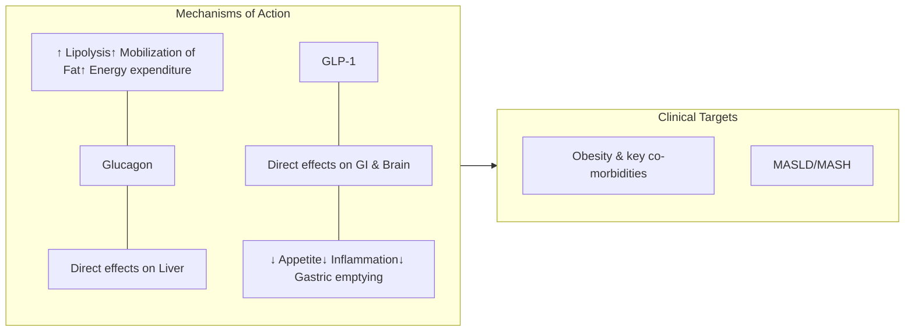
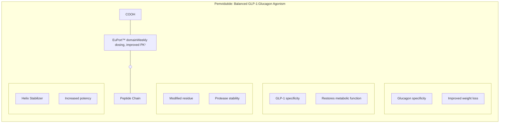

# PEMVIDUTIDE, A GLP-1/GLUCAGON DUAL RECEPTOR AGONIST, IN SUBJECTS WITH OVERWEIGHT OR OBESITY: A 48-WEEK, PLACEBO-CONTROLLED, PHASE 2 TRIAL (MOMENTUM)

L. Aronne¹, M.S. Harris², M.S. Roberts², J. Suschak², S. Tomah², J. Kasper², L. He², J. Yang², J.P. Frias³, S.K. Browne²;
¹Weill Cornell Medicine, New York, NY, USA, ²Altimmune, Inc, Gaithersburg, MD, USA, ³Velocity Clinical Research, Los Angeles, CA, USA.

altimmune logo | 

 NASDAQ: ALT


# DISCLOSURES

**Grants/Consultancy:** Allurion, Altimmune, Atria, Gelesis, Jamieson Wellness, Janssen Pharmaceuticals, Jazz Pharmaceuticals, Novo Nordisk, Pfizer, Optum, Eli Lilly, Senda Biosciences, Versanis. Grants; Allurion, AstraZeneca, Gelesis, Janssen Pharmaceuticals, Novo Nordisk, Eli Lilly.

**Stock/Shareholding;** Allurion, ERX Pharmaceuticals, Gelesis, Intellihealth, Jamieson Wellness, Myos Corp.

**Other:** ERX Pharmaceuticals, Intellihealth, Jamieson Wellness

2

altimmune logo


# US PREVALENCE AND SIGNIFICANCE OF OBESITY COMORBIDITIES

| ObesityDyslipidemia    | ObesityMASLDMASH                       | ObesityHypertension    | ObesityObs. Sleep Apnea | ObesityT2DM    |
| ---------------------- | -------------------------------------- | ---------------------- | ----------------------- | -------------- |
| 66-70% Dyslipidemia1,2 | 58-75% MASLD3,4,5<br/>30-36% MASH3,4,6 | 45-55% Hypertension1,7 | 41-45% Sleep Apnea8,9   | 19-23% T2DM1,7 |


### Most significant comorbidities are dyslipidemia, MASLD/MASH, and hypertension

1) Bays, Harold, et. al. (2013) Obesity, adiposity, and dyslipidemia: A consensus statement from the National Lipid Association. Journal of Clinical Lipidology 7(4):304–383.

2) Lim Y, Boster J. Obesity and Comorbid Conditions. [Updated 2023 Feb 8]. In: StatPearls [Internet]. Treasure Island (FL): StatPearls Publishing; https://www.ncbi.nlm.nih.gov/books/NBK574535/

3) Quek, Jingxuan, et. al. (2023) Global prevalence of non-alcoholic fatty liver disease and non-alcoholic steatohepatitis in the overweight and obese population:. The Lancet Gastroenterology & Hepatology 8(1):20-30.

4) Vernon, G, et. al. (2011) Systematic review: the epidemiology and natural history of non-alcoholic fatty liver disease and non-alcoholic steatohepatitis in adults. Aliment Pharmacol Ther 34:274–285.

5) Le, Michael, et. al. (2022) 2019 Global NAFLD Prevalence: A Systematic Review and Meta-analysis. Clinical Gastroenterology and Hepatology 2022;20:2809–2817

6) Dufour, Jean-François, et. al. (2021) The global epidemiology of nonalcoholic steatohepatitis (NASH) and associated risk factors–A targeted literature review. Endocrine and Metabolic Science 3.

7) Pantalone KM, et al. Prevalence and recognition of obesity and its associated comorbidities. BMJ Open 2017;7:e017583. doi:10.1136/ bmjopen-2017-017583

8) Romero-Corral, Abel, et. al. (2010) Interactions Between Obesity and Obstructive Sleep Apnea. Chest 137(3): 711-719.

9) Garvey JF, Pengo MF, Drakatos P, Kent BD. Epidemiological aspects of obstructive sleep apnea. J Thorac Dis 2015;7(5):920-929.

3

altimmune logo


# PEMVIDUTIDE MOA IS OPTIMIZED FOR OBESITY AND MASLD/MASH



4
<sup>1</sup>US Obesity Population: Hales CM et al. NCHS Data Brief. 2020 Feb;(360):1-8. PMID: 32487284.
<sup>2</sup>US MASH Population: Younossi ZM et all. Gut. 2020;(3):564-568. doi: 10.1136/gutjnl-2019-318813

altimmune logo


# PEMVIDUTIDE: RATIONALLY DESIGNED AND HIGHLY DIFFERENTIATED

EUPORT™ DOMAIN PROVIDES PROLONGED SERUM HALF-LIFE AND DELAYED TIME TO PEAK CONCENTRATION



¹Nestor JJ et al, Peptide Science. 2021;113:e24221

5

altimmune logo


# MOMENTUM OBESITY TRIAL DESIGN

* **Phase 2, 48-week trial of pemvidutide in 391 subjects with overweight or obesity**

* **Randomized 1:1:1:1 to 4 treatment arms, stratified by gender and baseline BMI, with standard lifestyle interventions**

* **No or rapid (4 week) dose titration; dose reduction for intolerability was not allowed**

* **Body composition MRIs were obtained in subset of subjects at baseline and week 48**

Diagram of MOMENTUM obesity trial design showing screening, randomization, and four treatment arms: placebo weekly, 1.2 mg weekly, 1.8 mg weekly, and 2.4 mg weekly with a 4-week titration period (0.6, 1.2, 1.8, 1.8 mg) leading to Week 48.

6

altimmune logo


# MOMENTUM KEY ELIGIBILITY CRITERIA

* **Men and women ages 18-75 years**

* **BMI ≥ 30 kg/m² or BMI ≥ 27 kg/m² with at least one obesity-related comorbidity**

    - History of cardiovascular disease

    - Hypertension

    - Dyslipidemia

    - Pre-diabetes

    - Obstructive sleep apnea

* **Non-diabetes: HbA1c ≤ 6.5% and fasting glucose ≤ 125 mg/dL**

* **At least one unsuccessful weight loss attempt**

* **25% of subjects were to be male**

7

altimmune logo


# DISPOSITION OF SUBJECTS

```mermaid
graph TD
    A[391 randomizedand dosed] --> B[PlaceboN=97 (100.0%)]
    A --> C[Pemvidutide 1.2 mgN=98 (100.0%)]
    A --> D[Pemvidutide 1.8 mgN=99 (100.0%)]
    A --> E[Pemvidutide 2.4 mgN=97 (100.0%)]

    B --> B1[Completed studyon study drugN=51 (52.6%)]
    B1 --> B2[Completed studyN=60 (61.9%)]

    C --> C1[Completed studyon study drugN=70 (71.4%)]
    C1 --> C2[Completed studyN=76 (77.6%)]

    D --> D1[Completed studyon study drugN=63 (63.6%)]
    D1 --> D2[Completed studyN=74 (74.7%)]

    E --> E1[Completed studyon study drugN=56 (57.7%)]
    E1 --> E2[Completed studyN=68 (70.1%)]
```

74.1% of subjects receiving pemvidutide completed the study

8

altimmune logo


# BASELINE CHARACTERISTICS OF SUBJECTS

| Characteristic        | Characteristic                   | Treatment<br/>Placebo(N=97) | Treatment<br/>1.2 mg(N=98) | Treatment<br/>1.8 mg(N=99) | Treatment<br/>2.4 mg(N=97) |
| --------------------- | -------------------------------- | --------------------------- | -------------------------- | -------------------------- | -------------------------- |
| Age, years            | mean (SD)                        | 50.3 (13.6)                 | 49.6 (12.3)                | 50.1 (13.3)                | 48.5 (13.6)                |
| Gender                | female, N (%)                    | 72 (74.2%)                  | 75 (76.5%)                 | 76 (76.8%)                 | 74 (76.3%)                 |
| Race                  | White, N (%)                     | 76 (78.4%)                  | 86 (87.8%)                 | 72 (72.7%)                 | 77 (79.4%)                 |
|                       | African-American, N (%)          | 13 (13.4%)                  | 8 (8.2%)                   | 19 (19.2%)                 | 16 (16.5%)                 |
|                       | Asian, N (%)                     | 5 (5.2%)                    | 1 (1.0%)                   | 2 (2.0%)                   | 0 (0.0%)                   |
|                       | Native or American Indian, N (%) | 0 (0.0%)                    | 0 (0.0%)                   | 1 (1.0%)                   | 0 (0.0%)                   |
|                       | Other, N (%)                     | 3 (3.1%)                    | 3 (3.1%)                   | 5 (5.1%)                   | 4 (4.1%)                   |
| Ethnicity             | Hispanic, N (%)                  | 19 (19.6%)                  | 19 (19.4%)                 | 18 (18.2%)                 | 24 (24.7%)                 |
|                       | not Hispanic, N (%)              | 78 (80.4%)                  | 77 (78.6%)                 | 79 (79.8%)                 | 73 (75.3%)                 |
|                       | not reported, N (%)              | 0 (0.0%)                    | 2 (2.0%)                   | 2 (2.0%)                   | 0 (0.0%)                   |
| BMI, kg/m²            | mean (SD)                        | 37.8 (7.2)                  | 37.4 (6.1)                 | 37.4 (7.4)                 | 37.1 (5.9)                 |
| Body weight, kg       | mean (SD)                        | 105.7 (22.5)                | 104.5 (22.7)               | 103.8 (23.8)               | 104.0 (19.7)               |
| Blood pressure, mm Hg | systolic, mean (SD)              | 122.2 (12.8)                | 121.6 (12.9)               | 124.0 (12.8)               | 124.7 (13.0)               |
|                       | diastolic, mean (SD)             | 76.4 (8.1)                  | 77.9 (7.5)                 | 78.2 (7.6)                 | 80.0 (7.7)                 |


9

altimmune logo


# Weight Loss of 15.6% Achieved at Week 48 on 2.4 mg

MEAN WEIGHT LOSS OF 32.2 LBS AND MAXIMAL WEIGHT LOSS OF 87.1 LBS

## Relative Weight Loss (%)

\*\*\* p < 0.001 vs. placebo (MMRM)

| Treatment Group           | LS Mean Weight Loss (% ± SE) |
| ------------------------- | ---------------------------- |
| placebo (N=97)            | -2.2                         |
| 1.2 mg pemvidutide (N=98) | -10.3\*\*\*                  |
| 1.8 mg pemvidutide (N=99) | -11.2\*\*\*                  |
| 2.4 mg pemvidutide (N=97) | -15.6\*\*\*                  |


## Relative Weight Loss (%)

| Week | placebo     | 1.2 mg pemvidutide | 1.8 mg pemvidutide | 2.4 mg pemvidutide |
| ---- | ----------- | ------------------ | ------------------ | ------------------ |
| 0    | 0           | 0                  | 0                  | 0                  |
| 4    | -2.0        | -3.5               | -3.8               | -4.2               |
| 8    | -2.2        | -5.2               | -5.5               | -6.3               |
| 12   | -2.5        | -6.3               | -7.0               | -8.1               |
| 16   | -2.6        | -7.2               | -7.9               | -9.5               |
| 20   | -2.6        | -7.9               | -8.6               | -10.4              |
| 24   | -2.7        | -8.4               | -9.1               | -11.2              |
| 28   | -2.3        | -8.8               | -9.6               | -12.1              |
| 32   | -2.4        | -9.3               | -10.1              | -12.9              |
| 36   | -2.2        | -9.7               | -10.3              | -13.6              |
| 40   | -2.1        | -10.0              | -10.6              | -14.3              |
| 44   | -2.2        | -10.2              | -11.0              | -15.0              |
| 48   | -2.2 (N=97) | -10.3 (N=98)       | -11.2 (N=99)       | -15.6 (N=97)       |


10

MMRM, mixed model for repeated measures

altimmune logo


# ROBUST WEIGHT LOSS AT ALL PEMVIDUTIDE DOSES

OVER 30% OF SUBJECTS LOST 20% OR MORE BODY WEIGHT ON 2.4 MG

### Placebo

| Subject | Change in Weight from Baseline (%) |
| ------- | ---------------------------------- |
| 1       | 3.0                                |
| 2       | 2.8                                |
| 3       | 2.5                                |
| 4       | 2.2                                |
| 5       | 2.0                                |
| 6       | 1.8                                |
| 7       | 1.5                                |
| 8       | 1.2                                |
| 9       | 1.0                                |
| 10      | 0.8                                |
| 11      | 0.5                                |
| 12      | 0.2                                |
| 13      | 0.0                                |
| 14      | -0.2                               |
| 15      | -0.5                               |
| 16      | -0.8                               |
| 17      | -1.0                               |
| 18      | -1.2                               |
| 19      | -1.5                               |
| 20      | -1.8                               |
| 21      | -2.0                               |
| 22      | -2.2                               |
| 23      | -2.5                               |
| 24      | -2.8                               |
| 25      | -3.0                               |
| 26      | -3.2                               |
| 27      | -3.5                               |
| 28      | -3.8                               |
| 29      | -4.0                               |
| 30      | -4.2                               |
| 31      | -4.5                               |
| 32      | -4.8                               |
| 33      | -5.0                               |
| 34      | -5.2                               |
| 35      | -5.5                               |
| 36      | -5.8                               |
| 37      | -6.0                               |
| 38      | -6.5                               |
| 39      | -7.0                               |
| 40      | -7.5                               |
| 41      | -8.0                               |
| 42      | -8.5                               |
| 43      | -9.0                               |
| 44      | -10.0                              |
| 45      | -11.0                              |
| 46      | -20.0                              |


### Pemvidutide 1.2 mg

| Subject | Change in Weight from Baseline (%) |
| ------- | ---------------------------------- |
| 1       | 4.0                                |
| 2       | 3.5                                |
| 3       | 2.0                                |
| 4       | 1.5                                |
| 5       | 1.0                                |
| 6       | 0.5                                |
| 7       | 0.0                                |
| 8       | -0.5                               |
| 9       | -1.0                               |
| 10      | -1.5                               |
| 11      | -2.0                               |
| 12      | -2.5                               |
| 13      | -3.0                               |
| 14      | -3.5                               |
| 15      | -4.0                               |
| 16      | -4.5                               |
| 17      | -5.0                               |
| 18      | -5.5                               |
| 19      | -6.0                               |
| 20      | -6.5                               |
| 21      | -7.0                               |
| 22      | -7.5                               |
| 23      | -8.0                               |
| 24      | -8.2                               |
| 25      | -8.5                               |
| 26      | -8.8                               |
| 27      | -9.0                               |
| 28      | -9.2                               |
| 29      | -9.5                               |
| 30      | -9.8                               |
| 31      | -10.0                              |
| 32      | -10.2                              |
| 33      | -10.5                              |
| 34      | -10.8                              |
| 35      | -11.0                              |
| 36      | -11.2                              |
| 37      | -11.5                              |
| 38      | -11.8                              |
| 39      | -12.0                              |
| 40      | -12.2                              |
| 41      | -12.5                              |
| 42      | -12.8                              |
| 43      | -13.0                              |
| 44      | -13.5                              |
| 45      | -14.0                              |
| 46      | -14.5                              |


### Pemvidutide 1.8 mg

| Subject | Change in Weight from Baseline (%) |
| ------- | ---------------------------------- |
| 1       | 10.0                               |
| 2       | 8.0                                |
| 3       | 7.0                                |
| 4       | 5.0                                |
| 5       | 4.0                                |
| 6       | 2.0                                |
| 7       | 1.0                                |
| 8       | 0.0                                |
| 9       | -1.0                               |
| 10      | -2.0                               |
| 11      | -3.0                               |
| 12      | -4.0                               |
| 13      | -5.0                               |
| 14      | -6.0                               |
| 15      | -7.0                               |
| 16      | -8.0                               |
| 17      | -9.0                               |
| 18      | -10.0                              |
| 19      | -11.0                              |
| 20      | -12.0                              |
| 21      | -13.0                              |
| 22      | -14.0                              |
| 23      | -15.0                              |
| 24      | -16.0                              |
| 25      | -17.0                              |
| 26      | -18.0                              |
| 27      | -19.0                              |
| 28      | -20.0                              |
| 29      | -21.0                              |
| 30      | -22.0                              |
| 31      | -23.0                              |
| 32      | -24.0                              |
| 33      | -25.0                              |
| 34      | -26.0                              |
| 35      | -27.0                              |
| 36      | -28.0                              |


### Pemvidutide 2.4 mg

| Subject | Change in Weight from Baseline (%) |
| ------- | ---------------------------------- |
| 1       | 0.0                                |
| 2       | -1.0                               |
| 3       | -2.0                               |
| 4       | -3.0                               |
| 5       | -4.0                               |
| 6       | -5.0                               |
| 7       | -6.0                               |
| 8       | -7.0                               |
| 9       | -8.0                               |
| 10      | -9.0                               |
| 11      | -10.0                              |
| 12      | -11.0                              |
| 13      | -12.0                              |
| 14      | -13.0                              |
| 15      | -14.0                              |
| 16      | -15.0                              |
| 17      | -16.0                              |
| 18      | -17.0                              |
| 19      | -18.0                              |
| 20      | -19.0                              |
| 21      | -20.0                              |
| 22      | -21.0                              |
| 23      | -22.0                              |
| 24      | -23.0                              |
| 25      | -24.0                              |
| 26      | -25.0                              |
| 27      | -26.0                              |
| 28      | -27.0                              |
| 29      | -28.0                              |
| 30      | -29.0                              |
| 31      | -30.0                              |
| 32      | -31.0                              |
| 33      | -32.0                              |


11

altimmune logo


# PRESERVATION OF LEAN MASS EMERGING AS KEY ATTRIBUTE OF CHRONIC WEIGHT MANAGEMENT

* **Lean mass loss of ~25% is an expected outcome of weight loss, however:**

    - Sarcopenia and loss of lean mass increase mortality¹

    - Up to 19% of Americans have sarcopenic obesity²

* **Incretin therapy has been associated with up to 40% lean mass loss³**

* **Weight loss therapies that minimize loss of lean mass are needed**

12

1. Lee DH, Giovannucci EL. Body composition and mortality in the general population: A review of epidemiologic studies. Exp Biol Med (Maywood). 2018 Dec;243(17-18):1275-1285. doi: 10.1177/1535370218818161. Epub 2018 Dec 11. PMID: 30537867; PMCID: PMC6348595.

2. Gao Q, Mei F, Shang Y, Hu K, Chen F, Zhao, Ma B. Global prevalence of sarcopenic obesity in older adults: A systematic review and meta-analysis. Epub 2021 Jun 21. 40(7):4633-4641. doi: 10.1016/j.clnu.2021.06.009.
3. Wilding JPH, Batterham RL, Calanna S, Davies M, Van Gaal LF, Lingvay I, McGowan BM, Rosenstock J, Tran MTD, Wadden TA, Wharton S, Yokote K, Zeuthen N, Kushner RF; STEP 1 Study Group. Once-Weekly Semaglutide in Adults with Overweight or Obesity. N Engl J Med. 2021 Mar 18;384(11):989-1002. doi: 10.1056/NEJMoa2032183. Epub 2021 Feb 10. PMID: 33567185.

altimmune logo


# PEMVIDUTIDE– ONLY 21.9% OF WEIGHT LOSS FROM LEAN MASS

MRI-BASED BODY COMPOSITION ANALYSIS SUBSTANTIATES QUALITY OF WEIGHT LOSS WITH PEMVIDUTIDE TREATMENT

**Regression Analysis of Change in Lean Mass vs. Change in Total Mass**
**Pemvidutide-treated Subjects, Full Analysis Set (n = 50)**

| Change in Total Mass (kg) | Change in Lean Mass (kg) |
| ------------------------- | ------------------------ |
| 4.2                       | 0.7                      |
| 1.5                       | 0.6                      |
| 0.8                       | 1.5                      |
| 0.1                       | 0.5                      |
| -0.2                      | -0.3                     |
| -0.5                      | -1.4                     |
| -1.2                      | 1.2                      |
| -1.5                      | -1.6                     |
| -1.8                      | -2.6                     |
| -2.5                      | -1.5                     |
| -3.2                      | -0.8                     |
| -3.5                      | -1.7                     |
| -3.8                      | -3.1                     |
| -4.2                      | -0.5                     |
| -4.5                      | -0.9                     |
| -4.8                      | -1.1                     |
| -5.1                      | -1.7                     |
| -5.5                      | -4.1                     |
| -5.8                      | -0.7                     |
| -6.1                      | -0.2                     |
| -6.5                      | -2.2                     |
| -6.8                      | -2.9                     |
| -7.1                      | -3.1                     |
| -7.5                      | -0.9                     |
| -8.2                      | -2.3                     |
| -8.5                      | -1.0                     |
| -9.2                      | -3.1                     |
| -9.5                      | -3.2                     |
| -9.8                      | -3.3                     |
| -10.5                     | -1.1                     |
| -10.8                     | -1.6                     |
| -11.2                     | 0.4                      |
| -11.5                     | -2.2                     |
| -11.8                     | -3.0                     |
| -12.5                     | -2.5                     |
| -12.8                     | -3.3                     |
| -13.2                     | -7.3                     |
| -13.5                     | -4.0                     |
| -13.8                     | -1.4                     |
| -14.1                     | -3.1                     |
| -14.2                     | -4.1                     |
| -14.5                     | -4.6                     |
| -14.8                     | -3.6                     |
| -15.2                     | -1.8                     |
| -15.5                     | -1.2                     |
| -16.2                     | -2.6                     |
| -21.5                     | -3.7                     |


Lean Loss Ratio = (lean mass loss)/(lean mass loss + adipose mass loss)

13

altimmune logo


# ROBUST REDUCTIONS IN SERUM LIPIDS AT WEEK 48

| Lipid Category    | placebo (N=50) | 1.2 mg pemvidutide (N=69) | 1.8 mg pemvidutide (N=58) | 2.4 pemvidutide (N=55) |
| ----------------- | -------------- | ------------------------- | ------------------------- | ---------------------- |
| Triglycerides     | +7.3           | -21.7\*\*\*               | -22.3\*\*\*               | -34.9\*\*\*            |
| Total Cholesterol | -2.8           | -11.6\*\*                 | -13.1\*\*\*               | -15.1\*\*\*            |
| LDL               | -2.8           | -6.2                      | -11.2                     | -9.9                   |
| VLDL              | -6.2           | -12.2                     | -28.9\*                   | -31.4\*                |
| HDL               | +0.3           | -3.6                      | -7.0\*                    | -8.9\*\*\*             |


14    ANCOVA, analysis of covariance    altimmune logo


# GREATER REDUCTIONS IN TRIGLYCERIDES, TOTAL AND LDL CHOLESTEROL IN SUBJECTS WITH ELEVATED BASELINE LEVELS

| Baseline Category<br/>LS Mean Change from Baseline (% ± SE) | placebo<br/>LS Mean Change from Baseline (% ± SE) | pemvidutide 1.2 mg<br/>LS Mean Change from Baseline (% ± SE) | pemvidutide 1.8 mg<br/>LS Mean Change from Baseline (% ± SE) | pemvidutide 2.4 mg<br/>LS Mean Change from Baseline (% ± SE) |
| ----------------------------------------------------------- | ------------------------------------------------- | ------------------------------------------------------------ | ------------------------------------------------------------ | ------------------------------------------------------------ |
| Triglycerides > 150 mg/dL at Baseline                       | -13.1% (N=17)                                     | -36.3%\* (N=22)                                              | -33.1%\* (N=19)                                              | -55.8%\*\*\* (N=21)                                          |
| Total Cholesterol > 200 mg/dL at Baseline                   | -4.4% (N=23)                                      | -14.8%\*\* (N=35)                                            | -18.5%\*\*\* (N=27)                                          | -20.0%\*\*\* (N=25)                                          |
| LDL > 130 mg/dL at Baseline                                 | -2.4% (N=15)                                      | -12.1% (N=22)                                                | -21.8%\*\* (N=21)                                            | -17.4%\* (N=17)                                              |


\* p < 0.05
\*\* p < 0.005
\*\*\* p < 0.001
vs. placebo (ANCOVA)

15 ANCOVA, analysis of covariance altimmune logo


# GLUCOSE HOMEOSTASIS MAINTAINED

## Fasting Glucose

| Treatment          | N    | Baseline (mg/dL) | Week 48 (mg/dL) |
| ------------------ | ---- | ---------------- | --------------- |
| placebo            | N=50 | 95.5             | 95.2            |
| 1.2 mg pemvidutide | N=68 | 99.4             | 98.6            |
| 1.8 mg pemvidutide | N=58 | 101.6            | 100.6           |
| 2.4 mg pemvidutide | N=55 | 101.5            | 99.4            |


## HbA1c

| Treatment          | N    | Baseline (%) | Week 48 (%) |
| ------------------ | ---- | ------------ | ----------- |
| placebo            | N=50 | 5.6          | 5.5         |
| 1.2 mg pemvidutide | N=68 | 5.5          | 5.5         |
| 1.8 mg pemvidutide | N=58 | 5.5          | 5.6         |
| 2.4 mg pemvidutide | N=55 | 5.6          | 5.5         |


16

altimmune logo


# IMPROVEMENTS IN BLOOD PRESSURE WITHOUT CLINICALLY MEANINGFUL INCREASES IN HEART RATE AT WEEK 48

## Blood Pressure

| Treatment                 | Systolic (mmHg) | Diastolic (mmHg) |
| ------------------------- | --------------- | ---------------- |
| placebo (N=97)            | 3.5             | 1.8              |
| pemvidutide 1.2 mg (N=98) | -2.3            | -2.1             |
| pemvidutide 1.8 mg (N=99) | -1.6            | -1.0             |
| pemvidutide 2.4 mg (N=97) | -4.6            | -2.9             |


## Heart Rate

| Treatment                 | LS Mean Change from Baseline (bpm) |
| ------------------------- | ---------------------------------- |
| placebo (N=97)            | -1.4                               |
| pemvidutide 1.2 mg (N=98) | 0.1                                |
| pemvidutide 1.8 mg (N=99) | 3.1                                |
| pemvidutide 2.4 mg (N=97) | 2.5                                |


17

MMRM, mixed model for repeated measures

altimmune logo


# OVERVIEW OF ADVERSE EVENTS (AEs)

| Characteristic                                    |       | Placebo(N=97)<br/>1.2 mg(N=98) | Treatment<br/>1.8 mg(N=99) | Treatment<br/>2.4 mg(N=97) | Treatment  |
| ------------------------------------------------- | ----- | ------------------------------ | -------------------------- | -------------------------- | ---------- |
| SAEs related to study drug                        | N (%) | 0 (0.0%)                       | 0 (0.0%)                   | 0 (0.0%)                   | 1 (1.0%)   |
| AEs leading to study drug discontinuation         |       |                                |                            |                            |            |
| All AEs leading to discontinuation                | N (%) | 6 (6.2%)                       | 5 (5.1%)                   | 19 (19.2%)                 | 19 (19.6%) |
| Drug-related AEs leading to discontinuation       | N (%) | 2 (2.1%)                       | 4 (4.1%)                   | 16 (16.2%)                 | 15 (15.5%) |
| Gastrointestinal (GI) AEs—mainly mild to moderate |       |                                |                            |                            |            |
| Nausea                                            | N (%) | 11 (11.3%)                     | 25 (25.5%)                 | 59 (59.6%)                 | 50 (51.5%) |
| Vomiting                                          | N (%) | 3 (3.1%)                       | 6 (6.1%)                   | 27 (27.3%)                 | 27 (27.8%) |
| Diarrhea                                          | N (%) | 5 (5.2%)                       | 8 (8.2%)                   | 10 (10.1%)                 | 18 (18.6%) |
| Constipation                                      | N (%) | 8 (8.2%)                       | 17 (17.3%)                 | 13 (13.1%)                 | 22 (22.7%) |
| AEs of Special Interest (AESI)                    | N (%) | 0 (0.0%)                       | 0 (0.0%)                   | 0 (0.0%)                   | 0 (0.0%)   |
| Major Adverse Cardiac Events (MACE)               | N (%) | 0 (0.0%)                       | 0 (0.0%)                   | 0 (0.0%)                   | 0 (0.0%)   |
| Cardiac AEs, including arrhythmias                | N (%) | 4 (4.1%)                       | 3 (3.1%)                   | 4 (4.0%)                   | 3 (3.1%)   |


* Only 1 drug-related SAE of vomiting

* No AESI or MACE events

* No imbalances in cardiac AEs across treatment groups

18

altimmune logo


# MOMENTUM TRIAL – WEEK 48 SUMMARY

## Efficacy

* Robust mean weight loss of 15.6% on pemvidutide 2.4 mg at Week 48

* Over 30% of subjects lost 20% or more body weight on 2.4 mg at Week 48

* Continued weight loss on 2.4 mg at Week 48—greater weight loss could potentially be achieved with longer duration of treatment

* Lean loss index of only 21.9%, representing class-leading preservation of lean mass

* Substantial and clinically meaningful reductions in total cholesterol, LDL, triglycerides and blood pressure

## Safety and Tolerability

* Gastrointestinal AEs, common to incretin-based agents, mainly mild to moderate in severity

* No imbalance in cardiac AEs, including arrhythmias

* No clinically meaningful increases in heart rate

* Glucose homeostasis maintained

19

altimmune logo


