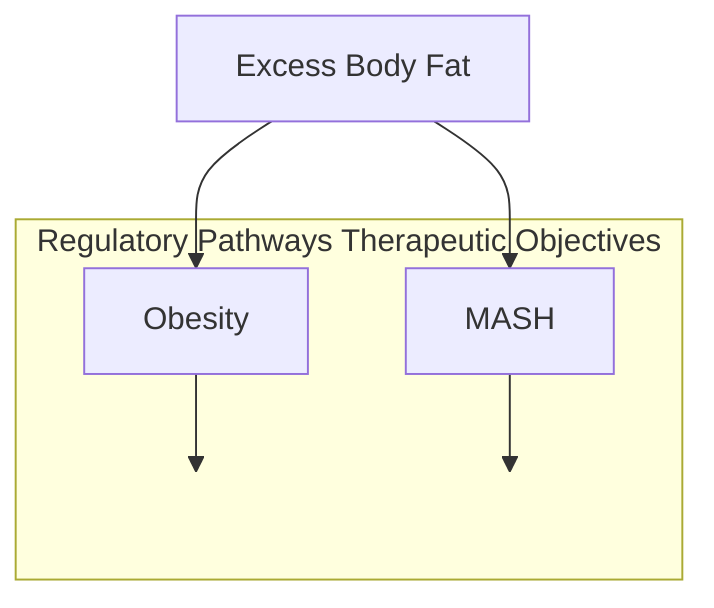
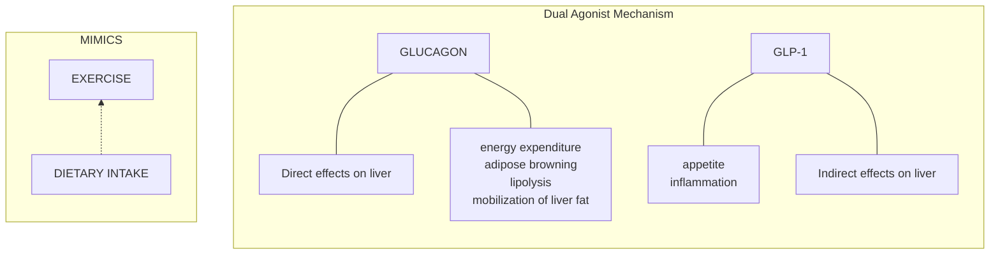
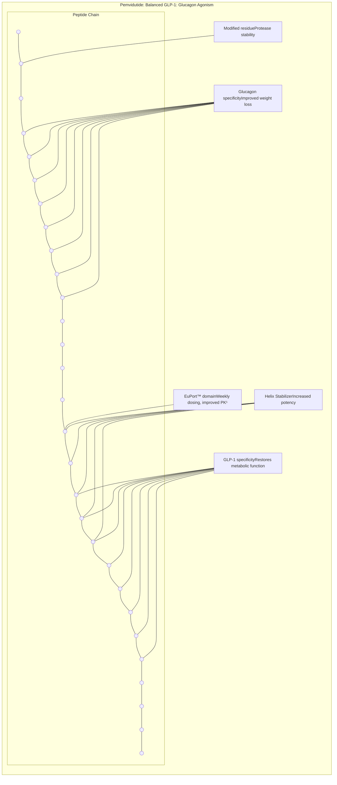

# Focusing on the Use of GLP-1s in Treating MASH & Fatty Liver Disease

M. Scott Harris, MD
Chief Medical Officer
Altimmune, Inc.

GLP-1 Based Therapeutics Summit
15 May 2024

altimmune logo

NASDAQ: ALT

# Forward-looking statements

**Safe-Harbor Statement**

This presentation has been prepared by Altimmune, Inc. ("we," "us," "our," "Altimmune" or the "Company") and includes certain "forward-looking statements" within the meaning of the Private Securities Litigation Reform Act of 1995, including statements regarding the timing of clinical development and funding milestones for our clinical assets as well as statements relating to future financial or business performance, conditions, plans, prospects, trends, or strategies and other financial and business matters, and the prospects for commercializing or selling any product or drug candidates. In addition, when or if used in this presentation, the words "may," "could," "should," "anticipate," "believe," "estimate," "expect," "intend," "plan," "predict" and similar expressions and their variants, as they relate to the Company may identify forward-looking statements. The Company cautions that these forward-looking statements are subject to numerous assumptions, risks, and uncertainties, which change over time. Important factors that may cause actual results to differ materially from the results discussed in the forward looking statements or historical experience include risks and uncertainties, including risks relating to: potential impacts due to the COVID-19 pandemic such as delays in regulatory review, manufacturing and supply chain interruptions, adverse effects on healthcare systems and disruption of the global economy, the timing and reliability of the results of the studies relating to human safety and possible adverse effects resulting from the administration of the Company's product candidates; our lack of financial resources and access to capital; clinical trials and the commercialization of proposed product candidates (such as marketing, regulatory, product liability, supply, competition, dependence on third parties and other risks); the timing of regulatory applications and the regulatory approval process; dependence on intellectual property and reimbursement and regulation. Further information on the factors and risks that could affect the Company's business, financial conditions and results of operations are contained in the Company's filings with the U.S. Securities and Exchange Commission, including under the heading "Risk Factors" in the Company's annual reports on Form 10-K and quarterly reports on Form 10-Q filed with the SEC, which are available at <u>www.sec.gov</u>. The statements made herein speak only as of the date stated herein, and any forward-looking statements contained herein are based on assumptions that the Company believes to be reasonable as of this date. The Company undertakes no obligation to update these statements as result of new information or future events.

altimmune logo

# OBESITY AND FATTY LIVER DISEASE

DISEASES WITH UNMET NEED APPROACHING EPIDEMIC PROPORTIONS

| Category              | Population |
| --------------------- | ---------- |
| US Obesity Population | 108M       |
| US MASLD Population   | 82.3M      |
| MASH                  | 16.4M      |

The recent successes of semaglutide (Wegovy®) and tirzepatide (Mounjaro®) have created optimism for other incretin-based therapies

* GLP-1/GCG dual receptor agonists

* GLP-1/ amylin combination agents

* GLP-1/GIP mAb

* Oral GLP-1 monotherapies

> GLP-1: glucagon-like peptide-1
> GCG: glucagon
> mAB: monoclonal Ab

Hales CM et al. NCHS Data Brief. 2020 Feb;(360):1-8. PMID: 32487284.
Younossi ZM et all. Gut. 2020 Mar;69(3):564-568.
https://liverfoundation.org/liver-diseases/fatty-liver-disease/nonalcoholic-steatohepatitis-nash/

3

altimmune logo

# OBESITY-RELATED CO-MORBIDITIES ARE THE MOST FREQUENT CAUSE OF DEATH IN PATIENTS WITH MASLD

| Outcome                        | n (%)       |
| ------------------------------ | ----------- |
| Death or liver transplantation | 193 (100.0) |
| Cardiovascular disease         | 74 (38.3)   |
| Non-liver cancer               | 36 (18.7)   |
| Cirrhosis complications        | 15 (7.8)    |
| Infections                     | 15 (7.8)    |
| HCC                            | 2 (1.0)     |
| Liver transplantation          | 1 (0.5)     |
| Other                          | 35 (18.1)   |
| Unknown                        | 15 (7.8)    |

619 patients with biopsy confirmed MASH

Median follow-up 12.6 years (range 0.3-35)

4

Adapted from Angulo, Gastroenterology 2015;149: 389–397

altimmune logo

# OBESITY AND MASH SYNERGIES

DISTINCT REGULATORY PATHWAYS BUT SIMILAR THERAPEUTIC OBJECTIVES

Flowchart showing the relationship between Excess Body Fat, Obesity, and MASH, with icons of a scale and a liver.

* **Reduce body weight**

* **Reduce liver fat**

* Improve serum lipid profile

* Reduce liver inflammation

* Reduce cardiovascular risk factors

* Reduce body weight

5

altimmune logo

# NON-INCRETIN AGENTS FAIL TO ACHIEVE MEANINGFUL WEIGHT LOSS

SNAPSHOT OF COMPOUNDS IN ADVANCED MASH DEVELOPMENT

| Agent                  | Mechanism     | Change in Body Weight | MASH Resolution | Fibrosis Improvement |
| ---------------------- | ------------- | --------------------- | --------------- | -------------------- |
| Obeticholic acid       | FXR agonist   | -2%                   | No              | Yes                  |
| Resmetirom             | THRβ agonist  | no change             | Yes             | Yes                  |
| Lanifibranor (1200 mg) | PanPPAR       | +3.1%                 | Yes             | Yes                  |
| Efruxifermin (70 mg)   | FGF21 agonist | -2.6%                 | Yes             | Yes                  |

6  Younossi, YM 2019, Lancet 394: 2184-96; Harrison, SA 2019, Lancet 394: 2012-24; Harrison SA 2022 , AASLD, The Liver Meeting 2022;
Franque SM, 2021; NEJM 385: 1547-57

altimmune logo

# SEMAGLUTIDE—WEIGHT LOSS IN PHASE 2 MASH CLINICAL TRIAL

SUBJECTS WITH AND WITHOUT DIABETES

**All randomized patients**

| Weeks                               | Placebo | Semaglutide 0.1 mg/day | Semaglutide 0.2 mg/day | Semaglutide 0.4 mg/day |
| ----------------------------------- | ------- | ---------------------- | ---------------------- | ---------------------- |
| 0                                   | 102     | 98                     | 98                     | 98                     |
| 4                                   | 101.5   | 97                     | 96                     | 95                     |
| 12                                  | 101.5   | 95                     | 92                     | 91                     |
| 20                                  | 101.5   | 94                     | 90                     | 88                     |
| 28                                  | 101.5   | 94                     | 89                     | 87                     |
| 36                                  | 101.5   | 94                     | 88.5                   | 85.5                   |
| 44                                  | 101     | 94                     | 88.5                   | 85                     |
| 52                                  | 100.5   | 93.5                   | 88                     | 84.5                   |
| 62                                  | 100.5   | 94                     | 88                     | 84.5                   |
| 72                                  | 100.5   | 94                     | 87.5                   | 84                     |
| Change from Baseline (%) at Week 72 |         |                        |                        |                        |
|                                     | -0.6%   | -4.8%\*                | -8.9%\*                | -12.5%\*               |

7

Newsome PN 2020, DOI: 10.1056/NEJMoa2028395

altimmune logo

# SEMAGLUTIDE—MASH RESOLUTION <u>WITHOUT</u> FIBROSIS IMPROVEMENT

RESULTS OF A 68-WEEK, PHASE 2, MULTICENTER TRIAL

## MASH Resolution

| Treatment Group           | Weekly dose | Percentage of Patients | Statistical Annotation                            |
| ------------------------- | ----------- | ---------------------- | ------------------------------------------------- |
| Semaglutide 0.1 mg (N=57) | 0.7 mg      | 40                     | Odds ratio, 3.36 (95% CI, 1.29–8.86)              |
| Semaglutide 0.2 mg (N=59) | 1.4 mg      | 36                     | Odds ratio, 2.71 (95% CI, 1.06–7.56)              |
| Semaglutide 0.4 mg (N=56) | 2.8 mg      | 59                     | Odds ratio, 6.87 (95% CI, 2.60–17.63) P<0.001 |
| Placebo (N=58)            |             | 17                     |                                                   |

## Fibrosis Improvement

| Treatment Group           | Weekly dose | Percentage of Patients | Statistical Annotation                          |
| ------------------------- | ----------- | ---------------------- | ----------------------------------------------- |
| Semaglutide 0.1 mg (N=57) | 0.7 mg      | 49                     | Odds ratio, 1.96 (95% CI, 0.86–4.51)            |
| Semaglutide 0.2 mg (N=59) | 1.4 mg      | 32                     | Odds ratio, 1.00 (95% CI, 0.43–2.32)            |
| Semaglutide 0.4 mg (N=56) | 2.8 mg      | 43                     | Odds ratio, 1.42 (95% CI, 0.62–3.28) P=0.48 |
| Placebo (N=58)            |             | 33                     |                                                 |

Newsome, NEJM 2020; Nov 13. doi: 10.1056/NEJMoa2028395

8

altimmune logo

# GLP-1 AND GIP AGENTS DISPLAY UNIMPRESSIVE EFFECTS ON LIVER FAT CONTENT

ABSENCE OF GLP-1 AND GIP RECEPTORS IN LIVER

| Drug                    | Dose       | Timepoint | LFC relative change from baseline (%) |
| ----------------------- | ---------- | --------- | ------------------------------------- |
| Semaglutide (GLP-1)     | 0.4 mg/day | Week 24   | -34                                   |
| Semaglutide (GLP-1)     | 0.4 mg/day | Week 48   | -57                                   |
| Tirzepatide (GLP-1/GIP) | 15 mg/week | Week 52   | -39.6                                 |

LFC reduction may occur too slowly to improve fibrosis in the study timeframe

LFC, liver fat content

9

Flint, Aliment Pharm Ther 2021; Gastadelli, Lancet Diabetes Endocrinol 2022; Harrison, AASLD 2022

altimmune logo

# THE IMPACT OF WEIGHT LOSS ON LIVER FIBROSIS MAY BE SLOW

IMPROVEMENT ON FIBROSIS MAY TAKE AS LONG 5 YEARS IN THE ABSENCE OF DIRECT LIVER EFFECTS

Evolution of Fibrosis after Bariatric Surgery
p<.001 p<.001

| Time Point | F0 (%) | F1 (%) | F2 (%) | F3 (%) | F4 (%) |
| ---------- | ------ | ------ | ------ | ------ | ------ |
| Baseline   | 7      | 41     | 14     | 34     | 4      |
| 1 year     | 25     | 29     | 22     | 20     | 4      |
| 5 years    | 58     | 16     | 11     | 11     | 4      |

Lassailly Gastroenterology 2020

10

altimmune logo

# LIVER FAT REDUCTION IMPROVES OUTCOMES ON LIVER BIOPSY

GREATER REDUCTIONS LEAD TO HIGHER RATES OF MASH RESOLUTION AND FIBROSIS IMPROVEMENT

* 30% and 50% reductions in liver fat content were associated with higher rates of MASH resolution and fibrosis improvement

* 41.5% liver fat reduction was identified on ROC analysis as the cutoff for achieving MASH resolution

| Endpoint             | ≥ 50% reduction | ≥ 30% reduction | < 30% reduction |
| -------------------- | --------------- | --------------- | --------------- |
| MASH Resolution      | 64              | 36              | 3               |
| Fibrosis Improvement | 50              | 37              | 19              |
| Both Endpoints       | 57              | 62              |                 |

### Receiver Operating Characteristic (ROC)

| False positive (100%- specificity) | True positive (sensitivity) |
| ---------------------------------- | --------------------------- |
| 0%                                 | 0%                          |
| 20%                                | 65%                         |
| 40%                                | 85%                         |
| 60%                                | 95%                         |
| 80%                                | 98%                         |
| 100%                               | 100%                        |

11

Adapted from Loomba, European Association for the Study of the Liver, International Liver Conference, 2020, analysis of Phase 2 resmetirom study (Harrison SA, Lancet 2019)

# FIBROSIS IMPROVEMENT DRIVEN BY LIVER FAT REDUCTION

EFFECTS ARE INDEPENDENT OF MECHANISM

**Agents with Direct Effects on Liver - Fibrosis Improvement Achieved**

| Compound     | Dose      | Mechanism | Liver FatReduction | Duration ofTreatment | Fibrosis Improvement Treatment | Fibrosis Improvement Placebo | Fibrosis Improvement Δ |
| ------------ | --------- | --------- | ------------------ | -------------------- | ---------------------------------- | -------------------------------- | -------------------------- |
| Resmetirom   | 100 mg QD | THR-β     | 48%                | 52 weeks             | 26%\*                              | 14%                              | 12%                        |
| Pegozafermin | 44 mg Q2W | FGF21     | 54%                | 24 weeks             | 27%\*                              | 7%                               | 20%                        |
| Efruxifermin | 50 mg QW  | FGF21     | 64%                | 24 weeks             | 41%\*                              | 20%                              | 21%                        |
| Pemvidutide  | 1.8 mg QW | GLP-1/GCG | 75%                | 24 weeks             | TBD                                | TBD                              | TBD                        |

**Agents with Indirect Effects on Liver - Fibrosis Improvement Not Achieved**

| Compound    | Dose      | Mechanism | Liver FatReduction | Duration ofTreatment | Fibrosis Improvement Treatment | Fibrosis Improvement Placebo | Fibrosis Improvement Δ |
| ----------- | --------- | --------- | ------------------ | -------------------- | ---------------------------------- | -------------------------------- | -------------------------- |
| Semaglutide | 0.4 mg QD | GLP-1     | 30-35%¹            | 72 weeks             | 43%                                | 33%                              | 10%                        |

\* p < 0.05    ¹ Estimated at Week 24

> **Good established correlation between Liver Fat Reduction and fibrosis improvement…**
> **Pemvidutide clearly demonstrates its promise to be superior**

12

12

# GLP-1/GLUCAGON DUAL RECEPTOR AGONISTS

Optimized for weight loss and MASH

Designed for significant reductions in:

Body weight icon

**BODY WEIGHT**

Liver icon

**LIVER FAT, INFLAMMATION, & RESULTING FIBROSIS**

13

# GLUCAGON AGENTS EXERT RAPID AND POTENT EFFECTS ON LIVER FAT CONTENT

REFLECT THE PRESENCE OF RECEPTORS IN LIVER

| Drug (Mechanism) Dose               | Timepoint | LFC relative change from baseline (%) |
| ----------------------------------- | --------- | ------------------------------------- |
| Semaglutide (GLP-1) 0.4 mg/day      | Week 24   | -34                                   |
| Semaglutide (GLP-1) 0.4 mg/day      | Week 48   | -57                                   |
| Tirzepatide (GLP-1/GIP) 15 mg/week  | Week 52   | -39.6                                 |
| Pemvidutide (GLP-1/GCG) 1.8 mg/week | Week 12   | -68.5                                 |
| Pemvidutide (GLP-1/GCG) 1.8 mg/week | Week 24   | -75.2                                 |

LFC, liver fat content

Flint, Aliment Pharm Ther 2021; Gastadelli, Lancet Diabetes Endocrinol 2022; Harrison, AASLD 2022

14

altimmune logo

# PEMVIDUTIDE

BALANCED AGONIST WITH PROLONGED SERUM HALF-LIFE AND DELAYED TIME TO PEAK CONCENTRATION

\*Nestor JJ et al, Peptide Science. 2021;113:e24221

15

altimmune logo

# PEMVIDUTIDE— ROBUST REDUCTIONS IN LIVER FAT CONTENT AT 24 WEEKS

CORRELATES WITH MASH RESOLUTION AND FIBROSIS IMPROVEMENT

### Relative Reduction

| Treatment Group           | Mean Relative Reduction in Liver Fat (%) |
| ------------------------- | ---------------------------------------- |
| placebo (N=18)            | 14.0                                     |
| 1.2 mg pemvidutide (N=14) | 56.3\*\*\*                               |
| 1.8 mg pemvidutide (N=13) | 75.2\*\*\*                               |
| 2.4 mg pemvidutide (N=11) | 76.4\*\*\*                               |

\*\*\* p < 0.001 vs placebo ANCOVA, LS mean ± SE

### 30% Reduction | 50% Reduction | Normalization (≤5% LFC)

| Treatment Group           | 30% Reduction (%) | 50% Reduction (%) | Normalization (≤5% LFC) (%) |
| ------------------------- | ----------------- | ----------------- | --------------------------- |
| placebo (N=18)            | 5.6               | 0                 | 0                           |
| 1.2 mg pemvidutide (N=14) | 76.9\*\*\*\*      | 61.5\*\*\*        | 30.8\*                      |
| 1.8 mg pemvidutide (N=13) | 92.3\*\*\*\*      | 84.6\*\*\*\*      | 53.8\*\*\*                  |
| 2.4 mg pemvidutide (N=11) | 100.0\*\*\*\*     | 72.7\*\*\*\*      | 45.5\*\*                    |

\* p < 0.05, \*\*\* p < 0.001, \*\*\*\*, p < 0.0001 vs placebo, Cochran-Mantel-Haenszel

16

altimmune logo

# PEMVIDUTIDE— MARKED REDUCTION OF LIVER FAT CONTENT BY MRI-PDFF AT WEEK 24

MRI-PDFF scans showing liver fat reduction from baseline to week 24

## MRI-PDFF

Baseline
32.3%

Week 24
1.7%

Baseline MRI scan of liver with high fat content indicated by red/yellow heat map

Week 24 MRI scan of liver with low fat content indicated by blue heat map and a color scale from 0 to 40

> This reduction was accompanied by a 38.1% decrease in liver volume

Pemvidutide 1.8 mg

17

Study ALT-801-106 MASLD Trial

altimmune logo

# PEMVIDUTIDE— SIGNIFICANT ALT REDUCTIONS AND cT1 RESPONSE RATES

TWO INDEPENDENT INDICATORS OF REDUCED LIVER INFLAMMATION AND NAFLD ACTIVITY SCORE (NAS)

## cT1 Responder Rates¹ at Week 24

| Treatment Group           | Proportion of Subjects (%) |
| ------------------------- | -------------------------- |
| placebo (N=18)            | 0.0                        |
| pemvidutide 1.2 mg (N=13) | 85.7\*\*                   |
| pemvidutide 1.8 mg (N=13) | 75.0                       |
| pemvidutide 2.4 mg (N=11) | 100.0                      |

\* p < 0.05, \*\* p < 0.005 vs. placebo (Fisher’s Exact Test)

## ALT Reduction at Week 24

| Population    | Treatment Group           | Mean Change from Baseline ± SE (IU/L) |
| ------------- | ------------------------- | ------------------------------------- |
| All subjects  | placebo (N=19)            | -2.2                                  |
| All subjects  | pemvidutide 1.2 mg (N=16) | -13.3\*\*                             |
| All subjects  | pemvidutide 1.8 mg (N=15) | -13.7\*\*                             |
| All subjects  | pemvidutide 2.4 mg (N=14) | -15.2\*\*                             |
| ALT ≥ 30 IU/L | placebo (N=13)            | -3.1                                  |
| ALT ≥ 30 IU/L | pemvidutide 1.2 mg (N=7)  | -17.0\*                               |
| ALT ≥ 30 IU/L | pemvidutide 1.8 mg (N=10) | -17.7\*                               |
| ALT ≥ 30 IU/L | pemvidutide 2.4 mg (N=9)  | -20.6\*                               |

Source: Phase 1b MASLD extension trial

\* p < 0.05, \*\* p < 0.005 vs. placebo (MMRM³)

18

¹80ms reduction from baseline; ²Dennis A, Front Endocrinol 2021; ³ mixed model for repeated measures

altimmune logo

# GLP-1 BASED AGENTS IN DEVELOPMENT¹ FOR MASH AND OBESITY

HIGH GLUCAGON CONTENT DRIVES POTENT EFFECTS ON LIVER FAT AND BODY WEIGHT

| Agent          | Class         | Agonist Ratios² | Dose Titration | LFC Reduction | Weight Reduction |
| -------------- | ------------- | --------------- | -------------- | ------------- | ---------------- |
| Semaglutide    | GLP-1         | —               | yes            | +             | ++++             |
| Tirzepatide    | GLP-1/GIP     | 1:15            | yes            | +             | ++++             |
| BI456906       | GLP-1/GCG     | 8:1             | yes            | —             | ++++             |
| Cotadutide     | GLP-1/GCG     | 5:1             | yes            | ++            | +                |
| Retatrutide    | GLP-1/GIP/GCG | 1:6:0.1         | yes            | ++++          | ++++             |
| Efinopegdutide | GLP-1/GCG     | 2:1             | yes            | ++++          | ++++             |
| Pemvidutide    | GLP-1/GCG     | 1:1             | no             | ++++          | ++++             |

\*1 Phase 2 and later; GLP-1, glucagon-like peptide-1; \*2 based on cell-based potency assays
GLP-1, glucagon-like peptide-1; GCG, glucagon; GIP, gastric inhibitory polypeptide

19

altimmune logo

# THANK YOU

