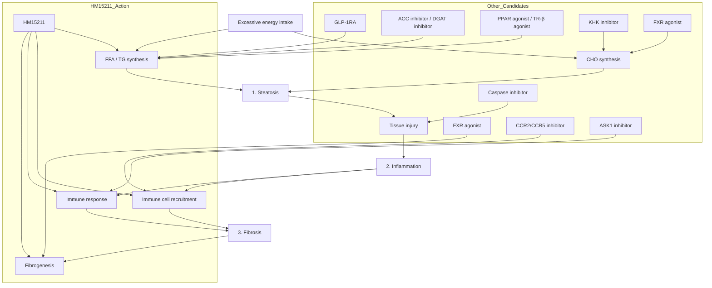

# Therapeutic effect of a novel long-acting GLP-1/GIP/Glucagon triple agonist (HM15211) in a NASH and fibrosis animal model

990-P

Hanmi logo

Jung Kuk Kim¹, Jong Suk Lee¹, Dae Jin Kim¹, Eun Jin Park¹, Aram Lee¹, Young Hoon Kim¹, and In Young Choi¹
¹Hanmi Pharm. Co., Ltd, Seoul, South Korea

## ABSTRACT

NASH, a severe form of NAFLD, can lead to end stage liver disease such as cirrhosis. Despite increasing prevalence and as a burden for public health, advances in the development of therapeutics are slow with yet no approved drug for NASH treatment. Since liver fat accumulation and inflammation are associated with NASH progression, targeting both aspects may contribute to NASH resolution and fibrosis improvement. Thus, to directly aid those aspects, we developed a novel long-acting, GLP-1/GIP/Glucagon triple agonist, HM15211. With a unique activity profile, HM15211 showed a liver preferential distribution, and exerted potent hepatic triglyceride (TG) reduction in addition to efficient body weight loss (BWL) in DIO mice, suggesting HM15211 as a novel therapeutic option for NASH treatment. Here, we evaluated the therapeutic potential of HM15211 in NASH and fibrosis animal models including monkeys.

In MCD-diet mice (6 weeks induction), HM15211 treatment led to significant decrease in hepatic TG content (-82.6% vs. vehicle). Time course MRI confirmed the progressive steatosis resolution. Histological analysis further indicated a significant reduction both in hepatic inflammatory gene expression and NAFLD activity score (NAS) (1.3 for HM15211, 3.4 for liraglutide, and 3.0 for vehicle). Next, to evaluate the therapeutic potential in fibrosis, MCD-diet mice were used for an extended period (up to 12 weeks induction) for overt liver fibrosis induction. In line with NASH improvement, HM15211 reduced hepatic hydroxyproline and the fibrosis score. Finally, obese and NASH monkeys were administered with HM15211, and predominant fat mass reduction, and improvement of blood lipid profiles and histological NASH/fibrosis markers were consistently observed in these primates too.

Based on these results, HM15211 may provide efficacy for the treatment of NASH and fibrosis. Further studies are needed to assess the clinical relevance of these findings.

## BACKGROUND

Modulation of multiple aspects of NASH and liver fibrosis by HM15211 in comparison to the action of other drug candidates for NASH

## METHODS

* Therapeutic potential of HM15211 in NASH and fibrosis was evaluated in MCD-diet mice (6 or 12 weeks induction). After 4 ~ 5 weeks treatment of HM15211, liver tissue samples were prepared to measure hepatic TG, TBARS (oxidative stress marker), Inflammation & HSC activation related marker gene expression (TNF-α, F4/80, TGF-β and α-SMA) and fibrosis related marker gene expression (Collagen-1α, and TIMP-1). To non-invasively monitor the changes in hepatic lipid contents, each mouse was subjected to MRI analysis every 2 weeks.

* To investigate the therapeutic effects of HM15211 in more human relevance disease model, biopsy-proven obese, NASH, and fibrosis monkeys (BMI >40 kg/m², NAS + fibrosis score > 7) induced by high fat diet for 1 ~ 3 years were utilized. After 12 weeks treatment of HM15211 including 3 weeks titration period, body weight and blood lipid profiles were determined, and liver biopsy samples were subjected to histologic analysis. Liver fat contents were determined by MRI-PDFF.

* To determine NAS (NAFLD activity score), the same region of each liver tissue was subjected to H&E staining. For fibrosis analysis, Sirius red staining and hepatic hydroxyproline analysis were performed.

## RESULTS

### Steatosis and inflammation improvement in MCD mice

Figure 1. Effect of HM15211 on steatosis in MCD-diet mice (n=7)

| Group                       | Hepatic TG (mg/g liver) | Hepatic TBARS (nmol/mg liver) |
| --------------------------- | ----------------------- | ----------------------------- |
| Normal vehicle              | 20                      | 10                            |
| MCD, vehicle                | 120                     | 25                            |
| Liraglutide 50 nmol/kg, BID | 100                     | 22                            |
| HM15211 0.72 nmol/kg, Q2D   | 50                      | 15                            |
| HM15211 1.44 nmol/kg, Q2D   | 20                      | 12                            |

\* ~ \*\*\*p<0.05 ~ 0.001 vs. MCD mice, vehicle by One-way ANOVA, † ~ †† p<0.05 ~ 0.01 vs. liraglutide by One-way ANOVA
§ TBARS: Thiobarbituric acid reactive substances, oxidative stress marker

(c) Representative magnetic resonance imaging (MRI)

MRI images showing liver fat reduction over 4 weeks

⮚ HM15211 significantly reduced liver TG and TBARS independent of BWL (data not shown) in MCD-diet mice, suggesting its direct liver effect on steatosis improvement.

Figure 2. Effect of HM15211 on inflammation markers in MCD-diet mice (n=7)

(a) Inflammation and HSC§ activation marker gene expression

| Marker | Normal vehicle | MCD, vehicle | Liraglutide 50 nmol/kg, BID | HM15211 1.44 nmol/kg, Q2D |
| ------ | -------------- | ------------ | --------------------------- | ------------------------- |
| TNF-α  | 1.0            | 4.0          | 3.0                         | 1.5                       |
| TGF-β  | 1.0            | 3.2          | 2.8                         | 1.8                       |
| α-SMA  | 1.0            | 4.2          | 3.5                         | 2.2                       |

\* ~ \*\*\*p<0.05 ~ 0.001 vs. MCD mice, vehicle by One-way ANOVA
§ HSC: Hepatic stellate cell involved in hepatic fibrosis

(b) F4/80 staining

F4/80 staining images

⮚ HM15211 reduces hepatic inflammation and HSC activation related marker expression, suggesting the anti-inflammatory effects of HM15211.

Figure 3. Effect of HM15211 on NASH in MCD-diet mice (n=7)

| Group                       | Steatosis | Lobular inflammation | Ballooning | Total NAS |
| --------------------------- | --------- | -------------------- | ---------- | --------- |
| Normal vehicle              | 0.0       | 0.0                  | 0.0        | 0.0       |
| MCD, vehicle                | 3.0       | 1.0                  | 0.0        | 4.0       |
| Liraglutide 50 nmol/kg, BID | 2.4       | 1.0                  | 0.0        | 3.4       |
| HM15211 0.72 nmol/kg, Q2D   | 1.8       | 0.3                  | 0.0        | 2.1       |
| HM15211 1.44 nmol/kg, Q2D   | 1.0       | 0.3                  | 0.0        | 1.3       |

\* ~ \*\*\*p<0.05 ~ 0.001 vs. MCD mice, vehicle by One-way ANOVA, †††p<0.001 vs. liraglutide by One-way ANOVA

(b) H&E staining

H&E staining images

⮚ Consistently, HM15211 reduced steatosis, inflammation and ballooning score, thereby completely reversing NAS to normal level in MCD-diet mice.

### Fibrosis improvement in MCD mice

Figure 4. Effect of HM15211 on hepatic fibrosis in MCD-diet mice (n=7)

| Experimental scheme | Model induction   | Drug treatment | Fibrosis |
| ------------------- | ----------------- | -------------- | -------- |
| Study #1            | MCD-diet 6 weeks  | 4 weeks        | Early    |
| Study #2            | MCD-diet 10 weeks | 5 weeks        |          |
| Study #3            | MCD-diet 12 weeks | 4 weeks        | Late     |

(a) Hepatic collagen-1α1 expression

| Group                     | Study #1 | Study #2 | Study #3 |
| ------------------------- | -------- | -------- | -------- |
| Normal vehicle            | 1.0      | 1.0      | 1.0      |
| MCD, vehicle              | 5.8      | 8.1      | 6.7      |
| HM15211 1.44 nmol/kg, Q2D | 0.9      | 1.0      | 0.8      |

(b) Hepatic TIMP1§ expression

| Group                     | Study #1 | Study #2 | Study #3 |
| ------------------------- | -------- | -------- | -------- |
| Normal vehicle            | 1.0      | 1.0      | 1.0      |
| MCD, vehicle              | 3.2      | 13.3     | 3.0      |
| HM15211 1.44 nmol/kg, Q2D | 1.0      | 1.9      | 1.4      |

§ TIMP1: Tissue inhibitor of metalloproteinases, fibrosis marker

(c) Hepatic hydroxyproline and fibrosis score

| Group                     | Study #1 | Study #2 | Study #3 |
| ------------------------- | -------- | -------- | -------- |
| Normal vehicle            | 228      | 154      | 236      |
| MCD, vehicle              | 680      | 931      | 1073     |
| HM15211 1.44 nmol/kg, Q2D | 355      | 417      | 787      |
| Fibrosis score            | Study #1 | Study #2 | Study #3 |
| Normal vehicle            | 0.3      | 0.0      | 0.0      |
| MCD, vehicle              | 1.9      | 2.4      | 3.0      |
| HM15211 1.44 nmol/kg, Q2D | 1.0      | 1.8      | 2.4      |

\*\*\*p<0.001 vs. MCD mice, vehicle by One-way ANOVA

(d) Sirius red staining (from study #1)

Sirius red staining images

⮚ HM15211 not only reduced hepatic expression of collagen-1α1 and TIMP-1, but also reduced hydroxyproline and fibrosis score in MCD-diet mice regardless of fibrosis stage.

### Therapeutic efficacy in obese/NASH monkeys

Figure 5. Effect of HM15211 on body composition and blood lipid profiles in obese/NASH monkeys

(a) DEXA image

DEXA images of Vehicle at Baseline and Post treatment

DEXA images of HM15211 at Baseline and Post treatment

| Time (Days) | Vehicle (n=3) | HM15211 (n=5) |
| ----------- | ------------- | ------------- |
| 0           | 0             | 0             |
| 14          | 0             | -5            |
| 28          | 0             | -10           |
| 42          | 0             | -14           |
| 56          | 0             | -17           |
| 70          | 0             | -19           |
| 84          | 0             | -20           |

(b) Changes in blood lipid profiles

| Lipid Profile           | Vehicle | HM15211 |
| ----------------------- | ------- | ------- |
| Δ TG (% vs. baseline)   | 0       | -75     |
| Δ LDL (% vs. baseline)  | 0       | -50     |
| Δ VLDL (% vs. baseline) | 0       | -75     |
| Δ HDL (% vs. baseline)  | 0       | 0       |

\*\* p<0.01 vs. vehicle by un-paired t-test; n.s. = not significant

⮚ In obese/NASH NHP, HM15211 provided BWL (data not shown) via fat mass reduction, and improved blood lipid profiles.

Figure 6. Effect of HM15211 in obese/NASH monkeys

(a) NAS + Fibrosis score

| Group         | Baseline | Post treatment |
| ------------- | -------- | -------------- |
| Vehicle (n=3) | 7.7      | 9.0            |
| HM15211 (n=5) | 7.6      | 7.0            |

\* p<0.05 vs. vehicle by un-paired t-test

(b) H&E staining

H&E staining images for monkeys

⮚ Relatively short-term treatment of HM15211 led to meaningful improvement in NAS + fibrosis score (vs. vehicle) in obese/NASH NHP.

## CONCLUSIONS

* HM15211, a novel long-acting triple agonist, is designed to treat NASH and fibrosis by targeting both steatosis and hepatic inflammation.

* In MCD-diet mice, HM15211 not only reduces liver fat and inflammation, but also improves fibrosis regardless of fibrosis stage.

* Beneficial effects of HM15211 on NASH and fibrosis improvement are well-reproduced in obese/NASH NHP.

* Therefore, HM15211 might be a novel therapeutic option for NASH and fibrosis.

American Diabetes Association’s (ADA) 79ᵗʰ Scientific Sessions, San Francisco, CA, USA; June 07-11, 2019

Hanmi Pharm. Co., Ltd.

