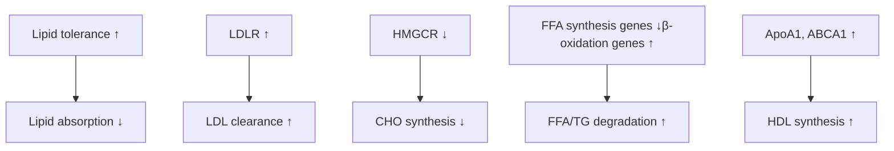

# Therapeutic effect of a long-acting GLP-1/GIP/Glucagon triple agonist (HM15211) in a dyslipidemia animal model

996-P logo

Hanmi logo

Jae Hyuk Choi¹, Hyo Sang Jo¹, Jung Kuk Kim¹, Sang Don Lee¹, Jong Soo Lee¹, Sang-Hyun Lee¹, In Young Choi¹
¹Hanmi Pharm. Co., Ltd., Seoul, South Korea

## ABSTRACT

Dyslipidemia is a well-established risk factor for cardiovascular disease. Although an efficacy has been demonstrated for several drugs including HMGCR inhibitor and PCSK9 inhibitor, overall outcome was still in doubt due to heterogeneity of this disease. Thus, targeting multiple pathways may provide promising efficacy in broad patient population. Previously, we showed that a long-acting GLP-1/GIP/Glucagon triple agonist, HM15211, not only provided efficient weight loss, but also improved lipid profiles in DIO mice. Of note, unlike current drugs possessing a single target, HM15211 could affect multiple pathways in lipid metabolism, suggesting HM15211 as a potential therapeutic option for dyslipidemia. Here, we investigated the effect of HM15211 on dyslipidemia and its modes of action (MoAs)

In high fat- and high fructose-fed hamsters, HM15211 showed greater LDL lowering than commercial drugs (-85.3% for HM15211, -18.1% and -32.8% for evolocumab and rosuvastatin, respectively vs. Veh.). To elucidate the responsible MoAs, potential effects of HM15211 on lipid absorption was evaluated in normal mice, and HM15211 showed significantly decreased plasma TG level after oral lipid challenge, compared to commercial drugs. Next, HepG2 cells were treated with HM15211, and substantially increased LDLR expression and more LDL uptake than evolocumab (3.6-fold for HM15211, 2.8-fold for evolocumab vs. CTL) were observed. To explore the additional HM15211 targets, the activity status of HMGCR, the key enzyme for cholesterol synthesis, was evaluated. Surprisingly, HM15211 induced progressive degradation of HMGCR both in HepG2 cells and hamster liver tissue, thereby substantially inhibiting its enzymatic activity. Furthermore, HM15211 led to a favorable gene expression signature associated with free-fatty acid (FFA) metabolism. Increased ApoA1 and ABCA1 expression may explain, at least in part, the increase trend of HDL by HM15211

In conclusion, we propose that by targeting multiple steps essential for LDL and FFA metabolism, HM15211 could provide therapeutic benefits for dyslipidemia patients

## BACKGROUND

**Known targets of current dyslipidemia drugs, and suggested effects of HM15211 on lipid metabolism**

Diagram showing lipid metabolism pathways and drug targets including HM15211, Ezetimibe, Statin, Fibrate, and PCSK9 inhibitors.

Current dyslipidemia drugs possess single target. So, the efficacy was limited even by combination therapy. With GLP-1, GIP, and GCG triple-agonism, HM15211 might provide more promising lipid lowering efficacy

## METHODS

* To evaluate the therapeutic efficacy in dyslipidemia, high-fat and high-fructose diet hamsters were administered with HM15211, and lipid profiles were monitored. For efficacy comparison, commercially available dyslipidemia drugs such as evolocumab and rosuvastatin were included. At the end of study, liver tissue samples were prepared, and protein expression of LDLR and HMGCR was further evaluated

* To evaluate the potential inhibitory effect of HM15211 on lipid absorption, oral lipid tolerance test was performed. Briefly, overnight fasted normal mice were fed with olive oil, followed by blood TG monitoring

* For *in vitro* MoA studies, cell lysates of HepG2 cells treated with HM15211 were subjected to western blot analysis (LDLR, and HMGCR) and qPCR (lipid metabolism-related genes)

* Additionally, LDL uptake and enzymatic activity of HMGCR in HepG2 cells were also determined after HM15211 treatment by using commercially available kits

## Results

### Lipid lowering efficacy in an animal model

**Figure 1. Effect of HM15211 on blood cholesterol (CHO) in dyslipidemia hamsters (n=6)**

<!-- layout: chart[bar_chart] -->

| Group                         | Blood LDL-C (mg/dL) | Blood HDL-C (mg/dL) | LDL/HDL ratio |
| ----------------------------- | ------------------- | ------------------- | ------------- |
| Normal hamster, Vehicle       | 100                 | 160                 | 0.6           |
| Dyslipidemia hamster, Vehicle | 240                 | 140                 | 1.7           |
| Evolocumab 219.2 nmol/kg, QW  | 195                 | 170                 | 1.1           |
| Rosuvastatin 3.0 mg/kg, QD    | 160                 | 155                 | 1.0           |
| HM15211 1.6 nmol/kg, Q2D      | 35                  | 190                 | 0.2           |
| HM15211 3.1 nmol/kg, Q2D      | 35                  | 185                 | 0.2           |

### Inhibition of lipid absorption by HM15211

<!-- layout: chart[bar_chart] -->

| Time (hrs) | Olive oil-fed, Vehicle | Evolocumab | Rosuvastatin | HM15211 0.5 mg/kg | HM15211 1.0 mg/kg |
| ---------- | ---------------------- | ---------- | ------------ | ----------------- | ----------------- |
| 0          | 200                    | 200        | 200          | 200               | 200               |
| 1          | 450                    | 450        | 450          | 350               | 300               |
| 2          | 800                    | 800        | 800          | 450               | 350               |
| 3          | 900                    | 900        | 900          | 500               | 350               |
| 4          | 750                    | 750        | 750          | 450               | 350               |

> Blood TG was significantly reduced in HM15211 groups after olive oil challenge, demonstrating the inhibitory effect of HM15211 on lipid absorption

### Enhanced LDL clearance by HM15211

**Figure 3. Effect of HM15211 on hepatic LDLR expression and LDL uptake**

<!-- layout: chart[bar_chart] -->

| Group               | LDL-BODIPY uptake (% vs. CTL) |
| ------------------- | ----------------------------- |
| CTL                 | 100                           |
| HM15211 0.01 uM     | 120                           |
| HM15211 0.1 uM      | 150                           |
| HM15211 1 uM        | 250                           |
| HM15211 10 uM       | 360                           |
| Evolocumab 10 ug/mL | 280                           |

> HM15211 treatment increased LDLR expression in HepG2 cell and liver tissue, which correlated with enhanced LDL uptake by HM15211

### HMGCR§ inhibition by HM15211

**Figure 4. Effect of HM15211 on hepatic HMGCR expression, and enzymatic activity**

<!-- layout: chart[line_chart] -->

| Time (hrs) | CTL | HM15211 10 uM | Rosuvastatin 1 uM |
| ---------- | --- | ------------- | ----------------- |
| 0          | 100 | 100           | 100               |
| 24         | 100 | 25            | 15                |
| 48         | 100 | 25            | 15                |

<!-- layout: planning_scratchpad
1. This is a table showing Western blot results (protein expression levels).
2. Sampling: Row 1 is a header, Row 2 is LDLR, Row 3 is beta-actin.
3. Columns: 4 columns (Protein, CTL, HM15211, Rosuvastatin/Evolocumab).
4. Merge cell detection: None.
5. Header structure: One row.
-->

| Protein | CTL      | HM15211  | Rosuvastatin/Evolocumab |
| ------- | -------- | -------- | ----------------------- |
| LDLR    | \[image] | \[image] | \[image]                |
| β-actin | \[image] | \[image] | \[image]                |

> HM15211 increased phosphorylation of HMGCR (*data not shown*), the key enzyme for CHO synthesis, followed by progressive degradation (48hr) in HepG2 cells, thereby substantially inhibiting the enzymatic activity of HMGCR

### Improved FFA metabolism by HM15211

**Figure 5. Effect of HM15211 on FFA metabolism related gene expression in HepG2 cells**

<!-- layout: chart[line_chart] -->

| Gene   | CTL | HM15211 10 uM |
| ------ | --- | ------------- |
| Srebp1 | 1.0 | 0.5           |
| Acc1   | 1.0 | 0.7           |
| Acc2   | 1.0 | 0.7           |
| Fas    | 1.0 | 0.7           |
| Scd1   | 1.0 | 0.4           |

<!-- layout: chart[bar_chart] -->

| Gene   | CTL | HM15211 10 uM |
| ------ | --- | ------------- |
| Cpt1   | 1   | 3             |
| Lcad   | 1   | 7             |
| Vicad  | 1   | 1             |
| Hadha  | 1   | 1             |
| Hadhb  | 1   | 1             |
| Acox   | 1   | 2             |
| Ehhadh | 1   | 2             |
| Acaa1  | 1   | 2             |

> HM15211 reduced and increased the expression of genes involved in FFA synthesis and β-oxidation in HepG2 cells, suggesting favorable changes in lipid metabolism

<!-- layout: chart[line_chart] -->

| Time (hrs) | CTL | HM15211 10 uM | Rosuvastatin 1 uM |
| ---------- | --- | ------------- | ----------------- |
| 0          | 100 | 100           | 100               |
| 24         | 100 | 25            | 15                |
| 48         | 100 | 25            | 15                |

### Increased HDL synthesis markers by HM15211

<!-- layout: chart[bar_chart] -->

| Gene  | CTL or vehicle | HM15211 |
| ----- | -------------- | ------- |
| Apoa1 | 1.0            | 1.4     |
| Abca1 | 1.0            | 1.3     |

> HM15211 tended to increase hepatic expression of ApoA1 and ABCA1, suggesting potential benefits of HM15211 in HDL synthesis

### Figure 7. Proposed MoAs for efficient lipid lowering by HM15211

<!-- layout: chart[bar_chart] -->

## CONCLUSIONS

* In dyslipidemia hamsters, HM15211 provides greater CHO lowering than commercial dyslipidemia drugs such as evolocumab and statin

* In the series of mechanistic studies, responsible modes of action for this potent CHO lowering by HM15211 are elucidated as follows: (1) inhibition of lipid absorption, (2) enhanced LDL clearance, (3) inhibition of CHO synthesis, (4) improved FFA metabolism, and (5) potential for HDL synthesis

* In conclusion, our results suggest that HM15211 might be a good therapeutic option for dyslipidemia patients

## REFERENCES

* A Kharitonenkov *et al, Mol Metab.* 3, 221-9 (2013)
* E Osto *et al, Circulation.* 131, 871-81 (2015)
* JS Dron *et al, Arterioscler Thromb Vas Biol.* 38, 592-8 (2018)

American Diabetes Association's (ADA) 79th Scientific Sessions, San Francisco, CA, USA; June 07-11, 2019

Hanmi Pharm. Co., Ltd.

