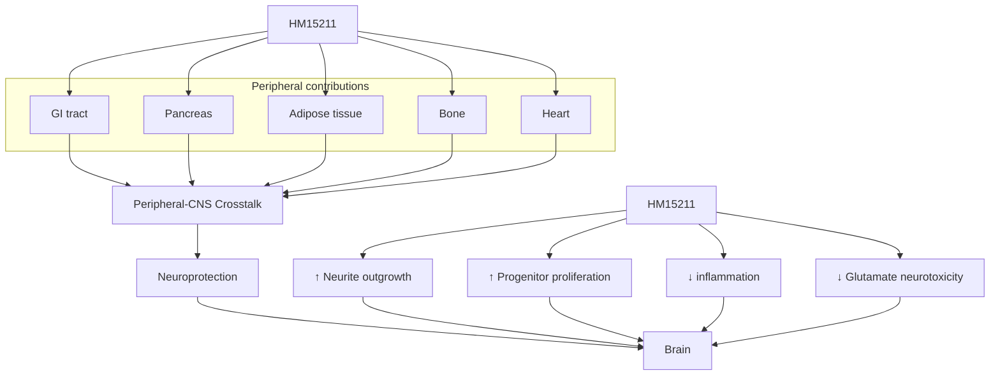

# Effect of HM15211, a novel long-acting GLP-1/GIP/Glucagon triple agonist in the neurodegenerative disease models 1810-P logo Hanmi logo

Won Ki Kim¹, Jeong A Kim¹, Sang Yun Kim¹, Sang-Hyun Lee¹, Sung Min Bae¹, In Young Choi¹, Young Hoon Kim¹.
¹Hanmi Pharm. Co., Ltd, Seoul, South Korea

## ABSTRACT

Metabolic disturbances such as diabetes and obesity, are a potential risk factors for progressive neurodegenerative disease such as Parkinson’s disease (PD), Alzheimer’s disease (AD), and multiple sclerosis (MS). There is evidence that an anti-diabetic or obesity drug of the glucagon-likepeptide-1(GLP-1) family has direct neuroprotective effects in an experimental models of neurodegenerative disease. Recently, we have developed HM15211, a novel long-acting GLP-1/GIP/Glucagon triple agonist. Previous studies have shown that HM15211 with a unique activity profile exerted neuroprotective effects in the 1-methyl-4-phenyl-1,2,3,6-tetrahydropyridine (MPTP) induced sub-chronic PD mice model. In the present study, we evaluated 1) the neuroprotective effects of HM15211 in chronic MPTP/probenecid PD model, 2) the protection of AD progression in diabetic model, and 3) neuroprotective effect in the relapsing-remitting experimental autoimmune encephalomyelitis (EAE) model of MS.

In chronic PD mice model, HM15211 administration protected dopaminergic neuronal death and decreased alpha synuclein in striatum. Together with these efficacies, HM15211 significantly improved the MPTP/probenecid induced motor impairments in behavior tests. In addition, HM15211 reversed inflammatory cytokines and oxidative stress marker in aged db/db mice, which have a pathological characters of AD. These results suggest that HM15211 have a protective effect in progression from diabetes to AD. In another experiment, HM15211 have shown the anti-inflammatory and neuroprotective effects in the EAE mouse model of MS. HM15211 administration significantly reduced the EAE clinical score and resulted in the reversal of histopathological sequelae compared to vehicle. Furthermore, HM15211 administration decreased pro-inflammatory cytokines, while it upregulated anti-inflammatory cytokines.

Based on these observations, HM15211 might be a potential therapeutic option for the neurodegenerative diseases.

## BACKGROUND

\* Neuroprotective effects of GLP-1¹, glucagon² and GIP³

## METHODS

\* Chronic Parkinson’s disease mice model was induced by 1-methyl-4-phenyl-1,2,3,6-tetrahydropyridine (MPTP) in combination with probenecid intraperitoneal injection, twice a week for 5 weeks and HM15211 was subcutaneously administered once a week for 6 weeks.

\* db/db mice are well-established diabetic model. It has been reported that db/db mice increase amyloid beta 1-42. Thus we chose db/db mice to elucidate the prophylactic effect of HM15211 on the development of Alzheimer’s disease. Six weeks old db/db mice were subcutaneously treated with HM15211, once every two days for 12 weeks.

\* The relapsing-remitting EAE mouse model established by injecting SJL mice with an emulsion of PLP139-151 in complete Freund's adjuvant, followed by administration of pertussis toxin was utilized. To evaluate the prophylactic effects of HM15211 on EAE model, the mice were subcutaneously treated with HM15211 from day 1.

## RESULTS

**Functional evaluation in MPTP/P-induced chronic Parkinson’s diseases (PD) mice model**

Figure 1. Motor function restoring effects of HM15211

| Group            | (a) Traction test (score 0\~3) | (b) Pole test (T-total, s) | (c) Rotarod (falling latency, s) |
| ---------------- | ------------------------------ | -------------------------- | -------------------------------- |
| Vehicle          | 3                              | 18                         | 180                              |
| MPTP/P           | 1.5                            | 45                         | 100                              |
| MPTP/P + HM15211 | 2.8\*\*\*                      | 25\*\*                     | 160\*\*\*                        |

\*p<0.01, \*\*\*p<0.001 vs. MPTP/P by One-way ANOVA

⮚ HM15211 administration restored MPTP/P-induced motor function impairment in (a) traction test, (b) pole test and (c) rotarod test.

## Neuroprotection in chronic PD mice

Figure 2. Dopaminergic neuroprotection by HM15211
(a) Dopaminergic neuron staining (TH; tyrosine hydroxylase)

Dopaminergic neuron staining images of Substantia nigra and Striatum for Vehicle, MPTP/P, and MPTP/P + HM15211 groups

| Group            | (b) TH+ cells in Substantia nigra | (c) α-synuclein (ng/ml) |
| ---------------- | --------------------------------- | ----------------------- |
| Vehicle          | 180                               | 1.5                     |
| MPTP/P           | 100                               | 7.5                     |
| MPTP/P + HM15211 | 140\*                             | 4.5\*\*\*               |

\*p<0.05, \*\*\*p<0.001 vs. MPTP/P by One-way ANOVA

⮚ HM15211 protected MPTP/P-induced dopaminergic neuronal cell damage in the striatum and the substantia nigra (a, b) and also effectively inhibited the α-synuclein toxicity, which was induced by MPTP/P (c).

## Mechanisms of neuroprotection in chronic PD mice

Figure 3. Anti-inflammatory effects of HM15211
(a) Microglia staining (Iba1)

Microglia staining (Iba1) in Striatum for Vehicle, MPTP/P, and MPTP/P + HM15211 groups

| Group            | (b) Iba1+ area in striatum (% vs. vehicle) | (c) IFN-γ (pg/ml) | (d) IL-10 (pg/ml) |
| ---------------- | ------------------------------------------ | ----------------- | ----------------- |
| Vehicle          | 100                                        | 100               | 2500              |
| MPTP/P           | 280                                        | 280               | 1200              |
| MPTP/P + HM15211 | 160\*\*\*                                  | 140\*\*           | 2200\*\*\*        |

\*\*p<0.01, \*\*\*p<0.001 vs. MPTP/P by One-way ANOVA

⮚ In striatum of MPTP/P-induced chronic PD mouse model, HM15211 reduced the area covered by microglia (a, b) and reversed the induction of IFN-γ (c) and the reduction of IL-10 (d) levels.
Iba1 : Ionized calcium binding adaptor molecule 1

## Alzheimer diseases’ pathological resolution in db/db mice

Figure 4. Inhibited accumulation of Aβ₁₋₄₂ and AGE by HM15211

| Group                                            | (a) Aβ1-42 (% vs. vehicle) | (b) AGE (μg/ml) |
| ------------------------------------------------ | -------------------------- | --------------- |
| db/m vehicle                                     | 100                        | 0.8             |
| db/db D0 (6 weeks old)                           | 100                        |                 |
| db/db (18 weeks old) vehicle                     | 140                        | 1.4             |
| db/db (18 weeks old) + HM15211 1.08 nmol/kg, Q2D | 105\*\*\*                  | 0.9\*\*\*       |

\*\*\*p<0.001 vs. db/db (18w) vehicle by One-way ANOVA

⮚ The Aβ₁₋₄₂ levels in cortex was increased in db/db mice, but HM15211 prevented the accumulation of Aβ₁₋₄₂ (a). Also, HM15211 effectively decreased the AGE (Advanced glycation end product), which is a factor in worsening of neurodegenerative disease.
Aβ₁₋₄₂ : Amyloid beta₁₋₄₂

## Mechanisms of neuroprotection in db/db mice

Figure 5. Reduced inflammation and oxidative stress by HM15211
(a) Reduction of activated microglia in cortex and hippocampus

Microglia staining in Cortex, Hippo_CA1, and Hippo_DG for db/m, db/db (6w), db/db (18w), and db/db + HM15211 groups

| Group                          | (b) IL-1β (pg/ml) | (c) IFN-γ (pg/ml) | (d) HNE protein adduct (μg/ml) |
| ------------------------------ | ----------------- | ----------------- | ------------------------------ |
| db/m vehicle                   | 35                | 35                | 6                              |
| db/db (18 weeks old) vehicle   | 65                | 65                | 13                             |
| db/db (18 weeks old) + HM15211 | 45\*\*\*          | 45\*\*            | 8\*\*\*                        |

\*\*p<0.01, \*\*\*p<0.001 vs. db/db (18w) vehicle by One-way ANOVA

⮚ HM15211 reduced activated microglia in cortex and hippocampus of db/db mice brain (a). Also, HM15211 decreased of IL-1β (b), IFN-γ (c) and HNE protein adduct (d) levels of db/db mice cortex.

## Neuroprotective effects in EAE mouse model of multiple sclerosis

Figure 6. Preventive effects of HM15211 in EAE mouse model
(a) Reduction of the EAE score

| Group                          | Cumulative clinical score (9\~24 dpi) |
| ------------------------------ | ------------------------------------- |
| EAE                            | 125                                   |
| EAE + HM15211 2.8 nmol/kg, Q2D | 35\*\*\*                              |

\*\*\*p<0.001 vs. EAE group by One-way ANOVA

(b) Reduction of demyelination in spinal cord (Luxol fast blue staining)

Luxol fast blue staining of spinal cord for Vehicle, EAE, and EAE + HM15211 groups

(c) Enhancement of Treg cell population (d) Induction of IL-10 mRNA level

| Group         | (c) CD4+Foxp3+ cells (%) | (d) IL-10 mRNA (Fold induction) |
| ------------- | ------------------------ | ------------------------------- |
| Naive         | 15                       | 1                               |
| EAE           | 18                       | 1.5                             |
| EAE + HM15211 | 25\*\*\*                 | 5.5\*\*                         |

\*\*p<0.01, \*\*\*p<0.001 vs. EAE group by One-way ANOVA

⮚ HM15211 administration significantly reduced the EAE clinical score (a) and inhibited demyelination in spinal cord, compared to vehicle (b). Also, HM15211 increased the percentage of splenic Treg cells (c) and upregulated anti-inflammatory cytokines, IL-10 (d).

## CONCLUSIONS

\* HM15211 inhibited the increase of α-synuclein in MPTP/Probenecid-induced chronic Parkinson’s disease, restoring motor function.

\* HM15211 reversed pathological characters of Alzheimer’s disease such as the Aβ₁₋₄₂ and AGE accumulations in aged db/db mice.

\* HM15211 reduced EAE clinical score and demyelination in spinal cord in the relapsing-remitting experimental autoimmune encephalomyelitis (EAE) model of MS.

\* These neuroprotective effects of HM15211 are derived from anti-inflammatory properties in the neurodegenerative animal models.

\* In conclusion, HM15211, a novel long-acting GLP-1 / GIP / Glucagon tri-agonist, might have therapeutic potential for neurodegenerative diseases.

## REFERENCES

1. Yazhou Li et al., Proc Natl Acad Sci U S A. Jan 27;106(4):1285-90 (2009)

2. Rami Abu Fanne et al., Am J Physiol Regul Integr Comp Physiol 301: R668–R673 (2011)

3. Yanwei Li et al., Neuropharmacology. 101, 255e263 (2016)

American Diabetes Association’s (ADA) 79ᵗʰ Scientific Sessions, San Francisco, CA, USA; June 07-11, 2019

Hanmi Pharm. Co., Ltd.

