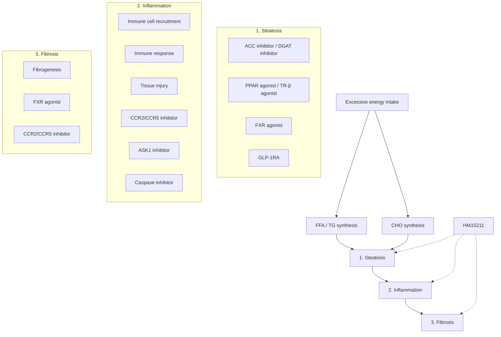

# Effect of a novel long-acting GLP-1/GIP/glucagon triple agonist (HM15211) in a NASH and liver fibrosis animal models Hanmi logo 1100-P

Jung Kuk Kim¹, Jong Suk Lee¹, Dae Jin Kim¹, Eun Jin Park¹, Aram Lee¹, Young Hoon Kim¹, and In Young Choi¹
¹Hanmi Pharm. Co., Ltd, Seoul, South Korea

## BACKGROUND

Modulation of multiple aspects of NASH and liver fibrosis by HM15211 in comparison to the action of other drug candidates for NASH

## AIMS

* Since multiple biological pathways are involved in the disease progression, therapeutic approach simultaneously targeting these pathways might be required to effectively treat NASH and fibrosis

* To address this, HM15211, a novel long-acting GLP-1/GIP/Glucagon triple agonist, has been developed

* In this study, we evaluated the therapeutic potential of HM15211 in NASH and fibrosis animal models

## METHODS

* Therapeutic potential of HM15211 in NASH and fibrosis was evaluated in MCD-diet induced NASH mice (6 ~ 12 weeks induction). After 4 ~ 5 weeks treatment of HM15211, liver tissue samples were prepared to measure hepatic TG, TBARS, NASH/fibrosis-related marker gene expression (TNF-α, TGF-β, α-SMA, and Collagen-1α1). Blood liver function markers (ALT, bilirubin) were also determined

* To investigate the therapeutic effects of HM15211 in more human relevant disease model, biopsy-proven obese, NASH, and fibrosis monkeys (BMI >40 kg/m², NAS + fibrosis score > 7) were utilized. After 12 weeks treatment of HM15211 including 3 weeks titration period, body weight and blood lipid profiles were determined, and body composition was determined by DEXA. Liver biopsy samples were subjected to histologic analysis.

* To determine NAS (NAFLD activity score), the same region of each liver tissue was subjected to H&E staining. For fibrosis analysis, Sirius red staining and hepatic hydroxyproline analysis were performed

## RESULTS

### Steatosis and inflammation improvement in MCD mice

Figure 1. Effect of HM15211 on steatosis in MCD-diet mice (n=7)

| Group                                           | Hepatic TG (mg/g liver) | Hepatic TBARS (nmol/mg liver) |
| ----------------------------------------------- | ----------------------- | ----------------------------- |
| Normal vehicle                                  | 40                      | 5                             |
| MCD, vehicle                                    | 100                     | 22                            |
| Liraglutide 50 nmol/kg, BID (3 mg/day in human) | 80                      | 18                            |
| HM15211 0.72 nmol/kg, Q2D (1 mg/wk in human)    | 45                      | 12                            |

\* ~ \*\*\*p<0.05 ~ 0.001 vs. MCD mice, vehicle by One-way ANOVA, † ~ †† p<0.05 ~ 0.01 vs. liraglutide by One-way ANOVA
§ TBARS: Thiobarbituric acid reactive substances, oxidative stress marker

⮚ HM15211 significantly reduced liver TG and TBARS independent of BWL (*data not shown*) in MCD-diet mice, suggesting its direct liver effect on steatosis improvement

Figure 2. Effect of HM15211 on NASH prognosis and inflammation marker expression in MCD-diet mice (n=7)

| Group                                           | Blood ALT (IU/L) | Blood total bilirubin (mg/dL) |
| ----------------------------------------------- | ---------------- | ----------------------------- |
| Normal vehicle                                  | 150              | 0.1                           |
| MCD, vehicle                                    | 900              | 1.1                           |
| Liraglutide 50 nmol/kg, BID (3 mg/day in human) | 500              | 0.95                          |
| HM15211 0.72 nmol/kg, Q2D (1 mg/wk in human)    | 350              | 0.6                           |
| HM15211 1.44 nmol/kg, Q2D (2 mg/wk in human)    | 200              | 0.4                           |

(c) Inflammation and HSC activation marker gene expression

| Group                                           | TNF-α | TGF-β | α-SMA |
| ----------------------------------------------- | ----- | ----- | ----- |
| Normal vehicle                                  | 1     | 1     | 1     |
| MCD, vehicle                                    | 2.8   | 2.5   | 3.1   |
| Liraglutide 50 nmol/kg, BID (3 mg/day in human) | 2.9   | 2.4   | 3.0   |
| HM15211 0.72 nmol/kg, Q2D (1 mg/wk in human)    | 1.5   | 1.5   | 2.1   |
| HM15211 1.44 nmol/kg, Q2D (2 mg/wk in human)    | 1.2   | 1.2   | 1.5   |

⮚ HM15211 not only reduced blood ALT and bilirubin, but also reduced hepatic inflammation and HSC activation related marker expression, suggesting the anti-inflammatory effects of HM15211

Figure 3. Effect of HM15211 on NASH in MCD-diet mice (n=7)

| Group            | NAFLD activity score |
| ---------------- | -------------------- |
| Normal vehicle   | 0                    |
| MCD, vehicle     | 4.2                  |
| MCD, Liraglutide | 3.8                  |
| MCD, HM15211     | 0.8                  |

(b) H&E staining
H&E staining images of Normal Vehicle, MCD Vehicle, MCD Liraglutide, and MCD HM15211

\* ~ \*\*p<0.05 ~ 0.01 vs. MCD mice, vehicle by One-way ANOVA; †††p<0.001 vs. Liraglutide by One-way ANOVA

⮚ Consistently, HM15211 completely reversed NAS to normal level

### Fibrosis improvement in MCD mice

Figure 4. Effect of HM15211 on hepatic fibrosis in MCD-diet mice (n=7)

<!-- layout: planning
1. This is semantically a table showing the experimental scheme for three studies.
2. No side-by-side tables.
3. Row sampling: 3 rows in body. Column count N=5.
4. Columns: 1. Model induction, 2. Drug treatment, 3. Study #, 4. Fibrosis stage, 5. Scheme (visual).
5. Merge cell detection: "MCD-diet" spans 2 rows. "C57BL/6 mice" spans 1 row.
6. Header structure: 3 rows of headers.
-->

| Model induction            | Drug treatment | Study # | Fibrosis | Experimental scheme | Experimental scheme         |
| -------------------------- | -------------- | ------- | -------- | ------------------- | --------------------------- |
| MCD-diet                   | 6 weeks        | 4 weeks | Study #1 | Early               | Experimental scheme diagram |
|                            | 10 weeks       | 5 weeks | Study #2 |                     |                             |
| C57BL/6 mice (8 weeks old) | 12 weeks       | 4 weeks | Study #3 | Late                |                             |

(a) Hepatic collagen-1α1 expression

| Study    | MCD, vehicle | HM15211 0.72 nmol/kg, Q2D |
| -------- | ------------ | ------------------------- |
| Study #1 | 6            | 2                         |
| Study #2 | 8            | 3                         |
| Study #3 | 12           | 5                         |

(b) Hepatic hydroxyproline and fibrosis score

| Study    | Measurement    | Normal vehicle | MCD, vehicle | HM15211 0.72 nmol/kg, Q2D |
| -------- | -------------- | -------------- | ------------ | ------------------------- |
| Study #1 | Hydroxyproline | 400            | 700          | 450                       |
|          | Fibrosis score | 0.3            | 1.9          | 1.0                       |
| Study #2 | Hydroxyproline |                | 1100         | 600                       |
|          | Fibrosis score | 0.0            | 2.4          | 1.8                       |
| Study #3 | Hydroxyproline |                | 1300         | 850                       |
|          | Fibrosis score | 0.0            | 3.0          | 2.4                       |

⮚ HM15211 reduced hepatic expression of collagen-1α1, hydroxyproline contents, and fibrosis score in MCD-diet mice regardless of fibrosis stage

### Therapeutic efficacy in obese/NASH monkeys

Figure 5. Effect of HM15211 on body composition and blood lipid profiles in obese/NASH monkeys

(a) DEXA image

DEXA images of Vehicle and HM15211 treated monkeys at baseline and post treatment
Graph of BW change (% vs. baseline) over 84 days for Vehicle and HM15211
Body composition chart showing Fat, Lean, and Bone mass for Vehicle and HM15211

(b) Changes in blood lipid profiles

| Lipid Profile           | Vehicle (n=3) | HM15211 (n=5) |
| ----------------------- | ------------- | ------------- |
| Δ TG (% vs. baseline)   | 10            | -60           |
| Δ LDL (% vs. baseline)  | 5             | -45           |
| Δ VLDL (% vs. baseline) | 10            | -60           |
| Δ HDL (% vs. baseline)  | -5            | -10           |

⮚ In obese/NASH NHP, HM15211 reduced fat mass, and improved blood lipid profiles

Figure 6. Effect of HM15211 in obese/NASH monkeys

| Group                         | NAS + fibrosis score |
| ----------------------------- | -------------------- |
| Vehicle, baseline             | 8.2                  |
| Vehicle, post-treatment (n=3) | 9.0                  |
| HM15211, baseline             | 8.2                  |
| HM15211, post-treatment (n=5) | 6.8                  |

(b) H&E staining
H&E staining images of Vehicle and HM15211 monkeys at baseline and post-treatment

\* ~ \*\*p<0.05 ~ 0.01 vs. vehicle by un-paired t-test

⮚ Relatively short-term treatment of HM15211 led to meaningful improvement in NAS + fibrosis score (vs. vehicle) in obese/NASH NHP

## CONCLUSIONS

* HM15211, a novel long-acting triple agonist, is designed to treat NASH and fibrosis by aiming multiple pathways involved in NASH and fibrosis progression

* In rodent NASH models, HM15211 reduces liver fat, inflammation marker expression, leading to NASH resolution

* In addition, HM15211 has potential to improve fibrosis in rodent NASH and fibrosis models regardless of fibrosis stage

* Beneficial effects of HM15211 on NASH and fibrosis improvement are well-translated in obese/NASH NHP

* Therefore, HM15211 might be a novel therapeutic option for NASH and fibrosis

European Association for the Study of Diabetes (EASD) 55ᵗʰ Annual Meeting, Barcelona, Spain, 16 - 20 September 2019

Hanmi Pharm. Co., Ltd.

