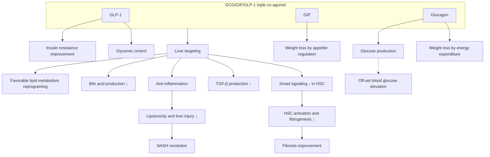

# Direct anti-inflammatory and anti-fibrotic effects of a novel long-acting Glucagon/GIP/GLP-1 triple agonist, HM15211, in TAA-induced mouse model of liver injury and fibrosis 735-P Hanmi logo

Jung Kuk Kim¹, Jong Suk Lee¹, Yohan Kim¹, Seon Myeong Lee¹, Hyunjoo Kwon¹, Eun Jin Park¹, Jae Hyuk Choi¹, Sungmin Bae¹, Daejin Kim¹, Sang Hyun Lee¹, In Young Choi¹
¹Hanmi Pharm. Co., Ltd, Seoul, South Korea

## ABSTRACT

HM15211 is a novel long-acting triple agonist consisting of Glucagon/GIP/GLP-1 triple agonist conjugated to human IgG FC fragment via short PEG linker. Previously, therapeutic benefits of HM15211 were demonstrated in diet-induced animal models of NASH and fibrosis. Here, direct anti-inflammatory and -fibrotic effects of HM15211 were further evaluated in TAA (thioacetamide)-induced liver injury and fibrosis mouse, and investigate underlying mechanism.

To induce liver injury and fibrosis, gradually increased dose of TAA was injected to mouse for 12 weeks, and HM15211 was administered during last 10 weeks. Interestingly, HM15211 treatment significantly reduced hepatic hydroxyproline (-51% vs. Veh, p<0.01), Sirius red positive area (-65% vs. Veh, p<0.001), and fibrosis score (0.7 for HM15211 vs. 3.0 for Veh, p<0.001). Considering baseline fibrosis score at week 2 (1.0), HM15211 could confer both potential reversal effect on pre-existing fibrosis and prevention effect on fibrogenesis. Consistently, expression of hepatic marker genes for fibrosis (i.e. collagen-1α1) and inflammation (i.e. F4/80, TNF-α) were significantly reduced in HM15211 group. Furthermore, multiplex cytokine analysis revealed that HM15211 treatment was associated with robust reduction across pro-inflammatory cytokines including TNF-α, IL-1β, and IL-6. Significant reduction in blood level of liver enzymes was also confirmed. Mechanistically, PMA/LPS-induced pro-inflammatory cytokine secretion of THP-1 cell was significantly attenuated by HM15211. TGF-β-induced collagen production was also reduced in LX2 cell.

In conclusion, HM15211 markedly improved liver inflammation and fibrosis in TAA mice, and related mechanism was elaborated by in vitro studies. Thus, HM15211 could be a novel therapeutic option for fibrosis due to NASH. Human study is ongoing to assess the clinical relevance of these findings.

## BACKGROUND

HM15211 is a novel long-acting Glucagon/GIP/GLP-1 triple agonist conjugated with human IgG4 Fc fragment via a short PEG linker

## METHODS

### Study design

Study design diagram showing TAA induction for 12 weeks and HM15211 treatment from week 2 to 12 with dose escalation of TAA

* Therapeutic potential of HM15211 in liver inflammation and fibrosis was evaluated in TAA mice. For this purpose, gradually escalated dose of TAA (thioacetamide, known hepato-toxin) was intraperitoneally injected to mouse for 12 weeks, and HM15211 was subcutaneously administered during last 10 weeks. After treatment, liver tissue samples were prepared, followed by H&E and Sirius red staining to determine the portal inflammation and fibrosis score, respectively. Hepatic hydroxyproline contents were quantified using commercially available assay kit. qPCR was performed to measure the expression level of hepatic inflammation- and fibrosis-related marker genes. Multiplex assay (MILLIPLEX®) was performed to determine blood level of pro-inflammatory cytokines.

* For in vitro mechanistic study, THP-1 cell (human monocyte) and LX2 cell (human HSC) were used. To differentiate monocyte to macrophage, THP-1 cells were incubated with PMA (phorbol 12-myristate 13-acetate, known NF-κB stimulator). LPS (lipopolysaccharide) was then treated to THP-1 macrophage to further induce M1 polarization. TGF-β was utilized for the activation of LX2 cells into myofibroblast-like cells

## RESULTS

### Anti-inflammatory and anti-fibrotic effects in TAA mice

### Figure 1. Effect of HM15211 on liver inflammation and fibrosis in TAA mice

(a) Representative image for Sirius red staining (scale bar = 100 μm)

Normal, Vehicle TAA, Vehicle TAA, HM15211

(b) Fibrosis score

| Group        | Fibrosis score |
| ------------ | -------------- |
| Baseline     | 1.0            |
| TAA, Vehicle | 3.0            |
| TAA, HM15211 | 0.7            |

\* \*\*\*p<0.001 vs. TAA, vehicle

(c) Sirius red positive area

| Group           | Sirius red positive area (%) |
| --------------- | ---------------------------- |
| Normal, Vehicle | 0.1                          |
| TAA, Vehicle    | 0.9                          |
| TAA, HM15211    | 0.3                          |

\* \*\*\*p<0.001 vs. TAA, vehicle

(d) Hepatic hydroxyproline

| Group           | Hepatic hydroxyproline (nmol/g liver) |
| --------------- | ------------------------------------- |
| Normal, Vehicle | 180                                   |
| TAA, Vehicle    | 380                                   |
| TAA, HM15211    | 190                                   |

\* \*\*p<0.01 vs. TAA, vehicle

⮚ HM15211 treatment leads to histological improvement of liver fibrosis in TAA mice. Reduction effect on fibrosis score is correlated with reduction of Sirius red positive area and hepatic hydroxyproline contents

### Figure 2. Effect of HM15211 on surrogate efficacy markers in TAA mice

(a) Hepatic inflammatory marker gene

| Gene  | Normal, Vehicle | TAA, Vehicle | TAA, HM15211 |
| ----- | --------------- | ------------ | ------------ |
| F4/80 | 1.0             | 1.8          | 1.2          |
| TNF-α | 1.0             | 1.6          | 1.1          |
| IL-1β | 1.0             | 2.4          | 1.2          |

(b) Hepatic fibrosis marker gene

| Gene   | Normal, Vehicle | TAA, Vehicle | TAA, HM15211 |
| ------ | --------------- | ------------ | ------------ |
| TGF-β  | 1.0             | 3.8          | 2.1          |
| Col1α1 | 1.0             | 5.2          | 2.8          |

(c) Blood liver function marker

| Marker | Normal, Vehicle | TAA, Vehicle | TAA, HM15211 |
| ------ | --------------- | ------------ | ------------ |
| ALT    | 40              | 180          | 100          |
| AST    | 80              | 210          | 160          |

(d) Blood pro-inflammatory cytokine (part of data for multiplex analysis)

| Cytokine | Normal, Vehicle | TAA, Vehicle | TAA, HM15211 |
| -------- | --------------- | ------------ | ------------ |
| TNF-α    | 10              | 100          | 40           |
| IL-1β    | 5               | 15           | 9            |
| IL-6     | 10              | 45           | 25           |
| MCP-1    | 20              | 80           | 55           |

\* \*\~ \*\*\*p<0.05 \~ 0.001 vs. TAA, vehicle by One-way ANOVA

⮚ Consistent with histology results, robust therapeutic effects of HM15211 are confirmed for surrogate efficacy measurement such as hepatic marker gene expression, blood cytokine level (w/o statistical significance).

### MoA for anti-inflammatory and anti-fibrotic effects

### Figure 3. Effect of HM15211 on THP-1 cell activation

(a) PMA-induced cell adhesion and representative image (monocyte to macrophage differentiation)

| Group         | Adherent cells (% vs. PMA only) |
| ------------- | ------------------------------- |
| Vehicle       | 5                               |
| PMA           | 100                             |
| PMA + HM15211 | 85                              |

(b) Pro-inflammatory cytokine secretion (M1 macrophage polarization)

| Cytokine | Vehicle | PMA 150 nM | PMA 150 nM + HM15211 10 μM |
| -------- | ------- | ---------- | -------------------------- |
| TNF-α    | 10      | 550        | 80                         |
| IL-1β    | 5       | 100        | 20                         |
| IL-12    | 5       | 280        | 40                         |

\* \*\~ \*\*\*p<0.05 \~ 0.001 vs. PMA only by One-way ANOVA

### Figure 4. Effect of HM15211 on LX-2 cell activation

(a) Smad3 phosphorylation & luciferase activation by TGF-β

| Assay                 | Vehicle | TGF-β 0.5 or 5 ng/mL | TGF-β + HM15211 10 μM |
| --------------------- | ------- | -------------------- | --------------------- |
| Smad3 phosphorylation | 1.0     | 2.2                  | 1.2                   |
| Luciferase activity   | 1.0     | 4.2                  | 2.1                   |

(b) Collagen secretion

| Group                 | Collagen Conc. (μg/mL) |
| --------------------- | ---------------------- |
| Vehicle               | 12                     |
| TGF-β                 | 36                     |
| TGF-β + HM15211 10 μM | 28                     |

\* \*\~ \*\*\*p<0.05 \~ 0.001 vs. TGF-β only by One-way ANOVA

⮚ In vitro mechanistic study results demonstrate inhibitory effects of HM15211 on activation of macrophage and HSC, further supporting its direct anti-inflammatory and -fibrotic effects.

## CONCLUSIONS

* HM15211, a novel long-acting triple agonist, is designed to treat NASH and fibrosis by targeting multiple aspect of the disease

* In TAA mice, HM15211 leads to improvement in liver inflammation and fibrosis, and in vitro studies clarify its direct anti-inflammatory and -fibrotic effects

* P2b study is on-going for the clinical relevant of these findings

American Diabetes Association logo American Diabetes Association’s (ADA) 82ⁿᵈ Scientific Sessions, New Orleans, LA; June 3-7, 2022 Hanmi Pharm. Co., Ltd.

