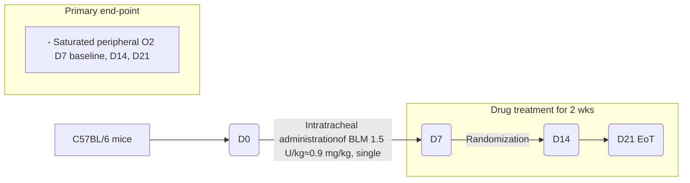

Abstract #838

58th EASD Annual Meeting banner, 19-23 September 2022, Stockholm & Online, easd.org

# Anti-fibrotic potential of a novel long-acting Glucagon/GIP/GLP-1 triple agonist (HM15211) in preclinical models of idiopathic pulmonary fibrosis

**<u>Seon Myeong Lee</u>**, Jeong A Kim, Jong Suk Lee, Jung Kuk Kim, Young-Hwan Ban, Jong Soo Lee, Sung Min Bae, Dae Jin Kim, Sang Hyun Lee, In Young Choi

Hanmi Pharm. Co., Ltd., Seoul, Republic of Korea

Hanmi logo

# Presenter Disclosure Hanmi logo

Employee of Hanmi Pharm. Co., Ltd.

European Association for the Study of Diabetes (EASD) 58th Annual Meeting, Stockholm & Online, 19 -23Sep.2022 Hanmi Pharm. Co., Ltd.

# Proposed indication expansion of HM15211 Hanmi logo

An excellent preclinical efficacy of HM15211 on liver fibrosis was confirmed (abstract #778). As HM15211 was distributed not only in the liver but also in the lung, potential benefits of HM15211 on pulmonary fibrosis was explored in terms of indication expansion

Illustration of heart and kidney
Heart and kidney
:CVR benefits

Illustration of a liver

1) Liver
:NASH/Fibrosis
:PBC/PSC

LAPS Triple agonist diagram
LAPSTriple agonist

Illustration of adipose tissue
Adipose tissue
:Obesity

Illustration of lungs showing fibrosis

## 2) Lung

:IPF as our suggestion

Based on the facts below...

1. Lung as another main target tissue of HM15211

2. Robust anti-fibrotic nature of HM15211

European Association for the Study of Diabetes (EASD) 58th Annual Meeting, Stockholm & Online, 19 -23Sep.2022

Hanmi Pharm. Co., Ltd.

# Overview of lung function alteration, and predicted targets of HM15211 in IPF Hanmi logo

**IPF is neither stopped nor reversed and lung function declines while on treatment.**
**Despite different etiology and pathogenesis, pleiotropic benefits including EMT inhibition and anti-fibrosis suggest medicinal utility of HM15211 for the management of IPF in addition to NASH**

## Lung Function (FVC) during IPF

| State                | Trend / Volume Description                               |
| -------------------- | -------------------------------------------------------- |
| Healthy subjects     | Stable Total Lung Capacity (horizontal dashed line)      |
| Existing Treatment   | Slower decline in FVC (green dashed line)                |
| IPF patients         | Rapid decline in FVC leading to Death (blue solid line)  |
| Room for Improvement | Area between "Healthy subjects" and "Existing Treatment" |

## Expected Target of **HM15211**

* [x] **Fibroblast** (MRC-5, human lung fibroblast) Fibroblast icon
* [x] **Myofibroblast** (LL-29, human IPF patient cell) Myofibroblast icon
* [x] **Alveolar Epithelium** (A549, human alveolar epithelial cell) Alveolar Epithelium icon
* [x] **Immune Cell** (THP-1, human monocyte) Immune Cell icon
* Capillary
* Bronchial Epithelium

Please note oral presentation reporting more information about HM15211:

**#778: Anti-inflammatory and anti-fibrotic effects of a novel long-acting Glucagon/GIP/GLP-1 triple agonist, HM15211, in TAA induced mouse model of liver injury and fibrosis**

European Association for the Study of Diabetes (EASD) 58th Annual Meeting, Stockholm & Online, 19 -23Sep.2022

Hanmi Pharm. Co., Ltd.

Hanmi logo

# Figure 1. Effect of HM15211 on lung function

⮚BLM-induced decrease in percent oxygen saturation level (SpO2) was effectively restored by HM15211 to almost normal control level (93.7% vs. 96.2% for normal) at D21, unlike IPF drugs, PIRF (88.0%), NINT (84.9%)

* Saline vehicle
* BLM 1.5 U/kg, vehicle
* BLM 1.5 U/kg, HM15211 141 μg/kg/Q2D
* BLM 1.5 U/kg, Pirfenidone 300 mg/kg/QD
* BLM 1.5 U/kg, Nintedanib 40 mg/kg/QD

## Arterial oxygen (SpO2, %) at D7

| Group                                  | Arterial oxygen (SpO2, %) |
| -------------------------------------- | ------------------------- |
| Saline vehicle                         | 95.6                      |
| BLM 1.5 U/kg, vehicle                  | 84.0                      |
| BLM 1.5 U/kg, HM15211 141 μg/kg/Q2D    | 85.6                      |
| BLM 1.5 U/kg, Pirfenidone 300 mg/kg/QD | 85.4                      |
| BLM 1.5 U/kg, Nintedanib 40 mg/kg/QD   | 86.7                      |

## Arterial oxygen (SpO2, %) at D14

| Group                                  | Arterial oxygen (SpO2, %) |
| -------------------------------------- | ------------------------- |
| Saline vehicle                         | 96.0                      |
| BLM 1.5 U/kg, vehicle                  | 77.1                      |
| BLM 1.5 U/kg, HM15211 141 μg/kg/Q2D    | 81.9                      |
| BLM 1.5 U/kg, Pirfenidone 300 mg/kg/QD | 81.3                      |
| BLM 1.5 U/kg, Nintedanib 40 mg/kg/QD   | 91.5                      |

\*\* ~ \*\*\*p < 0.01 ~ < 0.001 vs. BLM, vehicle by One-way ANOVA

## Arterial oxygen (SpO2, %) at D21

| Group                                  | Arterial oxygen (SpO2, %) |
| -------------------------------------- | ------------------------- |
| Saline vehicle                         | 96.2                      |
| BLM 1.5 U/kg, vehicle                  | 78.8                      |
| BLM 1.5 U/kg, HM15211 141 μg/kg/Q2D    | 88.0                      |
| BLM 1.5 U/kg, Pirfenidone 300 mg/kg/QD | 84.9                      |
| BLM 1.5 U/kg, Nintedanib 40 mg/kg/QD   | 93.7                      |

European Association for the Study of Diabetes (EASD) 58th Annual Meeting, Stockholm & Online, 19 -23Sep.2022

Hanmi Pharm. Co., Ltd.

# Figure 2. Effect of HM15211 on disease progression and death Hanmi logo

⮚ HM15211 significantly improved the survival rate of mice treated with 2.5 U/kg BLM from 17 to 61% unlike pirfenidone (28%) and nintedanib (33%), further demonstrating HM15211 could slow disease progression and extend survival in BLM mice

Study design diagram showing C57BL/6 mice receiving intratracheal administration of BLM 2.5 U/kg at D0, randomization at D7, drug treatment for 2 weeks, and primary end-point of survival rate monitoring at D21 (EoT). Treatment groups include Saline vehicle, BLM 2.5 U/kg vehicle, HM15211 141 μg/kg/Q2D, Pirfenidone 300 mg/kg/QD, and Nintedanib 40 mg/kg/QD.

\* ~ \*\*\*p < 0.05 ~ < 0.001 vs. BLM, vehicle by One-way ANOVA

## <u>Survival rate in 2.5 U/kg BLM mice</u>

<u>(% vs. saline vehicle)</u>

| Time (days after BLM exposure) | Saline, Vehicle  | BLM 2.5 unit/kg, HM15211 141 μg/kg/Q2D (4 mg/wk in human) | BLM 2.5 unit/kg, Pirfenidone 300 mg/kg/QD (2,400 mg/day in human) | BLM 2.5 unit/kg, Nintedanib 40 mg/kg/QD (320 mg/day in human) | BLM 2.5 unit/kg, Vehicle |
| ------------------------------ | ---------------- | --------------------------------------------------------- | ----------------------------------------------------------------- | ------------------------------------------------------------- | ------------------------ |
| 0                              | 100              | 100                                                       | 100                                                               | 100                                                           | 100                      |
| 7                              | 100              | 100                                                       | 100                                                               | 100                                                           | 100                      |
| 14                             | 100              | 72                                                        | 67                                                                | 61                                                            | 50                       |
| 21                             | 100 \\\*\\\*\\\* | 61 (11/18) \\\*                                           | 28 (5/18)                                                         | 33 (6/18)                                                     | 17 (3/18)                |

European Association for the Study of Diabetes (EASD) 58th Annual Meeting, Stockholm & Online, 19 -23Sep.2022
Hanmi Pharm. Co., Ltd.

# Summary & Conclusions

Hanmi logo

* **HM15211 is a novel long-acting Glucagon/GIP/GLP-1 triple agonist and its therapeutic potential was demonstrated in various animal models of NASH and/or fibrosis**

* **Tissue distribution study indicates that HM15211 is readily distributed to the lung in addition to the liver. These results make us to investigate the potential benefit of HM15211 on fibrotic lung disease with high unmet medical needs such as IPF**

* **In BLM mice, HM15211 improved pulmonary respiratory function and survival rate**

* **Compared to pirfenidone or nintedanib treated groups, HM15211 showed greater improvement effects on all the efficacy measurements in BLM mice**

> **HM15211 might be a potential therapeutic option for IPF in addition to NASH**
> **Human study should be required for human relevance of these findings**

**Contact information**: seonmyeong.lee@hanmi.co.kr

European Association for the Study of Diabetes (EASD) 58th Annual Meeting, Stockholm & Online, 19 -23Sep.2022

Hanmi Pharm. Co., Ltd.

