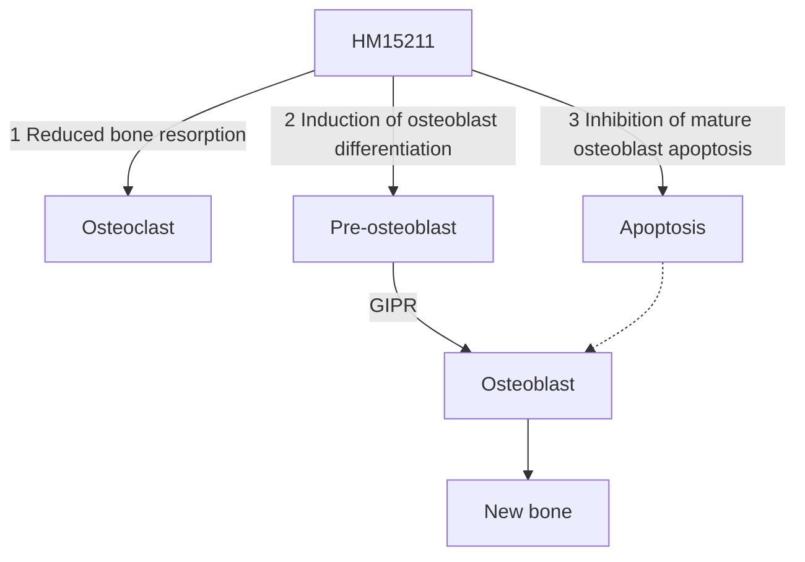

# Bone protective effect of a novel long-acting GLP-1/GIP/Glucagon triple agonist (HM15211) in the obese-osteoporosis rodent model 1105-P logo

Sang Don Lee¹, Jong Suk Lee¹, Eun Jin Park¹, Sang-Hyun Lee¹, Jong Soo Lee¹, In Young Choi¹, Young Hoon Kim¹, and Sun Jin Kim¹
1Hanmi Pharm. Co., Ltd, Seoul, Korea

# ABSTRACT

Severe weight loss is often associated with reduction in bone mineral density (BMD) and an imbalance between bone formation and resorption in obese people. As a consequence, there can be an increased risk of bone fractures with body weight loss. Several studies have proposed that the gut hormones, gastric inhibitory polypeptide (GIP), glucagon-like peptide-1 (GLP-1) and glucagon (GCG), might be modulators of bone growth and remodeling. HM15211 is a novel long-acting GLP-1/GIP/Glucagon agonist that is being developed for the treatment of obesity. In this study, we investigated whether treatment with HM15211 prevents bone loss under a severe weight loss condition, and the underlying mechanism of action.

To investigate bone protection efficacy of HM15211 and liraglutide in obese osteoporosis rats model for chronic treatment. After 4 weeks subcutaneous treatment of HM15211 showed lower serum level of decarboxylated osteocalcin (Glu-OC) and higher serum levels of osteoprotegerin (OPG) and procollagen type I pro-peptide (P1NP) compared with those of vehicle and liraglutide treated groups. Consequently, HM15211 showed comparable BMD of femurs with vehicle group while it showed greater weight loss compared to liraglutide.

For elucidating the underlying molecular mechanism, related marker gene expression was investigated using the MC3T3-E1 cell (mouse osteoblast cell). HM15211 led to significant increase in type1 collagen-α1 and carboxylated osteocalcin (Gla-OC) expression, which were blunted by inhibition of GIPR mediated signaling.

These results suggest that HM15211 might provide potent weight loss without the otherwise inevitable bone loss.

# METHODS

* To investigate MoA for bone protection of HM15211, MC3T3-E1 cells were treated with HM15211. Osteoblast differentiation related markers (RUNX2, OCN, ALP and Col1α) were analyzed using real-time PCR. Additionally, collagen protein expression change and anti-apoptotic effect were evaluated using commercial kit.
* Diet induced obesity (DIO) osteoporosis rat model was induced by surgical oophorectomy (OVX) and fed 60% kcal fat diet to immatured 5 weeks old female sprague dawley (SD) rats for 8 weeks. Serum levels of bone biochemical markers (Glu-OC, OPG and P1NP) were measured by commercial ELISA kits. BMD of femurs were monitored using a high resolution in vivo µ-CT system (n = 7 /group).

**Progress of in vivo study**

| D-56                            | D0                              | D14   | D28                |
| ------------------------------- | ------------------------------- | ----- | ------------------ |
| SD ♀ 5wks old 60% kcal fat diet | OVX                             | Serum | Serum Necropsy |
|                                 | HM15211 Q3D Liraglutide BID |       |                    |

# RESULTS

## Reduction of body weight and food intake

**Figure 1. Body weight change and food intake**
**(a) Body weight change**

| Day | Shame vehicle | OVX vehicle | OVX Liraglutide | OVX HM15211 2.2 nmol/kg | OVX HM15211 4.4 nmol/kg |
| --- | ------------- | ----------- | --------------- | ----------------------- | ----------------------- |
| 0   | 0             | 0           | 0               | 0                       | 0                       |
| 3   | 2             | 1           | -2              | -5                      | -8                      |
| 6   | 4             | 2           | -3              | -8                      | -15                     |
| 9   | 5             | 3           | -3              | -10                     | -20                     |
| 12  | 6             | 4           | -3              | -12                     | -25                     |
| 15  | 7             | 5           | -3              | -13                     | -28                     |
| 18  | 8             | 6           | -3              | -14                     | -31                     |
| 21  | 8.5           | 7           | -3              | -15                     | -33                     |
| 24  | 8.8           | 7.5         | -3.0\*\*        | -15.2\*\*\*             | -35.7\*\*\*             |

**(b) Accumulative food intake0-24day**

| Group                   | Accumulative Food Intake (g) |
| ----------------------- | ---------------------------- |
| Shame vehicle           | 102                          |
| OVX vehicle             | 103                          |
| OVX Liraglutide         | 80                           |
| OVX HM15211 2.2 nmol/kg | 80                           |
| OVX HM15211 4.4 nmol/kg | 50\*\*                       |

\*~***p<0.05~0.001 vs. vehicle by One-way ANOVA

➢ HM15211 administration significantly decreased body weight and food intake, respectively.
Legend for Figure 1
* [ ] Shame vehicle, Q2D
* [ ] OVX vehicle, Q2D
* [ ] OVX Liraglutide 25 nmol/kg, BID (3 mg/day in human)
* [ ] OVX HM15211 2.2 nmol/kg, Q2D (4 mg/week in human)
* [ ] OVX HM15211 4.4 nmol/kg, Q2D (8 mg/week in human)

## Improvement of bone biochemical markers

**Figure 2. Serum levels of Glu-OC, OPG and P1NP**

**(a) Glu-OC (bone resorption marker)**

| Day | Shame vehicle | OVX vehicle | OVX Liraglutide | OVX HM15211 2.2 nmol/kg | OVX HM15211 4.4 nmol/kg |
| --- | ------------- | ----------- | --------------- | ----------------------- | ----------------------- |
| -4  | 110           | 110         | 110             | 110                     | 110                     |
| 14  | 110           | 150\*       | 150             | 130\*\*\*               | 35\*\*\*                |
| 28  | 110           | 155         | 120\*\*\*       | 55\*\*\*                | 40\*\*\*                |

**(b) OPG (osteoclastogenesis inhibition marker) & P1NP (bone formation marker)**

| Group                   | OPG (pg/ml) at Day 28 | P1NP (ng/ml) at Day 28 |
| ----------------------- | --------------------- | ---------------------- |
| Shame vehicle           | 40                    | 180                    |
| OVX vehicle             | 45                    | 185                    |
| OVX Liraglutide         | 75                    | 190                    |
| OVX HM15211 2.2 nmol/kg | 85                    | 210\*\*\*              |
| OVX HM15211 4.4 nmol/kg | 175\*\*\*             | 230\*\*\*              |

\*~***p<0.05~0.001 vs. vehicle by One-way ANOVA

➢ Bone bio chemical markers (Glu-OC, OPG and P1NP) were dose dependently improved on HM15211 dosing group, respectively.

## Prevention of BMD loss following weight loss

**Figure 3. BMD and µ-CT image of femurs**

**(a) Femurs BMD and weight loss**

| Group                   | Femurs BMD (g/cm²) | Δ Body weight (%) |
| ----------------------- | ------------------ | ----------------- |
| Shame vehicle           | 0.43               | 8.8               |
| OVX vehicle             | 0.42               | 7.5               |
| OVX Liraglutide         | 0.41\*             | -3.0              |
| OVX HM15211 2.2 nmol/kg | 0.42               | -15.2\*\*\*       |
| OVX HM15211 4.4 nmol/kg | 0.43               | -35.7\*\*\*       |

\*~***p<0.05~0.001 vs. vehicle by One-way ANOVA

**(b) µ-CT image of Femurs**
µ-CT images of femurs for Shame Vehicle, OVX Vehicle, OVX Liraglutide 25 nmol/kg, OVX HM15211 2.2 nmol/kg, and OVX HM15211 4.4 nmol/kg

➢ Even severe weight loss condition, HM15211 prevented BMD loss of femurs

## MoA studies for bone protection

**Figure 4. Bone protection mechanism in MC3T3-E1 cell**

**(a) Osteoblast differentiation marker genes**

| Gene  | Control | HM15211 1 µM | HM15211 10 µM |
| ----- | ------- | ------------ | ------------- |
| RUNX2 | 1.0     | 1.3\*        | 1.5\*\*       |
| OCN   | 1.0     | 1.2          | 2.8\*\*       |
| ALP   | 1.0     | 1.1          | 1.8\*\*       |
| Col1α | 1.0     | 1.2          | 1.4\*\*       |

**(b) Collagen expression in conditioned media**

| Treatment                            | Collagen concentration (µg/ml) |
| ------------------------------------ | ------------------------------ |
| Control                              | 150                            |
| LAPS-GIP 1 µM                        | 330\*                          |
| HM15211 1 µM                         | 230                            |
| HM15211 10 µM                        | 310\*                          |
| HM15211 1 µM + GIP inhibitor 10 µM   | 180                            |
| HM15211 10 µM + GIP inhibitor 100 µM | 200                            |

**(c) Inhibition of osteoblast apoptosis**

| FBS (%) | HM15211 (µM) | GIP inhibitor (µM) | Luminescence (RLU) |
| ------- | ------------ | ------------------ | ------------------ |
| 10      | 0            | 0                  | 26000              |
| 0       | 0            | 0                  | 10000              |
| 0       | 2            | 0                  | 14000\*\*\*        |
| 0       | 2            | 0.31               | 13500\*\*\*        |
| 0       | 2            | 1.25               | 12500\*\*          |
| 0       | 2            | 5                  | 11500\*            |
| 0       | 2            | 20                 | 10500              |

\*~***p<0.05~0.001 vs. vehicle by One-way ANVAO

➢ HM15211 improved osteoblast differentiation and showed anti-apoptotic effect. Additionally, GIP antagonist reversed the beneficial effect of HM15211 on bone protection.

**Figure 5. Schematic summary for bone protective effect**

Nature. 481, 314-20 (2012), Nat Rev Cancer. 5, 21-8 (2005)

# CONCLUSIONS

* Lower serum level of Glu-OC and higher serum levels of OPG and P1NP were observed compared with those of vehicle and liraglutide treated groups in obese-osteoporosis rats model.
* HM15211 showed comparable BMD of femurs with vehicle while it showed greater weight loss compared to liraglutide in obese-osteoporosis rats model.
* HM15211 led to significant increase in collagen and Gla-OC expression, which were blunted by inhibition of GIPR mediated signaling in osteoblast cell.
* These results suggest that HM15211 might provide potent weight loss without bone loss

# REFERENCES

1. Francisco J. A. de Paula and Clifford J. Rosen, Arq Bras Endocrinol Metabol. 2010 Mar;54(2):150-7.
2. Francesc Villarroya et al., Nat Rev Endocrinol. 2017 Jan;13(1):26-35
3. Guojing Luo et al., Br J Clin Pharmacol. 2016 Jan;81(1):78-88.
4. Katsushi Tsukiyama et al., Mol Endocrinol. 2006 Jul;20(7):1644-51.

American Diabetes Association’s (ADA) 78th Scientific Sessions, Orlando, Florida, USA; June 22‐26, 2018
Hanmi Pharm. Co., Ltd.

