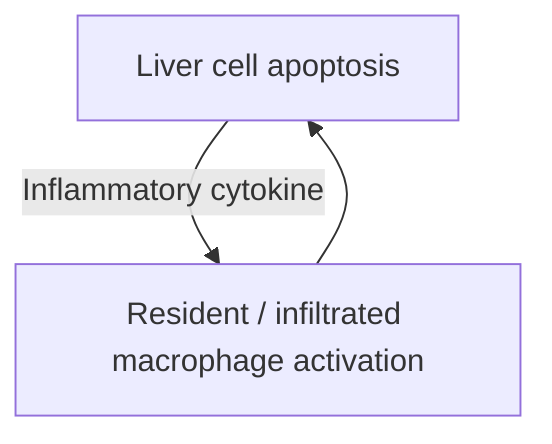
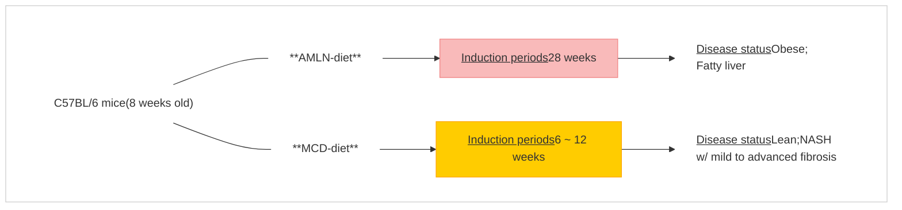
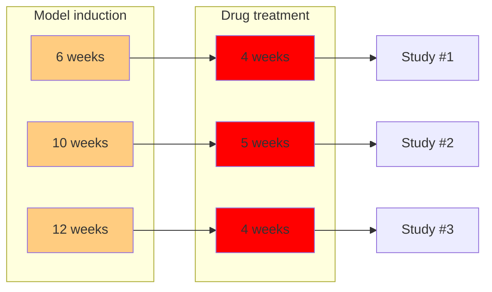

# Therapeutic effect of a novel long-acting GLP-1/GIP/Glucagon triple agonist (HM15211) in NASH and fibrosis animal models

**Jung Kuk Kim**, Jong Suk Lee, Eunjin Park, Dae Jin Kim, Young Hoon Kim, and In Young Choi

Hanmi Pharm. Co., Ltd., Seoul, Republic of Korea

Hanmi logo

Presenter Disclosure

Hanmi logo

**Employee of Hanmi Pharm. Co., Ltd.**

European Association for the Study of Diabetes (EASD) 54th Annual Meeting, Berlin, Germany; 1-5 Oct., 2018

**Hanmi Pharm. Co., Ltd.**

# NASH progression

Hanmi logo

| \*Normal\*                |       | \*NAFL\*                |       | \*NASH\*                |       | \*Cirrhosis\*                |
| ------------------------- | ----- | ----------------------- | ----- | ----------------------- | ----- | ---------------------------- |
| Normal liver illustration | arrow | NAFL liver illustration | arrow | NASH liver illustration | arrow | Cirrhosis liver illustration |

**Hepatocyte lipotoxicity**
* Obesity; Dyslipidemia; Insulin resistance and T2DM
$\rightarrow$ Liver fat accumulation

**Inflammation**
* Lipid peroxidation $\uparrow$
* Oxidative stress $\uparrow$

**Fibrosis**
* Inflammatory tissue injury
* HSC activation
* Fibrogenic component $\uparrow$
$\rightarrow$ Scar replaces damaged liver cells
$\rightarrow$ Liver function failure

European Association for the Study of Diabetes (EASD) 54ᵗʰ Annual Meeting, Berlin, Germany; 1-5 Oct., 2018

Hanmi Pharm. Co., Ltd.

# NASH progression and potential drug candidates

Hanmi logo

## Normal

Illustration of a healthy liver

Arrow pointing right

**Hepatocyte lipotoxicity**

* Obesity; Dyslipidemia; Insulin resistance and T2DM

$\rightarrow$ Liver fat accumulation

**GLP-1RA**

$\sqrt{\text{\underline{Liraglutide}}}$; semaglutide (P2, Novo)

**ACC inhibitor**

GS-0976 (P2, Gilead)

**PPAR agonist**

Elafibranor (P2, GENFIT)

## NAFL

Illustration of a fatty liver

Arrow pointing right

**Inflammation**

* Lipid peroxidation $\uparrow$
* Oxidative stress $\uparrow$

$\rightarrow$ Liver cell apoptosis $\rightarrow$ Resident / infiltrated macrophage activation $\rightarrow$ Inflammatory cytokine $\rightarrow$ Liver cell apoptosis

**FXR agonist**

$\sqrt{\text{\underline{Obeticholic acid}}}$ (P3, Intercept.)
GS-9674 (P2, Gilead)

## NASH

Illustration of an inflamed liver

Arrow pointing right

**Fibrosis**

* Inflammatory tissue injury
* HSC activation
* Fibrogenic component $\uparrow$

$\rightarrow$ Scar replaces damaged liver cells
$\rightarrow$ Liver function failure

**ASK1 inhibitor**
$\sqrt{\text{\underline{Selonsertib}}}$ (P3, Gilead)

## Cirrhosis

Illustration of a cirrhotic liver

**Drug candidates (selected)**

**Note.** $\sqrt{}$ Indicated compounds were used as active comparators in efficacy studies

European Association for the Study of Diabetes (EASD) 54th Annual Meeting, Berlin, Germany; 1-5 Oct., 2018
Hanmi Pharm. Co., Ltd.

# What is long-acting GLP-1/GIP/Glucagon triple agonist?

Hanmi logo

Diagram of GLP-1/GIP/GCG triple co-agonist structure showing the agonist peptide, flexible PEG linker, and aglycosylated Fc fragment

Hanmi’s GLP-1/GIP/GCG triple co-agonist is conjugated with a human IgG Fc fragment *via* flexible linker

**[General profile]**

* Extended half-life (t1/2 = 42.7 ~ 55 hrs in mice; 82.8 ~ 85.7 hrs in rats)

* High glucagon (GCG) activity suitable for obesity treatment

* Balanced GLP-1 and GIP activity to neutralize hyperglycemic risk of high GCG

* Anti-inflammatory effect by GIP activity

* Recently completed FIH clinical study in healthy obese subjects

**LAPSCOVERY : Long Acting Peptide/Protein DiSCOVERY Technology**

European Association for the Study of Diabetes (EASD) 54ᵗʰ Annual Meeting, Berlin, Germany; 1-5 Oct., 2018

Hanmi Pharm. Co., Ltd.

# Efficient weight loss by HM15211 and related MoA

Hanmi logo

## Weight change in pair-fed controlled DIO mice

| Time (Days) | Vehicle | Liraglutide 50 nmol/kg, BID | HM15211 1.44 nmol/kg, Q2D | Pair-fed for liraglutide | Pair-fed for HM15211 |
| ----------- | ------- | --------------------------- | ------------------------- | ------------------------ | -------------------- |
| 0           | 0       | 0                           | 0                         | 0                        | 0                    |
| 2           | -1      | -5                          | -2                        | -2                       | -2                   |
| 4           | -1      | -8                          | -4                        | -4                       | -4                   |
| 6           | -2      | -12                         | -7                        | -7                       | -7                   |
| 8           | -2      | -15                         | -11                       | -11                      | -11                  |
| 10          | -2      | -17                         | -15                       | -14                      | -14                  |
| 12          | -2      | -19                         | -20                       | -17                      | -17                  |
| 14          | -2      | -21                         | -23                       | -19                      | -19                  |
| 16          | -2      | -22                         | -26                       | -20                      | -20                  |
| 18          | -2      | -23                         | -28                       | -21                      | -21                  |
| 20          | -3      | -23                         | -30                       | -21                      | -21                  |
| 22          | -4      | -22                         | -33                       | -20                      | -20                  |
| 24          | -4      | -21                         | -34                       | -19                      | -19                  |
| 26          | -4      | -20                         | -35                       | -18                      | -18                  |
| 28          | -5.0    | -18.6\*\*                   | -35.0\*\*\*               | -18.6                    | -18.6                |

**-5.8 %** n.s. (Liraglutide vs. Pair-fed for liraglutide)
**-21.8 %** ††† (HM15211 vs. Pair-fed for HM15211)
*FI independent body weight loss*

**Vehicle**

**Liraglutide 50 nmol/kg, BID (3 mg/day in human)** open green circle **Pair-fed for liraglutide**

**HM15211 1.44 nmol/kg, Q2D (2 mg/week in human)** open red circle **Pair-fed for HM15211**

Infographic showing White adipose tissue browning and Enhanced energy expenditure. Top section shows histological slides for Vehicle, Liraglutide, and HM15211 stained for PGC-1α and UCP-1, with HM15211 showing significantly higher expression. A diagram shows a White adipocyte transforming into a Beige adipocyte. Bottom section shows a line chart of Energy expenditure (kal/kg/hr) over 24 hours, with HM15211 (red) consistently higher than Liraglutide (green) and Vehicle (grey). A diagram on the right illustrates lipid metabolism and heat production in a cell.

\*\* ~ \*\*\*p<0.01 ~ 0.001 vs. vehicle by One-way ANOVA, †††p<0.001 vs. pair-fed by One-way ANOVA

European Association for the Study of Diabetes (EASD) 54th Annual Meeting, Berlin, Germany; 1-5 Oct., 2018
**Hanmi Pharm. Co., Ltd.**

# Efficient hepatic fat reduction by HM15211 and related MoA

Hanmi logo

## 1) Liver preferential distribution

| Time   | Serum | Liver | Heart | Lung | Large I. | Spleen | Pancreas | Adipose tissue | Small I. | Stomach | Muscle |
| ------ | ----- | ----- | ----- | ---- | -------- | ------ | -------- | -------------- | -------- | ------- | ------ |
| 4 hr   | 150   | 100   | 50    | 50   | 20       | 20     | 20       | 20             | 20       | 20      | 20     |
| 48 hr  | 2300  | 1200  | 400   | 300  | 150      | 100    | 150      | 100            | 100      | 100     | 100    |
| 168 hr | 1150  | 750   | 100   | 100  | 100      | 50     | 50       | 50             | 50       | 50      | 50     |

Diagram showing HM15211 molecule and its preferential distribution to the liver indicated by a large grey arrow

## 3) Enhanced hepatic fat reduction in DIO mice

| Group       | Hepatic TG (mg/g) |
| ----------- | ----------------- |
| Vehicle     | 225               |
| Liraglutide | 85\*\*\*          |
| HM15211     | 45\*\*\*          |

Histology images of liver sections stained with H&E and Oil-red O for Vehicle, Liraglutide, and HM15211 groups

## 2) Hepatic lipid metabolism reprogramming

### De novo lipogenesis

| Gene     | Vehicle | Liraglutide | HM15211  |
| -------- | ------- | ----------- | -------- |
| SREBP-1C | 1.0     | 0.6         | 0.4\*    |
| ACC1     | 1.0     | 1.05        | 0.6\*\*  |
| ACC2     | 1.0     | 1.05        | 0.55\*\* |
| FAS      | 1.0     | 0.55        | 0.7      |
| SCD1     | 1.0     | 0.35        | 0.65     |

### β-oxidation

| Gene            | Vehicle | Liraglutide | HM15211   |
| --------------- | ------- | ----------- | --------- |
| In mitochondria |         |             |           |
| PGC-1α          | 1.0     | 0.4         | 3.8\*\*\* |
| CPT1            | 1.0     | 0.7         | 1.9\*     |
| LCAD            | 1.0     | 0.4         | 4.3\*\*\* |
| ACADVL          | 1.0     | 0.5         | 4.2\*\*\* |
| HADHA           | 1.0     | 0.4         | 1.5       |
| HADHB           | 1.0     | 0.5         | 1.5       |
| In peroxisome   |         |             |           |
| ACOX            | 1.0     | 0.4         | 1.0       |
| EHHADH          | 1.0     | 0.4         | 5.1\*     |
| ACAA1           | 1.0     | 0.4         | 1.8\*     |

**Legend for metabolism charts:**
*   [ ] Vehicle
*   [ ] Liraglutide 50 nmol/kg, BID (3 mg/day in human)
*   [ ] HM15211 1.44 nmol/kg, Q2D (2 mg/wk in human)

European Association for the Study of Diabetes (EASD) 54th Annual Meeting, Berlin, Germany; 1-5 Oct., 2018
Hanmi Pharm. Co., Ltd.

# Hypothesis

Hanmi logo

Diagram showing the mechanism of a weekly triple agonist involving Glucagon and GLP-1 receptors leading to NASH improvement

**Weekly triple agonist**

Illustration of a molecule binding to a receptor

* **Glucagon**
    * ➤ Browning of WAT
        * **: Energy expenditure ↑**
    * ➤ Liver targeting
        * **: Lipolysis ↑ & lipogenesis ↓**

* **GLP-1**
    * ➤ Appetite ↓
    * ➤ Inflammation ↓

* Body weight ↓
* Fat mass, blood lipid ↓
* Liver fat ↓

Arrow pointing down

**HM15211 [Ph1, US]**

* Expected for once-weekly regimen
* Completed for P1 SAD study in healthy obese subjects

➔ **NASH improvement: Steatosis ↓,** Inflammation ↓
➔ **Insufficient for fibrosis improvement**

European Association for the Study of Diabetes (EASD) 54th Annual Meeting, Berlin, Germany; 1-5 Oct., 2018

Hanmi Pharm. Co., Ltd.

# Hypothesis

Hanmi logo

**Weekly triple agonist**

Diagram showing the mechanism of a weekly triple agonist (HM15211) targeting Glucagon, GLP-1, and GIP receptors. Glucagon action leads to browning of WAT (Energy expenditure ↑) and liver targeting (Lipolysis ↑ & lipogenesis ↓). GLP-1 action leads to Appetite ↓ and Inflammation ↓. GIP action leads to Inflammation ↓. Combined effects include Body weight ↓, Fat mass, blood lipid ↓, Liver fat ↓, and Liver inflammation ↓, resulting in NASH improvement (Steatosis ↓, inflammation ↓, ballooning ↓) and Fibrosis improvement.

**HM15211 [Ph1, US]**

* Expected for once-weekly regimen
* Completed for P1 SAD study in healthy obese subjects

$\rightarrow$ **NASH improvement: Steatosis $\downarrow$, <u>inflammation $\downarrow$, ballooning $\downarrow$</u>**

$\rightarrow$ **<u>Fibrosis improvement</u>**

European Association for the Study of Diabetes (EASD) 54th Annual Meeting, Berlin, Germany; 1-5 Oct., 2018
**Hanmi Pharm. Co., Ltd.**

# Hypothesis

Hanmi logo

**Weekly triple agonist**

Diagram showing the mechanism of action for HM15211, a triple agonist of Glucagon, GLP-1, and GIP. Glucagon effects include browning of WAT (energy expenditure increase), liver targeting (lipolysis increase & lipogenesis decrease), and BG increasing risk. GLP-1 effects include appetite decrease, inflammation decrease, and INS secretion increase. GIP effects include inflammation decrease and INS secretion increase. These lead to decreases in body weight, fat mass, blood lipid, liver fat, and liver inflammation.

**HM15211 [Ph1, US]**

* Expected for once-weekly regimen

* Completed for P1 SAD study in healthy obese subjects

$\rightarrow$ **NASH improvement: Steatosis $\downarrow$, <mark><u>inflammation $\downarrow$ ballooning $\downarrow$</u></mark>**

$\rightarrow$ **<u>Fibrosis improvement</u>**

$\rightarrow$ Hyperglycemic risk of glucagon use $\downarrow$

European Association for the Study of Diabetes (EASD) 54th Annual Meeting, Berlin, Germany; 1-5 Oct., 2018
Hanmi Pharm. Co., Ltd.

# Objective & study strategies

Hanmi logo

# HM15211, long-acting GLP-1/GIP/Glucagon triple agonist, might have therapeutic potential in NASH and fibrosis as well as obesity

* **The efficacy was evaluated in rodent disease models**

European Association for the Study of Diabetes (EASD) 54th Annual Meeting, Berlin, Germany; 1-5 Oct., 2018

Hanmi Pharm. Co., Ltd.

# Change of weight and steatosis score in AMLN-diet mice

Hanmi logo

## Experimental scheme

**C57BL/6 mice (8 weeks old)**
**AMLN-diet**

| Model induction | Drug treatment | Analysis                                       |
| --------------- | -------------- | ---------------------------------------------- |
| 28 weeks        | 4 weeks        | Body weight Hepatic TG Steatosis score |

## Weight change (AMLN mice, n=7)

| Time (Days) | Normal, Vehicle | AMLN-mice, Vehicle | Selonsertib 30 mg/kg, QD | Obeticholic acid 30 mg/kg, QD | HM15211 2.87 nmol/kg, Q2D |
| ----------- | --------------- | ------------------ | ------------------------ | ----------------------------- | ------------------------- |
| 0           | 0               | 0                  | 0                        | 0                             | 0                         |
| 2           | -1              | -2                 | -3                       | -2                            | -4                        |
| 4           | -2              | -4                 | -7                       | -5                            | -8                        |
| 6           | -1              | -5                 | -7                       | -4                            | -12                       |
| 8           | -2              | -6                 | -8                       | -5                            | -18                       |
| 10          | -1              | -5                 | -8                       | -6                            | -23                       |
| 12          | -2              | -5                 | -7                       | -8                            | -25                       |
| 14          | -1              | -4                 | -6                       | -7                            | -26                       |
| 16          | -1              | -4                 | -6                       | -5                            | -27                       |
| 18          | -1              | -4                 | -7                       | -3                            | -28                       |
| 20          | -1              | -3                 | -7                       | -1                            | -30                       |
| 22          | -1              | -4                 | -8                       | -2                            | -33                       |
| 24          | -1              | -4                 | -8                       | -1                            | -32                       |
| 26          | 0               | -2                 | -6                       | 1                             | -34                       |
| 28          | 1               | -2                 | -7                       | 2                             | -37                       |

\*~***p<0.05 ~ 0.001 vs. AMLN mice, vehicle by One-way ANOVA
†††p<0.001 vs.selonsertib or OCA One-way ANOVA

European Association for the Study of Diabetes (EASD) 54th Annual Meeting, Berlin, Germany; 1-5 Oct., 2018
**Hanmi Pharm. Co., Ltd.**

# Change of weight and steatosis score in AMLN-diet mice

Hanmi logo

## Experimental scheme

| Experimental scheme        |                         |                                                                     |
| -------------------------- | ----------------------- | ------------------------------------------------------------------- |
| C57BL/6 mice (8 weeks old) | \*\*Model induction\*\* | \*\*Drug treatment\*\*                                              |
| \*\*AMLN-diet\*\*          | 28 weeks                | 4 weeks                                                             |
|                            |                         | \*\*Analysis\*\* Body weight Hepatic TG Steatosis score |

## Weight change (AMLN mice, n=7)

| Time (Days)                   | 0 | 2  | 4  | 6   | 8   | 10  | 12  | 14  | 16  | 18  | 20  | 22  | 24  | 26  | 28        |
| ----------------------------- | - | -- | -- | --- | --- | --- | --- | --- | --- | --- | --- | --- | --- | --- | --------- |
| Normal, Vehicle               | 0 | -1 | -2 | -3  | -2  | -4  | -5  | -6  | -5  | -4  | -3  | -2  | -1  | 0   | 1         |
| AMLN-mice, Vehicle            | 0 | -2 | -4 | -11 | -18 | -23 | -25 | -26 | -26 | -27 | -28 | -30 | -33 | -32 | -34\*\*\* |
| Selonsertib 30 mg/kg, QD      | 0 | -1 | -3 | -5  | -7  | -8  | -7  | -6  | -5  | -6  | -7  | -8  | -8  | -6  | -7        |
| Obeticholic acid 30 mg/kg, QD | 0 | -1 | -2 | -4  | -5  | -6  | -8  | -7  | -5  | -4  | -2  | -3  | -2  | -1  | 0         |
| HM15211 2.87 nmol/kg, Q2D     | 0 | -1 | -2 | -3  | -4  | -5  | -6  | -5  | -4  | -3  | -2  | -1  | 0   | 1   | 2†††      |

## Steatosis score (AMLN mice, n=7)

| Normal, Vehicle | AMLN-mice, Vehicle | Selonsertib 30 mg/kg, QD | Obeticholic acid 30 mg/kg, QD | HM15211 2.87 nmol/kg, Q2D |
| --------------- | ------------------ | ------------------------ | ----------------------------- | ------------------------- |
| 0.9\*\*\*       | 3.0                | 2.7                      | 3.0                           | 1.3\*\*\*†††              |

## H&E staining (AMLN mice, representative image)

H&E staining images showing liver histology for Normal, Veh; AMLN, Veh; Selonsertib; Obeticholic acid; and HM15211

\*~***$p < 0.05 \sim 0.001$ vs. AMLN mice, vehicle by One-way ANOVA
†††$p < 0.001$ vs. selonsertib or OCA One-way ANOVA

European Association for the Study of Diabetes (EASD) 54th Annual Meeting, Berlin, Germany; 1-5 Oct., 2018
**Hanmi Pharm. Co., Ltd.**

# Change of hepatic fat content in MCD-diet mice Hanmi logo

## Experimental scheme

Experimental scheme diagram showing model induction with MCD-diet for 6 weeks followed by drug treatment for 4 weeks in C57BL/6 mice, with MRI analysis at baseline, week 2, and week 4. Analysis includes Hepatic TG, TBARS, Blood liver function marker, Marker expression (qPCR, IHC), NAS, and MRI.

## Hepatic TG (MCD mice, n=7)

| Group                                           | Hepatic TG (mg/g liver) | Statistical Significance |
| ----------------------------------------------- | ----------------------- | ------------------------ |
| Normal, Vehicle                                 | 40                      | \*                       |
| MCD mice, Vehicle                               | 100                     |                          |
| Liraglutide 50 nmol/kg, BID (3 mg/day in human) | 80                      | †                        |
| HM15211 0.72 nmol/kg, Q2D (1 mg/wk in human)    | 20                      | \*\*                     |

## Real-time liver MRI (MCD mice, representative image)

| Normal, baseline     | MCD, Veh, baseline     | MCD, Veh, week 2     | Lira week 2     | HM15211 week 2     |
| -------------------- | ---------------------- | -------------------- | --------------- | ------------------ |
| Normal, baseline MRI | MCD, Veh, baseline MRI | MCD, Veh, week 2 MRI | Lira week 2 MRI | HM15211 week 2 MRI |
|                      |                        | MCD, Veh, week 4     | Lira week 4     | HM15211 week 4     |
|                      |                        | MCD, Veh, week 4 MRI | Lira week 4 MRI | HM15211 week 4 MRI |

\*~**p<0.05 ~ 0.01 vs. MCD mice, vehicle by One-way ANOVA; †p<0.05 vs. Liraglutide by One-way ANOVA

European Association for the Study of Diabetes (EASD) 54ᵗʰ Annual Meeting, Berlin, Germany; 1-5 Oct., 2018

Hanmi Pharm. Co., Ltd.

# Change of NASH prognosis markers in MCD-diet mice Hanmi logo

### Hepatic TBARS1)
(MCD mice, n=7)

### Blood ALT and bilirubin level
(MCD mice, n=7)

| Group                                           | Hepatic TBARS 1) (nmol/mg liver) | Blood ALT (IU/L) | Blood total bilirubin (mg/dL) |
| ----------------------------------------------- | -------------------------------- | ---------------- | ----------------------------- |
| Normal, Vehicle                                 | 3\*\*\*                          | 130\*\*\*        | 0.1\*\*\*                     |
| MCD mice, Vehicle                               | 21                               | 900              | 1.1                           |
| Liraglutide 50 nmol/kg, BID (3 mg/day in human) | 23††                             | 500              | 1.0†††                        |
| HM15211 0.72 nmol/kg, Q2D (1 mg/wk in human)    | 8\*                              | 180\*\*\*        | 0.4\*\*\*                     |

\*~***p<0.05 ~ 0.001 vs. MCD mice, vehicle by One-way ANOVA
††~†††p<0.01 ~ 0.001 vs. Liraglutide by One-way ANOVA

\*1) TBARS is surrogate of malondialdehyde, the lipid peroxidation product; oxidative stress marker

European Association for the Study of Diabetes (EASD) 54ᵗʰ Annual Meeting, Berlin, Germany; 1-5 Oct., 2018 Hanmi Pharm. Co., Ltd.

# Change of hepatic marker expression in MCD-diet mice Hanmi logo

## F4/80 staining (MCD mice, representative image)

Microscopy images of F4/80 staining in liver tissue for Normal vehicle, MCD vehicle, MCD Liraglutide, and MCD HM15211 groups. Scale bar 100μm is shown.

*MCD, **Liraglutide*** *MCD, **HM15211***

## Inflammation & HSC activation marker gene expression (MCD mice, n=7, qPCR)

| Gene  | Normal, Vehicle | MCD mice, Vehicle | Liraglutide 50 nmol/kg, BID (3 mg/day in human) | HM15211 0.72 nmol/kg, Q2D (1 mg/wk in human) |
| ----- | --------------- | ----------------- | ----------------------------------------------- | -------------------------------------------- |
| TNF-α | 1.0             | 2.7               | 2.8                                             | 1.1                                          |

\*~***p<0.05 ~ 0.001 vs. MCD mice, vehicle by One-way ANOVA

European Association for the Study of Diabetes (EASD) 54ᵗʰ Annual Meeting, Berlin, Germany; 1-5 Oct., 2018

Hanmi Pharm. Co., Ltd.

# Change of hepatic marker expression in MCD-diet mice

Hanmi logo

## **F4/80 staining** (MCD mice, representative image)

Microscopic images of liver tissue showing F4/80 staining for Normal vehicle, MCD vehicle, MCD Liraglutide, and MCD HM15211 groups.

*Normal, vehicle*

*MCD, vehicle*

## **Inflammation & <u>HSC activation</u> marker gene expression** (MCD mice, n=7, qPCR)

| Group                       | TNF-α | TGF-β | α-SMA     |
| --------------------------- | ----- | ----- | --------- |
| Normal, Vehicle             | 1.0   | 1.0\* | 1.0\*\*\* |
| MCD mice, Vehicle           | 2.7   | 2.1   | 3.0       |
| Liraglutide 50 nmol/kg, BID | 2.8   | 1.5   | 2.1       |
| HM15211 0.72 nmol/kg, Q2D   | 1.1   | 1.2   | 1.0\*\*\* |

\*~*** p<0.05 ~ 0.001 vs. MCD mice, vehicle by One-way ANOVA

European Association for the Study of Diabetes (EASD) 54th Annual Meeting, Berlin, Germany; 1-5 Oct., 2018
**Hanmi Pharm. Co., Ltd.**

# Change of NAFLD activity score in MCD-diet mice

Hanmi logo

Experimental scheme diagram showing C57BL/6 mice (8 weeks old) on an MCD-diet for 6 weeks (Model induction) followed by 4 weeks of Drug treatment (Study #1). Expected disease status: Liver fat ↑, Inflammation onset.

## NAFLD activity score (MCD mice, n=7)

| Treatment | Steatosis  | Lobular inflammation | Ballooning |
| --------- | ---------- | -------------------- | ---------- |
| Normal    | 1.5\*      | 0                    | 0          |
| Veh       | 1.8        | 1.2                  | 0          |
| GLP-1     | 2.8        | 0.6                  | 0          |
| Triple    | 1.3†††\*\* | 0                    | 0          |

* [ ] Normal, Vehicle
* [ ] MCD mice, Vehicle
* [ ] Liraglutide 50 nmol/kg, BID (3 mg/day in human)
* [ ] HM15211 0.72 nmol/kg, Q2D (1 mg/wk in human)

\*~**p<0.05 ~ 0.01 vs. MCD mice, vehicle by One-way ANOVA, †††p<0.01 vs. Liraglutide by One-way ANOVA

European Association for the Study of Diabetes (EASD) 54th Annual Meeting, Berlin, Germany; 1-5 Oct., 2018

Hanmi Pharm. Co., Ltd.

# Change of NAFLD activity score in MCD-diet mice Hanmi logo

Experimental scheme diagram

### Experimental scheme

C57BL/6 mouse
**C57BL/6 mice**
(8 weeks old)

**MCD-diet**

| \*\*Model induction\*\* | \*\*Drug treatment\*\* |                  | \*\*Expected disease status\*\*                             |
| ----------------------- | ---------------------- | ---------------- | ----------------------------------------------------------- |
| *6 weeks*               | *4 weeks*              | \*\*Study #1\*\* | Liver fat ↑ Inflammation onset                          |
| *10 weeks*              | *5 weeks*              | \*\*Study #2\*\* | Inflammatory liver damage ↑ → liver fat ↓, ballooning ↑ |

## NAFLD activity score (MCD mice, n=7)

### Study #1

| Treatment       | Steatosis | Lobular inflammation | Ballooning | Total Score |
| --------------- | --------- | -------------------- | ---------- | ----------- |
| Normal, Vehicle | 1.6       | 0                    | 0          | 1.6         |
| Veh (MCD mice)  | 1.8       | 1.2                  | 0          | 3.0         |
| GLP-1           | 2.8       | 0.6                  | 0          | 3.4         |
| Triple          | 1.3       | 0                    | 0          | 1.3         |

Legend icons **Steatosis**
Legend icons **Lobular inflammation**
**Ballooning**

\*~\*\*p<0.05 ~ 0.01 vs. MCD mice, vehicle by One-way ANOVA, ††p<0.01 vs. Liraglutide by One-way ANOVA

European Association for the Study of Diabetes (EASD) 54th Annual Meeting, Berlin, Germany; 1-5 Oct., 2018
Hanmi Pharm. Co., Ltd.

# Change of NAFLD activity score in MCD-diet mice Hanmi logo

Experimental scheme diagram showing model induction and drug treatment timelines for Study #1 and Study #2, along with expected disease status.

## NAFLD activity score (MCD mice, n=7)

### Study #1

| Group                               | NAFLD activity score | Significance |
| ----------------------------------- | -------------------- | ------------ |
| Normal, Vehicle                     | 1.6                  | \*           |
| MCD mice, Vehicle (Veh)             | 3.0                  |              |
| Liraglutide 50 nmol/kg, BID (GLP-1) | 3.5                  |              |
| HM15211 0.72 nmol/kg, Q2D (Triple)  | 1.3                  | ††† \*\*     |

### Study #2

| Group                               | NAFLD activity score | Significance | Components                                  |
| ----------------------------------- | -------------------- | ------------ | ------------------------------------------- |
| Normal, Vehicle                     | 0.00                 | \*\*\*       |                                             |
| MCD mice, Vehicle (Veh)             | 2.1                  |              | Steatosis, Lobular inflammation, Ballooning |
| Selonsertib 30 mg/kg, QD (ASK1i)    | 1.2                  |              | Steatosis, Ballooning                       |
| Obeticholic acid 30 mg/kg, QD (FXR) | 0.9                  | \*           | Steatosis, Lobular inflammation             |
| HM15211 0.72 nmol/kg, Q2D (Triple)  | 0.00                 | \*\*\*       |                                             |

| Drug Treatment                           | Human Equivalent Dose |
| ---------------------------------------- | --------------------- |
| green box Liraglutide 50 nmol/kg, BID    | (3 mg/day in human)   |
| red box HM15211 0.72 nmol/kg, Q2D        | (1 mg/wk in human)    |
| purple box Selonsertib 30 mg/kg, QD      | (250 mg/day in human) |
| orange box Obeticholic acid 30 mg/kg, QD | (250 mg/day in human) |

\*~**p<0.05 ~ 0.01 vs. MCD mice, vehicle by One-way ANOVA, †††p<0.001 vs. Liraglutide by One-way ANOVA

European Association for the Study of Diabetes (EASD) 54ᵗʰ Annual Meeting, Berlin, Germany; 1-5 Oct., 2018
Hanmi Pharm. Co., Ltd.

# Change of hepatic collagen and fibrosis score in MCD-diet mice

Hanmi logo

## Experimental scheme

C57BL/6 mice (8 weeks old)

**Analysis**
Marker expression (qPCR)
**<u>Hydroxyproline</u>**
**<u>Sirius red staining</u>**

## Hepatic hydroxyproline & fibrosis score

(MCD mice, n=7)

| Category                      | Normal, Vehicle | MCD mice, Vehicle | HM15211 0.72 nmol/kg, Q2D (1 mg/wk in human) |
| ----------------------------- | --------------- | ----------------- | -------------------------------------------- |
| Study #1                      |                 |                   |                                              |
| Hydroxyproline (nmol/g liver) | 220\*\*\*       | 680               | 360\*\*                                      |
| Fibrosis score                | 0.3             | 1.9               | 1.0                                          |
| Study #2                      |                 |                   |                                              |
| Hydroxyproline (nmol/g liver) | 150\*\*\*       | 930               | 420\*                                        |
| Fibrosis score                | 0.0             | 2.4               | 1.8                                          |
| Study #3                      |                 |                   |                                              |
| Hydroxyproline (nmol/g liver) | 230\*\*\*       | 1070              | 790                                          |
| Fibrosis score                | 0.0             | 3.0               | 2.4                                          |

\*~***p<0.05 ~ 0.001 vs. MCD mice, vehicle by One-way ANOVA

## Sirius red staining (MCD mice, representative image from study #1)

**Normal, vehicle**
Microscopy image of Sirius red staining for Normal, vehicle group

100μm

Microscopy image of Sirius red staining for MCD, vehicle group
**MCD, vehicle**

Microscopy image of Sirius red staining for MCD, HM15211 group
**MCD, HM15211**

European Association for the Study of Diabetes (EASD) 54th Annual Meeting, Berlin, Germany; 1-5 Oct., 2018
**Hanmi Pharm. Co., Ltd.**

# Change of hepatic fibrosis marker expression in MCD-diet mice

Hanmi logo

Experimental scheme diagram showing model induction and drug treatment timelines for three studies

## Hepatic collagen-1α1 expression

(MCD mice, n=7, qPCR)

| Category | Normal, Vehicle | MCD mice, Vehicle | HM15211 0.72 nmol/kg, Q2D (1 mg/wk in human) |
| -------- | --------------- | ----------------- | -------------------------------------------- |
| Study #1 | 1.0\*\*         | 5.8               | 1.0\*\*                                      |
| Study #2 | 1.1\*           | 8.2               | 1.1\*                                        |
| Study #3 | 1.1\*\*         | 6.7               | 0.8\*                                        |

## Hepatic TIMP-11) expression

(MCD mice, n=7, qPCR)

| Category | Normal, Vehicle | MCD mice, Vehicle | HM15211 0.72 nmol/kg, Q2D (1 mg/wk in human) |
| -------- | --------------- | ----------------- | -------------------------------------------- |
| Study #1 | 1.0\*\*         | 3.2               | 1.0\*\*                                      |
| Study #2 | 1.0\*           | 1.9               | 1.4                                          |
| Study #3 | 1.0\*\*\*       | 13.5              | 2.9\*\*                                      |

\*~\*\*\* $p < 0.05 \sim 0.001$ vs. MCD mice, vehicle by One-way ANOVA

1) TIMP-1: Tissue Inhibitor of MetalloProtease-1

European Association for the Study of Diabetes (EASD) 54th Annual Meeting, Berlin, Germany; 1-5 Oct., 2018
**Hanmi Pharm. Co., Ltd.**

# Summary & Conclusion

Hanmi logo

* Considering the progression of NAFLD from simple steatosis to NASH and fibrosis, recent drug candidates may have limited efficacy because they mainly target one step of disease progression

* In addition to efficient weight loss (energy expenditure ↑), the long-acting GLP-1/GIP/Glucagon triple agonist, HM15211, directly reduced liver fat (lipid metabolism reprogramming) and possibly inflammation, suggestive of therapeutic potential in NASH and fibrosis

* In AMLN-diet mice, HM15211, but not an ASK1 inhibitor and FXR agonist, provided efficient weight loss and completely reversed steatosis

* In MCD-diet mice, HM15211 reduced both 1) liver fat, 2) oxidative stress, and 3) marker gene expression including HSC activation (TGF-β and α-SMA) , resulting in greater NAS reduction than GLP-1RA, ASK1 inhibitor, or a FXR agonist

* HM15211 could improve hepatic fibrosis regardless of induction period

> **By directly affecting key steps (lipotoxicity and inflammation), HM15211 might provide improved therapeutic efficacy for the treatment of NASH and fibrosis; A Clinical study in NASH patients is planned for human efficacy translation**

**Please note posters or oral presentation reporting more information about HM15211:**

165-OR: Neuroprotective effects of HM15211, a novel long-acting GLP-1/GIP/Glucagon triple agonist in the neurodegenerative disease models

500-P: Bone protective effect of a novel long-acting GLP-1/GIP/Glucagon triple agonist (HM15211) in an animal model

719-P: A novel combination of a long-acting GLP-1/GIP/Glucagon triple agonist and once weekly basal insulin offers improved glucose lowering and weight loss in diabetic animal model

European Association for the Study of Diabetes (EASD) 54ᵗʰ Annual Meeting, Berlin, Germany; 1-5 Oct., 2018

Hanmi Pharm. Co., Ltd.

